# Compose performance

Latest: `7cd124b6adce9635972aa577d5bfb6e2494f4415` on 2026-10-27T065154Z, measured on the CI Ubuntu runner by the paired performance shards.
Each value is the median of the candidate arm's samples; p95 is shown beside it. Change compares the previous main commit.

| Benchmark | Median | p95 | Change |
| --- | --- | --- | --- |
| animate-many/bare | 1.01 ms | 1.08 ms | -40.1% |
| animate-many/compose | 3.91 ms | 4.37 ms | -50.4% |
| animate-many/memory/mounted | 2349 KiB | 2349 KiB | +0.0% |
| animate-many/memory/teardown | 0 KiB | 0 KiB | — |
| animated-navigation.extreme/bare/burst | 1.41 ms | 1.47 ms | +91.4% |
| animated-navigation.extreme/bare/cold | 5.75 ms | 7.79 ms | +32.6% |
| animated-navigation.extreme/bare/settle | 0.6 µs | 0.8 µs | +7.6% |
| animated-navigation.extreme/bare/steady | 19.07 ms | 19.85 ms | +92.3% |
| animated-navigation.extreme/bare/teardown | 3.34 ms | 3.70 ms | +22.6% |
| animated-navigation.extreme/compose/burst | 10.22 ms | 10.58 ms | +22.8% |
| animated-navigation.extreme/compose/cold | 12.32 ms | 18.05 ms | +18.4% |
| animated-navigation.extreme/compose/counts | 104.68 ms | 104.68 ms | +38.1% |
| animated-navigation.extreme/compose/settle | 1.0 µs | 1.3 µs | -9.8% |
| animated-navigation.extreme/compose/steady | 38.00 ms | 39.35 ms | +79.9% |
| animated-navigation.extreme/compose/teardown | 5.67 ms | 7.61 ms | +29.6% |
| animated-navigation.extreme/memory/mounted | 7393 KiB | 7393 KiB | +0.0% |
| animated-navigation.extreme/memory/teardown | 0 KiB | 0 KiB | — |
| animated-navigation.large/bare/burst | 355.3 µs | 369.0 µs | -49.6% |
| animated-navigation.large/bare/cold | 2.12 ms | 3.53 ms | -35.0% |
| animated-navigation.large/bare/settle | 0.4 µs | 0.9 µs | -56.8% |
| animated-navigation.large/bare/steady | 4.64 ms | 4.71 ms | -48.5% |
| animated-navigation.large/bare/teardown | 888.9 µs | 1.08 ms | -33.6% |
| animated-navigation.large/compose/burst | 2.51 ms | 2.59 ms | -50.3% |
| animated-navigation.large/compose/cold | 4.87 ms | 7.05 ms | -37.3% |
| animated-navigation.large/compose/counts | 48.78 ms | 48.78 ms | -40.4% |
| animated-navigation.large/compose/settle | 0.7 µs | 1.3 µs | -42.7% |
| animated-navigation.large/compose/steady | 14.82 ms | 16.03 ms | -51.9% |
| animated-navigation.large/compose/teardown | 1.35 ms | 2.35 ms | -43.3% |
| animated-navigation.large/memory/mounted | 3717 KiB | 3717 KiB | +0.2% |
| animated-navigation.large/memory/teardown | 0 KiB | 0 KiB | — |
| animated-navigation.medium/bare/burst | 214.0 µs | 284.9 µs | +68.0% |
| animated-navigation.medium/bare/cold | 531.3 µs | 1.08 ms | +50.7% |
| animated-navigation.medium/bare/settle | 0.5 µs | 0.6 µs | +91.6% |
| animated-navigation.medium/bare/steady | 2.62 ms | 2.65 ms | +64.5% |
| animated-navigation.medium/bare/teardown | 192.3 µs | 272.1 µs | +57.3% |
| animated-navigation.medium/compose/burst | 1.69 ms | 1.82 ms | +107.4% |
| animated-navigation.medium/compose/cold | 1.56 ms | 3.09 ms | +15.5% |
| animated-navigation.medium/compose/counts | 29.59 ms | 29.59 ms | +84.5% |
| animated-navigation.medium/compose/settle | 0.6 µs | 0.7 µs | +29.1% |
| animated-navigation.medium/compose/steady | 12.61 ms | 13.00 ms | +122.0% |
| animated-navigation.medium/compose/teardown | 438.0 µs | 607.1 µs | +11.9% |
| animated-navigation.medium/memory/mounted | 1257 KiB | 1257 KiB | +0.0% |
| animated-navigation.medium/memory/teardown | 0 KiB | 0 KiB | — |
| branch-swap/bare | 2.73 ms | 5.64 ms | +23.5% |
| branch-swap/compose | 4.35 ms | 5.75 ms | +76.4% |
| branch-swap/memory/mounted | 35 KiB | 35 KiB | +0.0% |
| branch-swap/memory/teardown | 0 KiB | 0 KiB | — |
| cold-mount-100/bare | 821.5 µs | 1.09 ms | +59.6% |
| cold-mount-100/compose | 536.9 µs | 1.16 ms | +44.4% |
| cold-mount-100/memory/mounted | 2224 KiB | 2224 KiB | +0.0% |
| cold-mount-100/memory/teardown | 0 KiB | 0 KiB | -100.0% |
| cold-mount-1000/bare | 3.10 ms | 4.57 ms | -36.4% |
| cold-mount-1000/compose | 3.30 ms | 7.52 ms | -44.2% |
| cold-mount-1000/memory/mounted | 21842 KiB | 21842 KiB | +0.0% |
| cold-mount-1000/memory/teardown | 0 KiB | 0 KiB | — |
| cold-mount-10000/bare | 53.66 ms | 99.28 ms | +3.3% |
| cold-mount-10000/compose | 104.39 ms | 117.88 ms | +54.2% |
| cold-mount-10000/memory/mounted | 218966 KiB | 218966 KiB | -0.0% |
| cold-mount-10000/memory/teardown | 9 KiB | 9 KiB | +800.0% |
| data-grid.extreme/bare/burst | 714.50 ms | 728.63 ms | +33.8% |
| data-grid.extreme/bare/cold | 455.87 ms | 476.14 ms | +33.4% |
| data-grid.extreme/bare/settle | 2.3 µs | 2.7 µs | -26.1% |
| data-grid.extreme/bare/steady | 18.54 ms | 26.80 ms | +50.7% |
| data-grid.extreme/bare/teardown | 455.2 µs | 609.5 µs | -8.9% |
| data-grid.extreme/compose/burst | 793.18 ms | 819.14 ms | +17.3% |
| data-grid.extreme/compose/cold | 486.29 ms | 513.82 ms | +20.3% |
| data-grid.extreme/compose/counts | 1378.75 ms | 1378.75 ms | +14.4% |
| data-grid.extreme/compose/settle | 2.2 µs | 2.4 µs | -21.7% |
| data-grid.extreme/compose/steady | 24.53 ms | 30.77 ms | +60.4% |
| data-grid.extreme/compose/teardown | 1.16 ms | 1.76 ms | -28.3% |
| data-grid.extreme/memory/mounted | 33055 KiB | 33055 KiB | +0.0% |
| data-grid.extreme/memory/teardown | 1 KiB | 1 KiB | +0.0% |
| data-grid.large/bare/burst | 68.88 ms | 74.30 ms | -40.9% |
| data-grid.large/bare/cold | 43.05 ms | 46.88 ms | -42.0% |
| data-grid.large/bare/settle | 2.3 µs | 2.8 µs | -2.9% |
| data-grid.large/bare/steady | 6.52 ms | 7.55 ms | -44.5% |
| data-grid.large/bare/teardown | 132.5 µs | 215.2 µs | -30.3% |
| data-grid.large/compose/burst | 82.87 ms | 93.61 ms | -40.6% |
| data-grid.large/compose/cold | 47.33 ms | 51.53 ms | -40.9% |
| data-grid.large/compose/counts | 153.44 ms | 153.44 ms | -39.3% |
| data-grid.large/compose/settle | 2.1 µs | 2.5 µs | -2.7% |
| data-grid.large/compose/steady | 9.09 ms | 13.17 ms | -49.9% |
| data-grid.large/compose/teardown | 316.1 µs | 417.8 µs | -38.9% |
| data-grid.large/memory/mounted | 7466 KiB | 7466 KiB | +0.0% |
| data-grid.large/memory/teardown | 1 KiB | 1 KiB | — |
| data-grid.medium/bare/burst | 52.91 ms | 53.84 ms | +55.6% |
| data-grid.medium/bare/cold | 33.85 ms | 35.16 ms | +61.8% |
| data-grid.medium/bare/settle | 1.3 µs | 1.8 µs | +12.1% |
| data-grid.medium/bare/steady | 7.15 ms | 9.61 ms | +53.7% |
| data-grid.medium/bare/teardown | 97.8 µs | 121.4 µs | +45.8% |
| data-grid.medium/compose/burst | 62.64 ms | 65.02 ms | +54.4% |
| data-grid.medium/compose/cold | 35.91 ms | 39.12 ms | +61.0% |
| data-grid.medium/compose/counts | 134.08 ms | 134.08 ms | +54.8% |
| data-grid.medium/compose/settle | 1.2 µs | 1.4 µs | -20.3% |
| data-grid.medium/compose/steady | 16.34 ms | 18.10 ms | +56.4% |
| data-grid.medium/compose/teardown | 309.9 µs | 371.1 µs | +70.1% |
| data-grid.medium/memory/mounted | 3927 KiB | 3927 KiB | +0.0% |
| data-grid.medium/memory/teardown | 0 KiB | 0 KiB | — |
| dense-dashboard.extreme/bare/burst | 3.63 ms | 5.20 ms | -46.7% |
| dense-dashboard.extreme/bare/cold | 130.3 µs | 349.0 µs | -47.5% |
| dense-dashboard.extreme/bare/settle | 0.5 µs | 0.5 µs | -49.5% |
| dense-dashboard.extreme/bare/steady | 75.3 µs | 77.3 µs | -47.8% |
| dense-dashboard.extreme/bare/teardown | 128.1 µs | 172.0 µs | -44.5% |
| dense-dashboard.extreme/compose/burst | 9.91 ms | 15.41 ms | -42.5% |
| dense-dashboard.extreme/compose/cold | 300.3 µs | 552.7 µs | -45.1% |
| dense-dashboard.extreme/compose/counts | 15.24 ms | 15.24 ms | -41.0% |
| dense-dashboard.extreme/compose/settle | 0.6 µs | 0.7 µs | -41.0% |
| dense-dashboard.extreme/compose/steady | 460.0 µs | 480.7 µs | -49.6% |
| dense-dashboard.extreme/compose/teardown | 343.9 µs | 513.2 µs | -41.2% |
| dense-dashboard.extreme/memory/mounted | 1258 KiB | 1258 KiB | +0.6% |
| dense-dashboard.extreme/memory/teardown | 0 KiB | 0 KiB | — |
| dense-dashboard.large/bare/burst | 1.84 ms | 3.76 ms | -35.0% |
| dense-dashboard.large/bare/cold | 197.6 µs | 466.3 µs | +52.7% |
| dense-dashboard.large/bare/settle | 0.6 µs | 0.8 µs | -18.9% |
| dense-dashboard.large/bare/steady | 79.2 µs | 98.8 µs | -40.9% |
| dense-dashboard.large/bare/teardown | 90.8 µs | 143.5 µs | -11.4% |
| dense-dashboard.large/compose/burst | 4.29 ms | 6.57 ms | -53.1% |
| dense-dashboard.large/compose/cold | 191.9 µs | 620.5 µs | -50.2% |
| dense-dashboard.large/compose/counts | 10.80 ms | 10.80 ms | -35.0% |
| dense-dashboard.large/compose/settle | 0.6 µs | 0.9 µs | -36.0% |
| dense-dashboard.large/compose/steady | 447.3 µs | 484.7 µs | -48.7% |
| dense-dashboard.large/compose/teardown | 145.7 µs | 218.7 µs | -50.7% |
| dense-dashboard.large/memory/mounted | 657 KiB | 657 KiB | +0.0% |
| dense-dashboard.large/memory/teardown | 0 KiB | 0 KiB | — |
| dense-dashboard.medium/bare/burst | 1.26 ms | 2.71 ms | +62.3% |
| dense-dashboard.medium/bare/cold | 89.7 µs | 215.6 µs | +27.5% |
| dense-dashboard.medium/bare/settle | 0.7 µs | 0.8 µs | +62.7% |
| dense-dashboard.medium/bare/steady | 130.2 µs | 141.9 µs | +78.3% |
| dense-dashboard.medium/bare/teardown | 48.7 µs | 64.8 µs | +58.4% |
| dense-dashboard.medium/compose/burst | 2.89 ms | 4.32 ms | +62.0% |
| dense-dashboard.medium/compose/cold | 190.9 µs | 428.8 µs | +8.4% |
| dense-dashboard.medium/compose/counts | 6.44 ms | 6.44 ms | +63.7% |
| dense-dashboard.medium/compose/settle | 0.8 µs | 0.9 µs | +38.4% |
| dense-dashboard.medium/compose/steady | 868.1 µs | 902.9 µs | +88.2% |
| dense-dashboard.medium/compose/teardown | 113.2 µs | 165.1 µs | +46.3% |
| dense-dashboard.medium/memory/mounted | 329 KiB | 329 KiB | +0.0% |
| dense-dashboard.medium/memory/teardown | 1 KiB | 1 KiB | +0.0% |
| entities-identity-churn-10.extreme/bare/burst | 15.79 ms | 32.84 ms | +25.0% |
| entities-identity-churn-10.extreme/bare/cold | 7.35 ms | 15.32 ms | +10.8% |
| entities-identity-churn-10.extreme/bare/settle | 1.9 µs | 2.2 µs | +10.2% |
| entities-identity-churn-10.extreme/bare/steady | 29.91 ms | 36.37 ms | +61.5% |
| entities-identity-churn-10.extreme/bare/teardown | 367.4 µs | 443.1 µs | +27.4% |
| entities-identity-churn-10.extreme/compose/burst | 51.13 ms | 61.53 ms | +59.0% |
| entities-identity-churn-10.extreme/compose/cold | 32.11 ms | 48.85 ms | +66.1% |
| entities-identity-churn-10.extreme/compose/counts | 237.95 ms | 237.95 ms | +42.4% |
| entities-identity-churn-10.extreme/compose/settle | 1.9 µs | 2.1 µs | +12.4% |
| entities-identity-churn-10.extreme/compose/steady | 54.52 ms | 71.07 ms | +92.4% |
| entities-identity-churn-10.extreme/compose/teardown | 1.41 ms | 2.18 ms | +95.9% |
| entities-identity-churn-10.extreme/memory/mounted | 4389 KiB | 4389 KiB | +6.2% |
| entities-identity-churn-10.extreme/memory/teardown | 0 KiB | 0 KiB | — |
| entities-identity-churn-10.large/bare/burst | 4.13 ms | 6.82 ms | -9.5% |
| entities-identity-churn-10.large/bare/cold | 3.12 ms | 8.25 ms | +53.6% |
| entities-identity-churn-10.large/bare/settle | 0.9 µs | 1.0 µs | -23.0% |
| entities-identity-churn-10.large/bare/steady | 10.70 ms | 12.99 ms | +62.8% |
| entities-identity-churn-10.large/bare/teardown | 107.5 µs | 132.2 µs | +29.4% |
| entities-identity-churn-10.large/compose/burst | 14.88 ms | 19.86 ms | +17.1% |
| entities-identity-churn-10.large/compose/cold | 11.57 ms | 12.90 ms | +82.1% |
| entities-identity-churn-10.large/compose/counts | 64.19 ms | 64.19 ms | +31.0% |
| entities-identity-churn-10.large/compose/settle | 1.1 µs | 1.6 µs | -9.8% |
| entities-identity-churn-10.large/compose/steady | 17.27 ms | 20.78 ms | +28.5% |
| entities-identity-churn-10.large/compose/teardown | 379.7 µs | 473.9 µs | +33.8% |
| entities-identity-churn-10.large/memory/mounted | 1745 KiB | 1745 KiB | +0.7% |
| entities-identity-churn-10.large/memory/teardown | 0 KiB | 0 KiB | — |
| entities-identity-churn-10.medium/bare/burst | 2.34 ms | 4.77 ms | +41.1% |
| entities-identity-churn-10.medium/bare/cold | 1.42 ms | 4.43 ms | +25.1% |
| entities-identity-churn-10.medium/bare/settle | 0.7 µs | 1.0 µs | -10.9% |
| entities-identity-churn-10.medium/bare/steady | 5.23 ms | 5.91 ms | +75.6% |
| entities-identity-churn-10.medium/bare/teardown | 59.6 µs | 87.1 µs | +10.2% |
| entities-identity-churn-10.medium/compose/burst | 6.31 ms | 10.58 ms | +10.3% |
| entities-identity-churn-10.medium/compose/cold | 4.66 ms | 8.82 ms | +16.8% |
| entities-identity-churn-10.medium/compose/counts | 31.90 ms | 31.90 ms | +49.3% |
| entities-identity-churn-10.medium/compose/settle | 0.8 µs | 1.0 µs | -40.0% |
| entities-identity-churn-10.medium/compose/steady | 8.20 ms | 10.96 ms | +59.5% |
| entities-identity-churn-10.medium/compose/teardown | 188.9 µs | 234.6 µs | +21.4% |
| entities-identity-churn-10.medium/memory/mounted | 920 KiB | 920 KiB | +0.1% |
| entities-identity-churn-10.medium/memory/teardown | 2 KiB | 2 KiB | — |
| entities-identity-churn-50.extreme/bare/burst | 14.45 ms | 26.84 ms | +12.6% |
| entities-identity-churn-50.extreme/bare/cold | 7.28 ms | 12.21 ms | +7.8% |
| entities-identity-churn-50.extreme/bare/settle | 1.8 µs | 4.5 µs | +20.9% |
| entities-identity-churn-50.extreme/bare/steady | 63.09 ms | 85.27 ms | -0.1% |
| entities-identity-churn-50.extreme/bare/teardown | 348.6 µs | 436.6 µs | +11.6% |
| entities-identity-churn-50.extreme/compose/burst | 45.08 ms | 71.40 ms | +16.5% |
| entities-identity-churn-50.extreme/compose/cold | 35.38 ms | 57.82 ms | +24.1% |
| entities-identity-churn-50.extreme/compose/counts | 333.87 ms | 333.87 ms | +34.0% |
| entities-identity-churn-50.extreme/compose/settle | 1.8 µs | 2.2 µs | -12.6% |
| entities-identity-churn-50.extreme/compose/steady | 145.63 ms | 171.92 ms | +15.1% |
| entities-identity-churn-50.extreme/compose/teardown | 1.38 ms | 1.99 ms | +43.9% |
| entities-identity-churn-50.extreme/memory/mounted | 4347 KiB | 4347 KiB | -0.2% |
| entities-identity-churn-50.extreme/memory/teardown | 0 KiB | 0 KiB | — |
| entities-identity-churn-50.large/bare/burst | 5.17 ms | 11.59 ms | +53.4% |
| entities-identity-churn-50.large/bare/cold | 2.96 ms | 8.12 ms | +5.1% |
| entities-identity-churn-50.large/bare/settle | 1.2 µs | 2.0 µs | +69.9% |
| entities-identity-churn-50.large/bare/steady | 21.39 ms | 26.74 ms | +53.3% |
| entities-identity-churn-50.large/bare/teardown | 133.7 µs | 156.7 µs | +77.9% |
| entities-identity-churn-50.large/compose/burst | 17.37 ms | 26.89 ms | +42.4% |
| entities-identity-churn-50.large/compose/cold | 10.20 ms | 14.69 ms | +29.3% |
| entities-identity-churn-50.large/compose/counts | 124.06 ms | 124.06 ms | +77.0% |
| entities-identity-churn-50.large/compose/settle | 1.9 µs | 2.4 µs | -19.8% |
| entities-identity-churn-50.large/compose/steady | 54.93 ms | 61.30 ms | +39.6% |
| entities-identity-churn-50.large/compose/teardown | 414.7 µs | 595.9 µs | +29.7% |
| entities-identity-churn-50.large/memory/mounted | 1800 KiB | 1800 KiB | -1.3% |
| entities-identity-churn-50.large/memory/teardown | 0 KiB | 0 KiB | -100.0% |
| entities-identity-churn-50.medium/bare/burst | 2.09 ms | 4.20 ms | -26.8% |
| entities-identity-churn-50.medium/bare/cold | 938.7 µs | 1.98 ms | -34.4% |
| entities-identity-churn-50.medium/bare/settle | 0.6 µs | 1.4 µs | -28.5% |
| entities-identity-churn-50.medium/bare/steady | 5.74 ms | 10.96 ms | -41.1% |
| entities-identity-churn-50.medium/bare/teardown | 53.7 µs | 77.4 µs | -26.8% |
| entities-identity-churn-50.medium/compose/burst | 5.46 ms | 9.05 ms | -43.7% |
| entities-identity-churn-50.medium/compose/cold | 4.09 ms | 7.13 ms | -20.6% |
| entities-identity-churn-50.medium/compose/counts | 41.57 ms | 41.57 ms | -42.2% |
| entities-identity-churn-50.medium/compose/settle | 1.2 µs | 2.1 µs | -18.3% |
| entities-identity-churn-50.medium/compose/steady | 15.73 ms | 18.89 ms | -33.1% |
| entities-identity-churn-50.medium/compose/teardown | 155.0 µs | 290.2 µs | -40.9% |
| entities-identity-churn-50.medium/memory/mounted | 997 KiB | 997 KiB | +0.0% |
| entities-identity-churn-50.medium/memory/teardown | 1 KiB | 1 KiB | +0.0% |
| entities-identity-churn.extreme/bare/burst | 13.60 ms | 23.02 ms | -38.0% |
| entities-identity-churn.extreme/bare/cold | 8.27 ms | 15.38 ms | +1.6% |
| entities-identity-churn.extreme/bare/settle | 2.0 µs | 2.6 µs | -7.3% |
| entities-identity-churn.extreme/bare/steady | 33.41 ms | 39.59 ms | -28.5% |
| entities-identity-churn.extreme/bare/teardown | 298.6 µs | 633.5 µs | -37.2% |
| entities-identity-churn.extreme/compose/burst | 47.51 ms | 56.65 ms | -9.6% |
| entities-identity-churn.extreme/compose/cold | 24.09 ms | 34.16 ms | -7.2% |
| entities-identity-churn.extreme/compose/counts | 173.44 ms | 173.44 ms | -37.3% |
| entities-identity-churn.extreme/compose/settle | 2.4 µs | 2.9 µs | +11.5% |
| entities-identity-churn.extreme/compose/steady | 70.81 ms | 90.99 ms | -25.9% |
| entities-identity-churn.extreme/compose/teardown | 1.12 ms | 2.25 ms | -12.1% |
| entities-identity-churn.extreme/memory/mounted | 4568 KiB | 4568 KiB | -3.9% |
| entities-identity-churn.extreme/memory/teardown | 0 KiB | 0 KiB | -100.0% |
| entities-identity-churn.large/bare/burst | 4.44 ms | 8.55 ms | +7.0% |
| entities-identity-churn.large/bare/cold | 2.73 ms | 6.32 ms | +26.8% |
| entities-identity-churn.large/bare/settle | 0.8 µs | 1.2 µs | -42.1% |
| entities-identity-churn.large/bare/steady | 13.78 ms | 22.86 ms | +52.8% |
| entities-identity-churn.large/bare/teardown | 107.2 µs | 130.9 µs | +17.9% |
| entities-identity-churn.large/compose/burst | 13.26 ms | 24.73 ms | +8.7% |
| entities-identity-churn.large/compose/cold | 10.65 ms | 22.13 ms | +20.8% |
| entities-identity-churn.large/compose/counts | 98.93 ms | 98.93 ms | +26.3% |
| entities-identity-churn.large/compose/settle | 1.3 µs | 1.6 µs | -36.2% |
| entities-identity-churn.large/compose/steady | 29.31 ms | 35.69 ms | +30.6% |
| entities-identity-churn.large/compose/teardown | 364.8 µs | 425.8 µs | +20.5% |
| entities-identity-churn.large/memory/mounted | 1704 KiB | 1704 KiB | -1.7% |
| entities-identity-churn.large/memory/teardown | 0 KiB | 0 KiB | -100.0% |
| entities-identity-churn.medium/bare/burst | 2.40 ms | 3.70 ms | +45.9% |
| entities-identity-churn.medium/bare/cold | 1.33 ms | 3.10 ms | +48.3% |
| entities-identity-churn.medium/bare/settle | 0.9 µs | 1.6 µs | -9.6% |
| entities-identity-churn.medium/bare/steady | 7.01 ms | 8.72 ms | +59.1% |
| entities-identity-churn.medium/bare/teardown | 59.7 µs | 76.8 µs | +35.2% |
| entities-identity-churn.medium/compose/burst | 7.54 ms | 13.00 ms | +53.5% |
| entities-identity-churn.medium/compose/cold | 4.47 ms | 6.73 ms | +59.1% |
| entities-identity-churn.medium/compose/counts | 41.27 ms | 41.27 ms | +43.6% |
| entities-identity-churn.medium/compose/settle | 1.0 µs | 1.1 µs | -13.7% |
| entities-identity-churn.medium/compose/steady | 13.83 ms | 17.29 ms | +47.2% |
| entities-identity-churn.medium/compose/teardown | 200.1 µs | 216.4 µs | +40.4% |
| entities-identity-churn.medium/memory/mounted | 950 KiB | 950 KiB | +0.0% |
| entities-identity-churn.medium/memory/teardown | 1 KiB | 1 KiB | +0.0% |
| entities-integrated.extreme/bare/burst | 3.27 ms | 6.01 ms | -48.5% |
| entities-integrated.extreme/bare/cold | 21.63 ms | 41.58 ms | +10.2% |
| entities-integrated.extreme/bare/settle | 1.5 µs | 2.0 µs | -31.7% |
| entities-integrated.extreme/bare/steady | 17.07 ms | 24.73 ms | -36.7% |
| entities-integrated.extreme/bare/teardown | 17.68 ms | 25.58 ms | -28.0% |
| entities-integrated.extreme/compose/burst | 9.89 ms | 11.46 ms | -53.1% |
| entities-integrated.extreme/compose/cold | 76.12 ms | 92.91 ms | -20.7% |
| entities-integrated.extreme/compose/counts | 233.71 ms | 233.71 ms | -32.8% |
| entities-integrated.extreme/compose/settle | 1.5 µs | 1.8 µs | -49.9% |
| entities-integrated.extreme/compose/steady | 52.43 ms | 74.13 ms | -45.3% |
| entities-integrated.extreme/compose/teardown | 26.22 ms | 29.88 ms | -35.4% |
| entities-integrated.extreme/memory/mounted | 39864 KiB | 39864 KiB | +0.0% |
| entities-integrated.extreme/memory/teardown | 0 KiB | 0 KiB | — |
| entities-integrated.large/bare/burst | 2.21 ms | 3.59 ms | -31.6% |
| entities-integrated.large/bare/cold | 7.47 ms | 17.57 ms | -25.2% |
| entities-integrated.large/bare/settle | 1.4 µs | 1.9 µs | -15.6% |
| entities-integrated.large/bare/steady | 9.18 ms | 21.80 ms | -45.3% |
| entities-integrated.large/bare/teardown | 6.02 ms | 7.54 ms | -12.6% |
| entities-integrated.large/compose/burst | 6.45 ms | 8.27 ms | -35.0% |
| entities-integrated.large/compose/cold | 32.51 ms | 38.42 ms | -21.3% |
| entities-integrated.large/compose/counts | 117.20 ms | 117.20 ms | -29.8% |
| entities-integrated.large/compose/settle | 1.7 µs | 2.1 µs | +14.2% |
| entities-integrated.large/compose/steady | 35.34 ms | 48.13 ms | -29.7% |
| entities-integrated.large/compose/teardown | 10.28 ms | 15.18 ms | -8.2% |
| entities-integrated.large/memory/mounted | 16544 KiB | 16544 KiB | +0.0% |
| entities-integrated.large/memory/teardown | 0 KiB | 0 KiB | — |
| entities-integrated.medium/bare/burst | 2.19 ms | 3.89 ms | +41.6% |
| entities-integrated.medium/bare/cold | 7.21 ms | 11.28 ms | +64.1% |
| entities-integrated.medium/bare/settle | 1.0 µs | 1.2 µs | +17.1% |
| entities-integrated.medium/bare/steady | 9.17 ms | 15.93 ms | +23.9% |
| entities-integrated.medium/bare/teardown | 2.19 ms | 3.04 ms | +13.2% |
| entities-integrated.medium/compose/burst | 7.48 ms | 11.10 ms | +61.5% |
| entities-integrated.medium/compose/cold | 22.01 ms | 29.45 ms | +41.3% |
| entities-integrated.medium/compose/counts | 96.26 ms | 96.26 ms | +44.2% |
| entities-integrated.medium/compose/settle | 1.2 µs | 1.6 µs | -22.6% |
| entities-integrated.medium/compose/steady | 38.13 ms | 43.06 ms | +58.9% |
| entities-integrated.medium/compose/teardown | 4.56 ms | 5.64 ms | -12.1% |
| entities-integrated.medium/memory/mounted | 8965 KiB | 8965 KiB | -0.1% |
| entities-integrated.medium/memory/teardown | 1 KiB | 1 KiB | -88.9% |
| entities-relevance-saturated.extreme/bare/burst | 16.75 ms | 22.41 ms | +11.0% |
| entities-relevance-saturated.extreme/bare/cold | 12.21 ms | 21.07 ms | +73.2% |
| entities-relevance-saturated.extreme/bare/settle | 1.8 µs | 2.4 µs | +22.2% |
| entities-relevance-saturated.extreme/bare/steady | 93.23 ms | 115.32 ms | +11.8% |
| entities-relevance-saturated.extreme/bare/teardown | 2.93 ms | 3.75 ms | +59.5% |
| entities-relevance-saturated.extreme/compose/burst | 75.03 ms | 97.33 ms | +16.3% |
| entities-relevance-saturated.extreme/compose/cold | 33.97 ms | 40.06 ms | +35.0% |
| entities-relevance-saturated.extreme/compose/counts | 215.91 ms | 215.91 ms | +27.8% |
| entities-relevance-saturated.extreme/compose/settle | 1.7 µs | 2.5 µs | +0.0% |
| entities-relevance-saturated.extreme/compose/steady | 43.58 ms | 71.20 ms | -6.7% |
| entities-relevance-saturated.extreme/compose/teardown | 12.59 ms | 14.41 ms | +20.7% |
| entities-relevance-saturated.extreme/memory/mounted | 12679 KiB | 12679 KiB | -0.1% |
| entities-relevance-saturated.extreme/memory/teardown | 0 KiB | 0 KiB | — |
| entities-relevance-saturated.large/bare/burst | 6.48 ms | 10.22 ms | +23.2% |
| entities-relevance-saturated.large/bare/cold | 3.61 ms | 12.00 ms | +45.8% |
| entities-relevance-saturated.large/bare/settle | 1.3 µs | 1.7 µs | +4.6% |
| entities-relevance-saturated.large/bare/steady | 35.27 ms | 41.87 ms | +67.9% |
| entities-relevance-saturated.large/bare/teardown | 922.0 µs | 1.27 ms | +32.7% |
| entities-relevance-saturated.large/compose/burst | 26.64 ms | 35.69 ms | +15.6% |
| entities-relevance-saturated.large/compose/cold | 10.96 ms | 29.05 ms | +43.6% |
| entities-relevance-saturated.large/compose/counts | 91.98 ms | 91.98 ms | +42.6% |
| entities-relevance-saturated.large/compose/settle | 1.3 µs | 1.9 µs | -0.9% |
| entities-relevance-saturated.large/compose/steady | 16.27 ms | 25.82 ms | +33.7% |
| entities-relevance-saturated.large/compose/teardown | 2.99 ms | 3.14 ms | +24.2% |
| entities-relevance-saturated.large/memory/mounted | 5094 KiB | 5094 KiB | -0.3% |
| entities-relevance-saturated.large/memory/teardown | 0 KiB | 0 KiB | -100.0% |
| entities-relevance-saturated.medium/bare/burst | 3.35 ms | 7.46 ms | +72.8% |
| entities-relevance-saturated.medium/bare/cold | 1.82 ms | 4.23 ms | +84.1% |
| entities-relevance-saturated.medium/bare/settle | 1.0 µs | 1.5 µs | +73.3% |
| entities-relevance-saturated.medium/bare/steady | 16.81 ms | 22.72 ms | +98.3% |
| entities-relevance-saturated.medium/bare/teardown | 491.3 µs | 543.7 µs | +124.8% |
| entities-relevance-saturated.medium/compose/burst | 12.85 ms | 16.95 ms | +71.6% |
| entities-relevance-saturated.medium/compose/cold | 5.92 ms | 11.00 ms | +72.6% |
| entities-relevance-saturated.medium/compose/counts | 42.76 ms | 42.76 ms | +105.4% |
| entities-relevance-saturated.medium/compose/settle | 1.4 µs | 1.7 µs | +112.1% |
| entities-relevance-saturated.medium/compose/steady | 9.09 ms | 13.79 ms | +74.4% |
| entities-relevance-saturated.medium/compose/teardown | 1.25 ms | 1.53 ms | +71.8% |
| entities-relevance-saturated.medium/memory/mounted | 2560 KiB | 2560 KiB | -0.3% |
| entities-relevance-saturated.medium/memory/teardown | 0 KiB | 0 KiB | -100.0% |
| entities-relevance-sweep.extreme/bare/burst | 24.56 ms | 54.03 ms | +14.3% |
| entities-relevance-sweep.extreme/bare/cold | 10.92 ms | 31.85 ms | +54.3% |
| entities-relevance-sweep.extreme/bare/settle | 2.2 µs | 2.6 µs | -2.2% |
| entities-relevance-sweep.extreme/bare/steady | 29.59 ms | 42.90 ms | +47.2% |
| entities-relevance-sweep.extreme/bare/teardown | 3.52 ms | 4.48 ms | -18.5% |
| entities-relevance-sweep.extreme/compose/burst | 126.72 ms | 154.77 ms | -7.1% |
| entities-relevance-sweep.extreme/compose/cold | 29.68 ms | 69.91 ms | +34.6% |
| entities-relevance-sweep.extreme/compose/counts | 425.75 ms | 425.75 ms | +22.4% |
| entities-relevance-sweep.extreme/compose/settle | 1.9 µs | 2.3 µs | -28.1% |
| entities-relevance-sweep.extreme/compose/steady | 124.86 ms | 165.18 ms | +32.2% |
| entities-relevance-sweep.extreme/compose/teardown | 13.93 ms | 19.75 ms | -2.3% |
| entities-relevance-sweep.extreme/memory/mounted | 12671 KiB | 12671 KiB | -0.1% |
| entities-relevance-sweep.extreme/memory/teardown | 8 KiB | 8 KiB | — |
| entities-relevance-sweep.large/bare/burst | 8.90 ms | 19.28 ms | +21.9% |
| entities-relevance-sweep.large/bare/cold | 3.71 ms | 8.97 ms | +55.8% |
| entities-relevance-sweep.large/bare/settle | 1.3 µs | 1.8 µs | +0.2% |
| entities-relevance-sweep.large/bare/steady | 10.81 ms | 19.74 ms | +34.9% |
| entities-relevance-sweep.large/bare/teardown | 1.03 ms | 1.20 ms | +49.1% |
| entities-relevance-sweep.large/compose/burst | 43.71 ms | 55.34 ms | +24.7% |
| entities-relevance-sweep.large/compose/cold | 10.85 ms | 25.07 ms | +27.8% |
| entities-relevance-sweep.large/compose/counts | 143.08 ms | 143.08 ms | +53.3% |
| entities-relevance-sweep.large/compose/settle | 1.4 µs | 1.7 µs | +4.5% |
| entities-relevance-sweep.large/compose/steady | 43.75 ms | 56.34 ms | +48.4% |
| entities-relevance-sweep.large/compose/teardown | 3.17 ms | 3.62 ms | +19.9% |
| entities-relevance-sweep.large/memory/mounted | 5110 KiB | 5110 KiB | +0.2% |
| entities-relevance-sweep.large/memory/teardown | 8 KiB | 8 KiB | — |
| entities-relevance-sweep.medium/bare/burst | 2.62 ms | 4.14 ms | -56.1% |
| entities-relevance-sweep.medium/bare/cold | 1.29 ms | 4.64 ms | -7.7% |
| entities-relevance-sweep.medium/bare/settle | 0.6 µs | 0.8 µs | -56.2% |
| entities-relevance-sweep.medium/bare/steady | 3.25 ms | 5.25 ms | -22.4% |
| entities-relevance-sweep.medium/bare/teardown | 282.0 µs | 483.3 µs | -41.6% |
| entities-relevance-sweep.medium/compose/burst | 11.06 ms | 17.30 ms | -41.9% |
| entities-relevance-sweep.medium/compose/cold | 3.36 ms | 8.33 ms | -30.6% |
| entities-relevance-sweep.medium/compose/counts | 40.89 ms | 40.89 ms | -39.5% |
| entities-relevance-sweep.medium/compose/settle | 0.8 µs | 1.2 µs | -58.1% |
| entities-relevance-sweep.medium/compose/steady | 10.99 ms | 16.12 ms | -35.6% |
| entities-relevance-sweep.medium/compose/teardown | 808.6 µs | 992.8 µs | -36.6% |
| entities-relevance-sweep.medium/memory/mounted | 2560 KiB | 2560 KiB | +0.0% |
| entities-relevance-sweep.medium/memory/teardown | 0 KiB | 0 KiB | — |
| entity-labels-sparse.extreme/bare/burst | 6.68 ms | 9.70 ms | -25.8% |
| entity-labels-sparse.extreme/bare/cold | 8.74 ms | 14.87 ms | -6.8% |
| entity-labels-sparse.extreme/bare/settle | 1.3 µs | 2.4 µs | +10.9% |
| entity-labels-sparse.extreme/bare/steady | 767.0 µs | 954.8 µs | -18.0% |
| entity-labels-sparse.extreme/bare/teardown | 5.31 ms | 7.03 ms | -16.3% |
| entity-labels-sparse.extreme/compose/burst | 21.44 ms | 31.51 ms | -35.5% |
| entity-labels-sparse.extreme/compose/cold | 18.44 ms | 24.82 ms | -33.7% |
| entity-labels-sparse.extreme/compose/counts | 85.44 ms | 85.44 ms | -15.6% |
| entity-labels-sparse.extreme/compose/settle | 2.2 µs | 3.7 µs | +18.6% |
| entity-labels-sparse.extreme/compose/steady | 3.26 ms | 4.36 ms | -29.1% |
| entity-labels-sparse.extreme/compose/teardown | 9.73 ms | 12.94 ms | -20.6% |
| entity-labels-sparse.extreme/memory/mounted | 11914 KiB | 11914 KiB | +0.0% |
| entity-labels-sparse.extreme/memory/teardown | 0 KiB | 0 KiB | — |
| entity-labels-sparse.large/bare/burst | 2.92 ms | 5.22 ms | -28.7% |
| entity-labels-sparse.large/bare/cold | 3.94 ms | 5.69 ms | -27.3% |
| entity-labels-sparse.large/bare/settle | 0.7 µs | 1.0 µs | -32.3% |
| entity-labels-sparse.large/bare/steady | 291.3 µs | 405.1 µs | -42.1% |
| entity-labels-sparse.large/bare/teardown | 1.47 ms | 2.11 ms | -28.1% |
| entity-labels-sparse.large/compose/burst | 8.59 ms | 11.49 ms | -41.5% |
| entity-labels-sparse.large/compose/cold | 7.94 ms | 11.99 ms | -39.6% |
| entity-labels-sparse.large/compose/counts | 27.57 ms | 27.57 ms | -51.2% |
| entity-labels-sparse.large/compose/settle | 1.0 µs | 1.7 µs | -47.0% |
| entity-labels-sparse.large/compose/steady | 1.27 ms | 1.93 ms | -43.2% |
| entity-labels-sparse.large/compose/teardown | 2.62 ms | 2.96 ms | -39.0% |
| entity-labels-sparse.large/memory/mounted | 6212 KiB | 6212 KiB | +0.0% |
| entity-labels-sparse.large/memory/teardown | 1 KiB | 1 KiB | -87.5% |
| entity-labels-sparse.medium/bare/burst | 810.5 µs | 1.44 ms | -48.8% |
| entity-labels-sparse.medium/bare/cold | 1.05 ms | 1.87 ms | -31.1% |
| entity-labels-sparse.medium/bare/settle | 0.4 µs | 8.1 µs | -35.5% |
| entity-labels-sparse.medium/bare/steady | 123.7 µs | 134.4 µs | -40.0% |
| entity-labels-sparse.medium/bare/teardown | 319.5 µs | 431.1 µs | -39.3% |
| entity-labels-sparse.medium/compose/burst | 2.70 ms | 3.53 ms | -55.6% |
| entity-labels-sparse.medium/compose/cold | 2.62 ms | 3.24 ms | -58.1% |
| entity-labels-sparse.medium/compose/counts | 12.26 ms | 12.26 ms | -53.7% |
| entity-labels-sparse.medium/compose/settle | 0.5 µs | 0.7 µs | -53.6% |
| entity-labels-sparse.medium/compose/steady | 479.6 µs | 557.5 µs | -49.1% |
| entity-labels-sparse.medium/compose/teardown | 677.6 µs | 805.8 µs | -45.9% |
| entity-labels-sparse.medium/memory/mounted | 2787 KiB | 2787 KiB | +0.3% |
| entity-labels-sparse.medium/memory/teardown | 1 KiB | 1 KiB | — |
| entity-labels.extreme/bare/burst | 5.36 ms | 8.21 ms | -39.9% |
| entity-labels.extreme/bare/cold | 5.88 ms | 9.62 ms | -39.0% |
| entity-labels.extreme/bare/settle | 0.6 µs | 0.8 µs | -60.3% |
| entity-labels.extreme/bare/steady | 542.2 µs | 655.1 µs | -51.3% |
| entity-labels.extreme/bare/teardown | 4.04 ms | 4.33 ms | -39.0% |
| entity-labels.extreme/compose/burst | 17.77 ms | 25.42 ms | -47.0% |
| entity-labels.extreme/compose/cold | 16.20 ms | 25.61 ms | -23.6% |
| entity-labels.extreme/compose/counts | 110.22 ms | 110.22 ms | -31.2% |
| entity-labels.extreme/compose/settle | 1.3 µs | 1.6 µs | -57.3% |
| entity-labels.extreme/compose/steady | 23.58 ms | 26.38 ms | -26.9% |
| entity-labels.extreme/compose/teardown | 7.79 ms | 8.30 ms | -33.1% |
| entity-labels.extreme/memory/mounted | 12133 KiB | 12133 KiB | -0.1% |
| entity-labels.extreme/memory/teardown | 1 KiB | 1 KiB | -88.9% |
| entity-labels.large/bare/burst | 3.09 ms | 7.14 ms | -38.0% |
| entity-labels.large/bare/cold | 3.10 ms | 7.17 ms | -29.0% |
| entity-labels.large/bare/settle | 1.0 µs | 2.3 µs | -37.1% |
| entity-labels.large/bare/steady | 302.9 µs | 430.9 µs | -35.0% |
| entity-labels.large/bare/teardown | 1.83 ms | 2.31 ms | -18.2% |
| entity-labels.large/compose/burst | 11.90 ms | 18.00 ms | -22.4% |
| entity-labels.large/compose/cold | 9.53 ms | 14.72 ms | -31.5% |
| entity-labels.large/compose/counts | 74.49 ms | 74.49 ms | -20.6% |
| entity-labels.large/compose/settle | 2.4 µs | 3.2 µs | +19.2% |
| entity-labels.large/compose/steady | 12.34 ms | 14.24 ms | -46.4% |
| entity-labels.large/compose/teardown | 3.85 ms | 4.95 ms | -15.5% |
| entity-labels.large/memory/mounted | 6320 KiB | 6320 KiB | +0.1% |
| entity-labels.large/memory/teardown | 1 KiB | 1 KiB | — |
| entity-labels.medium/bare/burst | 795.0 µs | 1.92 ms | -29.4% |
| entity-labels.medium/bare/cold | 1.13 ms | 1.95 ms | -7.5% |
| entity-labels.medium/bare/settle | 0.5 µs | 0.5 µs | -47.4% |
| entity-labels.medium/bare/steady | 121.8 µs | 127.5 µs | -18.8% |
| entity-labels.medium/bare/teardown | 314.9 µs | 482.1 µs | -29.0% |
| entity-labels.medium/compose/burst | 2.79 ms | 3.43 ms | -30.2% |
| entity-labels.medium/compose/cold | 2.77 ms | 3.28 ms | -33.3% |
| entity-labels.medium/compose/counts | 18.59 ms | 18.59 ms | -37.2% |
| entity-labels.medium/compose/settle | 0.6 µs | 1.0 µs | -53.8% |
| entity-labels.medium/compose/steady | 4.39 ms | 4.62 ms | -20.7% |
| entity-labels.medium/compose/teardown | 722.1 µs | 820.7 µs | -34.4% |
| entity-labels.medium/memory/mounted | 2850 KiB | 2850 KiB | +0.0% |
| entity-labels.medium/memory/teardown | 1 KiB | 1 KiB | — |
| events/bare | 10.25 ms | 11.30 ms | +26.7% |
| events/compose | 12.21 ms | 16.44 ms | +49.9% |
| events/memory/mounted | 4 KiB | 4 KiB | +0.0% |
| events/memory/teardown | 0 KiB | 0 KiB | — |
| inspector.extreme/bare/burst | 1.74 ms | 2.07 ms | +80.5% |
| inspector.extreme/bare/cold | 6.19 ms | 13.16 ms | +43.7% |
| inspector.extreme/bare/settle | 0.7 µs | 0.9 µs | -15.0% |
| inspector.extreme/bare/steady | 68.0 µs | 113.4 µs | +28.6% |
| inspector.extreme/bare/teardown | 5.30 ms | 5.52 ms | +24.6% |
| inspector.extreme/compose/burst | 8.83 ms | 10.78 ms | +54.1% |
| inspector.extreme/compose/cold | 25.09 ms | 30.60 ms | +64.1% |
| inspector.extreme/compose/counts | 44.97 ms | 44.97 ms | +60.7% |
| inspector.extreme/compose/settle | 0.9 µs | 1.1 µs | -22.7% |
| inspector.extreme/compose/steady | 240.9 µs | 290.7 µs | +53.4% |
| inspector.extreme/compose/teardown | 2.35 ms | 2.91 ms | +40.1% |
| inspector.extreme/memory/mounted | 21887 KiB | 21887 KiB | +0.0% |
| inspector.extreme/memory/teardown | 0 KiB | 0 KiB | — |
| inspector.large/bare/burst | 844.5 µs | 993.1 µs | +109.4% |
| inspector.large/bare/cold | 2.68 ms | 5.50 ms | +17.4% |
| inspector.large/bare/settle | 0.6 µs | 0.7 µs | +56.1% |
| inspector.large/bare/steady | 62.2 µs | 91.1 µs | +68.8% |
| inspector.large/bare/teardown | 1.59 ms | 2.21 ms | +45.4% |
| inspector.large/compose/burst | 4.41 ms | 4.92 ms | +93.3% |
| inspector.large/compose/cold | 8.80 ms | 15.04 ms | +49.8% |
| inspector.large/compose/counts | 25.30 ms | 25.30 ms | +67.0% |
| inspector.large/compose/settle | 1.1 µs | 1.9 µs | +116.3% |
| inspector.large/compose/steady | 233.3 µs | 279.4 µs | +79.3% |
| inspector.large/compose/teardown | 1.19 ms | 1.37 ms | +79.2% |
| inspector.large/memory/mounted | 7216 KiB | 7216 KiB | +0.0% |
| inspector.large/memory/teardown | 0 KiB | 0 KiB | — |
| inspector.medium/bare/burst | 138.9 µs | 172.1 µs | -46.6% |
| inspector.medium/bare/cold | 547.1 µs | 1.55 ms | -46.6% |
| inspector.medium/bare/settle | 0.3 µs | 0.3 µs | -45.9% |
| inspector.medium/bare/steady | 32.9 µs | 42.6 µs | -45.2% |
| inspector.medium/bare/teardown | 220.7 µs | 296.3 µs | -41.8% |
| inspector.medium/compose/burst | 733.9 µs | 887.5 µs | -51.0% |
| inspector.medium/compose/cold | 1.02 ms | 1.83 ms | -60.4% |
| inspector.medium/compose/counts | 3.29 ms | 3.29 ms | -44.8% |
| inspector.medium/compose/settle | 0.3 µs | 0.4 µs | -42.4% |
| inspector.medium/compose/steady | 104.8 µs | 129.9 µs | -48.4% |
| inspector.medium/compose/teardown | 211.7 µs | 245.8 µs | -42.1% |
| inspector.medium/memory/mounted | 1900 KiB | 1900 KiB | +0.0% |
| inspector.medium/memory/teardown | 0 KiB | 0 KiB | — |
| keyed-append/bare | 842.4 µs | 1.10 ms | -44.0% |
| keyed-append/compose | 980.1 µs | 1.34 ms | -44.9% |
| keyed-append/memory/mounted | 2200 KiB | 2200 KiB | -0.0% |
| keyed-append/memory/teardown | 0 KiB | 0 KiB | — |
| keyed-insert/bare | 1.66 ms | 1.92 ms | +58.5% |
| keyed-insert/compose | 3.04 ms | 3.53 ms | +66.0% |
| keyed-insert/memory/mounted | 2205 KiB | 2205 KiB | -0.4% |
| keyed-insert/memory/teardown | 0 KiB | 0 KiB | -100.0% |
| keyed-prepend/bare | 1.73 ms | 1.94 ms | +49.0% |
| keyed-prepend/compose | 4.57 ms | 4.78 ms | +70.8% |
| keyed-prepend/memory/mounted | 2208 KiB | 2208 KiB | -0.4% |
| keyed-prepend/memory/teardown | 0 KiB | 0 KiB | -100.0% |
| keyed-remove/bare | 1.50 ms | 1.80 ms | +86.5% |
| keyed-remove/compose | 3.20 ms | 4.41 ms | +106.9% |
| keyed-remove/memory/mounted | 2208 KiB | 2208 KiB | -0.0% |
| keyed-remove/memory/teardown | 8 KiB | 8 KiB | +0.0% |
| keyed-replace/bare | 21.87 ms | 26.78 ms | -27.1% |
| keyed-replace/compose | 44.86 ms | 52.14 ms | -26.8% |
| keyed-replace/memory/mounted | 2220 KiB | 2220 KiB | +52.9% |
| keyed-replace/memory/teardown | 1 KiB | 1 KiB | — |
| keyed-reverse/bare | 1.22 ms | 1.42 ms | +79.9% |
| keyed-reverse/compose | 3.33 ms | 3.61 ms | +90.2% |
| keyed-reverse/memory/mounted | 2204 KiB | 2204 KiB | -0.4% |
| keyed-reverse/memory/teardown | 0 KiB | 0 KiB | — |
| keyed-rotate/bare | 632.1 µs | 725.8 µs | -48.9% |
| keyed-rotate/compose | 1.76 ms | 1.94 ms | -49.3% |
| keyed-rotate/memory/mounted | 2204 KiB | 2204 KiB | +0.3% |
| keyed-rotate/memory/teardown | 0 KiB | 0 KiB | — |
| keyed-shuffle/bare | 682.4 µs | 1.61 ms | -48.3% |
| keyed-shuffle/compose | 1.78 ms | 1.89 ms | -49.3% |
| keyed-shuffle/memory/mounted | 2212 KiB | 2212 KiB | +0.3% |
| keyed-shuffle/memory/teardown | 0 KiB | 0 KiB | — |
| mount-cycles/bare | 15.40 ms | 17.41 ms | -22.6% |
| mount-cycles/compose | 19.11 ms | 20.38 ms | -29.9% |
| mount-cycles/memory/mounted | 12 KiB | 12 KiB | +0.0% |
| mount-cycles/memory/teardown | 0 KiB | 0 KiB | — |
| mount-dispose/bare | 8.58 ms | 12.30 ms | +80.7% |
| mount-dispose/compose | 9.85 ms | 12.80 ms | +78.3% |
| mount-dispose/memory/mounted | 4 KiB | 4 KiB | -69.2% |
| mount-dispose/memory/teardown | 0 KiB | 0 KiB | -100.0% |
| ordered-window-scroll/compose | 540.0 µs | 593.0 µs | +75.5% |
| ordered-window-scroll/memory/mounted | 1131 KiB | 1131 KiB | +0.0% |
| ordered-window-scroll/memory/teardown | 0 KiB | 0 KiB | — |
| projection-keyed-append-500/bare | 1.88 ms | 3.21 ms | -20.3% |
| projection-keyed-append-500/compose | 14.23 ms | 14.96 ms | -51.9% |
| projection-keyed-append-500/memory/mounted | 3158 KiB | 3158 KiB | +0.0% |
| projection-keyed-append-500/memory/teardown | 0 KiB | 0 KiB | — |
| projection-observe-100/compose | 1.39 ms | 1.87 ms | +70.9% |
| projection-observe-100/memory/mounted | 83 KiB | 83 KiB | +0.0% |
| projection-observe-100/memory/teardown | 1 KiB | 1 KiB | +0.0% |
| projection-selection-500/bare | 112.0 µs | 121.6 µs | -15.6% |
| projection-selection-500/compose | 673.4 µs | 721.9 µs | -22.0% |
| projection-selection-500/memory/mounted | 4023 KiB | 4023 KiB | -0.4% |
| projection-selection-500/memory/teardown | 0 KiB | 0 KiB | — |
| scene-2d.extreme/bare/burst | 5.83 ms | 12.77 ms | -20.9% |
| scene-2d.extreme/bare/cold | 999.6 µs | 1.90 ms | -25.2% |
| scene-2d.extreme/bare/settle | 0.7 µs | 1.9 µs | -70.3% |
| scene-2d.extreme/bare/steady | 28.71 ms | 31.98 ms | -9.2% |
| scene-2d.extreme/bare/teardown | 372.5 µs | 589.2 µs | -45.1% |
| scene-2d.extreme/compose/burst | 17.03 ms | 26.15 ms | -38.1% |
| scene-2d.extreme/compose/cold | 12.71 ms | 20.50 ms | +3.5% |
| scene-2d.extreme/compose/counts | 127.44 ms | 127.44 ms | -34.1% |
| scene-2d.extreme/compose/settle | 1.3 µs | 1.6 µs | -50.0% |
| scene-2d.extreme/compose/steady | 50.59 ms | 58.86 ms | -22.9% |
| scene-2d.extreme/compose/teardown | 729.0 µs | 1.14 ms | -31.8% |
| scene-2d.extreme/memory/mounted | 13269 KiB | 13269 KiB | -0.1% |
| scene-2d.extreme/memory/teardown | 17 KiB | 17 KiB | — |
| scene-2d.large/bare/burst | 8.33 ms | 11.93 ms | +39.9% |
| scene-2d.large/bare/cold | 2.33 ms | 2.83 ms | +140.7% |
| scene-2d.large/bare/settle | 1.6 µs | 2.6 µs | +141.9% |
| scene-2d.large/bare/steady | 49.36 ms | 69.16 ms | +76.7% |
| scene-2d.large/bare/teardown | 580.6 µs | 727.2 µs | +82.1% |
| scene-2d.large/compose/burst | 26.80 ms | 34.79 ms | +77.6% |
| scene-2d.large/compose/cold | 8.29 ms | 13.83 ms | +57.3% |
| scene-2d.large/compose/counts | 211.62 ms | 211.62 ms | +69.1% |
| scene-2d.large/compose/settle | 1.7 µs | 2.3 µs | +76.7% |
| scene-2d.large/compose/steady | 91.32 ms | 99.03 ms | +75.1% |
| scene-2d.large/compose/teardown | 1.15 ms | 1.41 ms | +88.9% |
| scene-2d.large/memory/mounted | 4831 KiB | 4831 KiB | -0.1% |
| scene-2d.large/memory/teardown | 8 KiB | 8 KiB | -42.9% |
| scene-2d.medium/bare/burst | 4.17 ms | 6.68 ms | -27.3% |
| scene-2d.medium/bare/cold | 799.6 µs | 1.42 ms | -32.1% |
| scene-2d.medium/bare/settle | 0.6 µs | 8.0 µs | -66.3% |
| scene-2d.medium/bare/steady | 19.87 ms | 21.68 ms | -26.1% |
| scene-2d.medium/bare/teardown | 235.7 µs | 317.6 µs | -45.1% |
| scene-2d.medium/compose/burst | 10.59 ms | 16.12 ms | -44.1% |
| scene-2d.medium/compose/cold | 2.68 ms | 4.00 ms | -32.4% |
| scene-2d.medium/compose/counts | 90.91 ms | 90.91 ms | -31.1% |
| scene-2d.medium/compose/settle | 0.7 µs | 1.1 µs | -70.6% |
| scene-2d.medium/compose/steady | 35.59 ms | 39.45 ms | -21.7% |
| scene-2d.medium/compose/teardown | 465.1 µs | 578.0 µs | -46.5% |
| scene-2d.medium/memory/mounted | 2337 KiB | 2337 KiB | +0.0% |
| scene-2d.medium/memory/teardown | 0 KiB | 0 KiB | — |
| scene-3d/bare | 1.77 ms | 2.40 ms | -33.6% |
| scene-3d/compose | 4.20 ms | 4.82 ms | -27.5% |
| scene-3d/memory/mounted | 1244 KiB | 1244 KiB | +0.0% |
| scene-3d/memory/teardown | 0 KiB | 0 KiB | -100.0% |
| session-cycle.extreme/bare/burst | 115.65 ms | 154.67 ms | -20.5% |
| session-cycle.extreme/bare/cold | 4.4 µs | 6.5 µs | -6.1% |
| session-cycle.extreme/bare/settle | 2.7 µs | 2.9 µs | -15.5% |
| session-cycle.extreme/bare/steady | 139.59 ms | 191.54 ms | -26.2% |
| session-cycle.extreme/bare/teardown | 2.6 µs | 3.1 µs | -6.5% |
| session-cycle.extreme/compose/burst | 98.25 ms | 145.90 ms | -34.8% |
| session-cycle.extreme/compose/cold | 4.1 µs | 6.1 µs | +7.2% |
| session-cycle.extreme/compose/counts | 267.42 ms | 267.42 ms | -24.8% |
| session-cycle.extreme/compose/settle | 2.1 µs | 2.5 µs | -7.7% |
| session-cycle.extreme/compose/steady | 141.00 ms | 208.82 ms | -24.7% |
| session-cycle.extreme/compose/teardown | 2.4 µs | 2.9 µs | +11.5% |
| session-cycle.extreme/memory/mounted | 4 KiB | 4 KiB | -80.0% |
| session-cycle.extreme/memory/teardown | 1 KiB | 1 KiB | — |
| session-cycle.large/bare/burst | 27.61 ms | 48.12 ms | -36.5% |
| session-cycle.large/bare/cold | 3.9 µs | 5.9 µs | -17.3% |
| session-cycle.large/bare/settle | 1.8 µs | 2.5 µs | -37.4% |
| session-cycle.large/bare/steady | 43.84 ms | 64.33 ms | -23.9% |
| session-cycle.large/bare/teardown | 2.1 µs | 2.6 µs | -13.0% |
| session-cycle.large/compose/burst | 32.50 ms | 45.79 ms | -38.5% |
| session-cycle.large/compose/cold | 4.1 µs | 7.0 µs | -6.0% |
| session-cycle.large/compose/counts | 108.24 ms | 108.24 ms | -20.4% |
| session-cycle.large/compose/settle | 1.6 µs | 2.2 µs | -30.2% |
| session-cycle.large/compose/steady | 55.92 ms | 72.96 ms | -11.9% |
| session-cycle.large/compose/teardown | 1.9 µs | 2.5 µs | -22.3% |
| session-cycle.large/memory/mounted | 13 KiB | 13 KiB | +8.3% |
| session-cycle.large/memory/teardown | 1 KiB | 1 KiB | — |
| session-cycle.medium/bare/burst | 11.75 ms | 14.78 ms | +28.3% |
| session-cycle.medium/bare/cold | 3.5 µs | 4.3 µs | +14.0% |
| session-cycle.medium/bare/settle | 1.5 µs | 2.9 µs | +54.8% |
| session-cycle.medium/bare/steady | 17.58 ms | 23.05 ms | +14.8% |
| session-cycle.medium/bare/teardown | 1.4 µs | 1.9 µs | -15.9% |
| session-cycle.medium/compose/burst | 16.57 ms | 20.59 ms | +94.8% |
| session-cycle.medium/compose/cold | 3.4 µs | 7.5 µs | +17.5% |
| session-cycle.medium/compose/counts | 40.97 ms | 40.97 ms | +61.0% |
| session-cycle.medium/compose/settle | 1.4 µs | 1.7 µs | +32.8% |
| session-cycle.medium/compose/steady | 22.03 ms | 34.59 ms | +67.1% |
| session-cycle.medium/compose/teardown | 1.6 µs | 3.3 µs | +1.9% |
| session-cycle.medium/memory/mounted | 4 KiB | 4 KiB | +0.0% |
| session-cycle.medium/memory/teardown | 0 KiB | 0 KiB | — |
| spatial-scene.extreme/bare/burst | 37.94 ms | 48.55 ms | -27.8% |
| spatial-scene.extreme/bare/cold | 2.56 ms | 8.88 ms | -21.6% |
| spatial-scene.extreme/bare/settle | 2.1 µs | 2.8 µs | -0.0% |
| spatial-scene.extreme/bare/steady | 45.31 ms | 72.04 ms | -39.8% |
| spatial-scene.extreme/bare/teardown | 1.01 ms | 2.07 ms | -33.6% |
| spatial-scene.extreme/compose/burst | 110.16 ms | 139.58 ms | -23.4% |
| spatial-scene.extreme/compose/cold | 7.79 ms | 14.95 ms | -61.3% |
| spatial-scene.extreme/compose/counts | 205.92 ms | 205.92 ms | -34.9% |
| spatial-scene.extreme/compose/settle | 2.1 µs | 3.8 µs | -4.7% |
| spatial-scene.extreme/compose/steady | 37.50 ms | 43.21 ms | -43.4% |
| spatial-scene.extreme/compose/teardown | 3.27 ms | 7.54 ms | -24.9% |
| spatial-scene.extreme/memory/mounted | 5486 KiB | 5486 KiB | -0.1% |
| spatial-scene.extreme/memory/teardown | 0 KiB | 0 KiB | -100.0% |
| spatial-scene.large/bare/burst | 13.91 ms | 17.62 ms | +55.4% |
| spatial-scene.large/bare/cold | 1.15 ms | 2.33 ms | +21.4% |
| spatial-scene.large/bare/settle | 1.6 µs | 2.1 µs | +82.5% |
| spatial-scene.large/bare/steady | 22.46 ms | 31.34 ms | +70.7% |
| spatial-scene.large/bare/teardown | 362.1 µs | 512.1 µs | +97.3% |
| spatial-scene.large/compose/burst | 40.78 ms | 54.76 ms | +90.5% |
| spatial-scene.large/compose/cold | 4.43 ms | 8.95 ms | +47.2% |
| spatial-scene.large/compose/counts | 83.38 ms | 83.38 ms | +81.1% |
| spatial-scene.large/compose/settle | 1.6 µs | 2.0 µs | +69.0% |
| spatial-scene.large/compose/steady | 23.47 ms | 23.99 ms | +90.2% |
| spatial-scene.large/compose/teardown | 1.05 ms | 1.34 ms | +107.5% |
| spatial-scene.large/memory/mounted | 1836 KiB | 1836 KiB | +1.2% |
| spatial-scene.large/memory/teardown | 0 KiB | 0 KiB | — |
| spatial-scene.medium/bare/burst | 3.35 ms | 5.72 ms | +16.0% |
| spatial-scene.medium/bare/cold | 420.7 µs | 1.46 ms | +27.0% |
| spatial-scene.medium/bare/settle | 0.7 µs | 3.1 µs | +17.1% |
| spatial-scene.medium/bare/steady | 8.34 ms | 9.58 ms | +64.6% |
| spatial-scene.medium/bare/teardown | 100.0 µs | 155.6 µs | +34.2% |
| spatial-scene.medium/compose/burst | 12.97 ms | 15.18 ms | +41.1% |
| spatial-scene.medium/compose/cold | 1.22 ms | 1.64 ms | +37.4% |
| spatial-scene.medium/compose/counts | 38.40 ms | 38.40 ms | +62.6% |
| spatial-scene.medium/compose/settle | 0.8 µs | 1.2 µs | -29.9% |
| spatial-scene.medium/compose/steady | 10.35 ms | 11.54 ms | +75.0% |
| spatial-scene.medium/compose/teardown | 266.8 µs | 353.8 µs | +42.9% |
| spatial-scene.medium/memory/mounted | 720 KiB | 720 KiB | +0.0% |
| spatial-scene.medium/memory/teardown | 0 KiB | 0 KiB | — |
| status-panel/bare | 56.0 µs | 85.6 µs | -45.6% |
| status-panel/compose | 336.1 µs | 349.5 µs | -47.5% |
| status-panel/memory/mounted | 47 KiB | 47 KiB | -14.5% |
| status-panel/memory/teardown | 0 KiB | 0 KiB | — |
| unwind/bare | 1.96 ms | 2.25 ms | -36.6% |
| unwind/compose | 2.89 ms | 4.54 ms | -30.6% |
| unwind/memory/mounted | 19 KiB | 19 KiB | -93.1% |
| unwind/memory/teardown | 0 KiB | 0 KiB | -100.0% |
| update-batched/bare | 485.4 µs | 520.8 µs | -20.1% |
| update-batched/compose | 1.33 ms | 1.37 ms | -16.8% |
| update-batched/memory/mounted | 1878 KiB | 1878 KiB | +0.0% |
| update-batched/memory/teardown | 0 KiB | 0 KiB | — |
| update-fanout/bare | 496.2 µs | 507.4 µs | -52.2% |
| update-fanout/compose | 827.6 µs | 876.4 µs | -55.1% |
| update-fanout/memory/mounted | 1814 KiB | 1814 KiB | +0.0% |
| update-fanout/memory/teardown | 0 KiB | 0 KiB | — |
| update-leaf/bare | 16.0 µs | 17.2 µs | +17.5% |
| update-leaf/compose | 39.6 µs | 52.4 µs | +41.5% |
| update-leaf/memory/mounted | 2759 KiB | 2759 KiB | +0.0% |
| update-leaf/memory/teardown | 0 KiB | 0 KiB | — |
| update-repeated/bare | 21.4 µs | 21.7 µs | -32.7% |
| update-repeated/compose | 144.8 µs | 147.5 µs | -21.1% |
| update-repeated/memory/mounted | 28 KiB | 28 KiB | -22.2% |
| update-repeated/memory/teardown | 0 KiB | 0 KiB | — |
| virtual-filtered-list.extreme/bare/burst | 538.31 ms | 613.81 ms | -31.0% |
| virtual-filtered-list.extreme/bare/cold | 348.61 ms | 413.73 ms | -31.4% |
| virtual-filtered-list.extreme/bare/settle | 3.0 µs | 3.6 µs | +26.7% |
| virtual-filtered-list.extreme/bare/steady | 6.25 ms | 14.20 ms | -37.3% |
| virtual-filtered-list.extreme/bare/teardown | 155.5 µs | 258.3 µs | -18.0% |
| virtual-filtered-list.extreme/compose/burst | 592.04 ms | 626.74 ms | -28.8% |
| virtual-filtered-list.extreme/compose/cold | 367.19 ms | 458.84 ms | -29.8% |
| virtual-filtered-list.extreme/compose/counts | 994.29 ms | 994.29 ms | -28.7% |
| virtual-filtered-list.extreme/compose/settle | 2.9 µs | 3.6 µs | +30.9% |
| virtual-filtered-list.extreme/compose/steady | 10.47 ms | 19.33 ms | -39.7% |
| virtual-filtered-list.extreme/compose/teardown | 447.1 µs | 2.78 ms | -9.2% |
| virtual-filtered-list.extreme/memory/mounted | 31843 KiB | 31843 KiB | +0.0% |
| virtual-filtered-list.extreme/memory/teardown | 1 KiB | 1 KiB | +0.0% |
| virtual-filtered-list.large/bare/burst | 111.77 ms | 114.66 ms | +61.1% |
| virtual-filtered-list.large/bare/cold | 72.64 ms | 75.21 ms | +60.1% |
| virtual-filtered-list.large/bare/settle | 1.3 µs | 1.8 µs | +8.8% |
| virtual-filtered-list.large/bare/steady | 6.67 ms | 9.29 ms | +55.2% |
| virtual-filtered-list.large/bare/teardown | 99.4 µs | 150.5 µs | +23.2% |
| virtual-filtered-list.large/compose/burst | 126.83 ms | 130.28 ms | +58.4% |
| virtual-filtered-list.large/compose/cold | 78.63 ms | 86.22 ms | +62.6% |
| virtual-filtered-list.large/compose/counts | 243.01 ms | 243.01 ms | +61.2% |
| virtual-filtered-list.large/compose/settle | 1.5 µs | 1.6 µs | -6.5% |
| virtual-filtered-list.large/compose/steady | 13.80 ms | 18.43 ms | +33.8% |
| virtual-filtered-list.large/compose/teardown | 310.6 µs | 370.1 µs | +58.3% |
| virtual-filtered-list.large/memory/mounted | 6974 KiB | 6974 KiB | +0.0% |
| virtual-filtered-list.large/memory/teardown | 1 KiB | 1 KiB | +0.0% |
| virtual-filtered-list.medium/bare/burst | 19.02 ms | 22.04 ms | +74.9% |
| virtual-filtered-list.medium/bare/cold | 11.61 ms | 13.10 ms | +77.5% |
| virtual-filtered-list.medium/bare/settle | 1.3 µs | 1.9 µs | +170.1% |
| virtual-filtered-list.medium/bare/steady | 5.80 ms | 7.47 ms | +98.5% |
| virtual-filtered-list.medium/bare/teardown | 62.0 µs | 108.3 µs | +76.6% |
| virtual-filtered-list.medium/compose/burst | 26.04 ms | 29.29 ms | +88.1% |
| virtual-filtered-list.medium/compose/cold | 13.18 ms | 14.82 ms | +85.8% |
| virtual-filtered-list.medium/compose/counts | 61.43 ms | 61.43 ms | +92.6% |
| virtual-filtered-list.medium/compose/settle | 1.7 µs | 2.2 µs | +183.6% |
| virtual-filtered-list.medium/compose/steady | 13.04 ms | 19.56 ms | +136.0% |
| virtual-filtered-list.medium/compose/teardown | 237.7 µs | 261.8 µs | +137.3% |
| virtual-filtered-list.medium/memory/mounted | 1680 KiB | 1680 KiB | +3.4% |
| virtual-filtered-list.medium/memory/teardown | 0 KiB | 0 KiB | — |

## Trends over the last 30 main commits

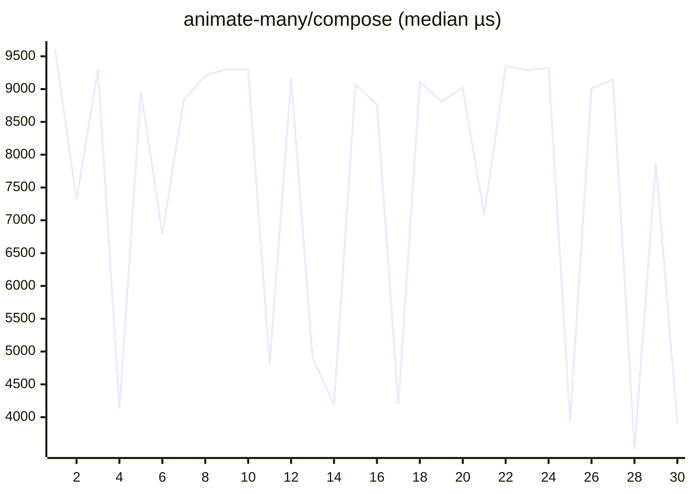
```mermaid
xychart-beta
    title "animate-many/compose (median µs)"
    x-axis 1 --> 30
    line [9612.0, 7315.2, 9298.7, 4130.8, 8970.6, 6790.0, 8834.4, 9205.4, 9306.1, 9292.8, 4799.0, 9161.8, 4902.4, 4191.9, 9068.1, 8766.5, 4198.0, 9106.8, 8812.6, 9018.9, 7078.2, 9350.0, 9290.5, 9323.4, 3931.6, 9007.0, 9145.8, 3511.4, 7871.3, 3905.5]
```

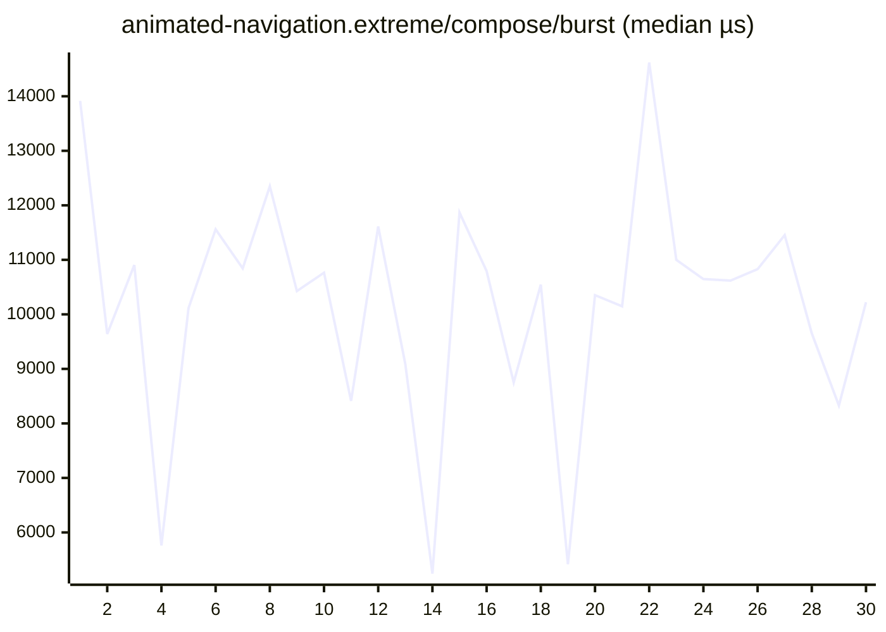
```mermaid
xychart-beta
    title "animated-navigation.extreme/compose/burst (median µs)"
    x-axis 1 --> 30
    line [13915.6, 9639.3, 10905.1, 5761.3, 10113.7, 11560.1, 10842.8, 12348.2, 10426.3, 10764.8, 8413.1, 11612.7, 9088.3, 5246.3, 11867.2, 10792.9, 8751.7, 10545.1, 5417.4, 10352.0, 10148.1, 14620.0, 11001.3, 10648.2, 10619.1, 10828.7, 11454.3, 9650.5, 8326.5, 10222.6]
```

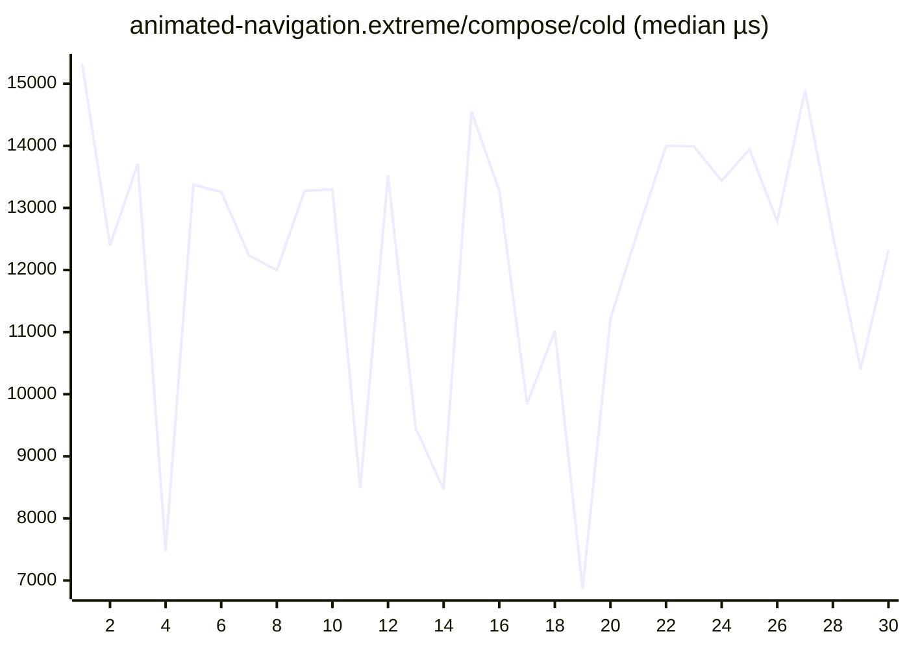
```mermaid
xychart-beta
    title "animated-navigation.extreme/compose/cold (median µs)"
    x-axis 1 --> 30
    line [15315.5, 12396.6, 13713.1, 7474.2, 13373.9, 13257.9, 12235.4, 11996.7, 13273.8, 13300.5, 8485.0, 13524.2, 9443.8, 8468.3, 14553.2, 13281.6, 9844.9, 11022.4, 6863.5, 11215.0, 12647.6, 14001.3, 13992.4, 13436.5, 13944.0, 12784.2, 14895.2, 12563.8, 10404.1, 12317.7]
```

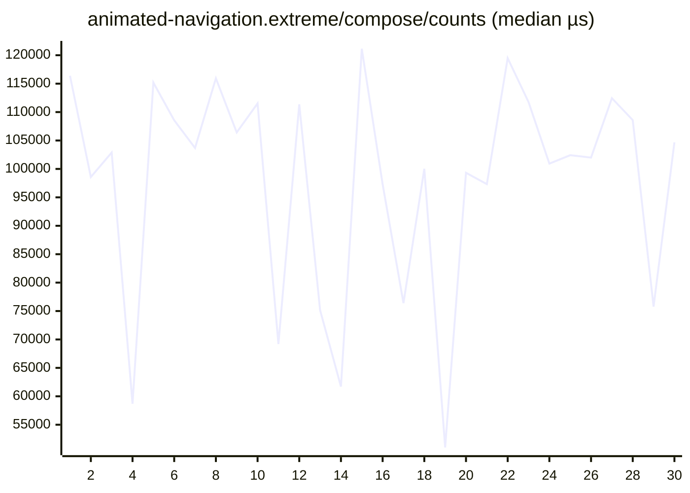
```mermaid
xychart-beta
    title "animated-navigation.extreme/compose/counts (median µs)"
    x-axis 1 --> 30
    line [116391.7, 98569.9, 102876.7, 58688.1, 115195.9, 108552.8, 103684.7, 115937.5, 106415.2, 111517.3, 69185.6, 111367.5, 75157.6, 61703.5, 121144.3, 97313.7, 76393.8, 100027.7, 51011.6, 99326.3, 97321.5, 119485.1, 111776.4, 100931.5, 102412.1, 101996.3, 112444.9, 108595.6, 75778.5, 104684.2]
```

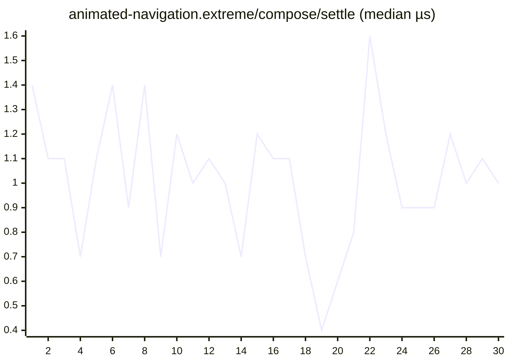
```mermaid
xychart-beta
    title "animated-navigation.extreme/compose/settle (median µs)"
    x-axis 1 --> 30
    line [1.4, 1.1, 1.1, 0.7, 1.1, 1.4, 0.9, 1.4, 0.7, 1.2, 1.0, 1.1, 1.0, 0.7, 1.2, 1.1, 1.1, 0.7, 0.4, 0.6, 0.8, 1.6, 1.2, 0.9, 0.9, 0.9, 1.2, 1.0, 1.1, 1.0]
```

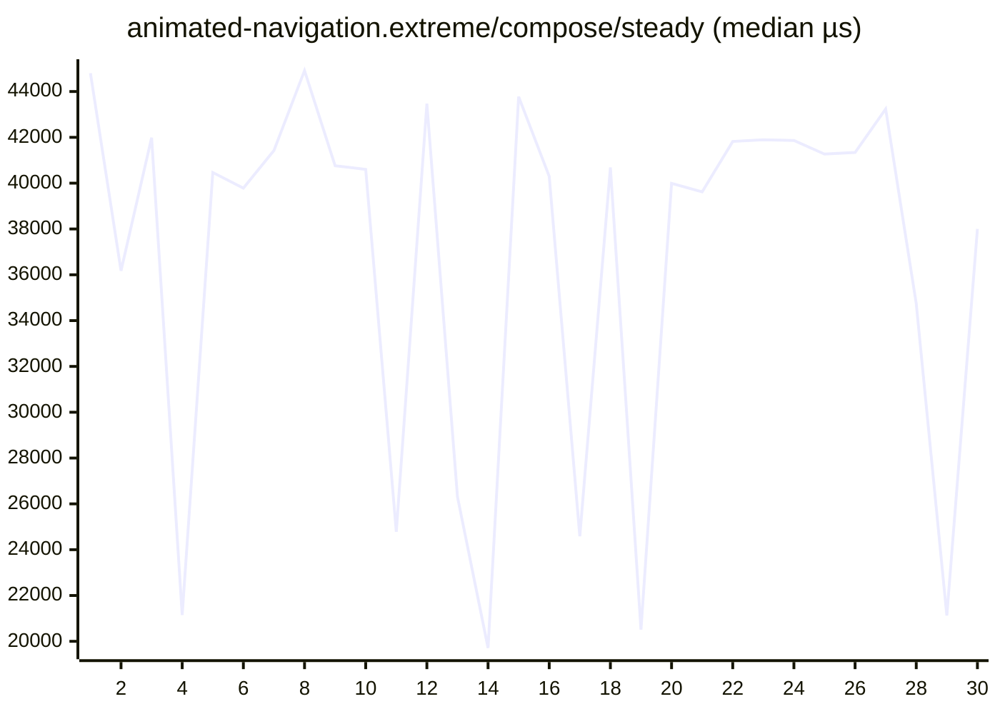
```mermaid
xychart-beta
    title "animated-navigation.extreme/compose/steady (median µs)"
    x-axis 1 --> 30
    line [44800.9, 36175.8, 41986.1, 21150.1, 40467.5, 39782.6, 41428.4, 44914.1, 40760.0, 40602.3, 24776.9, 43474.0, 26309.4, 19709.9, 43774.9, 40296.3, 24582.5, 40685.6, 20506.3, 39990.7, 39619.2, 41820.0, 41894.2, 41861.0, 41271.1, 41339.3, 43241.1, 34740.9, 21123.9, 38003.0]
```

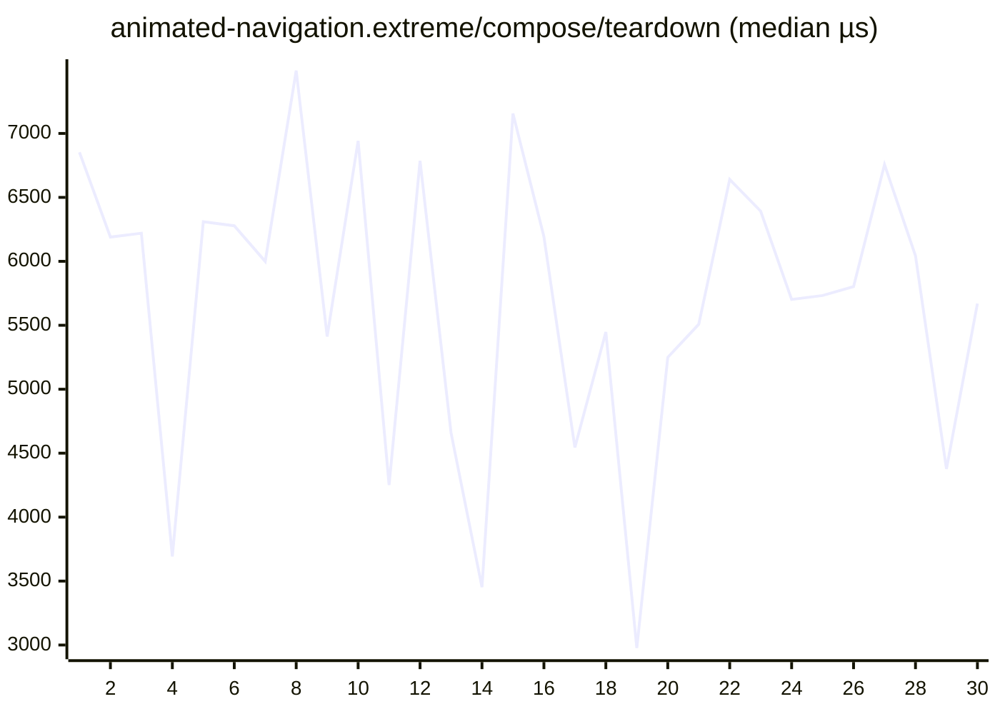
```mermaid
xychart-beta
    title "animated-navigation.extreme/compose/teardown (median µs)"
    x-axis 1 --> 30
    line [6853.0, 6189.7, 6219.9, 3693.0, 6309.6, 6278.2, 5999.3, 7491.5, 5412.1, 6942.1, 4250.5, 6786.2, 4660.1, 3451.8, 7156.4, 6192.8, 4544.8, 5447.8, 2977.0, 5249.1, 5507.8, 6640.7, 6392.4, 5701.8, 5732.5, 5802.2, 6756.8, 6043.1, 4376.4, 5670.1]
```

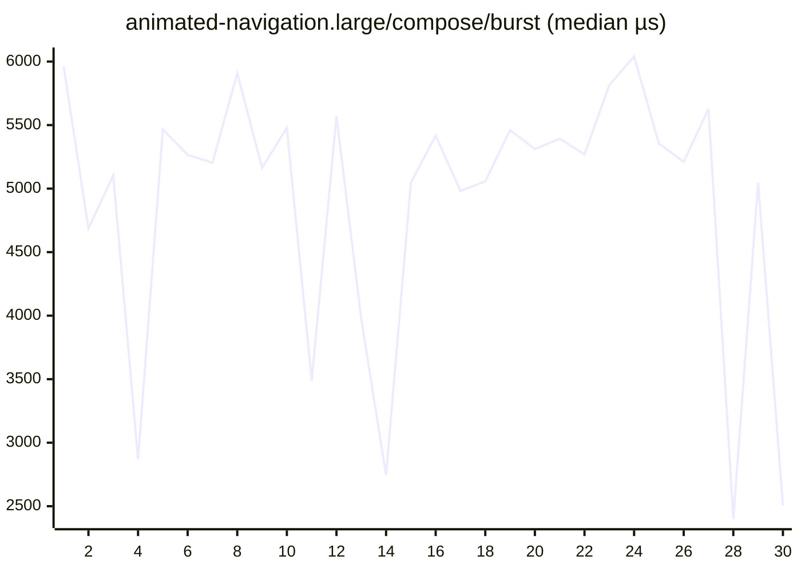
```mermaid
xychart-beta
    title "animated-navigation.large/compose/burst (median µs)"
    x-axis 1 --> 30
    line [5962.6, 4686.8, 5103.1, 2868.2, 5466.2, 5265.7, 5203.7, 5908.6, 5162.6, 5477.3, 3485.2, 5570.7, 3972.3, 2743.9, 5046.1, 5416.8, 4981.3, 5057.2, 5460.4, 5311.3, 5393.0, 5268.9, 5814.8, 6039.4, 5353.6, 5210.9, 5627.8, 2398.7, 5047.0, 2506.7]
```

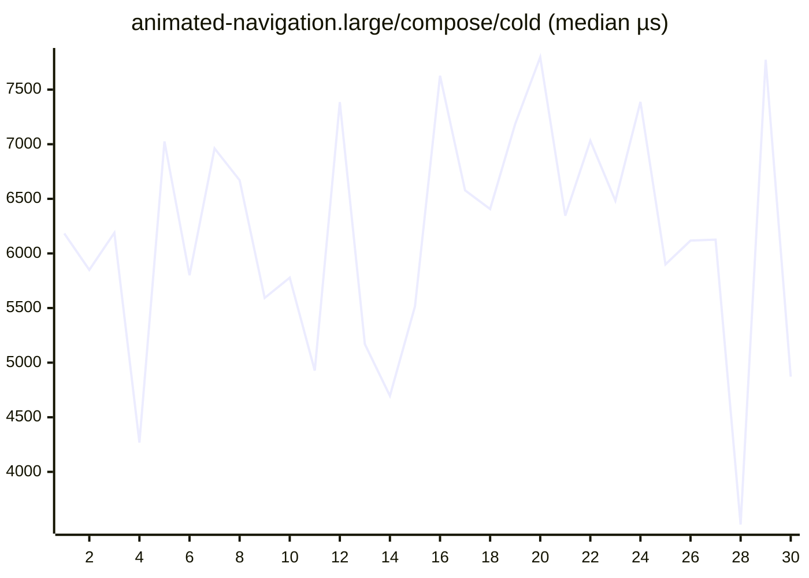
```mermaid
xychart-beta
    title "animated-navigation.large/compose/cold (median µs)"
    x-axis 1 --> 30
    line [6183.5, 5849.2, 6189.4, 4268.5, 7025.1, 5800.1, 6961.6, 6669.8, 5592.5, 5777.9, 4927.5, 7385.2, 5169.2, 4696.1, 5514.8, 7626.9, 6577.0, 6406.6, 7184.5, 7797.2, 6345.3, 7032.3, 6482.5, 7387.8, 5899.0, 6117.5, 6126.6, 3517.8, 7772.8, 4871.7]
```

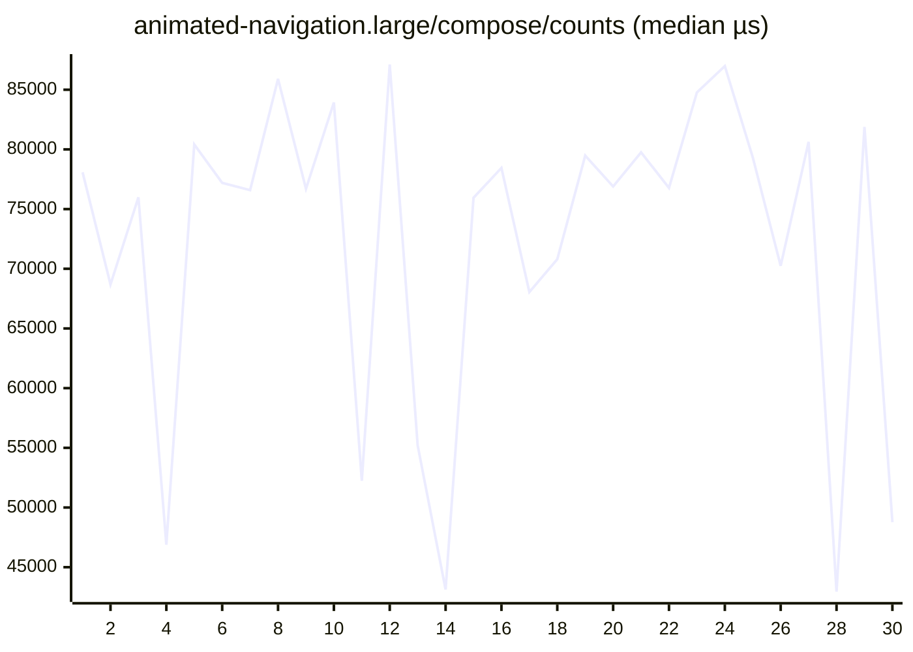
```mermaid
xychart-beta
    title "animated-navigation.large/compose/counts (median µs)"
    x-axis 1 --> 30
    line [78084.1, 68688.7, 75988.3, 46887.2, 80418.2, 77193.1, 76591.3, 85909.7, 76703.1, 83933.1, 52237.7, 87116.2, 55206.4, 43133.9, 75942.8, 78449.8, 68043.5, 70805.6, 79481.4, 76894.2, 79750.4, 76777.6, 84775.3, 86975.8, 79334.4, 70248.6, 80634.0, 42948.0, 81887.6, 48776.5]
```

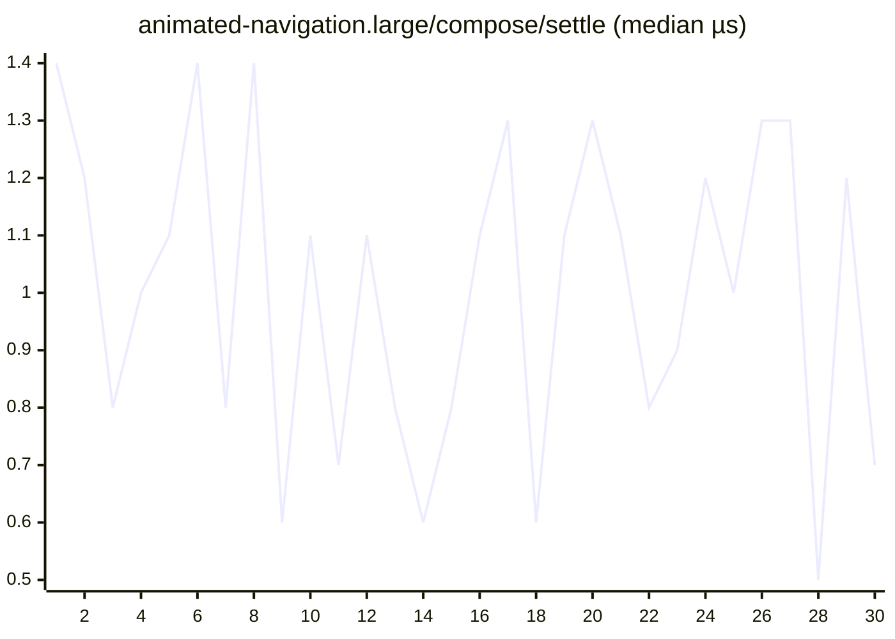
```mermaid
xychart-beta
    title "animated-navigation.large/compose/settle (median µs)"
    x-axis 1 --> 30
    line [1.4, 1.2, 0.8, 1.0, 1.1, 1.4, 0.8, 1.4, 0.6, 1.1, 0.7, 1.1, 0.8, 0.6, 0.8, 1.1, 1.3, 0.6, 1.1, 1.3, 1.1, 0.8, 0.9, 1.2, 1.0, 1.3, 1.3, 0.5, 1.2, 0.7]
```

```mermaid
xychart-beta
    title "animated-navigation.large/compose/steady (median µs)"
    x-axis 1 --> 30
    line [35808.1, 28678.7, 32946.1, 17234.9, 34669.9, 32836.2, 33753.5, 35965.6, 33580.5, 34615.5, 18867.2, 35156.6, 21295.6, 16923.0, 33166.9, 34296.9, 28151.3, 32755.2, 34740.3, 33937.2, 34748.5, 33855.1, 36848.3, 38104.0, 34408.9, 29761.2, 35305.9, 13524.7, 30803.7, 14816.2]
```

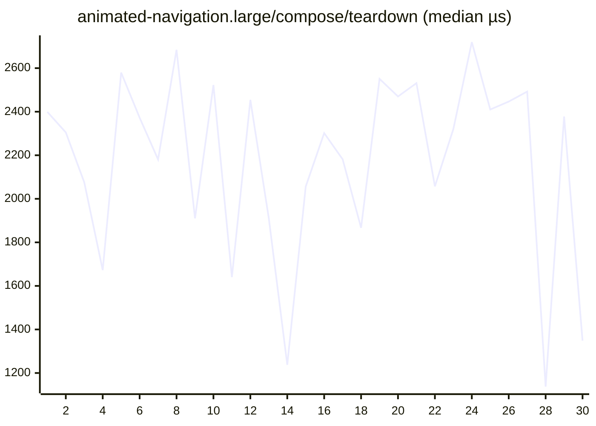
```mermaid
xychart-beta
    title "animated-navigation.large/compose/teardown (median µs)"
    x-axis 1 --> 30
    line [2399.1, 2304.8, 2075.6, 1672.7, 2579.5, 2372.6, 2180.7, 2684.2, 1910.4, 2522.5, 1640.1, 2454.4, 1910.3, 1238.0, 2056.1, 2301.7, 2181.8, 1866.8, 2550.9, 2469.9, 2531.3, 2057.3, 2320.4, 2719.6, 2410.2, 2446.6, 2492.4, 1137.6, 2377.9, 1348.5]
```

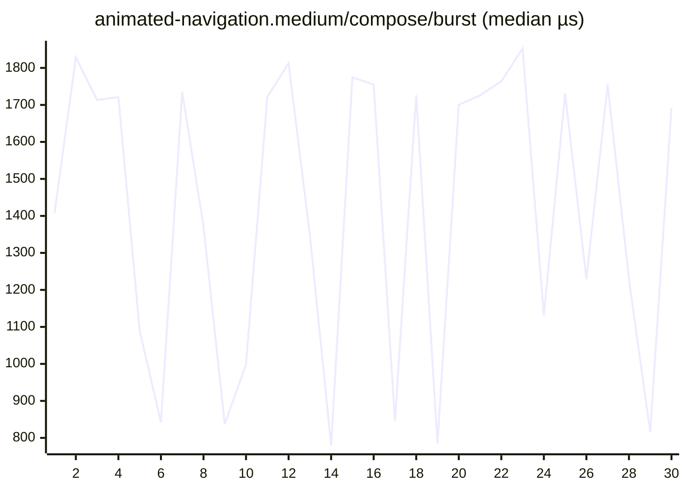
```mermaid
xychart-beta
    title "animated-navigation.medium/compose/burst (median µs)"
    x-axis 1 --> 30
    line [1407.7, 1828.7, 1713.2, 1721.3, 1089.5, 842.0, 1734.8, 1371.7, 837.2, 999.1, 1721.7, 1812.8, 1349.6, 779.2, 1774.3, 1755.1, 846.0, 1726.4, 785.0, 1700.0, 1725.9, 1764.0, 1852.4, 1131.0, 1731.3, 1229.1, 1755.1, 1228.7, 816.2, 1692.5]
```

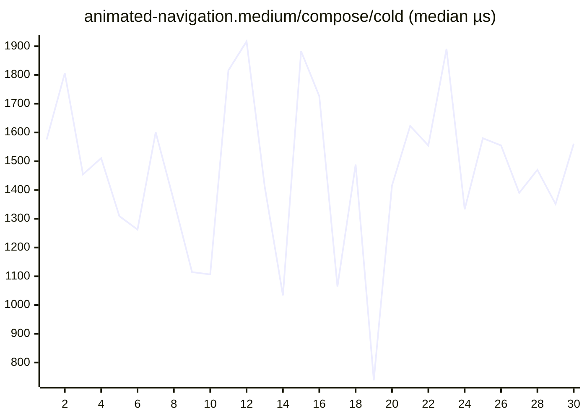
```mermaid
xychart-beta
    title "animated-navigation.medium/compose/cold (median µs)"
    x-axis 1 --> 30
    line [1575.4, 1806.3, 1454.3, 1510.6, 1309.3, 1262.3, 1600.9, 1362.0, 1114.5, 1106.6, 1816.0, 1916.6, 1411.0, 1033.3, 1882.6, 1726.4, 1064.2, 1488.7, 738.5, 1415.3, 1622.8, 1554.6, 1890.6, 1332.9, 1580.0, 1554.9, 1390.0, 1470.1, 1351.3, 1561.0]
```

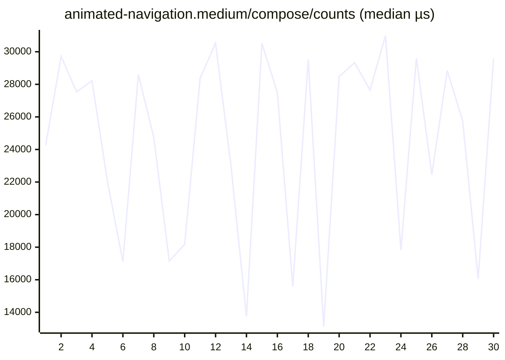
```mermaid
xychart-beta
    title "animated-navigation.medium/compose/counts (median µs)"
    x-axis 1 --> 30
    line [24261.2, 29711.8, 27538.5, 28220.6, 22030.3, 17110.4, 28591.1, 24743.2, 17148.6, 18167.6, 28376.3, 30524.5, 22988.2, 13747.6, 30513.1, 27507.8, 15585.4, 29535.9, 13117.0, 28472.2, 29329.2, 27651.1, 30993.3, 17839.5, 29606.1, 22453.4, 28845.5, 25750.2, 16043.3, 29594.8]
```

```mermaid
xychart-beta
    title "animated-navigation.medium/compose/settle (median µs)"
    x-axis 1 --> 30
    line [0.6, 0.6, 0.5, 0.6, 0.5, 0.6, 0.6, 0.4, 0.5, 0.5, 0.6, 0.9, 0.5, 0.4, 1.0, 0.6, 0.5, 0.5, 0.3, 0.5, 0.5, 0.5, 1.1, 0.5, 0.5, 0.9, 0.5, 0.6, 0.5, 0.6]
```

```mermaid
xychart-beta
    title "animated-navigation.medium/compose/steady (median µs)"
    x-axis 1 --> 30
    line [10651.3, 14357.3, 13461.9, 13406.0, 8401.2, 6375.1, 13610.7, 10392.6, 6186.6, 7688.8, 13447.4, 13901.2, 10215.3, 5845.4, 13107.8, 13527.2, 6531.9, 13446.8, 5854.3, 13280.4, 13596.6, 13771.9, 14371.4, 8590.2, 13660.6, 9551.5, 13852.3, 8480.8, 5681.7, 12610.6]
```

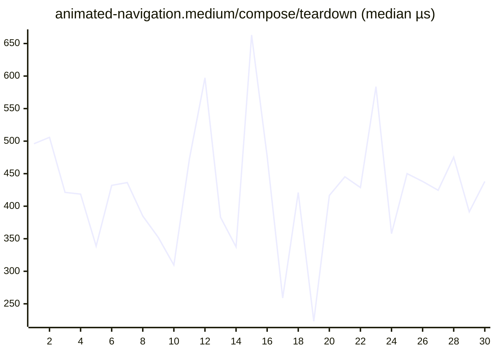
```mermaid
xychart-beta
    title "animated-navigation.medium/compose/teardown (median µs)"
    x-axis 1 --> 30
    line [496.0, 505.8, 421.2, 418.6, 338.6, 432.0, 436.3, 384.9, 351.9, 309.6, 472.7, 597.3, 383.1, 337.5, 663.1, 476.5, 258.9, 421.1, 223.2, 416.5, 445.2, 428.7, 583.7, 357.8, 450.1, 438.1, 424.5, 475.4, 391.4, 438.0]
```

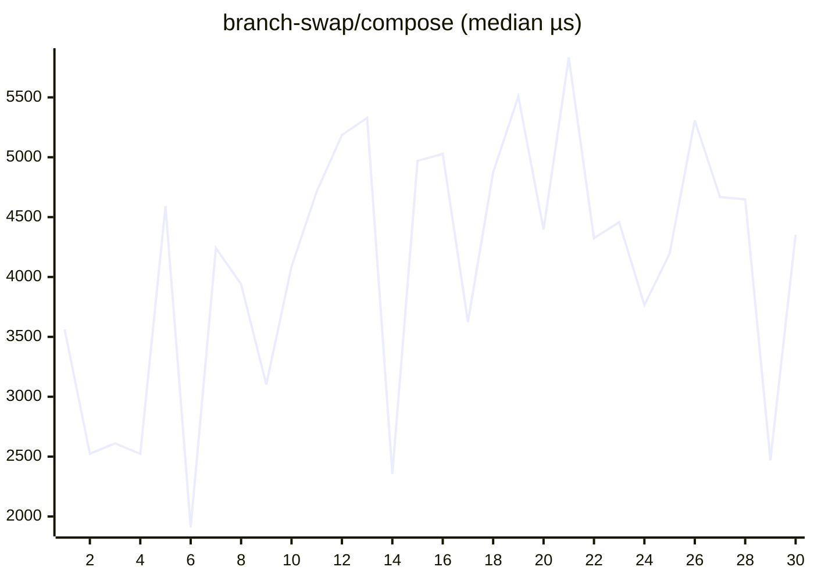
```mermaid
xychart-beta
    title "branch-swap/compose (median µs)"
    x-axis 1 --> 30
    line [3561.0, 2524.1, 2610.3, 2522.9, 4591.4, 1909.9, 4240.8, 3939.9, 3102.4, 4086.3, 4713.5, 5185.1, 5329.1, 2353.1, 4969.3, 5028.7, 3624.7, 4874.4, 5507.4, 4395.0, 5833.5, 4323.2, 4457.9, 3765.1, 4195.0, 5307.4, 4667.8, 4647.9, 2468.6, 4354.5]
```

```mermaid
xychart-beta
    title "cold-mount-100/compose (median µs)"
    x-axis 1 --> 30
    line [838.1, 567.4, 589.5, 322.8, 586.1, 833.3, 574.8, 590.4, 542.0, 551.8, 731.2, 1077.2, 808.7, 483.9, 513.1, 534.3, 922.8, 567.9, 639.7, 531.3, 306.7, 960.8, 541.6, 519.0, 587.9, 546.0, 604.5, 525.6, 371.7, 536.9]
```

```mermaid
xychart-beta
    title "cold-mount-1000/compose (median µs)"
    x-axis 1 --> 30
    line [3773.5, 7121.6, 6041.0, 5964.6, 7856.3, 5534.2, 7586.1, 7564.1, 6423.2, 5716.5, 6155.1, 4680.5, 6242.3, 3574.2, 8163.7, 6784.7, 5523.8, 7026.9, 7804.5, 6104.5, 7423.7, 6271.5, 5851.5, 7013.2, 8536.0, 3596.5, 8471.5, 6259.1, 5919.6, 3302.6]
```

```mermaid
xychart-beta
    title "cold-mount-10000/compose (median µs)"
    x-axis 1 --> 30
    line [75289.0, 90310.2, 100985.1, 86939.8, 92707.3, 108106.4, 117169.6, 87680.3, 84895.8, 118560.2, 74046.2, 87189.7, 102051.1, 65038.2, 94025.5, 96889.0, 94901.7, 182168.4, 93383.3, 111347.0, 102155.1, 73856.0, 87952.6, 96468.1, 91553.4, 70451.2, 91283.7, 99690.5, 67702.7, 104388.2]
```

```mermaid
xychart-beta
    title "data-grid.extreme/compose/burst (median µs)"
    x-axis 1 --> 30
    line [869706.9, 657651.2, 855176.6, 921506.7, 908083.0, 573450.9, 461483.4, 761043.5, 816508.3, 689906.6, 803454.6, 618026.1, 853689.3, 524407.7, 829320.4, 694790.7, 531210.0, 585345.5, 754887.8, 772293.0, 595984.0, 798879.1, 857320.9, 761033.9, 838712.3, 860892.2, 769258.3, 663198.9, 676076.6, 793178.6]
```

```mermaid
xychart-beta
    title "data-grid.extreme/compose/cold (median µs)"
    x-axis 1 --> 30
    line [527821.7, 398200.7, 504535.6, 560369.8, 559329.2, 357117.7, 275265.8, 469042.6, 502280.7, 419753.1, 493032.1, 374544.2, 525916.9, 330742.4, 514822.8, 415984.9, 320520.3, 345634.0, 462469.9, 476090.6, 366860.8, 496112.4, 535826.3, 461725.7, 511909.0, 517708.6, 465520.4, 385891.3, 404071.9, 486286.3]
```

```mermaid
xychart-beta
    title "data-grid.extreme/compose/counts (median µs)"
    x-axis 1 --> 30
    line [1498282.4, 1110786.6, 1445044.7, 1520204.8, 1598444.8, 1013220.0, 820746.8, 1359771.1, 1345694.4, 1198215.0, 1381937.6, 1103694.0, 1487289.3, 939246.6, 1449304.9, 1164488.0, 914851.5, 944741.2, 1311694.3, 1340877.2, 1045036.9, 1370205.3, 1453792.0, 1312466.3, 1416656.0, 1434623.4, 1413699.5, 1164479.8, 1205615.5, 1378751.9]
```

```mermaid
xychart-beta
    title "data-grid.extreme/compose/settle (median µs)"
    x-axis 1 --> 30
    line [1.9, 2.3, 2.1, 2.0, 2.5, 1.9, 2.3, 1.6, 2.0, 2.4, 2.0, 2.1, 2.0, 2.5, 3.0, 2.6, 2.8, 2.9, 2.1, 2.1, 2.3, 1.8, 2.1, 3.3, 1.9, 2.7, 2.0, 2.3, 2.8, 2.2]
```

```mermaid
xychart-beta
    title "data-grid.extreme/compose/steady (median µs)"
    x-axis 1 --> 30
    line [24816.6, 19150.7, 24207.3, 25586.7, 23913.6, 16161.1, 13884.4, 22676.4, 23497.7, 19627.2, 24715.0, 19926.1, 21328.2, 13514.4, 19969.7, 19510.9, 15303.7, 13224.5, 23661.7, 23571.0, 16761.3, 23826.3, 24369.2, 19606.9, 24245.4, 20492.2, 24703.4, 18192.7, 15296.2, 24530.0]
```

```mermaid
xychart-beta
    title "data-grid.extreme/compose/teardown (median µs)"
    x-axis 1 --> 30
    line [1291.4, 1110.8, 1495.5, 1394.8, 1342.7, 1198.4, 894.8, 1159.8, 1218.1, 1067.8, 1172.8, 980.9, 1356.9, 990.5, 1421.0, 1112.8, 1135.4, 1185.1, 1123.5, 1167.7, 1113.5, 1211.1, 1268.8, 1534.1, 1273.8, 1548.2, 1234.9, 1018.6, 1612.8, 1156.4]
```

```mermaid
xychart-beta
    title "data-grid.large/compose/burst (median µs)"
    x-axis 1 --> 30
    line [114009.5, 133242.0, 132707.0, 131389.9, 95336.0, 90479.1, 132048.5, 117034.0, 90517.6, 99924.5, 142674.2, 152054.8, 107266.5, 109774.4, 131631.2, 133642.9, 121904.3, 189744.7, 151845.7, 135416.4, 82048.7, 132619.5, 137505.2, 141504.7, 142340.9, 125288.7, 139513.0, 76048.5, 139575.3, 82866.3]
```

```mermaid
xychart-beta
    title "data-grid.large/compose/cold (median µs)"
    x-axis 1 --> 30
    line [63120.6, 77459.9, 77741.8, 77504.9, 55851.8, 49552.1, 78186.9, 63835.1, 50574.9, 58902.3, 83015.1, 91492.9, 63434.2, 63517.8, 78011.2, 75642.8, 68891.3, 120222.9, 92098.4, 74633.1, 48182.4, 77927.1, 75020.1, 78384.8, 81778.9, 67892.8, 80042.2, 43867.1, 80097.4, 47326.0]
```

```mermaid
xychart-beta
    title "data-grid.large/compose/counts (median µs)"
    x-axis 1 --> 30
    line [207644.2, 241741.6, 244790.8, 244140.2, 179442.8, 167872.8, 245479.5, 209517.2, 173625.5, 183503.3, 247575.1, 280353.1, 191777.3, 191942.0, 246828.4, 241264.2, 220125.9, 368904.3, 282491.5, 248494.0, 152428.6, 243799.2, 245311.7, 262333.4, 259613.4, 228268.6, 255969.3, 136831.2, 252868.0, 153440.2]
```

```mermaid
xychart-beta
    title "data-grid.large/compose/settle (median µs)"
    x-axis 1 --> 30
    line [2.4, 1.8, 1.5, 1.4, 1.2, 2.6, 1.6, 1.7, 2.0, 1.4, 1.6, 2.2, 1.3, 2.0, 1.6, 1.4, 2.5, 2.0, 2.9, 2.0, 2.4, 1.7, 1.4, 2.3, 2.3, 2.2, 1.8, 1.5, 2.2, 2.1]
```

```mermaid
xychart-beta
    title "data-grid.large/compose/steady (median µs)"
    x-axis 1 --> 30
    line [16104.9, 16959.8, 15977.4, 16630.3, 11479.9, 11754.6, 16353.8, 12991.3, 10569.2, 12334.9, 17439.5, 17744.9, 12209.4, 12926.7, 16077.8, 16718.3, 14103.3, 18470.0, 18673.3, 17193.8, 10296.2, 16545.0, 15506.0, 19549.2, 17526.2, 15670.7, 17911.5, 8701.9, 18142.9, 9085.4]
```

```mermaid
xychart-beta
    title "data-grid.large/compose/teardown (median µs)"
    x-axis 1 --> 30
    line [474.6, 573.2, 553.4, 516.9, 391.3, 447.8, 530.9, 497.7, 413.5, 417.8, 673.8, 622.3, 432.9, 482.3, 498.6, 494.5, 593.8, 536.3, 641.7, 540.5, 369.9, 537.0, 551.3, 554.9, 577.3, 500.0, 577.4, 327.6, 517.1, 316.1]
```

```mermaid
xychart-beta
    title "data-grid.medium/compose/burst (median µs)"
    x-axis 1 --> 30
    line [46673.5, 57857.6, 48420.1, 50977.2, 67910.8, 47817.6, 71027.7, 60248.1, 63971.8, 40554.9, 61266.2, 43948.0, 45646.3, 37707.1, 69933.5, 61140.7, 40745.2, 63439.8, 34916.1, 61511.6, 63443.2, 67987.2, 63098.7, 62579.7, 61672.7, 63331.6, 68810.0, 63674.7, 40565.8, 62643.1]
```

```mermaid
xychart-beta
    title "data-grid.medium/compose/cold (median µs)"
    x-axis 1 --> 30
    line [25793.1, 34471.6, 28818.4, 27678.6, 37266.3, 27413.1, 42489.8, 36315.9, 37015.0, 23026.9, 36389.3, 25537.0, 24976.5, 22520.6, 36575.2, 36342.5, 24121.2, 35877.5, 19402.6, 36210.4, 35904.6, 36170.4, 36526.9, 36098.8, 36474.8, 38580.5, 37707.2, 36575.2, 22310.4, 35914.3]
```

```mermaid
xychart-beta
    title "data-grid.medium/compose/counts (median µs)"
    x-axis 1 --> 30
    line [99581.8, 122381.7, 107874.3, 104361.4, 148720.8, 103336.5, 148623.9, 130794.7, 134981.7, 87414.3, 140256.9, 101443.1, 103966.6, 82991.9, 140560.5, 132248.1, 88553.3, 139829.2, 70947.7, 144000.7, 133650.4, 133813.7, 135280.4, 134894.5, 139250.8, 133305.8, 150466.1, 141788.5, 86628.2, 134077.9]
```

```mermaid
xychart-beta
    title "data-grid.medium/compose/settle (median µs)"
    x-axis 1 --> 30
    line [1.8, 1.5, 2.2, 2.0, 2.7, 2.0, 2.4, 1.4, 1.9, 1.2, 1.8, 2.0, 2.6, 1.8, 2.5, 1.0, 1.1, 1.5, 0.7, 1.1, 1.4, 2.4, 2.0, 1.3, 1.7, 1.6, 2.1, 1.9, 1.4, 1.2]
```

```mermaid
xychart-beta
    title "data-grid.medium/compose/steady (median µs)"
    x-axis 1 --> 30
    line [12334.8, 12381.3, 12840.2, 10470.5, 13619.2, 11418.3, 14976.0, 13623.4, 16125.3, 9286.1, 15988.6, 10571.0, 10284.2, 8331.7, 13691.2, 13996.3, 10262.7, 13810.7, 6990.4, 14343.4, 14314.2, 13381.3, 14342.5, 15545.6, 14298.5, 14988.3, 15590.1, 15530.2, 10448.3, 16344.1]
```

```mermaid
xychart-beta
    title "data-grid.medium/compose/teardown (median µs)"
    x-axis 1 --> 30
    line [248.2, 292.5, 260.1, 258.1, 350.6, 241.2, 365.1, 291.9, 312.0, 182.4, 298.5, 260.1, 225.5, 199.1, 374.9, 287.6, 199.1, 292.5, 160.9, 289.9, 317.4, 326.9, 305.3, 354.2, 308.2, 429.4, 444.6, 288.7, 182.1, 309.9]
```

```mermaid
xychart-beta
    title "dense-dashboard.extreme/compose/burst (median µs)"
    x-axis 1 --> 30
    line [11532.2, 14838.7, 15355.1, 14237.6, 19804.9, 12160.9, 22267.2, 17938.8, 17343.2, 11744.1, 18935.9, 12431.7, 13563.7, 10265.6, 18057.4, 15307.7, 10841.2, 15532.2, 8047.5, 14601.3, 15551.0, 15731.4, 18780.6, 20702.4, 7290.4, 16351.7, 17741.2, 10335.5, 17239.5, 9913.9]
```

```mermaid
xychart-beta
    title "dense-dashboard.extreme/compose/cold (median µs)"
    x-axis 1 --> 30
    line [383.4, 479.8, 502.1, 460.9, 622.2, 391.5, 598.7, 533.1, 544.2, 396.2, 582.7, 433.7, 388.8, 357.0, 574.0, 491.1, 349.3, 485.5, 248.4, 461.3, 475.3, 486.0, 588.4, 588.4, 247.5, 509.0, 558.4, 326.2, 547.0, 300.3]
```

```mermaid
xychart-beta
    title "dense-dashboard.extreme/compose/counts (median µs)"
    x-axis 1 --> 30
    line [17691.5, 22404.5, 21786.2, 19601.6, 29177.0, 18354.6, 29196.1, 24726.4, 24497.4, 17843.8, 29355.9, 16907.7, 21176.1, 14811.4, 28504.9, 21197.0, 15521.1, 22807.6, 12089.7, 21520.1, 21049.7, 20208.7, 24624.7, 31135.2, 10473.3, 25634.2, 25483.0, 13763.3, 25831.5, 15243.1]
```

```mermaid
xychart-beta
    title "dense-dashboard.extreme/compose/settle (median µs)"
    x-axis 1 --> 30
    line [1.2, 1.1, 1.4, 0.9, 2.0, 1.1, 1.9, 1.0, 1.0, 1.1, 1.1, 1.3, 1.9, 1.1, 1.5, 0.8, 1.0, 0.8, 0.5, 0.8, 0.7, 1.0, 1.4, 2.1, 0.5, 1.2, 1.4, 0.7, 1.1, 0.6]
```

```mermaid
xychart-beta
    title "dense-dashboard.extreme/compose/steady (median µs)"
    x-axis 1 --> 30
    line [533.0, 686.6, 708.9, 700.6, 897.3, 551.6, 891.7, 837.9, 851.9, 466.5, 847.8, 522.7, 468.9, 431.9, 891.4, 842.6, 463.9, 847.5, 452.8, 842.4, 846.0, 912.4, 882.1, 894.1, 432.0, 867.2, 871.6, 462.2, 912.2, 460.0]
```

```mermaid
xychart-beta
    title "dense-dashboard.extreme/compose/teardown (median µs)"
    x-axis 1 --> 30
    line [393.2, 539.8, 566.2, 477.4, 750.9, 387.6, 852.7, 578.6, 584.8, 403.3, 604.5, 409.3, 558.9, 425.1, 670.2, 525.6, 354.8, 507.8, 290.0, 507.9, 518.9, 573.0, 610.4, 701.6, 273.7, 541.8, 603.5, 341.1, 584.4, 343.9]
```

```mermaid
xychart-beta
    title "dense-dashboard.large/compose/burst (median µs)"
    x-axis 1 --> 30
    line [5056.8, 5928.3, 7819.4, 5262.6, 10115.0, 6456.2, 9438.2, 6248.7, 8699.0, 5344.5, 8641.8, 5255.7, 6678.1, 10081.2, 4617.9, 4393.4, 3734.2, 8912.1, 8475.1, 8457.4, 3546.4, 7461.2, 7904.5, 8709.4, 9023.0, 7643.9, 10076.2, 3846.3, 9131.7, 4286.2]
```

```mermaid
xychart-beta
    title "dense-dashboard.large/compose/cold (median µs)"
    x-axis 1 --> 30
    line [249.9, 272.8, 305.9, 241.0, 388.7, 281.7, 353.2, 277.0, 315.2, 224.8, 318.8, 254.6, 260.3, 378.8, 209.3, 164.0, 172.4, 367.4, 349.5, 340.1, 145.5, 298.1, 305.9, 354.4, 322.9, 336.4, 336.0, 150.3, 385.4, 191.9]
```

```mermaid
xychart-beta
    title "dense-dashboard.large/compose/counts (median µs)"
    x-axis 1 --> 30
    line [14102.2, 13629.3, 13693.5, 13209.6, 18184.6, 13156.2, 19699.1, 16149.3, 17614.6, 12484.4, 17033.2, 11006.9, 11748.4, 17291.5, 11206.2, 8308.1, 9001.0, 17274.5, 16718.8, 16077.0, 6534.0, 16146.4, 15768.8, 16845.8, 15171.8, 14831.0, 17630.3, 8939.2, 16624.3, 10802.9]
```

```mermaid
xychart-beta
    title "dense-dashboard.large/compose/settle (median µs)"
    x-axis 1 --> 30
    line [1.2, 0.9, 1.0, 0.7, 1.6, 1.1, 1.3, 0.8, 0.8, 1.0, 0.8, 1.1, 1.4, 1.4, 0.6, 0.5, 0.5, 1.3, 0.9, 0.8, 0.5, 0.7, 0.8, 0.9, 0.9, 1.7, 1.0, 0.5, 1.0, 0.6]
```

```mermaid
xychart-beta
    title "dense-dashboard.large/compose/steady (median µs)"
    x-axis 1 --> 30
    line [514.3, 679.4, 690.4, 687.8, 906.9, 544.2, 843.3, 826.2, 842.4, 453.4, 832.9, 543.4, 462.1, 840.6, 475.5, 424.6, 436.6, 837.1, 826.7, 839.5, 411.6, 847.3, 909.1, 913.2, 862.2, 727.1, 864.9, 439.5, 871.3, 447.3]
```

```mermaid
xychart-beta
    title "dense-dashboard.large/compose/teardown (median µs)"
    x-axis 1 --> 30
    line [204.5, 229.9, 234.0, 203.9, 330.2, 203.6, 300.1, 241.5, 297.5, 179.0, 256.5, 184.9, 236.6, 313.4, 166.4, 144.4, 145.8, 305.5, 267.3, 284.2, 125.9, 244.2, 259.0, 303.9, 272.3, 308.2, 358.3, 129.4, 295.6, 145.7]
```

```mermaid
xychart-beta
    title "dense-dashboard.medium/compose/burst (median µs)"
    x-axis 1 --> 30
    line [2886.3, 1441.8, 1725.1, 2212.3, 2923.7, 1545.5, 3048.9, 2276.1, 2787.0, 3601.1, 2820.4, 3481.9, 3299.7, 2334.4, 2540.8, 3338.4, 2082.2, 1710.9, 2831.0, 2969.0, 2450.6, 3084.4, 3083.7, 2222.7, 3204.2, 3077.0, 2907.7, 2543.9, 1783.0, 2888.8]
```

```mermaid
xychart-beta
    title "dense-dashboard.medium/compose/cold (median µs)"
    x-axis 1 --> 30
    line [218.8, 100.9, 158.5, 169.7, 216.8, 94.9, 220.6, 178.7, 193.6, 231.5, 195.7, 210.2, 308.6, 138.8, 217.4, 234.4, 147.6, 105.9, 188.2, 202.7, 179.5, 191.2, 281.6, 197.3, 216.0, 234.2, 210.0, 252.3, 176.0, 190.9]
```

```mermaid
xychart-beta
    title "dense-dashboard.medium/compose/counts (median µs)"
    x-axis 1 --> 30
    line [5949.6, 3187.1, 3588.3, 3998.0, 5805.3, 3074.5, 6058.2, 4688.6, 4602.1, 6344.4, 5931.1, 6502.2, 6059.5, 3138.1, 4633.3, 6093.5, 4211.2, 3095.8, 5970.4, 6362.2, 4937.2, 5544.6, 5995.1, 4503.3, 6032.2, 5345.3, 5947.6, 5114.6, 3930.7, 6435.8]
```

```mermaid
xychart-beta
    title "dense-dashboard.medium/compose/settle (median µs)"
    x-axis 1 --> 30
    line [0.7, 0.4, 0.9, 0.6, 1.0, 0.4, 0.7, 0.5, 0.7, 0.7, 0.7, 0.7, 1.2, 0.6, 1.0, 1.4, 0.9, 0.4, 0.7, 0.7, 0.9, 0.7, 0.7, 0.9, 0.7, 1.0, 0.7, 0.6, 0.6, 0.8]
```

```mermaid
xychart-beta
    title "dense-dashboard.medium/compose/steady (median µs)"
    x-axis 1 --> 30
    line [816.4, 407.5, 448.9, 446.8, 626.3, 405.8, 836.7, 691.9, 679.1, 829.3, 806.3, 886.2, 635.3, 437.8, 644.6, 709.4, 452.7, 409.0, 821.6, 821.9, 540.5, 849.9, 838.5, 600.2, 860.4, 658.6, 856.2, 721.6, 461.2, 868.1]
```

```mermaid
xychart-beta
    title "dense-dashboard.medium/compose/teardown (median µs)"
    x-axis 1 --> 30
    line [121.5, 62.5, 79.1, 89.7, 105.7, 57.1, 114.0, 91.1, 113.4, 114.9, 114.1, 129.6, 134.7, 83.7, 109.7, 156.3, 80.9, 63.9, 117.6, 114.1, 88.4, 117.1, 116.7, 100.5, 117.7, 120.6, 113.1, 112.2, 77.4, 113.2]
```

```mermaid
xychart-beta
    title "entities-identity-churn-10.extreme/compose/burst (median µs)"
    x-axis 1 --> 30
    line [48500.0, 29373.5, 40666.3, 39982.2, 49684.3, 29001.5, 55300.8, 46626.0, 54331.2, 47385.4, 44184.1, 57350.2, 55638.5, 36466.5, 53142.1, 40953.7, 40503.1, 80157.0, 46793.7, 56109.6, 45462.7, 48510.6, 60681.5, 40638.1, 42592.1, 45165.1, 45720.1, 43775.4, 32150.9, 51127.2]
```

```mermaid
xychart-beta
    title "entities-identity-churn-10.extreme/compose/cold (median µs)"
    x-axis 1 --> 30
    line [29239.1, 17390.4, 22368.5, 29280.2, 24311.0, 16950.3, 33925.4, 35068.3, 35395.1, 30904.1, 25973.8, 35820.1, 27155.8, 19162.0, 39830.0, 28260.2, 18550.0, 44833.8, 28617.6, 31620.7, 25764.4, 35864.8, 38703.7, 28915.5, 24546.1, 33122.0, 29407.0, 21782.9, 19334.8, 32107.6]
```

```mermaid
xychart-beta
    title "entities-identity-churn-10.extreme/compose/counts (median µs)"
    x-axis 1 --> 30
    line [232881.6, 153922.4, 182354.5, 184019.0, 216326.1, 144957.2, 253653.9, 222367.1, 244247.3, 227252.0, 222707.6, 229905.6, 227412.0, 154463.0, 253905.0, 179264.3, 170048.3, 434668.3, 216711.2, 259686.7, 213299.9, 224665.4, 302732.5, 179471.3, 189128.9, 221616.6, 221561.2, 196803.3, 167043.3, 237946.3]
```

```mermaid
xychart-beta
    title "entities-identity-churn-10.extreme/compose/settle (median µs)"
    x-axis 1 --> 30
    line [2.1, 1.3, 2.4, 2.5, 2.5, 1.7, 2.1, 2.4, 2.7, 1.8, 1.7, 2.3, 2.4, 1.7, 2.5, 1.5, 1.3, 3.2, 1.9, 2.2, 1.9, 2.0, 2.5, 2.2, 1.7, 1.7, 1.7, 3.4, 1.7, 1.9]
```

```mermaid
xychart-beta
    title "entities-identity-churn-10.extreme/compose/steady (median µs)"
    x-axis 1 --> 30
    line [62006.6, 30428.1, 51252.0, 46762.5, 64252.2, 28767.6, 66612.9, 59787.7, 63653.0, 55688.2, 55625.3, 65233.1, 65161.4, 37503.7, 66247.5, 54105.1, 46206.4, 85779.4, 56176.7, 68552.2, 52823.7, 55052.8, 90368.7, 44610.1, 45299.1, 54817.1, 51535.9, 53779.1, 28343.1, 54519.4]
```

```mermaid
xychart-beta
    title "entities-identity-churn-10.extreme/compose/teardown (median µs)"
    x-axis 1 --> 30
    line [1144.8, 694.6, 900.0, 1153.0, 1185.0, 704.6, 1317.6, 1288.5, 1374.1, 1154.8, 1108.5, 1439.2, 1308.5, 830.9, 1325.7, 1140.3, 956.2, 2163.9, 1126.7, 1342.7, 1059.4, 1220.4, 1582.7, 1013.6, 940.5, 1217.9, 1070.6, 1033.1, 721.0, 1412.4]
```

```mermaid
xychart-beta
    title "entities-identity-churn-10.large/compose/burst (median µs)"
    x-axis 1 --> 30
    line [13759.9, 13609.3, 14702.9, 13810.3, 16589.5, 13156.5, 16938.4, 14336.2, 14496.7, 12469.3, 15407.9, 10352.2, 12022.2, 9505.6, 16359.3, 13144.2, 11752.4, 15603.8, 7762.6, 14936.6, 13638.4, 15674.1, 15123.4, 14927.7, 16280.9, 13627.1, 17888.6, 14151.7, 12700.0, 14875.4]
```

```mermaid
xychart-beta
    title "entities-identity-churn-10.large/compose/cold (median µs)"
    x-axis 1 --> 30
    line [8930.7, 10020.5, 8909.7, 10600.2, 13336.4, 10600.4, 12699.6, 11446.0, 12019.2, 7298.6, 11158.7, 8272.5, 7480.0, 7996.4, 11097.1, 10183.1, 7739.9, 10622.5, 5293.1, 10171.5, 9263.7, 12055.5, 12834.4, 12587.0, 11756.7, 11684.6, 12659.0, 10409.2, 6356.7, 11574.3]
```

```mermaid
xychart-beta
    title "entities-identity-churn-10.large/compose/counts (median µs)"
    x-axis 1 --> 30
    line [64825.7, 63038.7, 65034.2, 58295.1, 80549.5, 59637.8, 87345.1, 67044.6, 67442.3, 52391.8, 70744.8, 45340.9, 42928.4, 43869.5, 72373.2, 63240.3, 60410.3, 68541.4, 34587.1, 64209.3, 62317.2, 77151.0, 69078.7, 67272.4, 67174.9, 64785.7, 76626.5, 73672.7, 49015.7, 64191.1]
```

```mermaid
xychart-beta
    title "entities-identity-churn-10.large/compose/settle (median µs)"
    x-axis 1 --> 30
    line [1.6, 1.3, 1.8, 1.6, 2.4, 1.4, 2.1, 1.2, 1.3, 1.3, 1.7, 1.2, 2.0, 1.9, 1.6, 1.0, 1.3, 1.4, 0.9, 1.2, 1.1, 2.2, 1.7, 1.1, 1.3, 1.0, 2.2, 1.7, 1.2, 1.1]
```

```mermaid
xychart-beta
    title "entities-identity-churn-10.large/compose/steady (median µs)"
    x-axis 1 --> 30
    line [18127.8, 19237.6, 16977.4, 16994.0, 22978.3, 17373.8, 24022.9, 20372.9, 19422.1, 16158.3, 19649.2, 15884.6, 12704.8, 12213.1, 20784.8, 18987.4, 15374.7, 20202.7, 9889.0, 20346.5, 18359.3, 24364.8, 20036.1, 20527.3, 18747.9, 18386.6, 22755.4, 18369.0, 13436.4, 17268.6]
```

```mermaid
xychart-beta
    title "entities-identity-churn-10.large/compose/teardown (median µs)"
    x-axis 1 --> 30
    line [337.4, 360.3, 368.0, 351.5, 470.6, 319.2, 503.9, 407.0, 387.4, 294.0, 408.2, 292.6, 308.6, 273.4, 452.2, 367.8, 292.4, 399.4, 218.0, 428.1, 376.7, 429.0, 407.6, 452.5, 388.1, 388.0, 501.6, 411.9, 283.9, 379.7]
```

```mermaid
xychart-beta
    title "entities-identity-churn-10.medium/compose/burst (median µs)"
    x-axis 1 --> 30
    line [8202.0, 6319.3, 6445.7, 3900.8, 7292.3, 7175.4, 6417.0, 7572.0, 6505.7, 7539.0, 4551.2, 7381.0, 5312.0, 4364.1, 7817.1, 6734.5, 4953.6, 6146.2, 3321.2, 6166.6, 6254.2, 6606.1, 7360.8, 5141.7, 6554.2, 7714.6, 6002.4, 6882.8, 5723.3, 6313.3]
```

```mermaid
xychart-beta
    title "entities-identity-churn-10.medium/compose/cold (median µs)"
    x-axis 1 --> 30
    line [5318.6, 5299.9, 5743.4, 2913.7, 5973.1, 4930.1, 5396.7, 6172.9, 5428.8, 6106.4, 3768.4, 5332.9, 3655.2, 3607.3, 5864.0, 5187.8, 4265.0, 5425.7, 2899.8, 4857.5, 5366.1, 5519.6, 5915.8, 4144.5, 5800.3, 4982.7, 5165.6, 5816.9, 3993.4, 4663.1]
```

```mermaid
xychart-beta
    title "entities-identity-churn-10.medium/compose/counts (median µs)"
    x-axis 1 --> 30
    line [40497.8, 27670.3, 31664.9, 18380.9, 32467.4, 30743.4, 32153.6, 32792.7, 29426.3, 33269.3, 24241.3, 32295.2, 25382.5, 19297.4, 32529.2, 35449.8, 22600.3, 30347.4, 15802.5, 28064.2, 29739.0, 32860.6, 32962.2, 26114.4, 31149.4, 29879.1, 28856.6, 29939.0, 21368.4, 31895.4]
```

```mermaid
xychart-beta
    title "entities-identity-churn-10.medium/compose/settle (median µs)"
    x-axis 1 --> 30
    line [2.1, 1.6, 0.8, 0.6, 1.3, 1.4, 0.8, 1.5, 0.7, 1.7, 0.9, 0.9, 0.9, 1.0, 1.5, 0.8, 1.1, 0.8, 0.6, 0.7, 0.8, 0.8, 1.0, 1.0, 0.8, 1.6, 0.8, 1.5, 1.4, 0.8]
```

```mermaid
xychart-beta
    title "entities-identity-churn-10.medium/compose/steady (median µs)"
    x-axis 1 --> 30
    line [10678.6, 8206.7, 8958.3, 4763.9, 9523.9, 9074.0, 9048.8, 9567.1, 9299.6, 9981.8, 6169.6, 8767.4, 6681.7, 5242.5, 9912.6, 8878.4, 5726.2, 8868.8, 4425.2, 8417.7, 8997.0, 9319.4, 9685.6, 6718.7, 8764.7, 8580.0, 8590.5, 7089.3, 5139.0, 8195.1]
```

```mermaid
xychart-beta
    title "entities-identity-churn-10.medium/compose/teardown (median µs)"
    x-axis 1 --> 30
    line [264.1, 212.7, 181.2, 110.8, 211.8, 210.3, 188.4, 238.5, 207.6, 239.0, 147.6, 196.3, 151.4, 128.1, 234.7, 197.1, 159.9, 181.7, 100.8, 178.6, 182.5, 191.4, 204.6, 160.5, 196.6, 197.8, 177.7, 181.2, 155.6, 188.9]
```

```mermaid
xychart-beta
    title "entities-identity-churn-50.extreme/compose/burst (median µs)"
    x-axis 1 --> 30
    line [41164.8, 46703.8, 44520.9, 38822.5, 40775.0, 36485.4, 43653.6, 35867.4, 34266.2, 32167.3, 47315.9, 56247.1, 35460.4, 40749.2, 61095.9, 48204.4, 42451.3, 43030.3, 34847.7, 40630.9, 46331.6, 47016.9, 52779.3, 48343.0, 40663.7, 46695.4, 55224.6, 45735.2, 38710.8, 45081.9]
```

```mermaid
xychart-beta
    title "entities-identity-churn-50.extreme/compose/cold (median µs)"
    x-axis 1 --> 30
    line [29991.4, 41393.0, 32387.4, 25962.5, 25504.0, 25319.0, 37083.9, 25771.7, 25931.6, 22738.4, 30340.0, 38850.1, 21841.9, 22148.0, 27247.6, 25313.6, 31830.4, 27729.0, 16713.9, 28466.5, 33897.0, 23751.3, 37212.1, 25995.5, 28177.5, 37996.0, 40438.1, 34308.2, 28509.3, 35375.1]
```

```mermaid
xychart-beta
    title "entities-identity-churn-50.extreme/compose/counts (median µs)"
    x-axis 1 --> 30
    line [347691.5, 358267.1, 320929.1, 329140.8, 275854.8, 259581.0, 334907.8, 295014.5, 246701.5, 267573.0, 384574.9, 394862.2, 297066.8, 273180.8, 391930.7, 337473.9, 289712.9, 343512.7, 208716.7, 342102.9, 332878.6, 407661.0, 398095.5, 349062.1, 329027.2, 388229.7, 435124.6, 317064.8, 249090.4, 333873.0]
```

```mermaid
xychart-beta
    title "entities-identity-churn-50.extreme/compose/settle (median µs)"
    x-axis 1 --> 30
    line [2.1, 2.0, 1.8, 1.8, 1.4, 2.3, 2.2, 1.9, 2.2, 1.6, 2.1, 2.4, 1.6, 2.4, 2.2, 1.8, 3.1, 1.9, 1.7, 1.7, 1.9, 2.4, 2.0, 1.9, 1.8, 2.1, 2.4, 2.2, 2.1, 1.8]
```

```mermaid
xychart-beta
    title "entities-identity-churn-50.extreme/compose/steady (median µs)"
    x-axis 1 --> 30
    line [168550.7, 182630.3, 163543.1, 182753.2, 138682.5, 133780.4, 165275.8, 149408.4, 111451.2, 136217.5, 203349.1, 212304.8, 142963.5, 149138.1, 201633.3, 177102.1, 153164.5, 186993.2, 103826.3, 174887.4, 169534.9, 235194.8, 197421.4, 168197.3, 162109.0, 191539.3, 228162.2, 151891.6, 126564.7, 145631.6]
```

```mermaid
xychart-beta
    title "entities-identity-churn-50.extreme/compose/teardown (median µs)"
    x-axis 1 --> 30
    line [1080.1, 1376.9, 1058.4, 1062.6, 926.8, 1133.5, 1104.3, 970.0, 848.3, 985.0, 1305.6, 1480.7, 939.4, 1362.0, 1291.8, 1096.0, 1045.0, 1113.5, 688.6, 1070.9, 1227.4, 1393.5, 1242.1, 1081.9, 1096.7, 1195.4, 1340.6, 1130.2, 958.8, 1379.9]
```

```mermaid
xychart-beta
    title "entities-identity-churn-50.large/compose/burst (median µs)"
    x-axis 1 --> 30
    line [14964.2, 12211.5, 11912.3, 14060.4, 15071.6, 9027.6, 18620.6, 19561.0, 14256.0, 15757.8, 16733.7, 18175.8, 16394.2, 9684.6, 19151.9, 16631.0, 12152.6, 21721.6, 15047.3, 17972.9, 16405.5, 17654.5, 20213.8, 14879.7, 14688.1, 17973.9, 14374.6, 16966.5, 12195.5, 17367.6]
```

```mermaid
xychart-beta
    title "entities-identity-churn-50.large/compose/cold (median µs)"
    x-axis 1 --> 30
    line [12335.9, 7185.3, 8832.7, 11712.1, 10066.8, 8342.5, 10620.5, 8742.6, 11307.8, 13813.6, 10078.2, 11520.7, 10071.1, 7153.1, 11875.7, 13108.6, 9349.3, 14947.2, 10357.9, 14120.6, 8770.1, 9870.3, 15702.7, 7589.0, 8693.7, 10010.6, 10465.8, 8478.5, 7884.9, 10199.0]
```

```mermaid
xychart-beta
    title "entities-identity-churn-50.large/compose/counts (median µs)"
    x-axis 1 --> 30
    line [121699.6, 72346.5, 90059.4, 95283.3, 117176.1, 61067.3, 135298.4, 127316.3, 114177.9, 123935.4, 115659.7, 141317.2, 124010.9, 68080.2, 136069.5, 116476.5, 86959.3, 264527.8, 127616.1, 121588.6, 105054.6, 121362.2, 149344.4, 95575.1, 104795.9, 122831.5, 116411.5, 105521.6, 70086.9, 124064.8]
```

```mermaid
xychart-beta
    title "entities-identity-churn-50.large/compose/settle (median µs)"
    x-axis 1 --> 30
    line [1.9, 1.3, 1.5, 2.2, 2.2, 1.2, 1.7, 1.7, 1.8, 1.7, 1.7, 2.2, 2.2, 1.9, 2.1, 1.2, 1.5, 2.4, 1.8, 1.8, 1.6, 1.6, 2.3, 2.2, 1.3, 1.7, 1.1, 2.7, 2.3, 1.9]
```

```mermaid
xychart-beta
    title "entities-identity-churn-50.large/compose/steady (median µs)"
    x-axis 1 --> 30
    line [59706.0, 34308.7, 51437.5, 47528.6, 59568.6, 31848.4, 60575.3, 53501.9, 51348.9, 56812.4, 56379.8, 63971.2, 62136.9, 35904.4, 63448.6, 54429.3, 49701.9, 79725.6, 59019.4, 59722.3, 52854.7, 57187.4, 84023.7, 48357.9, 48136.7, 59480.0, 53466.7, 53156.8, 39355.5, 54926.1]
```

```mermaid
xychart-beta
    title "entities-identity-churn-50.large/compose/teardown (median µs)"
    x-axis 1 --> 30
    line [440.9, 295.7, 317.9, 369.3, 410.5, 228.9, 431.5, 405.0, 388.3, 429.0, 422.8, 503.6, 408.5, 265.8, 496.0, 429.4, 314.3, 501.3, 420.5, 437.2, 369.3, 412.1, 541.1, 362.8, 349.0, 415.7, 404.1, 387.9, 319.8, 414.7]
```

```mermaid
xychart-beta
    title "entities-identity-churn-50.medium/compose/burst (median µs)"
    x-axis 1 --> 30
    line [7988.6, 9747.3, 9365.5, 8349.5, 6021.4, 7530.2, 8564.1, 7945.3, 5942.5, 6061.8, 9300.0, 9685.8, 6780.4, 7288.8, 8050.7, 7981.7, 8314.8, 8789.7, 9875.1, 9792.0, 5976.1, 8952.0, 8308.8, 10853.6, 8885.7, 8787.3, 10369.9, 4949.4, 9704.3, 5460.3]
```

```mermaid
xychart-beta
    title "entities-identity-churn-50.medium/compose/cold (median µs)"
    x-axis 1 --> 30
    line [4571.3, 5260.1, 4670.0, 5901.2, 3485.4, 3508.0, 6353.3, 5982.3, 4253.9, 3093.3, 6073.5, 5226.8, 5253.6, 5737.2, 4663.5, 6511.8, 5598.3, 5325.1, 6250.1, 6554.5, 4121.3, 4813.1, 4971.9, 5350.2, 6494.6, 4765.7, 5452.3, 3496.8, 5145.7, 4086.2]
```

```mermaid
xychart-beta
    title "entities-identity-churn-50.medium/compose/counts (median µs)"
    x-axis 1 --> 30
    line [57149.8, 65876.4, 59908.3, 63387.5, 49532.5, 47417.3, 63149.1, 51987.3, 47650.9, 50996.6, 65923.4, 65597.9, 49076.4, 55899.8, 65332.3, 62462.1, 66365.1, 64838.0, 75846.0, 66959.5, 39943.5, 66068.4, 65593.5, 65901.2, 73235.0, 65517.2, 70208.8, 39329.1, 71870.1, 41572.7]
```

```mermaid
xychart-beta
    title "entities-identity-churn-50.medium/compose/settle (median µs)"
    x-axis 1 --> 30
    line [1.6, 1.3, 1.0, 0.9, 1.1, 2.1, 1.1, 1.2, 1.3, 1.1, 1.3, 1.9, 1.1, 1.3, 1.0, 1.0, 1.8, 1.7, 2.0, 1.5, 1.3, 1.3, 1.2, 1.8, 1.6, 2.1, 1.5, 0.8, 1.5, 1.2]
```

```mermaid
xychart-beta
    title "entities-identity-churn-50.medium/compose/steady (median µs)"
    x-axis 1 --> 30
    line [23959.0, 26680.3, 24724.4, 25894.3, 17904.5, 18238.3, 25204.8, 20874.4, 18761.8, 18671.9, 24933.1, 26327.0, 22199.1, 22426.1, 25053.3, 25438.4, 25658.5, 28238.0, 27108.6, 26155.3, 15300.2, 24844.7, 27093.9, 28143.9, 29806.3, 24803.3, 27041.1, 14733.6, 23516.0, 15729.9]
```

```mermaid
xychart-beta
    title "entities-identity-churn-50.medium/compose/teardown (median µs)"
    x-axis 1 --> 30
    line [235.4, 253.6, 224.3, 241.3, 176.2, 215.7, 232.0, 204.8, 166.6, 163.6, 247.9, 268.2, 206.9, 208.4, 233.4, 215.2, 230.7, 272.2, 294.0, 265.5, 176.2, 248.2, 241.7, 288.3, 270.0, 280.0, 262.1, 137.7, 262.1, 155.0]
```

```mermaid
xychart-beta
    title "entities-identity-churn.extreme/compose/burst (median µs)"
    x-axis 1 --> 30
    line [49011.8, 47993.9, 58958.8, 49403.5, 73334.0, 54549.5, 66548.0, 54692.4, 50808.2, 45346.6, 64404.4, 44556.8, 54268.3, 51525.4, 49883.4, 53310.6, 54526.0, 65570.8, 75767.4, 60116.7, 49183.4, 54722.3, 57677.0, 68986.4, 69956.7, 52707.2, 61975.0, 36372.1, 52545.0, 47512.5]
```

```mermaid
xychart-beta
    title "entities-identity-churn.extreme/compose/cold (median µs)"
    x-axis 1 --> 30
    line [21354.5, 24947.4, 23666.7, 30840.0, 48721.1, 23251.0, 32258.1, 34556.2, 37320.9, 26896.5, 28562.5, 18882.8, 20662.7, 30879.2, 34709.0, 29571.8, 31940.8, 27984.4, 30483.3, 26273.5, 22732.0, 34281.1, 25648.0, 27321.3, 27495.3, 29339.7, 31857.0, 22669.6, 25969.1, 24094.8]
```

```mermaid
xychart-beta
    title "entities-identity-churn.extreme/compose/counts (median µs)"
    x-axis 1 --> 30
    line [263232.8, 241537.1, 281124.0, 231871.8, 353585.2, 248508.0, 354600.3, 272145.1, 280403.1, 215439.7, 275925.5, 232621.2, 230653.6, 254831.0, 267496.5, 255744.6, 265666.7, 317278.5, 368209.6, 275776.0, 203865.0, 258842.9, 263897.3, 297924.9, 314311.6, 290965.8, 321966.6, 165838.8, 276623.6, 173443.9]
```

```mermaid
xychart-beta
    title "entities-identity-churn.extreme/compose/settle (median µs)"
    x-axis 1 --> 30
    line [2.2, 1.5, 2.1, 2.1, 3.1, 2.2, 2.6, 1.9, 2.0, 2.2, 1.9, 2.3, 2.4, 1.8, 1.8, 1.7, 2.3, 2.1, 2.7, 2.0, 2.1, 1.9, 1.8, 2.3, 2.3, 2.4, 2.1, 2.1, 2.2, 2.4]
```

```mermaid
xychart-beta
    title "entities-identity-churn.extreme/compose/steady (median µs)"
    x-axis 1 --> 30
    line [94632.2, 97962.6, 108987.6, 90436.8, 176374.5, 99424.5, 155470.2, 102340.9, 104819.1, 92642.8, 109719.2, 93469.6, 91510.1, 92639.5, 99584.2, 98164.7, 106886.3, 126233.7, 158029.0, 107217.8, 79651.5, 99931.8, 105695.3, 122758.8, 114683.2, 136359.6, 107363.8, 57895.0, 95560.9, 70814.1]
```

```mermaid
xychart-beta
    title "entities-identity-churn.extreme/compose/teardown (median µs)"
    x-axis 1 --> 30
    line [1099.8, 1219.6, 1413.1, 1134.2, 2628.7, 1181.1, 1619.0, 1290.8, 1234.4, 1140.3, 1481.3, 1048.1, 1529.4, 1150.6, 1193.5, 1305.5, 1288.8, 1668.8, 2092.0, 1368.2, 1072.8, 1236.0, 1343.9, 1588.1, 1536.1, 1470.0, 1404.3, 822.9, 1278.7, 1123.5]
```

```mermaid
xychart-beta
    title "entities-identity-churn.large/compose/burst (median µs)"
    x-axis 1 --> 30
    line [17384.4, 12828.2, 14670.0, 10802.1, 16642.4, 15644.2, 13803.3, 15894.8, 14230.7, 17457.7, 12369.8, 16567.9, 12008.9, 9741.6, 13150.5, 15010.8, 10430.2, 7696.6, 14038.1, 13305.3, 9976.9, 14009.8, 16401.9, 13976.6, 16131.1, 13990.6, 13851.1, 12757.3, 12191.6, 13257.9]
```

```mermaid
xychart-beta
    title "entities-identity-churn.large/compose/cold (median µs)"
    x-axis 1 --> 30
    line [12412.5, 10919.1, 9991.0, 7777.1, 12912.0, 9409.6, 12787.2, 12599.2, 13130.1, 11285.8, 9709.2, 10198.8, 8787.1, 8089.2, 10645.0, 13885.3, 8603.5, 6885.6, 10849.6, 11399.1, 8129.7, 12545.4, 12285.5, 14108.9, 11444.1, 11632.2, 9761.4, 12034.2, 8815.7, 10653.7]
```

```mermaid
xychart-beta
    title "entities-identity-churn.large/compose/counts (median µs)"
    x-axis 1 --> 30
    line [131198.0, 102800.1, 106962.5, 78783.2, 123433.1, 103192.9, 104430.0, 107261.8, 97542.2, 114780.9, 81637.6, 108041.6, 87537.3, 71804.0, 99214.7, 106502.9, 83371.7, 57229.3, 92822.4, 98346.3, 79870.7, 99112.8, 110428.8, 106006.7, 104148.4, 100913.5, 93464.0, 91690.9, 78349.5, 98931.6]
```

```mermaid
xychart-beta
    title "entities-identity-churn.large/compose/settle (median µs)"
    x-axis 1 --> 30
    line [2.3, 1.7, 1.5, 1.8, 2.1, 1.8, 1.5, 2.1, 1.2, 1.9, 1.1, 1.6, 1.4, 1.5, 1.9, 2.4, 1.0, 0.8, 1.0, 1.1, 1.1, 1.2, 1.7, 1.5, 1.5, 2.3, 1.0, 1.9, 2.1, 1.3]
```

```mermaid
xychart-beta
    title "entities-identity-churn.large/compose/steady (median µs)"
    x-axis 1 --> 30
    line [44952.7, 30109.8, 34357.1, 23042.6, 39531.9, 34800.9, 32076.5, 35789.2, 30831.0, 35006.3, 26722.2, 34206.4, 28843.8, 20539.4, 32628.9, 33454.4, 25320.9, 16560.1, 30274.7, 30729.8, 25255.8, 30821.9, 39423.5, 33099.7, 33598.6, 35248.5, 31324.5, 27219.4, 22446.4, 29311.6]
```

```mermaid
xychart-beta
    title "entities-identity-churn.large/compose/teardown (median µs)"
    x-axis 1 --> 30
    line [504.6, 355.7, 394.0, 294.7, 437.3, 369.5, 374.1, 431.8, 360.0, 430.7, 282.8, 400.7, 317.2, 252.8, 350.4, 405.7, 281.1, 205.8, 360.5, 368.4, 264.7, 368.0, 453.7, 376.6, 424.0, 369.3, 353.9, 350.4, 302.7, 364.8]
```

```mermaid
xychart-beta
    title "entities-identity-churn.medium/compose/burst (median µs)"
    x-axis 1 --> 30
    line [6318.0, 7594.1, 7048.3, 6573.8, 9681.2, 6917.6, 10671.7, 7352.6, 7444.0, 5553.5, 8327.7, 5800.0, 7532.3, 8326.3, 6322.1, 4237.3, 5166.8, 8077.4, 9249.1, 8081.5, 4288.6, 8245.2, 8443.0, 7634.6, 9370.5, 8705.8, 8675.8, 7564.3, 4910.2, 7536.5]
```

```mermaid
xychart-beta
    title "entities-identity-churn.medium/compose/cold (median µs)"
    x-axis 1 --> 30
    line [4209.2, 4766.1, 4414.4, 4459.7, 5534.7, 4639.2, 6259.4, 4559.3, 5122.8, 3357.2, 5238.4, 3007.7, 3873.8, 5338.2, 3450.0, 2619.9, 3619.1, 5185.7, 5243.0, 4992.4, 2386.8, 5646.5, 5765.1, 5936.3, 6821.0, 5673.0, 5122.2, 5086.0, 2806.5, 4466.1]
```

```mermaid
xychart-beta
    title "entities-identity-churn.medium/compose/counts (median µs)"
    x-axis 1 --> 30
    line [34883.2, 42248.6, 35027.4, 39583.1, 54112.8, 35568.3, 53135.7, 45790.5, 44009.5, 32544.3, 46007.6, 30291.5, 38839.5, 46550.4, 31393.6, 21535.1, 23877.4, 47781.2, 48473.8, 45118.2, 21982.2, 48933.6, 45414.9, 46838.7, 43277.1, 42046.6, 41199.4, 45242.1, 28744.7, 41272.1]
```

```mermaid
xychart-beta
    title "entities-identity-churn.medium/compose/settle (median µs)"
    x-axis 1 --> 30
    line [1.3, 1.0, 1.4, 1.1, 2.0, 1.2, 2.2, 0.9, 1.0, 1.2, 1.1, 1.0, 2.2, 1.9, 1.7, 0.6, 0.7, 1.6, 1.9, 1.6, 0.5, 2.0, 1.7, 0.9, 1.2, 1.0, 1.2, 1.2, 1.1, 1.0]
```

```mermaid
xychart-beta
    title "entities-identity-churn.medium/compose/steady (median µs)"
    x-axis 1 --> 30
    line [13984.1, 14562.6, 12821.2, 13331.6, 17419.2, 12697.6, 19931.5, 14936.2, 14865.4, 12633.7, 15363.1, 9969.8, 13406.1, 17563.5, 10308.7, 8082.3, 9280.0, 16350.9, 16473.4, 16328.7, 7469.9, 17519.5, 17070.4, 15888.2, 18121.1, 15705.0, 15952.5, 14088.9, 9392.5, 13828.2]
```

```mermaid
xychart-beta
    title "entities-identity-churn.medium/compose/teardown (median µs)"
    x-axis 1 --> 30
    line [182.1, 197.6, 194.9, 188.5, 272.0, 172.4, 326.5, 214.9, 209.0, 161.2, 226.1, 146.6, 225.9, 256.6, 170.9, 115.3, 123.5, 243.4, 249.4, 237.9, 108.1, 249.1, 258.0, 228.0, 249.7, 240.3, 235.0, 213.7, 142.5, 200.1]
```

```mermaid
xychart-beta
    title "entities-integrated.extreme/compose/burst (median µs)"
    x-axis 1 --> 30
    line [25262.9, 28283.5, 20257.0, 10917.0, 19502.9, 24080.5, 19960.3, 23727.6, 18390.4, 21100.0, 17439.3, 20030.5, 18495.9, 10288.4, 17662.3, 19158.5, 22136.0, 16706.7, 29921.1, 20726.2, 21113.5, 18215.9, 17493.6, 18082.6, 20837.8, 9766.0, 21136.8, 16268.1, 21069.3, 9886.6]
```

```mermaid
xychart-beta
    title "entities-integrated.extreme/compose/cold (median µs)"
    x-axis 1 --> 30
    line [109143.0, 107346.8, 112756.0, 73472.7, 113745.4, 103329.2, 116577.4, 113946.5, 114118.9, 112593.3, 90008.5, 108330.3, 94470.8, 73134.4, 107070.4, 102113.6, 100354.0, 108909.3, 129985.6, 118427.9, 125082.3, 109348.2, 105666.0, 117136.8, 116650.0, 67122.1, 119207.0, 100064.9, 95993.8, 76115.4]
```

```mermaid
xychart-beta
    title "entities-integrated.extreme/compose/counts (median µs)"
    x-axis 1 --> 30
    line [372031.9, 371349.9, 343525.6, 217868.2, 360516.2, 336407.1, 365059.0, 423319.5, 361829.1, 349288.6, 282524.2, 357406.1, 330656.7, 215453.7, 326652.3, 335024.3, 319803.6, 301456.7, 392211.0, 425691.5, 394240.0, 375951.6, 315329.0, 313414.8, 324577.8, 211758.3, 348584.6, 319693.6, 347993.0, 233710.4]
```

```mermaid
xychart-beta
    title "entities-integrated.extreme/compose/settle (median µs)"
    x-axis 1 --> 30
    line [2.2, 2.2, 1.9, 1.8, 1.9, 2.1, 1.9, 2.3, 1.6, 2.2, 1.6, 2.1, 2.0, 1.7, 1.8, 1.8, 2.1, 1.5, 2.4, 1.9, 2.2, 1.7, 1.5, 1.4, 2.0, 1.4, 2.0, 1.5, 3.1, 1.5]
```

```mermaid
xychart-beta
    title "entities-integrated.extreme/compose/steady (median µs)"
    x-axis 1 --> 30
    line [117256.3, 106657.1, 98348.3, 59055.9, 101799.9, 103158.3, 100873.5, 115044.8, 87598.0, 108020.6, 74589.8, 97192.1, 85641.3, 55478.3, 100540.4, 89139.6, 104201.0, 79159.7, 115437.7, 112206.1, 116121.9, 90667.9, 83670.7, 85853.0, 95868.4, 51705.5, 97424.9, 80532.3, 95877.0, 52425.7]
```

```mermaid
xychart-beta
    title "entities-integrated.extreme/compose/teardown (median µs)"
    x-axis 1 --> 30
    line [37604.0, 45565.4, 37162.6, 31516.4, 39172.8, 37057.2, 37139.6, 45558.4, 33108.3, 47613.6, 27231.7, 41531.6, 32174.8, 28169.5, 34564.4, 35031.7, 36788.8, 31297.0, 43186.9, 41820.0, 40473.6, 34828.5, 30357.4, 29531.5, 35913.5, 25336.8, 40624.5, 31371.2, 40553.2, 26215.6]
```

```mermaid
xychart-beta
    title "entities-integrated.large/compose/burst (median µs)"
    x-axis 1 --> 30
    line [8702.4, 10287.4, 10136.5, 9822.3, 8483.4, 7252.4, 9927.0, 8424.9, 6957.0, 8468.7, 10206.6, 14920.9, 8172.7, 8698.5, 10066.6, 9910.7, 11685.7, 12464.4, 10950.7, 10074.1, 7080.7, 10288.2, 10515.8, 10880.9, 10674.1, 11204.1, 11148.9, 5704.0, 9926.7, 6454.5]
```

```mermaid
xychart-beta
    title "entities-integrated.large/compose/cold (median µs)"
    x-axis 1 --> 30
    line [36425.1, 45716.0, 39872.5, 39917.1, 29158.2, 30742.1, 43972.9, 34958.4, 32787.8, 29287.8, 42325.9, 49728.2, 34397.8, 37527.0, 40614.3, 39040.7, 38290.3, 43994.0, 55854.8, 41594.1, 31498.8, 40582.4, 38800.2, 43469.9, 42983.2, 38242.2, 40631.9, 26916.7, 41307.1, 32511.8]
```

```mermaid
xychart-beta
    title "entities-integrated.large/compose/counts (median µs)"
    x-axis 1 --> 30
    line [156094.5, 170891.3, 159918.6, 159409.8, 123085.1, 129687.2, 160052.6, 139696.9, 134004.0, 122945.8, 170282.3, 206774.8, 132931.8, 150500.9, 156970.9, 159524.4, 156522.3, 178073.2, 206909.7, 165636.4, 126992.6, 168122.4, 164367.5, 177272.8, 174369.2, 169543.6, 189707.9, 104457.8, 166876.7, 117198.4]
```

```mermaid
xychart-beta
    title "entities-integrated.large/compose/settle (median µs)"
    x-axis 1 --> 30
    line [2.0, 1.5, 1.1, 1.3, 1.2, 1.9, 1.5, 1.3, 2.1, 1.3, 1.6, 2.1, 1.2, 1.6, 1.3, 1.3, 2.2, 1.7, 2.0, 1.5, 1.8, 1.4, 1.4, 2.0, 1.8, 2.2, 1.5, 1.1, 1.5, 1.7]
```

```mermaid
xychart-beta
    title "entities-integrated.large/compose/steady (median µs)"
    x-axis 1 --> 30
    line [46845.8, 49441.4, 48906.3, 48394.1, 38336.6, 38926.6, 50075.4, 42207.0, 38612.3, 37360.6, 54678.6, 67411.4, 37331.6, 43265.7, 49176.1, 49669.9, 50139.1, 58102.8, 61420.6, 47278.2, 40698.9, 50589.5, 48330.8, 52253.8, 54312.0, 56404.3, 56185.0, 30983.2, 50283.2, 35337.8]
```

```mermaid
xychart-beta
    title "entities-integrated.large/compose/teardown (median µs)"
    x-axis 1 --> 30
    line [12636.7, 11453.4, 9676.2, 9468.6, 7501.9, 12956.1, 10009.3, 9471.1, 13938.6, 7721.6, 12193.9, 18029.9, 9589.5, 12645.3, 10337.7, 10282.1, 14340.9, 14114.8, 15879.4, 11744.8, 13776.3, 10893.1, 11459.8, 15028.5, 12963.2, 17135.8, 13405.8, 9043.5, 11191.9, 10278.8]
```

```mermaid
xychart-beta
    title "entities-integrated.medium/compose/burst (median µs)"
    x-axis 1 --> 30
    line [8325.1, 7310.8, 7725.2, 4373.6, 8143.5, 7842.8, 7736.3, 7767.2, 7690.7, 7697.9, 6319.0, 7829.1, 6841.2, 4228.0, 7083.2, 6872.7, 5724.2, 4106.9, 7282.8, 7542.0, 6363.0, 7630.9, 7851.0, 7065.0, 7645.5, 7276.4, 7404.1, 6098.4, 4629.3, 7478.1]
```

```mermaid
xychart-beta
    title "entities-integrated.medium/compose/cold (median µs)"
    x-axis 1 --> 30
    line [20523.4, 16963.3, 24114.6, 15390.3, 22026.8, 20615.5, 21547.9, 19992.3, 18799.4, 22885.9, 15659.8, 21287.6, 14038.5, 11065.5, 21659.1, 20937.3, 12942.8, 10353.5, 17316.7, 20321.0, 13472.1, 21108.7, 21675.6, 21030.5, 21550.3, 21814.4, 19263.5, 16846.1, 15576.9, 22008.4]
```

```mermaid
xychart-beta
    title "entities-integrated.medium/compose/counts (median µs)"
    x-axis 1 --> 30
    line [107959.8, 94567.5, 113174.7, 55185.3, 104655.9, 96762.4, 98185.9, 114888.1, 97832.6, 104372.1, 74869.5, 105893.4, 80894.9, 64386.1, 88478.3, 104363.0, 68491.4, 53177.0, 93323.9, 88140.7, 70381.1, 99875.1, 106219.8, 95284.4, 101217.5, 93525.5, 98746.4, 84403.7, 66774.2, 96255.5]
```

```mermaid
xychart-beta
    title "entities-integrated.medium/compose/settle (median µs)"
    x-axis 1 --> 30
    line [2.2, 1.7, 1.5, 1.0, 1.9, 2.1, 1.6, 1.7, 1.6, 1.7, 1.2, 1.6, 1.4, 1.5, 2.0, 2.1, 1.4, 0.9, 1.1, 1.2, 1.1, 1.7, 1.7, 1.7, 1.3, 2.4, 1.1, 1.6, 1.6, 1.2]
```

```mermaid
xychart-beta
    title "entities-integrated.medium/compose/steady (median µs)"
    x-axis 1 --> 30
    line [47449.4, 35007.7, 37155.4, 20922.3, 41221.1, 36357.3, 41695.6, 35887.0, 39232.7, 35605.8, 30858.8, 34901.2, 30707.7, 20916.0, 35210.3, 34588.6, 26788.2, 17975.8, 37851.3, 35657.2, 26987.1, 39813.5, 40230.1, 35291.1, 36780.2, 38865.7, 36722.6, 32281.3, 23997.8, 38131.0]
```

```mermaid
xychart-beta
    title "entities-integrated.medium/compose/teardown (median µs)"
    x-axis 1 --> 30
    line [6913.2, 7758.7, 5425.1, 3598.7, 7513.6, 6383.3, 5777.9, 6224.8, 6071.4, 6893.6, 4435.3, 6452.0, 4488.1, 4771.4, 6234.5, 7660.3, 4055.2, 2857.9, 4556.9, 4437.0, 3751.9, 6109.6, 6029.9, 5446.8, 5199.3, 6340.5, 4379.6, 5913.2, 5195.0, 4565.0]
```

```mermaid
xychart-beta
    title "entities-relevance-saturated.extreme/compose/burst (median µs)"
    x-axis 1 --> 30
    line [97254.7, 96247.4, 87014.9, 56203.8, 97444.4, 80154.4, 77927.4, 103746.7, 82803.5, 93375.6, 59829.5, 101895.7, 65226.7, 69372.4, 102781.7, 70048.4, 66964.5, 79663.6, 51963.6, 68553.5, 72416.4, 90188.4, 90049.3, 71269.2, 74688.8, 83703.2, 89297.3, 88501.4, 64527.2, 75029.6]
```

```mermaid
xychart-beta
    title "entities-relevance-saturated.extreme/compose/cold (median µs)"
    x-axis 1 --> 30
    line [28424.7, 29174.1, 36070.7, 21358.8, 36288.9, 26574.9, 35611.0, 36983.5, 34520.6, 36564.2, 21527.8, 37487.9, 22901.3, 19757.3, 37880.7, 29077.7, 23381.3, 28892.6, 20018.9, 28453.4, 34457.6, 26888.6, 29833.5, 34069.1, 28648.0, 30741.1, 30679.1, 30314.9, 25154.3, 33969.6]
```

```mermaid
xychart-beta
    title "entities-relevance-saturated.extreme/compose/counts (median µs)"
    x-axis 1 --> 30
    line [277035.4, 262243.7, 240299.8, 164476.9, 257313.3, 264214.0, 233920.7, 276780.2, 221301.1, 270359.0, 177921.8, 274771.1, 192468.4, 166500.1, 277864.5, 229505.2, 204288.2, 238280.0, 151855.9, 239108.2, 218174.7, 257018.1, 254150.2, 235903.8, 229292.9, 239907.1, 287812.5, 273551.7, 168906.7, 215914.5]
```

```mermaid
xychart-beta
    title "entities-relevance-saturated.extreme/compose/settle (median µs)"
    x-axis 1 --> 30
    line [2.9, 2.6, 2.0, 2.1, 2.8, 2.4, 2.1, 2.9, 2.0, 3.0, 1.8, 2.8, 2.3, 2.5, 2.8, 2.0, 3.1, 2.1, 2.2, 2.1, 1.9, 2.7, 2.4, 1.8, 2.0, 2.2, 2.3, 2.2, 1.7, 1.7]
```

```mermaid
xychart-beta
    title "entities-relevance-saturated.extreme/compose/steady (median µs)"
    x-axis 1 --> 30
    line [59312.8, 52039.1, 53658.6, 36010.3, 61177.2, 57566.9, 48010.2, 68485.7, 53094.5, 57009.3, 41539.1, 57133.3, 49753.9, 42073.5, 66737.1, 46638.9, 51906.0, 51659.2, 30822.3, 50537.1, 50530.7, 62359.6, 52759.6, 51176.8, 45041.0, 54652.2, 57276.7, 52335.7, 46722.0, 43582.9]
```

```mermaid
xychart-beta
    title "entities-relevance-saturated.extreme/compose/teardown (median µs)"
    x-axis 1 --> 30
    line [14500.7, 15465.3, 13655.0, 10660.5, 15751.4, 13314.0, 13344.5, 17644.9, 12661.0, 16440.7, 11094.6, 16090.4, 12986.5, 12086.3, 18142.3, 12585.6, 12778.3, 12962.4, 9839.9, 12809.7, 12316.8, 14197.2, 14513.9, 13026.7, 12861.6, 13658.5, 15435.3, 14747.5, 10424.6, 12585.5]
```

```mermaid
xychart-beta
    title "entities-relevance-saturated.large/compose/burst (median µs)"
    x-axis 1 --> 30
    line [27643.0, 16736.6, 24669.8, 21688.5, 29979.9, 16166.2, 30300.2, 30155.5, 28582.6, 28651.2, 27329.9, 28979.2, 31384.7, 19187.3, 30459.7, 25912.9, 24472.7, 25589.1, 15351.6, 24296.6, 24074.4, 35922.9, 27509.4, 26427.8, 25138.3, 27671.3, 31075.0, 25166.2, 23053.9, 26640.2]
```

```mermaid
xychart-beta
    title "entities-relevance-saturated.large/compose/cold (median µs)"
    x-axis 1 --> 30
    line [13843.1, 7413.0, 8312.1, 8704.4, 10161.2, 6701.9, 12357.0, 10756.6, 10370.8, 11728.1, 11365.2, 11702.2, 11668.6, 7745.8, 13349.5, 10759.5, 8353.6, 11714.6, 7045.4, 11419.2, 11852.8, 11451.9, 11369.4, 11165.4, 11281.4, 11664.7, 12705.0, 11477.0, 7634.6, 10963.7]
```

```mermaid
xychart-beta
    title "entities-relevance-saturated.large/compose/counts (median µs)"
    x-axis 1 --> 30
    line [92984.2, 61791.0, 76047.1, 71772.8, 86609.3, 65186.0, 106708.1, 101829.6, 109206.6, 92523.3, 98196.1, 103780.3, 86269.3, 64958.3, 108453.4, 96427.4, 76974.1, 99455.2, 58874.5, 95557.9, 94428.4, 104185.9, 98722.4, 99070.8, 93773.9, 97541.7, 111886.3, 94787.6, 64517.5, 91975.7]
```

```mermaid
xychart-beta
    title "entities-relevance-saturated.large/compose/settle (median µs)"
    x-axis 1 --> 30
    line [2.0, 1.3, 1.4, 2.1, 2.5, 1.5, 2.1, 2.3, 2.4, 1.8, 1.6, 2.2, 2.3, 1.8, 2.5, 1.2, 1.6, 2.0, 1.0, 1.2, 1.3, 2.5, 2.0, 1.5, 1.6, 1.8, 2.2, 1.7, 1.3, 1.3]
```

```mermaid
xychart-beta
    title "entities-relevance-saturated.large/compose/steady (median µs)"
    x-axis 1 --> 30
    line [20176.3, 10165.4, 13367.2, 11453.9, 16848.3, 9876.0, 19588.2, 17985.1, 19800.6, 18112.7, 16450.4, 18537.0, 18728.9, 11800.5, 21100.0, 16405.7, 13154.5, 18481.1, 9737.8, 16218.9, 17347.3, 20732.1, 18592.7, 17477.6, 19295.9, 18042.6, 20307.1, 18224.4, 12169.4, 16267.8]
```

```mermaid
xychart-beta
    title "entities-relevance-saturated.large/compose/teardown (median µs)"
    x-axis 1 --> 30
    line [3277.4, 2382.9, 2631.1, 3034.7, 3549.8, 2278.8, 3502.9, 3805.4, 3819.2, 3267.9, 3244.7, 4160.1, 3689.0, 3174.7, 4227.6, 2942.9, 2637.9, 3417.0, 2098.1, 3024.0, 3096.6, 3926.4, 3427.5, 3024.9, 3258.5, 3490.2, 4008.6, 3242.9, 2410.3, 2992.9]
```

```mermaid
xychart-beta
    title "entities-relevance-saturated.medium/compose/burst (median µs)"
    x-axis 1 --> 30
    line [13944.0, 11937.1, 11307.3, 6750.6, 12996.3, 12989.8, 13667.0, 12683.5, 13714.4, 12186.7, 9072.5, 12685.5, 9859.9, 10702.4, 11329.6, 10903.4, 12180.5, 12997.6, 15329.5, 12094.6, 8088.0, 11962.4, 15269.5, 9881.3, 9306.5, 11955.7, 11260.8, 10101.9, 7490.7, 12852.9]
```

```mermaid
xychart-beta
    title "entities-relevance-saturated.medium/compose/cold (median µs)"
    x-axis 1 --> 30
    line [5933.8, 6295.2, 6588.9, 3499.8, 6545.6, 5372.2, 7062.3, 6753.8, 6482.3, 6567.6, 3807.3, 7146.6, 5444.9, 6049.8, 6933.3, 7218.0, 4857.1, 6891.7, 7982.3, 6487.9, 4614.6, 6674.3, 6697.0, 3840.9, 5069.8, 5783.2, 5485.8, 3672.0, 3429.1, 5919.4]
```

```mermaid
xychart-beta
    title "entities-relevance-saturated.medium/compose/counts (median µs)"
    x-axis 1 --> 30
    line [45495.9, 38988.2, 39254.8, 26227.8, 42747.2, 41118.5, 39198.0, 43906.8, 41520.5, 40325.3, 34865.1, 42542.8, 30576.4, 34596.4, 35944.0, 38445.2, 36957.7, 39946.6, 47513.5, 41303.0, 24561.5, 38400.0, 48313.1, 24555.5, 31116.6, 40661.8, 37391.7, 30488.3, 20822.0, 42761.6]
```

```mermaid
xychart-beta
    title "entities-relevance-saturated.medium/compose/settle (median µs)"
    x-axis 1 --> 30
    line [2.2, 1.9, 1.0, 0.6, 1.3, 2.0, 1.3, 1.8, 1.1, 1.3, 1.1, 1.3, 1.2, 1.0, 0.9, 1.1, 1.4, 1.7, 2.1, 1.5, 1.1, 1.0, 2.1, 1.5, 1.0, 1.3, 0.8, 1.2, 0.7, 1.4]
```

```mermaid
xychart-beta
    title "entities-relevance-saturated.medium/compose/steady (median µs)"
    x-axis 1 --> 30
    line [10581.6, 7636.9, 7928.6, 4687.4, 9124.6, 9217.5, 9170.4, 8764.4, 9846.1, 8458.0, 6308.1, 8997.5, 7632.0, 7560.7, 8957.4, 8944.8, 8621.4, 8315.6, 10812.2, 8059.3, 6230.2, 8040.7, 9969.0, 6108.1, 6308.0, 8831.8, 8183.9, 5701.6, 5209.9, 9087.2]
```

```mermaid
xychart-beta
    title "entities-relevance-saturated.medium/compose/teardown (median µs)"
    x-axis 1 --> 30
    line [1482.3, 1376.9, 1147.0, 743.8, 1440.3, 1227.4, 1235.2, 1620.3, 1200.1, 1482.3, 839.0, 1348.2, 1128.0, 1175.2, 1119.9, 1145.3, 1152.3, 1394.3, 1665.0, 1343.6, 995.7, 1160.7, 1728.5, 1234.0, 1082.9, 1219.2, 1082.2, 905.9, 726.1, 1247.3]
```

```mermaid
xychart-beta
    title "entities-relevance-sweep.extreme/compose/burst (median µs)"
    x-axis 1 --> 30
    line [147758.9, 149769.7, 128240.4, 93044.8, 149168.0, 144251.0, 131585.7, 147043.5, 138853.1, 148610.3, 101068.7, 119055.2, 110184.1, 72087.4, 160453.1, 119538.8, 104905.2, 225498.8, 127698.0, 125428.1, 146026.8, 124465.4, 177090.4, 129353.3, 112321.6, 127230.0, 114831.7, 135855.3, 136352.9, 126721.3]
```

```mermaid
xychart-beta
    title "entities-relevance-sweep.extreme/compose/cold (median µs)"
    x-axis 1 --> 30
    line [37931.2, 27280.6, 33457.4, 32352.6, 32106.3, 26594.2, 30779.4, 41249.8, 30978.2, 42100.3, 29164.0, 34824.5, 24570.5, 25542.1, 30999.6, 39329.0, 21948.8, 56920.8, 29082.8, 36633.0, 27563.2, 34159.5, 36133.3, 21977.1, 29176.6, 28370.1, 29128.3, 37389.4, 22045.2, 29677.3]
```

```mermaid
xychart-beta
    title "entities-relevance-sweep.extreme/compose/counts (median µs)"
    x-axis 1 --> 30
    line [495520.1, 408039.1, 458887.5, 256641.6, 523119.6, 464648.7, 389212.7, 471089.2, 417051.1, 469661.4, 329683.4, 426404.6, 347330.0, 278229.6, 501493.1, 387958.3, 319596.4, 793650.6, 380643.5, 424352.0, 415985.7, 420591.8, 520324.5, 375709.2, 343553.3, 372883.0, 379513.6, 414215.0, 347884.4, 425752.5]
```

```mermaid
xychart-beta
    title "entities-relevance-sweep.extreme/compose/settle (median µs)"
    x-axis 1 --> 30
    line [2.8, 2.4, 2.0, 2.4, 2.3, 2.3, 2.1, 2.8, 1.9, 2.5, 2.2, 2.6, 2.4, 2.1, 2.9, 1.8, 1.9, 3.4, 1.8, 2.2, 2.5, 2.3, 2.8, 2.6, 2.3, 1.8, 1.7, 3.5, 2.7, 1.9]
```

```mermaid
xychart-beta
    title "entities-relevance-sweep.extreme/compose/steady (median µs)"
    x-axis 1 --> 30
    line [167028.5, 121048.4, 129724.9, 78538.3, 131756.2, 137165.3, 123652.4, 139636.4, 120641.4, 122040.3, 103545.5, 133106.6, 113162.1, 84333.6, 139202.5, 122308.0, 98803.1, 245980.9, 117589.3, 114291.4, 115251.2, 124101.1, 166050.3, 101787.4, 103825.8, 118044.5, 116372.1, 124678.9, 94438.2, 124862.2]
```

```mermaid
xychart-beta
    title "entities-relevance-sweep.extreme/compose/teardown (median µs)"
    x-axis 1 --> 30
    line [15285.8, 15385.2, 13545.9, 12137.9, 14643.9, 14547.8, 13579.1, 18199.6, 14372.0, 16570.3, 12849.3, 15626.4, 13423.7, 10490.4, 17639.4, 12954.5, 11632.9, 23737.7, 13199.5, 15866.9, 13763.7, 13724.7, 17088.2, 13964.5, 13146.5, 13332.5, 12901.7, 15386.5, 14255.7, 13934.7]
```

```mermaid
xychart-beta
    title "entities-relevance-sweep.large/compose/burst (median µs)"
    x-axis 1 --> 30
    line [43296.5, 43553.3, 35754.9, 37879.2, 59168.1, 41786.5, 62893.0, 41234.0, 41592.0, 40247.3, 44117.8, 35485.3, 49323.5, 31247.4, 51478.8, 34098.6, 34139.3, 42351.5, 26130.1, 50273.2, 39871.6, 55067.9, 43267.5, 41386.7, 43961.9, 36980.5, 50458.8, 42312.0, 35065.4, 43711.2]
```

```mermaid
xychart-beta
    title "entities-relevance-sweep.large/compose/cold (median µs)"
    x-axis 1 --> 30
    line [8874.3, 10385.9, 10093.6, 10681.3, 14504.4, 8713.5, 14374.0, 11292.8, 11386.0, 10523.4, 15085.7, 8671.2, 9937.9, 7335.4, 11987.1, 11030.5, 7206.9, 16651.5, 7126.6, 12541.1, 12951.4, 10882.7, 11562.3, 11299.3, 11622.2, 15225.2, 12462.7, 12347.4, 8486.3, 10846.1]
```

```mermaid
xychart-beta
    title "entities-relevance-sweep.large/compose/counts (median µs)"
    x-axis 1 --> 30
    line [121670.1, 137514.1, 119307.2, 116472.5, 200142.9, 111452.0, 166578.4, 138418.4, 149671.4, 110726.1, 145437.5, 115771.8, 88596.5, 93268.4, 141104.0, 133606.9, 99379.7, 134578.9, 71065.9, 148915.2, 125174.8, 166300.9, 151270.0, 137172.2, 137502.1, 141292.1, 144804.8, 138771.4, 93335.4, 143082.4]
```

```mermaid
xychart-beta
    title "entities-relevance-sweep.large/compose/settle (median µs)"
    x-axis 1 --> 30
    line [2.4, 1.6, 2.2, 2.0, 3.0, 1.6, 2.1, 1.7, 1.6, 2.1, 2.0, 1.5, 2.9, 2.0, 2.3, 1.6, 1.4, 1.8, 1.2, 2.0, 1.5, 2.4, 1.8, 1.5, 1.5, 1.6, 2.1, 1.7, 1.4, 1.4]
```

```mermaid
xychart-beta
    title "entities-relevance-sweep.large/compose/steady (median µs)"
    x-axis 1 --> 30
    line [39104.4, 46006.1, 40089.7, 36520.1, 60341.0, 39911.6, 62544.5, 41919.1, 43771.8, 35749.3, 53958.3, 35052.3, 41185.4, 29745.4, 48038.6, 41415.0, 33184.7, 39827.9, 24427.1, 51101.5, 41138.9, 50247.8, 47287.4, 43774.6, 44316.3, 48676.5, 45362.2, 39980.9, 29492.0, 43752.3]
```

```mermaid
xychart-beta
    title "entities-relevance-sweep.large/compose/teardown (median µs)"
    x-axis 1 --> 30
    line [3097.4, 3094.1, 3740.5, 3308.5, 5401.4, 2983.5, 5239.3, 3464.3, 3300.5, 3248.5, 3921.0, 2890.1, 3820.9, 3228.3, 4505.9, 3304.5, 2447.3, 3540.6, 2643.6, 3865.3, 3330.7, 3981.7, 3464.3, 3312.4, 3439.2, 3513.9, 3842.4, 3455.3, 2643.9, 3169.6]
```

```mermaid
xychart-beta
    title "entities-relevance-sweep.medium/compose/burst (median µs)"
    x-axis 1 --> 30
    line [20502.7, 11766.6, 17019.7, 16181.3, 18018.6, 11196.0, 22081.2, 18378.1, 19867.1, 19531.9, 20313.0, 21543.1, 19255.4, 9951.4, 21150.2, 19385.1, 18696.0, 18263.6, 24499.0, 21251.6, 21744.3, 16992.7, 18385.4, 17557.9, 19997.9, 10784.4, 18803.4, 17153.3, 19020.1, 11057.0]
```

```mermaid
xychart-beta
    title "entities-relevance-sweep.medium/compose/cold (median µs)"
    x-axis 1 --> 30
    line [5806.6, 3251.3, 4242.8, 4567.5, 5171.4, 4429.6, 6358.0, 5384.5, 5603.0, 5878.6, 6642.2, 6654.2, 7442.9, 3039.3, 5962.2, 5540.2, 5327.7, 5782.6, 6448.6, 6380.7, 6345.1, 7063.7, 5220.7, 5216.6, 5441.2, 3135.5, 5530.5, 5491.9, 4848.6, 3363.7]
```

```mermaid
xychart-beta
    title "entities-relevance-sweep.medium/compose/counts (median µs)"
    x-axis 1 --> 30
    line [73925.1, 39521.4, 64266.7, 64313.0, 69307.7, 44008.5, 83227.7, 71954.3, 74650.6, 75859.9, 70648.0, 76061.8, 74721.6, 38150.2, 80706.3, 71339.8, 70764.5, 67706.2, 91362.6, 76221.3, 82876.8, 76027.2, 67815.9, 65544.7, 78743.7, 38747.7, 73546.5, 72159.3, 67565.4, 40890.2]
```

```mermaid
xychart-beta
    title "entities-relevance-sweep.medium/compose/settle (median µs)"
    x-axis 1 --> 30
    line [1.9, 0.9, 1.5, 2.7, 1.8, 1.2, 1.9, 1.9, 2.3, 1.3, 1.4, 2.1, 2.1, 0.7, 1.2, 1.9, 1.9, 1.1, 2.3, 2.0, 1.6, 1.4, 0.9, 1.0, 1.9, 0.7, 1.5, 1.0, 1.9, 0.8]
```

```mermaid
xychart-beta
    title "entities-relevance-sweep.medium/compose/steady (median µs)"
    x-axis 1 --> 30
    line [21901.2, 11598.6, 16084.1, 17362.8, 19878.1, 12256.6, 20947.0, 16964.2, 20623.5, 20341.0, 20073.2, 20855.7, 20252.8, 10303.5, 19901.0, 18785.9, 21668.5, 18459.0, 23785.8, 20444.0, 23539.2, 20724.0, 19449.0, 18400.1, 20112.2, 9899.5, 18448.5, 18140.8, 17082.9, 10995.0]
```

```mermaid
xychart-beta
    title "entities-relevance-sweep.medium/compose/teardown (median µs)"
    x-axis 1 --> 30
    line [1361.2, 805.1, 1141.2, 1629.0, 1316.3, 1084.8, 1512.6, 1537.9, 1520.4, 1364.3, 1343.3, 1672.1, 1527.7, 734.0, 1330.5, 1454.3, 1232.9, 1172.4, 1674.0, 1426.6, 1448.8, 1305.2, 1099.5, 1109.5, 1277.9, 685.7, 1504.0, 1200.6, 1275.4, 808.6]
```

```mermaid
xychart-beta
    title "entity-labels-sparse.extreme/compose/burst (median µs)"
    x-axis 1 --> 30
    line [30740.0, 30157.3, 32728.7, 31850.2, 49922.1, 31055.3, 53579.0, 32139.1, 31815.6, 26603.4, 32438.6, 26913.9, 27635.9, 27398.8, 30432.3, 30951.5, 31755.2, 42459.4, 46681.1, 34832.1, 37216.0, 30480.6, 31850.4, 39244.6, 30346.9, 48158.7, 36624.4, 17264.9, 33211.6, 21436.6]
```

```mermaid
xychart-beta
    title "entity-labels-sparse.extreme/compose/cold (median µs)"
    x-axis 1 --> 30
    line [19443.1, 21501.3, 23241.9, 22558.6, 28906.9, 21218.7, 23868.0, 26137.7, 23298.4, 17062.7, 28183.8, 22229.8, 19742.9, 23598.4, 25903.4, 25333.6, 25378.5, 30926.6, 32812.1, 25592.0, 23268.8, 24428.9, 24184.9, 26852.7, 30279.5, 25690.2, 27015.4, 14897.4, 27824.8, 18438.7]
```

```mermaid
xychart-beta
    title "entity-labels-sparse.extreme/compose/counts (median µs)"
    x-axis 1 --> 30
    line [95734.4, 87969.1, 101861.3, 98252.5, 128543.0, 90083.9, 144277.1, 97523.8, 113922.8, 81348.2, 103566.0, 81203.7, 74574.7, 90254.9, 98055.2, 94626.9, 96575.2, 110059.7, 139242.9, 105737.3, 92766.8, 116886.8, 101803.5, 112930.3, 108076.0, 120201.2, 119965.8, 69665.8, 101181.9, 85441.2]
```

```mermaid
xychart-beta
    title "entity-labels-sparse.extreme/compose/settle (median µs)"
    x-axis 1 --> 30
    line [2.1, 1.5, 1.8, 2.0, 3.5, 1.8, 2.8, 1.8, 1.8, 1.6, 1.9, 1.7, 2.2, 2.2, 1.5, 1.5, 2.2, 2.2, 3.0, 1.8, 3.1, 1.6, 1.7, 2.2, 1.9, 2.7, 1.8, 1.5, 1.9, 2.2]
```

```mermaid
xychart-beta
    title "entity-labels-sparse.extreme/compose/steady (median µs)"
    x-axis 1 --> 30
    line [4056.5, 3954.9, 4210.9, 3954.1, 5955.2, 3846.6, 5495.2, 4193.8, 4440.5, 3402.7, 4330.0, 3380.7, 3532.7, 3812.4, 4609.7, 3999.1, 4431.6, 5584.4, 5594.6, 4261.5, 4707.5, 4102.0, 4418.7, 5273.8, 4757.7, 5061.9, 5504.0, 2240.2, 4597.9, 3260.7]
```

```mermaid
xychart-beta
    title "entity-labels-sparse.extreme/compose/teardown (median µs)"
    x-axis 1 --> 30
    line [10927.2, 10437.8, 11785.0, 10969.4, 16640.3, 11061.9, 15506.0, 11121.9, 12063.1, 9629.1, 12055.4, 9526.0, 11227.9, 10799.0, 10757.6, 10748.6, 12561.7, 14000.0, 15727.2, 12219.7, 13107.0, 11043.4, 12176.8, 14031.0, 12132.5, 14780.4, 12712.0, 7473.6, 12243.9, 9727.7]
```

```mermaid
xychart-beta
    title "entity-labels-sparse.large/compose/burst (median µs)"
    x-axis 1 --> 30
    line [12968.2, 14944.3, 13156.1, 11903.4, 18937.3, 12006.6, 26302.5, 13367.3, 15223.0, 11928.1, 14830.4, 11024.1, 16235.1, 12510.8, 14265.1, 15356.3, 14678.3, 15377.6, 20726.6, 13875.9, 10491.2, 13026.8, 13870.8, 15237.5, 16628.4, 15265.7, 16012.2, 8161.9, 14698.7, 8593.5]
```

```mermaid
xychart-beta
    title "entity-labels-sparse.large/compose/cold (median µs)"
    x-axis 1 --> 30
    line [9673.3, 10162.5, 10425.1, 9138.0, 16568.5, 10069.1, 12282.3, 12910.0, 10508.1, 9876.4, 15034.8, 7424.0, 10500.2, 10900.8, 12049.0, 11485.2, 12659.1, 12655.2, 15468.5, 11247.6, 9098.8, 11855.1, 10413.9, 12269.1, 12491.4, 13145.4, 12998.7, 7407.7, 13145.8, 7941.2]
```

```mermaid
xychart-beta
    title "entity-labels-sparse.large/compose/counts (median µs)"
    x-axis 1 --> 30
    line [40692.9, 42414.6, 39516.8, 42369.1, 68730.7, 35875.0, 64835.6, 48936.9, 50665.5, 35785.3, 48156.1, 29346.0, 50567.9, 40040.0, 45381.0, 44406.4, 43611.9, 51692.5, 58171.0, 46761.8, 31451.1, 43072.0, 45735.3, 52112.6, 48783.0, 54156.7, 49353.1, 27703.2, 56455.5, 27569.9]
```

```mermaid
xychart-beta
    title "entity-labels-sparse.large/compose/settle (median µs)"
    x-axis 1 --> 30
    line [1.6, 1.4, 1.4, 1.4, 2.6, 1.3, 2.3, 0.9, 1.3, 1.5, 1.3, 1.3, 2.8, 1.4, 0.9, 1.0, 2.2, 1.9, 2.4, 1.1, 1.7, 1.0, 1.1, 1.8, 1.9, 2.5, 2.0, 0.8, 1.8, 1.0]
```

```mermaid
xychart-beta
    title "entity-labels-sparse.large/compose/steady (median µs)"
    x-axis 1 --> 30
    line [2440.9, 2190.5, 1904.3, 1822.0, 3192.2, 1907.8, 2995.3, 2045.1, 2228.1, 1810.5, 2172.3, 1546.6, 2505.3, 1861.5, 2093.2, 2049.4, 2359.4, 2410.7, 2821.0, 2093.6, 1628.4, 2091.4, 2216.9, 2378.5, 2413.6, 2527.6, 2197.4, 1082.0, 2232.9, 1267.8]
```

```mermaid
xychart-beta
    title "entity-labels-sparse.large/compose/teardown (median µs)"
    x-axis 1 --> 30
    line [3895.1, 3908.4, 3767.0, 3746.9, 5621.8, 3533.9, 5888.2, 3726.7, 3834.5, 3708.0, 3891.7, 2928.4, 5134.2, 3549.0, 3817.3, 3863.0, 4567.4, 4433.9, 5601.4, 4117.3, 3427.1, 3694.7, 4288.4, 4889.1, 4795.6, 5098.3, 4170.6, 2719.5, 4293.5, 2618.9]
```

```mermaid
xychart-beta
    title "entity-labels-sparse.medium/compose/burst (median µs)"
    x-axis 1 --> 30
    line [5969.2, 3082.2, 3646.2, 3725.6, 4815.2, 2559.6, 6620.1, 4670.7, 4261.9, 5522.6, 5484.7, 5854.1, 5283.3, 2761.0, 5995.1, 5269.7, 3161.2, 6634.3, 5384.6, 5462.9, 4772.7, 5216.6, 6726.0, 6214.4, 2473.8, 6166.8, 6119.2, 3225.7, 6071.3, 2696.7]
```

```mermaid
xychart-beta
    title "entity-labels-sparse.medium/compose/cold (median µs)"
    x-axis 1 --> 30
    line [4648.3, 2237.8, 3552.1, 4437.4, 5690.1, 2615.3, 5009.7, 5158.5, 5485.3, 4995.1, 4570.6, 6477.7, 4487.9, 3087.3, 6339.7, 5946.8, 3351.7, 7223.0, 6032.3, 6704.8, 5478.9, 5234.9, 4478.7, 6037.3, 2463.8, 5385.5, 5774.8, 4126.8, 6252.5, 2617.2]
```

```mermaid
xychart-beta
    title "entity-labels-sparse.medium/compose/counts (median µs)"
    x-axis 1 --> 30
    line [23587.6, 12562.2, 18385.8, 16519.4, 22390.3, 11729.1, 24857.0, 20708.8, 20090.8, 24745.1, 22118.7, 26331.3, 23281.7, 13574.5, 23545.6, 22930.5, 16125.4, 30428.6, 25129.8, 24927.0, 19753.7, 23167.4, 23694.7, 25493.3, 11321.9, 24720.9, 23686.8, 16315.4, 26501.5, 12258.7]
```

```mermaid
xychart-beta
    title "entity-labels-sparse.medium/compose/settle (median µs)"
    x-axis 1 --> 30
    line [0.9, 0.5, 1.0, 1.6, 1.3, 0.5, 1.2, 0.7, 0.8, 0.9, 0.8, 1.2, 1.3, 0.5, 1.1, 0.8, 1.0, 1.1, 0.8, 1.3, 1.1, 0.8, 0.8, 1.6, 0.5, 0.8, 1.3, 0.9, 1.1, 0.5]
```

```mermaid
xychart-beta
    title "entity-labels-sparse.medium/compose/steady (median µs)"
    x-axis 1 --> 30
    line [1013.9, 512.7, 665.1, 683.5, 862.0, 487.6, 1022.5, 794.7, 785.9, 995.4, 960.6, 1049.3, 922.9, 510.6, 1067.0, 977.0, 589.0, 1184.6, 984.2, 1056.7, 882.8, 1028.5, 1021.5, 1178.1, 507.7, 1045.8, 1101.9, 544.3, 941.4, 479.6]
```

```mermaid
xychart-beta
    title "entity-labels-sparse.medium/compose/teardown (median µs)"
    x-axis 1 --> 30
    line [1228.0, 691.1, 924.8, 1172.3, 1228.5, 658.3, 1406.4, 1132.9, 1103.5, 1217.7, 1180.7, 1511.6, 1315.2, 689.0, 1568.3, 1219.2, 842.2, 1636.4, 1213.1, 1394.4, 1274.5, 1292.7, 1294.0, 1593.4, 636.3, 1288.3, 1502.3, 835.3, 1252.9, 677.6]
```

```mermaid
xychart-beta
    title "entity-labels.extreme/compose/burst (median µs)"
    x-axis 1 --> 30
    line [33150.6, 31009.3, 34242.4, 32524.1, 61317.8, 32078.2, 60915.5, 31620.4, 33228.4, 29712.7, 37046.3, 28289.2, 28722.6, 18268.0, 34228.5, 35024.9, 37252.0, 32944.2, 50278.1, 37618.4, 38829.4, 32644.2, 31839.3, 29195.6, 35058.9, 17292.8, 38875.9, 31251.5, 33515.3, 17765.3]
```

```mermaid
xychart-beta
    title "entity-labels.extreme/compose/cold (median µs)"
    x-axis 1 --> 30
    line [19043.0, 26424.6, 22746.0, 21814.9, 36125.5, 21193.5, 28086.8, 30303.7, 23060.2, 22384.6, 30485.9, 19556.5, 24609.8, 17352.7, 24554.6, 27538.0, 22099.9, 25332.0, 32579.3, 29418.6, 29310.2, 25929.9, 24768.3, 27958.9, 23921.4, 17467.1, 27854.4, 26828.4, 21196.2, 16198.1]
```

```mermaid
xychart-beta
    title "entity-labels.extreme/compose/counts (median µs)"
    x-axis 1 --> 30
    line [145730.7, 183814.2, 178258.1, 168433.6, 242062.2, 161868.6, 232863.0, 186541.9, 188245.5, 142297.8, 196716.0, 138627.7, 177476.1, 154497.9, 191657.1, 220375.8, 194152.6, 185676.6, 234837.2, 210092.3, 200443.1, 183821.8, 180184.2, 177080.9, 211743.9, 98169.3, 203374.3, 179091.1, 160270.9, 110220.5]
```

```mermaid
xychart-beta
    title "entity-labels.extreme/compose/settle (median µs)"
    x-axis 1 --> 30
    line [1.8, 1.5, 2.2, 2.0, 3.5, 2.1, 3.2, 1.6, 1.5, 2.3, 1.9, 1.7, 2.4, 1.1, 1.6, 2.0, 2.2, 1.5, 2.7, 2.1, 2.3, 1.7, 1.6, 1.3, 2.2, 1.3, 2.1, 1.8, 3.1, 1.3]
```

```mermaid
xychart-beta
    title "entity-labels.extreme/compose/steady (median µs)"
    x-axis 1 --> 30
    line [30404.9, 43592.1, 39017.9, 38674.6, 51533.9, 30775.3, 51325.8, 43053.2, 41488.7, 28628.6, 46779.6, 26668.4, 32372.7, 23507.7, 43025.5, 46252.3, 47378.0, 42546.6, 49676.2, 44591.8, 46599.3, 43218.1, 42812.7, 42308.2, 47031.6, 22251.5, 47906.5, 41101.7, 32267.2, 23581.1]
```

```mermaid
xychart-beta
    title "entity-labels.extreme/compose/teardown (median µs)"
    x-axis 1 --> 30
    line [10670.0, 11402.2, 12000.1, 11279.1, 18240.8, 11619.8, 16517.0, 11460.7, 11769.0, 11030.8, 12955.7, 9692.4, 12047.6, 7639.1, 11811.7, 12588.9, 11988.6, 11598.3, 15468.3, 12571.5, 13800.5, 11573.4, 11010.3, 10743.3, 11702.4, 7281.1, 13991.1, 10774.3, 11644.4, 7791.6]
```

```mermaid
xychart-beta
    title "entity-labels.large/compose/burst (median µs)"
    x-axis 1 --> 30
    line [15705.5, 8668.6, 10885.5, 11937.1, 15087.9, 7846.9, 18172.7, 15409.8, 14938.4, 14849.0, 14897.6, 18231.3, 15770.3, 12644.3, 14718.2, 14161.1, 14770.4, 16101.7, 18302.2, 15347.1, 14049.5, 15192.3, 15204.3, 17031.3, 17882.6, 18402.9, 17888.1, 8050.7, 15327.2, 11899.7]
```

```mermaid
xychart-beta
    title "entity-labels.large/compose/cold (median µs)"
    x-axis 1 --> 30
    line [13238.4, 7382.9, 9032.9, 10279.1, 13823.3, 9031.2, 13599.2, 12232.6, 14035.7, 12004.1, 14485.9, 16230.2, 14525.1, 12169.5, 11653.4, 13588.1, 11514.9, 16233.9, 18203.6, 13870.3, 10493.8, 15291.7, 14032.4, 15752.0, 16537.4, 13173.4, 16456.4, 7933.1, 13920.8, 9530.3]
```

```mermaid
xychart-beta
    title "entity-labels.large/compose/counts (median µs)"
    x-axis 1 --> 30
    line [97208.5, 44084.1, 62545.8, 66003.8, 77824.4, 47317.9, 96845.6, 83787.9, 83701.1, 91701.4, 87220.4, 102535.9, 77983.9, 77538.4, 85625.0, 86227.5, 76351.1, 95844.9, 105655.6, 94849.8, 73931.6, 87920.7, 91052.0, 98292.2, 97270.3, 94087.9, 105438.2, 51018.6, 93829.4, 74491.6]
```

```mermaid
xychart-beta
    title "entity-labels.large/compose/settle (median µs)"
    x-axis 1 --> 30
    line [1.6, 0.7, 1.2, 2.1, 2.3, 0.8, 2.2, 2.1, 2.2, 1.5, 1.2, 2.6, 2.1, 1.5, 1.0, 1.4, 1.9, 2.0, 2.4, 1.7, 2.4, 1.2, 1.3, 1.9, 2.3, 2.6, 1.8, 0.9, 2.0, 2.4]
```

```mermaid
xychart-beta
    title "entity-labels.large/compose/steady (median µs)"
    x-axis 1 --> 30
    line [23067.9, 10007.7, 11093.8, 12671.3, 15637.9, 10516.7, 24500.8, 18521.9, 20233.5, 22671.4, 21513.2, 23386.2, 15927.0, 17200.4, 21344.2, 21303.7, 15611.2, 23552.4, 25300.9, 21972.4, 12803.6, 22044.7, 21020.5, 22443.2, 24019.7, 19767.1, 23686.3, 10205.8, 23041.4, 12344.8]
```

```mermaid
xychart-beta
    title "entity-labels.large/compose/teardown (median µs)"
    x-axis 1 --> 30
    line [4511.9, 2413.7, 3359.3, 3824.7, 4739.9, 2515.0, 4863.6, 4518.2, 4821.5, 4134.9, 3876.6, 5458.7, 5018.6, 3889.0, 3821.1, 3791.7, 4761.1, 4705.2, 5277.9, 4687.6, 4121.1, 4499.3, 4562.6, 5208.6, 5307.0, 5125.3, 4819.4, 2559.8, 4552.1, 3846.9]
```

```mermaid
xychart-beta
    title "entity-labels.medium/compose/burst (median µs)"
    x-axis 1 --> 30
    line [6655.7, 2987.1, 4307.0, 3682.8, 4907.8, 3324.3, 5747.3, 5064.4, 5297.7, 6713.9, 5504.7, 6627.0, 5198.1, 3230.1, 5245.7, 5504.1, 3732.0, 2989.0, 5359.0, 5578.4, 4108.6, 5915.2, 5430.1, 5629.8, 6165.1, 2637.9, 6023.4, 5626.4, 4000.3, 2791.6]
```

```mermaid
xychart-beta
    title "entity-labels.medium/compose/cold (median µs)"
    x-axis 1 --> 30
    line [4634.0, 2388.0, 4074.6, 3602.4, 4409.0, 2479.5, 5244.2, 4760.9, 4419.5, 5323.1, 4213.6, 6063.2, 6276.7, 2731.6, 4663.7, 4300.8, 3058.4, 2305.7, 4333.7, 4356.5, 3186.2, 4813.4, 4524.8, 4494.6, 4376.8, 2327.1, 5316.2, 6298.7, 4154.2, 2769.9]
```

```mermaid
xychart-beta
    title "entity-labels.medium/compose/counts (median µs)"
    x-axis 1 --> 30
    line [39554.7, 17018.3, 25208.3, 27401.5, 28674.4, 17827.2, 35343.4, 32495.8, 34975.7, 35907.1, 36349.3, 39135.5, 35820.5, 19006.4, 29867.9, 36595.7, 24348.1, 17681.2, 34105.0, 35285.3, 24021.3, 37838.2, 34353.5, 35338.6, 35624.5, 16782.7, 39568.3, 35831.9, 29586.0, 18593.7]
```

```mermaid
xychart-beta
    title "entity-labels.medium/compose/settle (median µs)"
    x-axis 1 --> 30
    line [1.4, 0.5, 1.2, 1.7, 1.3, 0.5, 0.9, 1.4, 1.2, 1.0, 0.8, 1.4, 1.8, 0.6, 1.2, 1.8, 1.1, 0.5, 0.8, 0.9, 1.1, 1.0, 0.8, 0.8, 1.5, 0.5, 1.1, 0.9, 1.2, 0.6]
```

```mermaid
xychart-beta
    title "entity-labels.medium/compose/steady (median µs)"
    x-axis 1 --> 30
    line [10002.5, 4084.2, 5621.1, 4900.5, 6594.9, 4294.7, 9081.4, 7094.4, 6927.6, 9313.3, 9086.9, 8777.5, 7069.6, 4383.3, 6593.2, 7319.9, 5420.3, 4112.9, 9304.4, 9174.6, 5358.8, 9174.8, 9045.6, 8892.3, 7230.8, 3992.3, 8598.9, 9008.8, 5536.1, 4387.8]
```

```mermaid
xychart-beta
    title "entity-labels.medium/compose/teardown (median µs)"
    x-axis 1 --> 30
    line [1522.0, 723.0, 1106.6, 1193.6, 1316.0, 773.1, 1320.4, 1297.3, 1347.7, 1364.4, 1211.5, 1589.0, 1508.7, 823.0, 1289.0, 1567.7, 1031.1, 708.8, 1209.1, 1248.6, 987.8, 1420.9, 1240.7, 1219.0, 1367.3, 658.3, 1501.0, 1283.6, 1100.8, 722.1]
```

```mermaid
xychart-beta
    title "events/compose (median µs)"
    x-axis 1 --> 30
    line [12880.5, 7949.6, 9101.6, 11355.0, 13309.8, 7443.4, 13513.3, 13190.8, 11935.0, 13736.4, 12440.8, 13775.9, 13097.5, 15506.3, 13613.2, 7829.7, 7761.0, 15283.1, 13086.8, 13914.1, 6336.1, 13012.8, 15350.4, 12351.1, 12218.5, 14052.2, 13460.7, 12954.0, 8141.3, 12205.8]
```

```mermaid
xychart-beta
    title "inspector.extreme/compose/burst (median µs)"
    x-axis 1 --> 30
    line [10218.7, 5604.9, 6973.3, 5782.0, 8076.6, 4860.3, 9309.8, 8729.2, 8091.1, 10010.8, 9250.9, 10684.6, 8854.4, 5612.4, 10568.8, 9375.3, 7329.3, 8722.5, 4876.1, 9048.3, 9152.0, 9773.2, 9695.4, 9426.9, 9568.3, 9108.8, 9986.1, 8769.9, 5725.9, 8825.6]
```

```mermaid
xychart-beta
    title "inspector.extreme/compose/cold (median µs)"
    x-axis 1 --> 30
    line [23939.4, 18653.8, 19197.1, 21671.9, 23951.9, 16163.0, 26269.8, 26609.8, 24650.5, 27035.5, 26611.9, 31476.5, 23147.5, 18602.7, 30772.6, 24841.0, 19397.4, 25331.1, 15069.4, 24528.1, 25712.0, 26654.0, 22441.4, 24822.9, 24500.9, 25946.7, 27305.3, 24500.8, 15293.6, 25090.2]
```

```mermaid
xychart-beta
    title "inspector.extreme/compose/counts (median µs)"
    x-axis 1 --> 30
    line [44294.9, 28478.2, 34069.7, 40942.9, 39564.4, 25554.2, 46292.0, 44753.1, 41508.4, 45755.1, 46546.6, 46808.4, 46429.9, 28804.7, 51173.7, 43137.3, 31019.7, 40873.6, 25882.7, 42341.3, 41835.8, 52823.9, 45826.1, 46249.6, 43923.0, 44384.1, 49241.6, 47001.4, 27978.6, 44965.8]
```

```mermaid
xychart-beta
    title "inspector.extreme/compose/settle (median µs)"
    x-axis 1 --> 30
    line [1.8, 1.4, 1.5, 1.9, 1.8, 0.9, 1.0, 1.8, 1.5, 1.6, 1.1, 2.0, 2.1, 1.8, 2.5, 1.0, 1.5, 0.8, 0.7, 0.9, 0.9, 2.4, 1.3, 1.1, 1.1, 0.9, 1.9, 1.5, 1.1, 0.9]
```

```mermaid
xychart-beta
    title "inspector.extreme/compose/steady (median µs)"
    x-axis 1 --> 30
    line [304.4, 195.7, 222.4, 257.6, 246.7, 159.7, 268.0, 299.6, 255.5, 296.6, 268.6, 371.6, 277.1, 216.8, 355.7, 260.8, 218.5, 238.9, 161.7, 273.1, 253.1, 302.1, 285.0, 250.1, 255.7, 249.6, 311.7, 291.1, 157.1, 240.9]
```

```mermaid
xychart-beta
    title "inspector.extreme/compose/teardown (median µs)"
    x-axis 1 --> 30
    line [2610.4, 1830.1, 2189.4, 2793.2, 2584.0, 1396.7, 2316.0, 2830.3, 2521.4, 2810.5, 2437.0, 3757.0, 3256.9, 2194.2, 3524.5, 2425.0, 2300.9, 2263.0, 1248.4, 2121.1, 2294.7, 3184.4, 2645.1, 2384.6, 2556.3, 2130.0, 3204.4, 2810.2, 1678.2, 2350.7]
```

```mermaid
xychart-beta
    title "inspector.large/compose/burst (median µs)"
    x-axis 1 --> 30
    line [4834.6, 2399.5, 2543.4, 2718.1, 3191.6, 2265.9, 4720.2, 4039.6, 3748.0, 4533.3, 4540.0, 4760.6, 3382.2, 3724.7, 4460.9, 4360.3, 3168.0, 4507.6, 5092.5, 4654.6, 2370.5, 4579.3, 5307.2, 2332.6, 3671.4, 4600.5, 4414.6, 2285.1, 2278.7, 4405.2]
```

```mermaid
xychart-beta
    title "inspector.large/compose/cold (median µs)"
    x-axis 1 --> 30
    line [9019.8, 4807.1, 6297.0, 7597.7, 6967.6, 5011.2, 8652.6, 7819.4, 6848.8, 8099.9, 8429.0, 8836.5, 7838.0, 7226.4, 7637.4, 7009.5, 7874.0, 8136.1, 10271.7, 10036.1, 5679.5, 7837.4, 10021.9, 5907.7, 6309.0, 9883.8, 8362.2, 6455.8, 5877.1, 8802.2]
```

```mermaid
xychart-beta
    title "inspector.large/compose/counts (median µs)"
    x-axis 1 --> 30
    line [22413.4, 13855.0, 17657.9, 18402.8, 17853.9, 12096.7, 24833.1, 21422.5, 20295.4, 23825.5, 23971.5, 26412.6, 21240.7, 20621.7, 21545.0, 20562.3, 19081.8, 24252.2, 25309.4, 23418.3, 16996.5, 22544.8, 26835.9, 15879.1, 20254.9, 22684.7, 28592.6, 17310.3, 15149.2, 25300.6]
```

```mermaid
xychart-beta
    title "inspector.large/compose/settle (median µs)"
    x-axis 1 --> 30
    line [1.0, 0.4, 1.1, 1.8, 1.1, 0.5, 1.4, 1.1, 0.9, 0.7, 0.8, 1.3, 1.3, 0.7, 0.8, 0.7, 1.2, 0.8, 1.7, 0.9, 0.6, 0.9, 2.5, 0.5, 0.7, 0.8, 0.8, 1.1, 0.5, 1.1]
```

```mermaid
xychart-beta
    title "inspector.large/compose/steady (median µs)"
    x-axis 1 --> 30
    line [245.5, 127.5, 160.8, 218.3, 221.2, 140.6, 289.8, 244.4, 219.7, 245.9, 248.1, 297.6, 243.0, 205.8, 234.9, 227.0, 206.5, 240.2, 308.5, 258.8, 158.2, 243.4, 359.3, 144.4, 212.8, 246.8, 237.4, 160.3, 130.1, 233.3]
```

```mermaid
xychart-beta
    title "inspector.large/compose/teardown (median µs)"
    x-axis 1 --> 30
    line [1034.1, 633.8, 819.3, 1184.7, 1068.1, 626.4, 1340.9, 1197.0, 1095.5, 1056.4, 1122.8, 1375.6, 1142.6, 952.1, 1072.1, 1027.9, 975.5, 1094.6, 1602.9, 1261.5, 745.6, 1221.3, 1791.0, 635.1, 920.8, 1179.6, 1092.9, 892.7, 665.9, 1193.3]
```

```mermaid
xychart-beta
    title "inspector.medium/compose/burst (median µs)"
    x-axis 1 --> 30
    line [949.5, 1228.1, 1202.6, 1212.4, 1601.2, 956.2, 1714.3, 1575.6, 1559.5, 874.0, 1580.8, 1112.2, 937.7, 790.9, 1627.3, 1614.2, 776.8, 1722.1, 1651.3, 1594.8, 1185.6, 1606.7, 1632.3, 1764.6, 791.6, 1604.1, 1651.1, 721.2, 1496.5, 733.9]
```

```mermaid
xychart-beta
    title "inspector.medium/compose/cold (median µs)"
    x-axis 1 --> 30
    line [1674.3, 1787.9, 2053.5, 2149.1, 2961.2, 1596.8, 2948.0, 1870.6, 2680.1, 2069.8, 2423.6, 1677.5, 2737.0, 1213.3, 2733.2, 2448.2, 1682.3, 2869.3, 2815.0, 2332.1, 1891.5, 2294.7, 2142.3, 3521.2, 1090.8, 2739.1, 2909.2, 1302.5, 2581.1, 1021.9]
```

```mermaid
xychart-beta
    title "inspector.medium/compose/counts (median µs)"
    x-axis 1 --> 30
    line [3465.4, 5629.4, 5044.4, 4665.5, 6362.0, 3999.4, 8345.3, 6076.5, 6280.1, 4687.9, 6156.4, 4155.2, 5584.4, 2966.0, 5492.3, 6364.2, 3538.2, 6374.7, 5716.2, 5656.1, 5043.5, 6064.3, 6587.5, 7617.1, 3061.9, 6384.8, 7558.6, 3499.0, 5956.4, 3286.9]
```

```mermaid
xychart-beta
    title "inspector.medium/compose/settle (median µs)"
    x-axis 1 --> 30
    line [0.6, 0.6, 0.5, 0.5, 0.8, 0.6, 1.2, 0.6, 0.6, 0.7, 0.6, 0.6, 1.2, 0.4, 0.8, 0.6, 0.6, 0.7, 0.7, 0.7, 0.5, 0.7, 0.6, 0.8, 0.3, 0.6, 0.7, 0.4, 0.6, 0.3]
```

```mermaid
xychart-beta
    title "inspector.medium/compose/steady (median µs)"
    x-axis 1 --> 30
    line [160.3, 190.7, 191.8, 189.0, 247.2, 165.5, 280.7, 243.4, 218.6, 151.1, 225.7, 175.2, 179.0, 121.0, 253.7, 220.7, 144.9, 234.6, 235.2, 260.8, 187.2, 246.5, 240.0, 274.3, 120.4, 224.6, 237.8, 124.5, 203.1, 104.8]
```

```mermaid
xychart-beta
    title "inspector.medium/compose/teardown (median µs)"
    x-axis 1 --> 30
    line [235.1, 343.4, 305.4, 324.2, 440.7, 286.7, 590.6, 378.0, 369.3, 267.4, 368.1, 285.4, 460.6, 217.6, 423.0, 371.1, 250.6, 394.6, 432.3, 449.6, 292.6, 398.9, 382.2, 480.9, 207.0, 382.9, 418.9, 248.3, 365.7, 211.7]
```

```mermaid
xychart-beta
    title "keyed-append/compose (median µs)"
    x-axis 1 --> 30
    line [2017.3, 1849.1, 1890.5, 1051.8, 1973.6, 1709.5, 1889.9, 2007.1, 1855.3, 1932.6, 1345.4, 1874.9, 1375.1, 1490.4, 1831.0, 1841.1, 1588.1, 1927.6, 2091.5, 1859.4, 1360.9, 1638.9, 1681.9, 1789.5, 1716.9, 1512.0, 1745.1, 830.9, 1777.8, 980.1]
```

```mermaid
xychart-beta
    title "keyed-insert/compose (median µs)"
    x-axis 1 --> 30
    line [3946.0, 3101.5, 3884.0, 1959.5, 3703.6, 3486.6, 3845.8, 3817.7, 3672.4, 3834.8, 2272.6, 3786.7, 2612.8, 1898.7, 2820.6, 3041.6, 1997.4, 1905.2, 3582.4, 3594.0, 2351.9, 3487.4, 3539.7, 2645.1, 3502.7, 2803.4, 3484.1, 2615.1, 1830.8, 3038.9]
```

```mermaid
xychart-beta
    title "keyed-prepend/compose (median µs)"
    x-axis 1 --> 30
    line [4810.1, 5713.6, 5284.0, 5303.8, 3424.0, 3075.3, 5469.7, 4329.9, 3072.9, 3534.2, 5415.6, 5749.3, 4398.7, 2787.2, 5443.4, 5461.6, 5126.8, 5224.4, 5748.0, 6082.7, 5657.0, 5060.3, 5407.1, 5335.4, 5348.7, 5328.2, 5427.1, 4871.5, 2674.1, 4568.4]
```

```mermaid
xychart-beta
    title "keyed-remove/compose (median µs)"
    x-axis 1 --> 30
    line [3841.8, 2875.3, 3547.1, 1827.6, 3479.3, 3015.0, 3793.2, 3623.3, 3407.1, 3633.7, 2290.5, 3574.5, 2238.6, 4071.0, 1907.7, 1731.4, 1801.9, 3722.6, 3907.0, 3553.9, 1664.4, 3469.7, 3357.5, 1850.1, 2621.4, 3459.8, 3255.4, 1777.5, 1548.3, 3204.0]
```

```mermaid
xychart-beta
    title "keyed-replace/compose (median µs)"
    x-axis 1 --> 30
    line [53183.6, 71503.5, 56891.2, 60200.2, 44740.2, 49482.4, 62602.0, 53547.2, 42754.3, 45079.6, 62821.6, 73484.8, 53239.5, 56699.2, 58779.0, 61430.6, 59854.0, 66520.4, 75219.8, 63437.2, 46310.5, 62972.9, 64826.1, 71299.5, 65547.2, 62679.9, 64586.0, 38784.6, 61318.7, 44859.9]
```

```mermaid
xychart-beta
    title "keyed-reverse/compose (median µs)"
    x-axis 1 --> 30
    line [3170.7, 4076.7, 3867.3, 3889.8, 2315.2, 2136.9, 3943.8, 3223.1, 2172.9, 2596.7, 3912.4, 4086.3, 3167.2, 1995.6, 4192.7, 3975.8, 2123.5, 3928.3, 2005.6, 3842.4, 3948.2, 3987.2, 4209.0, 2664.4, 4050.7, 2871.6, 4061.4, 3031.1, 1752.5, 3334.0]
```

```mermaid
xychart-beta
    title "keyed-rotate/compose (median µs)"
    x-axis 1 --> 30
    line [3245.0, 4008.5, 3943.0, 3893.6, 2361.3, 2144.9, 4059.1, 3293.0, 2245.2, 2677.4, 3984.8, 4099.9, 3222.6, 4157.1, 2193.0, 2088.4, 2026.8, 4045.9, 4133.9, 3952.9, 1874.0, 4146.3, 4250.8, 4265.3, 4193.0, 3378.3, 4170.1, 1840.8, 3471.6, 1760.9]
```

```mermaid
xychart-beta
    title "keyed-shuffle/compose (median µs)"
    x-axis 1 --> 30
    line [3309.9, 4133.7, 4059.5, 4033.7, 2413.3, 2320.3, 4145.0, 3363.4, 2283.9, 2444.8, 4070.7, 4478.8, 3313.3, 2012.3, 4278.8, 4008.2, 2176.2, 4654.1, 4053.4, 4251.2, 3356.3, 4218.7, 4374.0, 4406.9, 1973.8, 4391.6, 5215.1, 2063.0, 3510.2, 1781.0]
```

```mermaid
xychart-beta
    title "mount-cycles/compose (median µs)"
    x-axis 1 --> 30
    line [25389.8, 24470.6, 24881.5, 23116.2, 33298.8, 19578.4, 31633.5, 23882.9, 26129.9, 17334.7, 29876.3, 17030.6, 21914.8, 15351.4, 30271.7, 24875.1, 18209.5, 41035.7, 27153.0, 32330.1, 22575.1, 26220.5, 26450.6, 26006.1, 34985.1, 25810.5, 28401.6, 16957.3, 27266.0, 19106.1]
```

```mermaid
xychart-beta
    title "mount-dispose/compose (median µs)"
    x-axis 1 --> 30
    line [7309.6, 5895.6, 6379.9, 6063.8, 8561.0, 5241.5, 10075.4, 8933.6, 7451.1, 9936.7, 9206.7, 10375.5, 10524.2, 8588.0, 9102.8, 8465.1, 8206.8, 9488.2, 11139.3, 9756.0, 5357.6, 9721.7, 11600.9, 6821.2, 8212.3, 9537.3, 9016.7, 6469.5, 5523.2, 9847.9]
```

```mermaid
xychart-beta
    title "ordered-window-scroll/compose (median µs)"
    x-axis 1 --> 30
    line [471.3, 556.9, 564.7, 553.8, 385.7, 321.4, 549.1, 480.4, 312.0, 380.8, 545.1, 555.7, 462.8, 545.5, 336.9, 303.7, 316.8, 558.8, 547.3, 557.2, 287.8, 537.8, 541.7, 316.2, 458.8, 555.9, 537.1, 345.2, 307.7, 540.0]
```

```mermaid
xychart-beta
    title "projection-keyed-append-500/compose (median µs)"
    x-axis 1 --> 30
    line [0, 0, 0, 0, 0, 0, 0, 0, 0, 0, 0, 0, 0, 0, 0, 0, 0, 0, 0, 0, 0, 28586.7, 30361.1, 31124.1, 12682.3, 29136.4, 31221.5, 14085.1, 29606.2, 14228.2]
```

```mermaid
xychart-beta
    title "projection-observe-100/compose (median µs)"
    x-axis 1 --> 30
    line [0, 0, 0, 0, 0, 0, 0, 0, 0, 0, 0, 0, 0, 0, 0, 0, 0, 0, 0, 0, 0, 2014.5, 2019.2, 1041.0, 2008.9, 1916.6, 1457.3, 870.6, 815.3, 1393.3]
```

```mermaid
xychart-beta
    title "projection-selection-500/compose (median µs)"
    x-axis 1 --> 30
    line [0, 0, 0, 0, 0, 0, 0, 0, 0, 0, 0, 0, 0, 0, 0, 0, 0, 0, 0, 0, 0, 1259.1, 1231.4, 1225.3, 1141.1, 628.1, 1403.4, 1236.7, 863.8, 673.4]
```

```mermaid
xychart-beta
    title "scene-2d.extreme/compose/burst (median µs)"
    x-axis 1 --> 30
    line [33381.7, 27820.2, 30682.4, 19661.0, 28503.1, 27385.1, 30676.5, 28778.6, 30568.6, 30951.2, 19540.1, 31409.7, 26209.6, 17909.0, 28109.4, 25331.8, 27578.9, 26481.6, 26927.2, 29342.7, 29533.0, 29161.7, 28759.4, 25969.5, 24278.7, 15558.7, 30168.2, 23483.5, 27499.7, 17031.2]
```

```mermaid
xychart-beta
    title "scene-2d.extreme/compose/cold (median µs)"
    x-axis 1 --> 30
    line [17711.5, 14764.4, 21038.9, 11215.7, 20462.7, 16769.4, 15059.0, 19783.2, 17011.5, 18762.2, 12419.5, 19569.5, 13907.5, 10148.4, 16561.3, 17370.9, 14039.9, 16578.6, 18850.6, 17393.5, 19083.4, 19385.9, 17574.5, 17997.5, 17921.1, 9696.7, 18217.2, 16601.7, 12274.4, 12708.5]
```

```mermaid
xychart-beta
    title "scene-2d.extreme/compose/counts (median µs)"
    x-axis 1 --> 30
    line [238390.1, 207079.0, 236140.7, 138184.2, 230943.6, 221631.6, 235812.5, 246946.0, 224752.1, 241342.8, 174719.5, 241448.8, 190006.0, 125809.2, 225839.9, 244081.8, 223304.5, 225321.8, 238333.6, 238072.5, 236459.2, 230547.3, 225939.3, 218301.9, 233982.8, 122621.2, 239176.2, 222875.9, 193323.9, 127436.3]
```

```mermaid
xychart-beta
    title "scene-2d.extreme/compose/settle (median µs)"
    x-axis 1 --> 30
    line [2.5, 2.4, 1.9, 1.8, 2.1, 2.1, 1.9, 2.5, 1.5, 2.2, 1.6, 1.8, 1.9, 1.3, 1.8, 1.5, 1.7, 1.5, 2.3, 2.3, 2.1, 1.8, 1.4, 1.3, 2.4, 1.3, 1.8, 1.5, 2.5, 1.3]
```

```mermaid
xychart-beta
    title "scene-2d.extreme/compose/steady (median µs)"
    x-axis 1 --> 30
    line [97238.3, 78657.6, 93914.1, 52229.2, 93731.7, 90060.2, 95064.3, 92297.5, 93959.2, 96713.1, 67063.4, 97841.6, 72376.4, 49359.2, 92614.3, 96719.0, 88429.7, 91527.8, 96882.9, 94712.5, 99592.2, 94144.8, 93055.9, 89599.0, 97514.3, 49451.6, 94615.0, 87906.0, 65643.2, 50594.6]
```

```mermaid
xychart-beta
    title "scene-2d.extreme/compose/teardown (median µs)"
    x-axis 1 --> 30
    line [1345.4, 1276.1, 1387.9, 883.0, 1294.2, 1087.5, 1445.8, 1448.1, 1234.9, 1334.2, 868.4, 1306.9, 929.6, 722.4, 1263.1, 1238.0, 1050.2, 1094.8, 1301.2, 1305.3, 1326.9, 1201.1, 1170.9, 1048.7, 1125.1, 692.3, 1278.5, 1085.0, 1069.3, 729.0]
```

```mermaid
xychart-beta
    title "scene-2d.large/compose/burst (median µs)"
    x-axis 1 --> 30
    line [26826.4, 14648.1, 23991.6, 17009.8, 26266.2, 17048.6, 27192.0, 21699.1, 23196.2, 28654.4, 31188.0, 32384.8, 34843.2, 17709.1, 31519.5, 27432.5, 22302.5, 44307.4, 24820.6, 29505.4, 27740.4, 30271.4, 32795.7, 19822.9, 24060.0, 26026.5, 24396.2, 27207.1, 15090.5, 26803.2]
```

```mermaid
xychart-beta
    title "scene-2d.large/compose/cold (median µs)"
    x-axis 1 --> 30
    line [8011.4, 5744.9, 5928.1, 6149.2, 7633.5, 4052.3, 9373.6, 8092.3, 8242.4, 6786.8, 6807.2, 7117.4, 6850.3, 4113.6, 8211.1, 6154.8, 4679.1, 10863.2, 6688.6, 6502.9, 6115.0, 6454.0, 7239.4, 5178.4, 5730.9, 7903.4, 6815.5, 5263.6, 5270.9, 8290.0]
```

```mermaid
xychart-beta
    title "scene-2d.large/compose/counts (median µs)"
    x-axis 1 --> 30
    line [211377.1, 117511.9, 160501.4, 129535.4, 198277.6, 109338.9, 228267.7, 182225.3, 188809.3, 224954.1, 208367.0, 234148.0, 212192.0, 117190.0, 227841.6, 206600.8, 144741.8, 274634.4, 217210.5, 209850.8, 171303.0, 213876.8, 233361.7, 144498.5, 168390.8, 214058.4, 201359.5, 175913.0, 125153.8, 211617.8]
```

```mermaid
xychart-beta
    title "scene-2d.large/compose/settle (median µs)"
    x-axis 1 --> 30
    line [1.7, 1.3, 2.1, 2.3, 2.4, 0.8, 1.9, 2.1, 2.4, 1.6, 1.4, 2.1, 2.1, 1.2, 2.0, 1.1, 1.4, 3.1, 1.1, 1.5, 1.6, 1.5, 2.2, 2.3, 1.4, 1.6, 1.3, 2.6, 0.9, 1.7]
```

```mermaid
xychart-beta
    title "scene-2d.large/compose/steady (median µs)"
    x-axis 1 --> 30
    line [93404.2, 50940.6, 68914.9, 56622.4, 81485.3, 49588.3, 98041.4, 74863.3, 78728.0, 93504.9, 93128.0, 96432.7, 82602.4, 52863.5, 97227.9, 92461.0, 61274.6, 111767.3, 91702.7, 94477.3, 76112.6, 93976.6, 97521.3, 57467.0, 74694.5, 94457.6, 92874.9, 61330.6, 52152.4, 91316.5]
```

```mermaid
xychart-beta
    title "scene-2d.large/compose/teardown (median µs)"
    x-axis 1 --> 30
    line [1068.9, 745.5, 942.1, 867.7, 1027.5, 605.7, 1218.9, 1178.1, 1161.4, 1195.8, 1197.4, 1382.0, 1242.9, 773.8, 1453.3, 1082.1, 778.3, 1999.7, 1068.6, 1171.2, 1123.6, 1165.8, 1402.4, 953.3, 967.4, 1110.2, 981.8, 1022.9, 610.8, 1153.6]
```

```mermaid
xychart-beta
    title "scene-2d.medium/compose/burst (median µs)"
    x-axis 1 --> 30
    line [19566.8, 24613.0, 21830.9, 21914.7, 15539.6, 16071.1, 20653.1, 16156.2, 13451.4, 17070.9, 21652.9, 31002.5, 17086.0, 9904.0, 20192.8, 21505.4, 20068.2, 18665.0, 24367.0, 20312.7, 26046.3, 22048.8, 21009.6, 18142.1, 19813.7, 10082.8, 22325.3, 21113.1, 18936.2, 10594.7]
```

```mermaid
xychart-beta
    title "scene-2d.medium/compose/cold (median µs)"
    x-axis 1 --> 30
    line [3823.9, 5466.1, 3897.6, 3555.4, 2705.3, 2636.4, 3972.1, 4177.5, 3530.8, 2930.5, 4029.2, 4778.1, 2987.2, 2213.0, 4553.4, 4320.4, 3863.5, 4806.7, 5050.4, 5703.9, 4294.0, 3980.8, 3693.1, 4239.8, 4978.0, 2121.1, 4258.7, 4223.8, 3970.4, 2682.9]
```

```mermaid
xychart-beta
    title "scene-2d.medium/compose/counts (median µs)"
    x-axis 1 --> 30
    line [148021.9, 170011.4, 155845.4, 157157.6, 112924.6, 108237.2, 158063.2, 135151.4, 95137.7, 122218.3, 164109.8, 174780.6, 128244.3, 82185.1, 163648.4, 164057.1, 159670.1, 159485.8, 174542.1, 168363.1, 166106.8, 164464.9, 154050.1, 152480.4, 158376.0, 82328.9, 167561.8, 160737.3, 131915.8, 90908.0]
```

```mermaid
xychart-beta
    title "scene-2d.medium/compose/settle (median µs)"
    x-axis 1 --> 30
    line [2.2, 1.3, 1.0, 0.9, 1.1, 1.5, 1.2, 1.2, 1.8, 1.1, 1.4, 2.5, 1.0, 0.7, 1.3, 1.7, 2.1, 1.1, 2.4, 1.9, 1.9, 1.3, 0.9, 0.9, 2.1, 0.6, 1.8, 1.2, 2.5, 0.7]
```

```mermaid
xychart-beta
    title "scene-2d.medium/compose/steady (median µs)"
    x-axis 1 --> 30
    line [54077.8, 70846.0, 68475.1, 67595.5, 43826.9, 40181.0, 69670.8, 55909.2, 40456.0, 45717.5, 69116.6, 74648.1, 53571.5, 35744.1, 69414.4, 69150.7, 65980.9, 69530.1, 72629.8, 71350.4, 69843.3, 69602.4, 68392.3, 67582.4, 64623.2, 35829.4, 68379.6, 66975.5, 45440.7, 35592.8]
```

```mermaid
xychart-beta
    title "scene-2d.medium/compose/teardown (median µs)"
    x-axis 1 --> 30
    line [896.1, 1066.5, 827.8, 814.6, 602.9, 748.2, 845.0, 737.1, 860.2, 616.6, 995.4, 1527.6, 718.0, 455.9, 895.8, 972.1, 883.8, 863.1, 1154.2, 1073.2, 1109.6, 902.9, 784.6, 769.9, 925.0, 427.5, 1056.8, 857.9, 868.8, 465.1]
```

```mermaid
xychart-beta
    title "scene-3d/compose (median µs)"
    x-axis 1 --> 30
    line [5440.4, 7389.5, 6615.1, 6376.6, 10244.5, 5127.0, 9321.4, 7547.3, 8374.0, 5006.7, 8357.8, 4614.0, 6280.2, 4434.6, 6035.1, 9115.7, 4212.8, 3671.0, 7383.9, 7373.2, 5141.7, 8924.2, 7522.2, 7495.3, 7334.7, 3675.0, 8501.9, 8282.7, 5798.8, 4202.7]
```

```mermaid
xychart-beta
    title "session-cycle.extreme/compose/burst (median µs)"
    x-axis 1 --> 30
    line [115393.0, 103046.5, 113930.3, 120767.1, 130705.0, 103802.0, 128400.1, 142816.1, 123118.4, 105047.6, 139186.6, 170768.6, 129072.9, 128013.1, 122386.4, 144203.6, 107194.2, 135146.0, 161575.0, 155202.1, 181074.4, 114418.1, 120984.3, 110393.1, 116734.9, 61564.3, 141422.2, 137227.6, 150748.6, 98251.8]
```

```mermaid
xychart-beta
    title "session-cycle.extreme/compose/cold (median µs)"
    x-axis 1 --> 30
    line [4.2, 4.3, 4.2, 4.6, 5.0, 4.0, 5.4, 4.8, 4.9, 4.2, 4.2, 5.0, 4.6, 4.2, 4.2, 4.7, 4.0, 4.0, 5.7, 4.8, 4.3, 4.9, 4.3, 4.2, 4.3, 4.2, 4.9, 4.0, 3.8, 4.1]
```

```mermaid
xychart-beta
    title "session-cycle.extreme/compose/counts (median µs)"
    x-axis 1 --> 30
    line [308098.2, 247736.6, 332555.4, 297268.8, 364456.1, 271101.1, 346442.2, 365313.0, 389611.0, 372836.0, 351963.4, 441452.6, 390536.3, 249156.5, 378624.3, 343657.3, 369959.7, 347398.8, 360354.3, 388437.9, 425358.5, 377347.3, 356199.9, 336409.6, 363001.3, 248163.4, 357028.3, 361342.5, 355824.2, 267419.9]
```

```mermaid
xychart-beta
    title "session-cycle.extreme/compose/settle (median µs)"
    x-axis 1 --> 30
    line [1.9, 2.0, 2.2, 2.6, 2.5, 2.1, 2.3, 2.4, 2.5, 2.0, 2.0, 2.5, 2.4, 2.2, 1.9, 2.0, 2.1, 1.9, 2.3, 2.4, 2.4, 2.2, 2.1, 1.9, 2.2, 1.9, 2.2, 2.0, 2.3, 2.1]
```

```mermaid
xychart-beta
    title "session-cycle.extreme/compose/steady (median µs)"
    x-axis 1 --> 30
    line [197076.8, 157127.6, 193707.5, 140489.0, 200387.4, 135009.2, 237679.1, 238449.6, 222780.9, 221526.5, 195005.3, 220550.3, 225054.4, 134965.8, 198877.7, 206852.8, 201339.9, 186472.2, 228522.6, 217218.8, 197653.5, 213726.1, 214510.9, 199514.0, 216767.1, 150650.3, 220062.6, 178501.0, 187257.6, 141001.5]
```

```mermaid
xychart-beta
    title "session-cycle.extreme/compose/teardown (median µs)"
    x-axis 1 --> 30
    line [2.2, 2.4, 2.1, 2.7, 3.0, 2.5, 2.7, 3.0, 2.9, 2.3, 2.0, 3.0, 2.7, 2.5, 2.2, 2.7, 2.6, 2.0, 2.6, 2.7, 2.9, 2.3, 2.1, 1.9, 2.6, 2.1, 2.8, 2.3, 2.1, 2.4]
```

```mermaid
xychart-beta
    title "session-cycle.large/compose/burst (median µs)"
    x-axis 1 --> 30
    line [46878.9, 50522.5, 39632.6, 42006.2, 57491.1, 47770.6, 43632.6, 37946.8, 48879.6, 45009.6, 58342.1, 47265.2, 39413.0, 26635.5, 54644.6, 61370.2, 56638.8, 50529.9, 49438.4, 62665.7, 56544.1, 39870.2, 43962.6, 44888.8, 56001.8, 41307.2, 49476.5, 41789.4, 52878.6, 32497.8]
```

```mermaid
xychart-beta
    title "session-cycle.large/compose/cold (median µs)"
    x-axis 1 --> 30
    line [3.5, 3.2, 4.2, 4.3, 6.2, 3.7, 5.4, 4.3, 4.0, 4.1, 4.1, 2.7, 4.6, 3.9, 4.3, 4.0, 3.7, 3.8, 4.6, 4.9, 4.7, 4.0, 4.1, 3.6, 4.3, 3.5, 4.6, 3.9, 4.4, 4.1]
```

```mermaid
xychart-beta
    title "session-cycle.large/compose/counts (median µs)"
    x-axis 1 --> 30
    line [99563.4, 125498.0, 117015.6, 132164.7, 157084.7, 148138.6, 162243.7, 147619.1, 126923.6, 109080.0, 145974.8, 122908.0, 93627.8, 80164.5, 129987.3, 143162.6, 130037.2, 115325.2, 166617.5, 120016.9, 142676.5, 149147.3, 126132.2, 125088.7, 124611.0, 85492.9, 140867.0, 126602.1, 136035.8, 108238.0]
```

```mermaid
xychart-beta
    title "session-cycle.large/compose/settle (median µs)"
    x-axis 1 --> 30
    line [1.6, 1.4, 2.1, 1.9, 2.5, 1.8, 2.3, 1.8, 1.7, 1.9, 1.9, 1.4, 2.1, 1.7, 2.0, 1.6, 1.9, 1.6, 2.0, 2.2, 1.9, 1.9, 1.9, 1.6, 2.2, 1.8, 2.1, 1.6, 2.3, 1.6]
```

```mermaid
xychart-beta
    title "session-cycle.large/compose/steady (median µs)"
    x-axis 1 --> 30
    line [61818.0, 57307.8, 74551.5, 74773.3, 100237.1, 66389.4, 93951.0, 74531.3, 69768.3, 61192.7, 68105.2, 53923.2, 53150.1, 57893.3, 78420.7, 78230.5, 64423.4, 69032.4, 101627.1, 72853.8, 68471.9, 81378.0, 78499.8, 73026.9, 66506.6, 46634.3, 87137.6, 71296.5, 63506.0, 55922.2]
```

```mermaid
xychart-beta
    title "session-cycle.large/compose/teardown (median µs)"
    x-axis 1 --> 30
    line [2.0, 1.8, 2.5, 2.3, 2.9, 1.9, 2.4, 1.7, 1.5, 2.1, 2.2, 1.4, 2.8, 1.8, 1.8, 1.8, 2.0, 1.6, 2.6, 2.6, 1.8, 1.8, 1.9, 1.7, 2.2, 1.9, 2.4, 1.9, 2.5, 1.9]
```

```mermaid
xychart-beta
    title "session-cycle.medium/compose/burst (median µs)"
    x-axis 1 --> 30
    line [14167.1, 12992.3, 13234.1, 15559.1, 10465.1, 11655.7, 11959.3, 15591.5, 10920.0, 9897.7, 13971.7, 12299.8, 13051.9, 11471.0, 15268.5, 13308.8, 10642.0, 34768.6, 15401.3, 17431.1, 14375.2, 17238.8, 14885.5, 12329.5, 13058.9, 11754.7, 17310.3, 13013.7, 8505.5, 16572.6]
```

```mermaid
xychart-beta
    title "session-cycle.medium/compose/cold (median µs)"
    x-axis 1 --> 30
    line [3.5, 3.8, 3.0, 4.3, 2.2, 3.7, 3.0, 4.1, 3.6, 2.7, 3.4, 4.3, 3.5, 3.2, 4.0, 3.0, 2.0, 7.4, 3.2, 3.4, 3.1, 3.1, 4.3, 3.9, 3.4, 3.7, 2.8, 3.7, 2.9, 3.4]
```

```mermaid
xychart-beta
    title "session-cycle.medium/compose/counts (median µs)"
    x-axis 1 --> 30
    line [33666.4, 44220.3, 39011.1, 41846.8, 30498.8, 31874.8, 41643.0, 34746.8, 31038.0, 35524.4, 42354.8, 44418.4, 37392.6, 31982.1, 45245.6, 41216.0, 30005.0, 61213.7, 41189.5, 42722.1, 36952.5, 41869.9, 47082.7, 29805.6, 37777.6, 41779.4, 37464.1, 39386.1, 25446.8, 40969.8]
```

```mermaid
xychart-beta
    title "session-cycle.medium/compose/settle (median µs)"
    x-axis 1 --> 30
    line [1.8, 1.4, 1.0, 1.2, 1.0, 1.6, 1.3, 1.3, 1.5, 1.0, 1.3, 1.7, 1.1, 1.3, 1.7, 1.2, 0.9, 3.2, 1.5, 1.3, 1.5, 1.2, 1.9, 1.7, 1.2, 1.3, 1.3, 1.6, 1.0, 1.4]
```

```mermaid
xychart-beta
    title "session-cycle.medium/compose/steady (median µs)"
    x-axis 1 --> 30
    line [18367.5, 26384.9, 23587.7, 27936.0, 14539.5, 17820.3, 24159.6, 19799.8, 14886.1, 16868.2, 27178.9, 27489.2, 19355.8, 12787.3, 27801.7, 22469.2, 14400.8, 46411.9, 26349.3, 22071.2, 18411.0, 20716.2, 27316.9, 15040.2, 18148.1, 26561.0, 20928.9, 21745.1, 13184.3, 22033.1]
```

```mermaid
xychart-beta
    title "session-cycle.medium/compose/teardown (median µs)"
    x-axis 1 --> 30
    line [1.8, 1.5, 1.1, 1.6, 0.9, 1.7, 1.2, 1.2, 1.6, 1.0, 1.4, 1.9, 1.7, 1.6, 2.0, 1.2, 0.8, 3.4, 1.7, 1.6, 1.6, 1.1, 2.2, 1.8, 1.8, 1.4, 1.1, 1.8, 1.6, 1.6]
```

```mermaid
xychart-beta
    title "spatial-scene.extreme/compose/burst (median µs)"
    x-axis 1 --> 30
    line [129214.0, 136849.7, 138470.2, 144472.7, 95523.9, 101470.5, 128743.8, 118774.8, 107945.6, 105041.8, 144308.7, 166047.7, 114966.3, 131759.9, 135340.9, 140893.4, 131768.3, 155094.3, 180378.4, 150122.7, 116144.1, 137624.0, 141700.2, 154069.5, 152425.5, 148060.8, 154673.6, 93303.2, 143733.9, 110161.7]
```

```mermaid
xychart-beta
    title "spatial-scene.extreme/compose/cold (median µs)"
    x-axis 1 --> 30
    line [13879.1, 19936.9, 11791.9, 11562.9, 8114.6, 7744.9, 18853.2, 16933.8, 7747.0, 8661.9, 11087.4, 13966.0, 9297.2, 9682.3, 19078.9, 10755.7, 10686.7, 11897.9, 15515.7, 11911.2, 8001.4, 10910.7, 10950.9, 11643.1, 11969.8, 11308.1, 11501.2, 6919.4, 20144.3, 7794.5]
```

```mermaid
xychart-beta
    title "spatial-scene.extreme/compose/counts (median µs)"
    x-axis 1 --> 30
    line [254745.5, 304720.4, 287843.2, 294778.7, 202222.5, 206267.0, 290406.9, 244142.8, 184190.0, 229340.2, 286223.5, 330432.0, 234958.9, 255349.6, 295141.5, 288561.0, 273484.3, 321640.4, 350176.7, 302525.9, 207158.8, 285842.2, 288378.3, 302589.2, 311442.8, 283173.6, 302205.3, 184485.7, 316540.4, 205915.3]
```

```mermaid
xychart-beta
    title "spatial-scene.extreme/compose/settle (median µs)"
    x-axis 1 --> 30
    line [2.4, 2.0, 1.4, 1.6, 1.3, 2.1, 1.8, 1.7, 2.0, 1.3, 1.7, 2.6, 1.8, 2.0, 1.8, 1.5, 2.4, 1.9, 2.4, 2.0, 2.1, 1.5, 1.9, 2.5, 2.1, 2.4, 2.1, 1.9, 2.2, 2.1]
```

```mermaid
xychart-beta
    title "spatial-scene.extreme/compose/steady (median µs)"
    x-axis 1 --> 30
    line [52024.6, 70068.5, 63812.5, 64409.4, 43998.7, 39926.7, 68488.9, 57521.6, 39054.6, 44879.7, 63569.9, 68978.0, 49996.6, 51828.3, 70002.5, 63024.9, 57710.3, 67093.3, 73818.0, 64904.2, 40912.2, 60596.6, 60925.8, 64314.7, 64023.8, 51888.5, 63861.2, 34219.8, 66195.5, 37498.9]
```

```mermaid
xychart-beta
    title "spatial-scene.extreme/compose/teardown (median µs)"
    x-axis 1 --> 30
    line [4512.2, 4315.9, 3466.7, 4067.4, 2841.4, 2971.9, 3721.2, 3749.5, 3626.7, 3065.3, 3639.7, 5350.2, 2923.3, 3490.3, 3601.9, 4116.6, 3954.6, 4457.1, 5408.5, 4140.3, 3976.0, 3815.3, 3548.8, 4356.5, 4773.7, 4961.0, 4281.3, 2604.1, 4350.1, 3268.7]
```

```mermaid
xychart-beta
    title "spatial-scene.large/compose/burst (median µs)"
    x-axis 1 --> 30
    line [33445.5, 38984.4, 36092.3, 34872.0, 27515.2, 28800.0, 35259.7, 31377.1, 24590.5, 25859.3, 39608.4, 45187.9, 30630.7, 24291.2, 41952.6, 38288.6, 23771.5, 68957.7, 38633.6, 36378.3, 32888.0, 37571.6, 48058.7, 29989.1, 28863.1, 39362.4, 34012.2, 32262.3, 21400.4, 40776.5]
```

```mermaid
xychart-beta
    title "spatial-scene.large/compose/cold (median µs)"
    x-axis 1 --> 30
    line [3829.8, 3724.9, 3617.4, 3505.9, 3229.3, 2691.6, 4806.4, 2907.8, 2183.6, 2879.2, 3888.6, 4193.1, 2817.9, 3167.6, 4558.5, 3465.0, 2525.8, 5857.9, 3354.7, 4811.2, 3579.7, 5046.7, 5918.4, 2712.8, 3126.9, 5752.3, 3320.2, 2710.6, 3008.7, 4428.8]
```

```mermaid
xychart-beta
    title "spatial-scene.large/compose/counts (median µs)"
    x-axis 1 --> 30
    line [68807.2, 84007.9, 81376.6, 82795.6, 58376.4, 55613.7, 86206.9, 59297.2, 44311.3, 56370.3, 87662.6, 93055.1, 71601.6, 48079.4, 82831.9, 84012.2, 46941.1, 107311.9, 79215.9, 82553.0, 71604.9, 82777.8, 93365.7, 52566.1, 65322.3, 86933.9, 76712.9, 62865.7, 46041.0, 83378.3]
```

```mermaid
xychart-beta
    title "spatial-scene.large/compose/settle (median µs)"
    x-axis 1 --> 30
    line [2.3, 1.3, 1.0, 1.0, 1.1, 2.0, 1.2, 1.2, 1.0, 1.1, 1.6, 2.1, 1.1, 1.2, 2.0, 1.2, 1.2, 3.2, 1.2, 1.9, 2.1, 1.5, 2.3, 2.0, 1.2, 1.8, 0.9, 2.6, 0.9, 1.6]
```

```mermaid
xychart-beta
    title "spatial-scene.large/compose/steady (median µs)"
    x-axis 1 --> 30
    line [16415.8, 21967.6, 21470.8, 22464.9, 15864.8, 12773.0, 23134.9, 15870.2, 12090.1, 14948.2, 23201.2, 24764.2, 16427.0, 12351.9, 20970.8, 21910.9, 12276.9, 27829.5, 21507.1, 21553.7, 16906.9, 22924.6, 23969.4, 12030.7, 15929.4, 22900.8, 21109.6, 14358.6, 12341.5, 23473.7]
```

```mermaid
xychart-beta
    title "spatial-scene.large/compose/teardown (median µs)"
    x-axis 1 --> 30
    line [805.0, 855.2, 803.6, 785.7, 627.6, 705.5, 843.2, 695.4, 497.7, 607.9, 1052.8, 1286.5, 687.4, 528.0, 946.8, 845.4, 549.5, 2189.2, 792.4, 874.0, 809.8, 928.2, 1416.9, 731.8, 692.1, 930.5, 761.4, 753.2, 507.2, 1052.2]
```

```mermaid
xychart-beta
    title "spatial-scene.medium/compose/burst (median µs)"
    x-axis 1 --> 30
    line [11457.1, 13518.7, 12640.5, 12542.6, 8682.4, 8878.8, 12787.7, 10457.6, 9024.9, 8827.4, 13781.1, 15537.1, 10266.7, 6334.8, 11961.1, 12233.8, 14155.9, 13821.3, 15404.0, 16077.9, 14740.7, 13351.4, 13515.9, 10753.7, 14068.4, 14022.7, 11419.7, 12734.0, 9194.9, 12971.7]
```

```mermaid
xychart-beta
    title "spatial-scene.medium/compose/cold (median µs)"
    x-axis 1 --> 30
    line [1127.5, 1311.3, 1223.2, 1184.2, 879.6, 847.8, 1267.7, 988.1, 846.9, 1025.5, 1343.5, 2126.9, 1128.4, 679.7, 1289.3, 1232.4, 1352.0, 1322.6, 1462.8, 1768.3, 1497.3, 1363.1, 1403.1, 1028.4, 1291.8, 1254.7, 1198.0, 1084.6, 888.8, 1221.5]
```

```mermaid
xychart-beta
    title "spatial-scene.medium/compose/counts (median µs)"
    x-axis 1 --> 30
    line [28600.2, 38760.3, 35914.7, 37283.3, 26653.6, 25124.6, 39943.0, 29657.9, 65867.1, 26872.3, 39304.2, 41634.3, 28772.1, 19308.3, 39819.1, 35192.3, 34278.4, 37371.6, 42994.9, 42830.0, 40543.5, 38789.2, 39876.5, 33732.6, 38183.6, 34495.6, 34946.8, 29546.1, 23608.2, 38395.3]
```

```mermaid
xychart-beta
    title "spatial-scene.medium/compose/settle (median µs)"
    x-axis 1 --> 30
    line [1.4, 0.9, 0.8, 0.8, 1.1, 1.1, 0.9, 0.8, 0.8, 1.0, 0.9, 2.5, 0.9, 0.6, 0.8, 0.9, 1.7, 0.9, 2.0, 1.7, 1.6, 0.8, 1.4, 1.1, 0.9, 1.8, 0.9, 1.3, 1.2, 0.8]
```

```mermaid
xychart-beta
    title "spatial-scene.medium/compose/steady (median µs)"
    x-axis 1 --> 30
    line [7440.0, 10757.9, 10783.6, 10447.9, 7142.7, 5944.2, 11076.0, 7590.2, 5930.9, 7744.9, 10941.1, 11507.2, 7760.5, 5517.6, 10924.2, 9315.2, 9093.6, 10718.0, 11113.0, 11392.9, 11233.1, 10555.6, 10814.9, 7991.0, 10514.0, 8658.5, 10505.3, 7547.9, 5913.2, 10345.2]
```

```mermaid
xychart-beta
    title "spatial-scene.medium/compose/teardown (median µs)"
    x-axis 1 --> 30
    line [257.4, 307.7, 289.4, 268.8, 213.9, 203.7, 284.5, 230.4, 177.8, 196.6, 291.5, 373.8, 235.8, 154.8, 305.7, 280.8, 308.1, 308.9, 333.8, 459.6, 332.3, 283.3, 299.4, 213.9, 291.9, 283.1, 270.7, 253.2, 186.7, 266.8]
```

```mermaid
xychart-beta
    title "status-panel/compose (median µs)"
    x-axis 1 --> 30
    line [449.9, 652.9, 625.9, 604.8, 463.3, 373.4, 612.2, 459.2, 352.7, 492.0, 622.0, 695.7, 440.5, 317.8, 596.0, 594.6, 421.2, 590.7, 296.1, 579.2, 601.1, 613.1, 560.2, 593.0, 674.5, 478.4, 639.5, 314.5, 640.0, 336.1]
```

```mermaid
xychart-beta
    title "unwind/compose (median µs)"
    x-axis 1 --> 30
    line [4681.9, 2220.6, 3034.6, 3095.2, 3927.3, 2203.9, 4610.8, 4615.6, 4168.6, 5287.0, 3968.8, 5119.5, 5017.5, 2779.9, 5014.6, 4672.0, 3901.1, 2721.7, 3855.9, 4826.5, 4009.1, 4974.1, 4520.1, 3629.2, 4444.4, 2472.4, 4588.3, 4921.0, 4164.1, 2887.9]
```

```mermaid
xychart-beta
    title "update-batched/compose (median µs)"
    x-axis 1 --> 30
    line [3034.6, 2232.9, 3059.4, 1492.9, 3239.3, 2419.1, 3145.7, 2866.6, 3061.9, 2906.3, 1694.5, 2832.4, 1705.8, 1406.1, 2879.4, 3050.4, 1456.6, 3225.6, 3104.5, 2820.9, 2213.5, 3016.9, 3049.5, 2975.2, 2407.8, 1350.3, 3098.5, 2798.2, 1598.9, 1329.9]
```

```mermaid
xychart-beta
    title "update-fanout/compose (median µs)"
    x-axis 1 --> 30
    line [1823.1, 1315.3, 1835.1, 822.8, 1892.2, 1379.4, 1836.8, 1623.3, 1834.5, 1580.5, 1039.3, 1573.0, 1099.2, 784.0, 1611.9, 1851.9, 911.6, 1938.1, 816.4, 1817.4, 2000.9, 1585.0, 1848.1, 1932.8, 768.5, 1809.9, 1855.5, 820.4, 1842.9, 827.6]
```

```mermaid
xychart-beta
    title "update-leaf/compose (median µs)"
    x-axis 1 --> 30
    line [35.9, 40.1, 40.7, 40.7, 32.8, 24.2, 40.6, 34.0, 24.7, 32.8, 41.4, 43.5, 35.0, 35.0, 40.2, 40.9, 37.2, 42.4, 45.9, 46.2, 24.0, 51.0, 42.5, 40.9, 53.3, 42.0, 47.0, 41.3, 28.0, 39.6]
```

```mermaid
xychart-beta
    title "update-repeated/compose (median µs)"
    x-axis 1 --> 30
    line [261.5, 364.0, 356.1, 357.0, 469.4, 268.4, 383.0, 395.5, 388.8, 232.4, 387.3, 244.4, 210.0, 217.7, 386.3, 452.3, 378.3, 405.9, 396.0, 386.4, 396.6, 385.1, 384.1, 386.2, 370.9, 199.6, 456.9, 390.2, 183.5, 144.8]
```

```mermaid
xychart-beta
    title "virtual-filtered-list.extreme/compose/burst (median µs)"
    x-axis 1 --> 30
    line [659995.0, 698672.7, 709767.1, 654183.8, 988199.5, 671053.7, 967523.5, 778264.5, 811090.8, 569938.9, 910413.3, 550601.3, 695441.5, 820702.3, 742009.7, 484086.9, 431022.7, 824112.7, 780633.3, 845216.6, 411503.0, 763226.1, 794297.1, 974181.1, 398923.1, 760056.5, 887659.2, 572768.6, 831788.1, 592038.3]
```

```mermaid
xychart-beta
    title "virtual-filtered-list.extreme/compose/cold (median µs)"
    x-axis 1 --> 30
    line [402562.3, 443175.1, 434568.7, 403527.0, 604894.6, 421563.3, 603837.8, 489436.5, 504515.2, 358296.8, 541987.4, 347947.1, 392957.5, 500707.8, 467942.4, 317393.7, 277187.4, 514064.0, 485503.0, 519078.7, 265306.0, 474542.2, 496919.4, 597308.7, 256166.0, 483096.8, 559287.6, 363855.6, 523294.8, 367189.2]
```

```mermaid
xychart-beta
    title "virtual-filtered-list.extreme/compose/counts (median µs)"
    x-axis 1 --> 30
    line [1078431.5, 1190165.4, 1065313.0, 1109872.8, 1634229.8, 1128758.7, 1588525.9, 1438190.9, 1324146.1, 979310.2, 1407718.8, 915354.4, 977918.0, 1440720.4, 1205033.1, 876742.1, 715349.4, 1397237.0, 1320607.2, 1369439.3, 714082.5, 1275108.6, 1332878.6, 1613406.6, 679122.0, 1339773.0, 1615730.7, 1000817.9, 1394367.2, 994285.6]
```

```mermaid
xychart-beta
    title "virtual-filtered-list.extreme/compose/settle (median µs)"
    x-axis 1 --> 30
    line [2.7, 1.8, 2.4, 2.4, 2.9, 2.8, 2.4, 2.2, 2.0, 2.5, 2.6, 2.9, 2.6, 2.0, 2.7, 2.5, 1.9, 2.5, 2.2, 1.9, 2.2, 2.3, 2.1, 2.9, 2.1, 1.9, 2.3, 2.8, 2.2, 2.9]
```

```mermaid
xychart-beta
    title "virtual-filtered-list.extreme/compose/steady (median µs)"
    x-axis 1 --> 30
    line [13726.7, 13668.5, 12849.3, 13460.1, 17921.6, 12450.5, 16974.3, 17271.7, 17237.6, 11368.9, 17521.2, 11575.5, 11761.5, 17423.0, 11351.4, 9078.8, 9006.4, 16443.6, 17847.7, 18051.1, 8695.6, 15577.5, 17604.5, 22860.7, 8729.7, 16807.9, 18281.7, 10330.8, 17364.3, 10469.0]
```

```mermaid
xychart-beta
    title "virtual-filtered-list.extreme/compose/teardown (median µs)"
    x-axis 1 --> 30
    line [570.2, 533.8, 467.2, 441.5, 606.6, 495.5, 583.4, 518.6, 522.5, 464.9, 584.6, 478.9, 479.2, 494.7, 706.7, 374.9, 343.7, 529.1, 538.7, 556.3, 345.3, 562.1, 538.0, 647.3, 297.0, 500.2, 570.5, 442.9, 492.6, 447.1]
```

```mermaid
xychart-beta
    title "virtual-filtered-list.large/compose/burst (median µs)"
    x-axis 1 --> 30
    line [130628.4, 71007.0, 94251.3, 81557.8, 108804.7, 69145.0, 134404.0, 102881.0, 112407.1, 126039.1, 123775.7, 136155.9, 114486.1, 77275.2, 135195.8, 124499.4, 79215.3, 124896.5, 69069.8, 122392.8, 125539.4, 132114.5, 131485.5, 125391.1, 122735.8, 149985.6, 146079.0, 130179.1, 80047.4, 126827.0]
```

```mermaid
xychart-beta
    title "virtual-filtered-list.large/compose/cold (median µs)"
    x-axis 1 --> 30
    line [78386.1, 43806.1, 55829.2, 50093.8, 66586.9, 43522.0, 82924.9, 63045.2, 66023.5, 76969.5, 75937.8, 79438.3, 68991.4, 49384.0, 80383.1, 76827.1, 50157.5, 77096.2, 43482.7, 76517.2, 75963.3, 80187.3, 80456.5, 76841.8, 76397.4, 86100.1, 88142.1, 79044.8, 48362.5, 78632.9]
```

```mermaid
xychart-beta
    title "virtual-filtered-list.large/compose/counts (median µs)"
    x-axis 1 --> 30
    line [237449.0, 132886.2, 159710.6, 141581.0, 209257.8, 142227.2, 252387.7, 199410.2, 207526.1, 241998.3, 231202.4, 245977.0, 211288.5, 153403.7, 244368.3, 235586.1, 153605.0, 234627.7, 127418.4, 225178.9, 238074.3, 249428.2, 250343.9, 236278.0, 231447.8, 253666.7, 273086.5, 241389.7, 150714.3, 243010.1]
```

```mermaid
xychart-beta
    title "virtual-filtered-list.large/compose/settle (median µs)"
    x-axis 1 --> 30
    line [2.0, 1.0, 2.1, 2.4, 2.3, 1.2, 2.1, 2.1, 2.4, 1.8, 1.2, 2.4, 2.4, 2.2, 2.6, 1.3, 2.2, 1.7, 0.8, 1.2, 1.6, 2.1, 2.1, 1.9, 1.3, 1.9, 2.6, 2.1, 1.6, 1.5]
```

```mermaid
xychart-beta
    title "virtual-filtered-list.large/compose/steady (median µs)"
    x-axis 1 --> 30
    line [13820.3, 7769.8, 11069.5, 9141.8, 12120.4, 7335.3, 16558.6, 10946.5, 11137.6, 16225.6, 15387.4, 14413.4, 12472.3, 8112.6, 13897.6, 14714.7, 9082.8, 15732.1, 8132.3, 13574.9, 14271.0, 12884.1, 14337.1, 14655.8, 14643.0, 16146.9, 15057.3, 13885.3, 10316.8, 13800.5]
```

```mermaid
xychart-beta
    title "virtual-filtered-list.large/compose/teardown (median µs)"
    x-axis 1 --> 30
    line [316.6, 177.0, 238.9, 230.5, 303.4, 184.1, 317.8, 280.4, 292.6, 359.0, 307.8, 369.9, 269.5, 212.5, 356.0, 334.4, 240.9, 306.1, 173.7, 293.8, 311.8, 302.7, 326.2, 318.2, 300.8, 383.3, 350.3, 315.2, 196.2, 310.6]
```

```mermaid
xychart-beta
    title "virtual-filtered-list.medium/compose/burst (median µs)"
    x-axis 1 --> 30
    line [24749.7, 14336.6, 15360.9, 16779.4, 21924.1, 13689.7, 24794.3, 20202.7, 20132.0, 25621.4, 24773.5, 25981.2, 22864.6, 13909.1, 25651.2, 23180.0, 16578.8, 31624.7, 24439.6, 23830.6, 20904.6, 25792.2, 27973.3, 15981.7, 18912.5, 26353.5, 22957.7, 18306.5, 13842.1, 26036.6]
```

```mermaid
xychart-beta
    title "virtual-filtered-list.medium/compose/cold (median µs)"
    x-axis 1 --> 30
    line [12615.2, 6978.4, 7976.4, 8554.5, 10792.6, 6996.2, 13356.2, 9970.9, 9896.2, 12853.1, 12663.9, 12606.7, 11415.1, 7262.3, 13373.6, 12393.4, 8292.3, 16599.7, 12844.8, 12351.4, 9731.9, 12704.8, 13274.9, 7574.0, 9606.2, 13105.0, 12371.6, 9635.6, 7093.6, 13177.3]
```

```mermaid
xychart-beta
    title "virtual-filtered-list.medium/compose/counts (median µs)"
    x-axis 1 --> 30
    line [60488.9, 31514.3, 44861.3, 36535.2, 54991.8, 31197.0, 63162.6, 48873.6, 53950.2, 61960.5, 56716.0, 60081.4, 53423.1, 34154.5, 63664.9, 58409.1, 36577.4, 76937.2, 62513.6, 60942.0, 49460.6, 60212.2, 67795.4, 36221.7, 45738.7, 61403.5, 57565.7, 41931.1, 31893.1, 61427.4]
```

```mermaid
xychart-beta
    title "virtual-filtered-list.medium/compose/settle (median µs)"
    x-axis 1 --> 30
    line [1.7, 0.7, 1.1, 2.3, 2.0, 0.7, 1.8, 2.7, 2.1, 1.3, 0.9, 1.9, 2.1, 0.7, 2.3, 0.9, 1.0, 3.3, 1.1, 1.6, 1.7, 1.3, 2.6, 1.9, 1.0, 1.6, 0.8, 1.9, 0.6, 1.7]
```

```mermaid
xychart-beta
    title "virtual-filtered-list.medium/compose/steady (median µs)"
    x-axis 1 --> 30
    line [11775.6, 6339.4, 8929.5, 7982.2, 10279.3, 6290.3, 14426.7, 10949.9, 8832.9, 13971.7, 12365.5, 11107.7, 10232.8, 7175.8, 14107.1, 12761.4, 7450.0, 19260.3, 13970.0, 12561.0, 9305.2, 12176.5, 13659.8, 7580.8, 10700.3, 15151.6, 11221.2, 10505.9, 5522.4, 13035.2]
```

```mermaid
xychart-beta
    title "virtual-filtered-list.medium/compose/teardown (median µs)"
    x-axis 1 --> 30
    line [197.9, 112.1, 130.1, 141.5, 160.7, 108.4, 198.1, 167.1, 160.3, 216.6, 190.8, 206.7, 159.2, 103.6, 256.2, 190.9, 119.8, 430.9, 218.6, 194.4, 161.4, 192.2, 209.7, 120.9, 149.9, 246.7, 182.9, 152.2, 100.1, 237.7]
```
