# Compose performance

Latest: `7c7df2ec4dc64b38804d105768024d03227a20c6` on 2026-10-26T185344Z, measured on the CI Ubuntu runner by the paired performance shards.
Each value is the median of the candidate arm's samples; p95 is shown beside it. Change compares the previous main commit.

| Benchmark | Median | p95 | Change |
| --- | --- | --- | --- |
| animate-many/bare | 1.65 ms | 1.72 ms | +70.7% |
| animate-many/compose | 9.07 ms | 9.34 ms | +116.3% |
| animate-many/memory/mounted | 2399 KiB | 2399 KiB | +0.0% |
| animate-many/memory/teardown | 0 KiB | 0 KiB | — |
| animated-navigation.extreme/bare/burst | 1.39 ms | 1.44 ms | +97.6% |
| animated-navigation.extreme/bare/cold | 6.16 ms | 8.71 ms | +46.7% |
| animated-navigation.extreme/bare/settle | 1.2 µs | 13.8 µs | +46.1% |
| animated-navigation.extreme/bare/steady | 17.75 ms | 17.96 ms | +94.6% |
| animated-navigation.extreme/bare/teardown | 4.30 ms | 5.34 ms | +52.4% |
| animated-navigation.extreme/compose/burst | 11.87 ms | 12.32 ms | +126.2% |
| animated-navigation.extreme/compose/cold | 14.55 ms | 18.10 ms | +71.9% |
| animated-navigation.extreme/compose/counts | 121.14 ms | 121.14 ms | +96.3% |
| animated-navigation.extreme/compose/settle | 1.2 µs | 1.8 µs | +75.0% |
| animated-navigation.extreme/compose/steady | 43.77 ms | 44.66 ms | +122.1% |
| animated-navigation.extreme/compose/teardown | 7.16 ms | 8.27 ms | +107.3% |
| animated-navigation.extreme/memory/mounted | 7535 KiB | 7535 KiB | +0.0% |
| animated-navigation.extreme/memory/teardown | 0 KiB | 0 KiB | — |
| animated-navigation.large/bare/burst | 681.0 µs | 745.6 µs | +101.7% |
| animated-navigation.large/bare/cold | 1.62 ms | 4.04 ms | +81.9% |
| animated-navigation.large/bare/settle | 0.6 µs | 0.7 µs | +118.1% |
| animated-navigation.large/bare/steady | 9.00 ms | 9.25 ms | +94.8% |
| animated-navigation.large/bare/teardown | 1.05 ms | 1.19 ms | +61.6% |
| animated-navigation.large/compose/burst | 5.05 ms | 5.21 ms | +83.9% |
| animated-navigation.large/compose/cold | 5.51 ms | 9.62 ms | +17.4% |
| animated-navigation.large/compose/counts | 75.94 ms | 75.94 ms | +76.1% |
| animated-navigation.large/compose/settle | 0.8 µs | 1.8 µs | +32.7% |
| animated-navigation.large/compose/steady | 33.17 ms | 33.88 ms | +96.0% |
| animated-navigation.large/compose/teardown | 2.06 ms | 2.69 ms | +66.1% |
| animated-navigation.large/memory/mounted | 3793 KiB | 3793 KiB | +0.0% |
| animated-navigation.large/memory/teardown | 0 KiB | 0 KiB | — |
| animated-navigation.medium/bare/burst | 215.2 µs | 262.7 µs | +77.1% |
| animated-navigation.medium/bare/cold | 608.0 µs | 1.57 ms | +70.4% |
| animated-navigation.medium/bare/settle | 0.4 µs | 1.0 µs | +83.0% |
| animated-navigation.medium/bare/steady | 2.74 ms | 2.81 ms | +81.3% |
| animated-navigation.medium/bare/teardown | 215.7 µs | 306.9 µs | +87.8% |
| animated-navigation.medium/compose/burst | 1.77 ms | 1.89 ms | +127.7% |
| animated-navigation.medium/compose/cold | 1.88 ms | 3.38 ms | +82.2% |
| animated-navigation.medium/compose/counts | 30.51 ms | 30.51 ms | +122.0% |
| animated-navigation.medium/compose/settle | 1.0 µs | 1.3 µs | +133.3% |
| animated-navigation.medium/compose/steady | 13.11 ms | 13.64 ms | +124.2% |
| animated-navigation.medium/compose/teardown | 663.1 µs | 871.9 µs | +96.5% |
| animated-navigation.medium/memory/mounted | 1282 KiB | 1282 KiB | +0.0% |
| animated-navigation.medium/memory/teardown | 0 KiB | 0 KiB | — |
| branch-swap/bare | 3.49 ms | 4.37 ms | +113.9% |
| branch-swap/compose | 4.97 ms | 10.04 ms | +111.2% |
| branch-swap/memory/mounted | 27 KiB | 27 KiB | -22.9% |
| branch-swap/memory/teardown | 0 KiB | 0 KiB | — |
| cold-mount-100/bare | 713.2 µs | 1.07 ms | +22.6% |
| cold-mount-100/compose | 513.1 µs | 1.10 ms | +6.0% |
| cold-mount-100/memory/mounted | 2240 KiB | 2240 KiB | +0.0% |
| cold-mount-100/memory/teardown | 1 KiB | 1 KiB | +0.0% |
| cold-mount-1000/bare | 5.53 ms | 8.97 ms | +60.6% |
| cold-mount-1000/compose | 8.16 ms | 11.95 ms | +128.4% |
| cold-mount-1000/memory/mounted | 21906 KiB | 21906 KiB | +0.0% |
| cold-mount-1000/memory/teardown | 0 KiB | 0 KiB | — |
| cold-mount-10000/bare | 74.05 ms | 101.57 ms | +90.0% |
| cold-mount-10000/compose | 94.03 ms | 173.49 ms | +44.6% |
| cold-mount-10000/memory/mounted | 219934 KiB | 219934 KiB | -0.0% |
| cold-mount-10000/memory/teardown | 1 KiB | 1 KiB | +0.0% |
| data-grid.extreme/bare/burst | 754.20 ms | 782.33 ms | +53.3% |
| data-grid.extreme/bare/cold | 488.02 ms | 501.79 ms | +55.9% |
| data-grid.extreme/bare/settle | 3.0 µs | 3.4 µs | +13.5% |
| data-grid.extreme/bare/steady | 16.45 ms | 23.77 ms | +45.1% |
| data-grid.extreme/bare/teardown | 700.6 µs | 885.0 µs | +22.4% |
| data-grid.extreme/compose/burst | 829.32 ms | 876.84 ms | +58.1% |
| data-grid.extreme/compose/cold | 514.82 ms | 520.12 ms | +55.7% |
| data-grid.extreme/compose/counts | 1449.30 ms | 1449.30 ms | +54.3% |
| data-grid.extreme/compose/settle | 3.0 µs | 4.7 µs | +23.3% |
| data-grid.extreme/compose/steady | 19.97 ms | 21.91 ms | +47.8% |
| data-grid.extreme/compose/teardown | 1.42 ms | 1.69 ms | +43.5% |
| data-grid.extreme/memory/mounted | 33063 KiB | 33063 KiB | +0.0% |
| data-grid.extreme/memory/teardown | 9 KiB | 9 KiB | +800.0% |
| data-grid.large/bare/burst | 113.56 ms | 116.07 ms | +26.0% |
| data-grid.large/bare/cold | 71.98 ms | 78.76 ms | +30.0% |
| data-grid.large/bare/settle | 1.3 µs | 1.9 µs | -40.8% |
| data-grid.large/bare/steady | 9.68 ms | 11.69 ms | +20.8% |
| data-grid.large/bare/teardown | 195.6 µs | 229.0 µs | +13.4% |
| data-grid.large/compose/burst | 131.63 ms | 142.70 ms | +19.9% |
| data-grid.large/compose/cold | 78.01 ms | 86.43 ms | +22.8% |
| data-grid.large/compose/counts | 246.83 ms | 246.83 ms | +28.6% |
| data-grid.large/compose/settle | 1.6 µs | 2.4 µs | -17.7% |
| data-grid.large/compose/steady | 16.08 ms | 18.43 ms | +24.4% |
| data-grid.large/compose/teardown | 498.6 µs | 551.5 µs | +3.4% |
| data-grid.large/memory/mounted | 7474 KiB | 7474 KiB | +0.0% |
| data-grid.large/memory/teardown | 1 KiB | 1 KiB | +0.0% |
| data-grid.medium/bare/burst | 54.07 ms | 59.00 ms | +77.7% |
| data-grid.medium/bare/cold | 32.85 ms | 35.82 ms | +71.4% |
| data-grid.medium/bare/settle | 2.6 µs | 4.8 µs | +12.8% |
| data-grid.medium/bare/steady | 7.30 ms | 12.43 ms | +54.2% |
| data-grid.medium/bare/teardown | 116.7 µs | 159.5 µs | +78.3% |
| data-grid.medium/compose/burst | 69.93 ms | 71.82 ms | +85.5% |
| data-grid.medium/compose/cold | 36.58 ms | 44.21 ms | +62.4% |
| data-grid.medium/compose/counts | 140.56 ms | 140.56 ms | +69.4% |
| data-grid.medium/compose/settle | 2.5 µs | 3.3 µs | +35.4% |
| data-grid.medium/compose/steady | 13.69 ms | 16.33 ms | +64.3% |
| data-grid.medium/compose/teardown | 374.9 µs | 509.6 µs | +88.3% |
| data-grid.medium/memory/mounted | 3935 KiB | 3935 KiB | +0.0% |
| data-grid.medium/memory/teardown | 1 KiB | 1 KiB | +0.0% |
| dense-dashboard.extreme/bare/burst | 7.53 ms | 11.07 ms | +69.1% |
| dense-dashboard.extreme/bare/cold | 367.1 µs | 579.6 µs | +134.3% |
| dense-dashboard.extreme/bare/settle | 1.0 µs | 1.9 µs | +71.7% |
| dense-dashboard.extreme/bare/steady | 140.8 µs | 156.8 µs | +92.1% |
| dense-dashboard.extreme/bare/teardown | 260.3 µs | 491.6 µs | +89.0% |
| dense-dashboard.extreme/compose/burst | 18.06 ms | 21.64 ms | +75.9% |
| dense-dashboard.extreme/compose/cold | 574.0 µs | 1.97 ms | +60.8% |
| dense-dashboard.extreme/compose/counts | 28.50 ms | 28.50 ms | +92.5% |
| dense-dashboard.extreme/compose/settle | 1.5 µs | 13.1 µs | +34.4% |
| dense-dashboard.extreme/compose/steady | 891.4 µs | 981.8 µs | +106.4% |
| dense-dashboard.extreme/compose/teardown | 670.2 µs | 805.0 µs | +57.7% |
| dense-dashboard.extreme/memory/mounted | 1242 KiB | 1242 KiB | -0.6% |
| dense-dashboard.extreme/memory/teardown | 0 KiB | 0 KiB | — |
| dense-dashboard.large/bare/burst | 3.02 ms | 4.03 ms | -17.3% |
| dense-dashboard.large/bare/cold | 95.2 µs | 393.9 µs | -51.6% |
| dense-dashboard.large/bare/settle | 0.7 µs | 1.0 µs | -22.2% |
| dense-dashboard.large/bare/steady | 78.7 µs | 89.3 µs | -42.1% |
| dense-dashboard.large/bare/teardown | 71.9 µs | 89.4 µs | -45.1% |
| dense-dashboard.large/compose/burst | 4.62 ms | 8.22 ms | -54.2% |
| dense-dashboard.large/compose/cold | 209.3 µs | 773.6 µs | -44.8% |
| dense-dashboard.large/compose/counts | 11.21 ms | 11.21 ms | -35.2% |
| dense-dashboard.large/compose/settle | 0.6 µs | 1.7 µs | -55.3% |
| dense-dashboard.large/compose/steady | 475.5 µs | 523.1 µs | -43.4% |
| dense-dashboard.large/compose/teardown | 166.4 µs | 286.3 µs | -46.9% |
| dense-dashboard.large/memory/mounted | 657 KiB | 657 KiB | +0.0% |
| dense-dashboard.large/memory/teardown | 0 KiB | 0 KiB | — |
| dense-dashboard.medium/bare/burst | 1.48 ms | 2.33 ms | +26.2% |
| dense-dashboard.medium/bare/cold | 92.0 µs | 246.1 µs | +47.3% |
| dense-dashboard.medium/bare/settle | 0.8 µs | 1.2 µs | +102.8% |
| dense-dashboard.medium/bare/steady | 109.1 µs | 124.7 µs | +49.3% |
| dense-dashboard.medium/bare/teardown | 43.8 µs | 59.1 µs | +34.9% |
| dense-dashboard.medium/compose/burst | 2.54 ms | 4.14 ms | +8.8% |
| dense-dashboard.medium/compose/cold | 217.4 µs | 442.2 µs | +56.7% |
| dense-dashboard.medium/compose/counts | 4.63 ms | 4.63 ms | +47.6% |
| dense-dashboard.medium/compose/settle | 1.0 µs | 1.2 µs | +64.8% |
| dense-dashboard.medium/compose/steady | 644.6 µs | 676.3 µs | +47.2% |
| dense-dashboard.medium/compose/teardown | 109.7 µs | 130.8 µs | +31.1% |
| dense-dashboard.medium/memory/mounted | 329 KiB | 329 KiB | +0.0% |
| dense-dashboard.medium/memory/teardown | 1 KiB | 1 KiB | +0.0% |
| entities-identity-churn-10.extreme/bare/burst | 18.37 ms | 28.61 ms | +78.9% |
| entities-identity-churn-10.extreme/bare/cold | 13.09 ms | 16.26 ms | +153.9% |
| entities-identity-churn-10.extreme/bare/settle | 2.8 µs | 3.0 µs | +79.5% |
| entities-identity-churn-10.extreme/bare/steady | 31.50 ms | 45.55 ms | +78.7% |
| entities-identity-churn-10.extreme/bare/teardown | 483.8 µs | 608.3 µs | +95.4% |
| entities-identity-churn-10.extreme/compose/burst | 53.14 ms | 64.78 ms | +45.7% |
| entities-identity-churn-10.extreme/compose/cold | 39.83 ms | 49.05 ms | +107.9% |
| entities-identity-churn-10.extreme/compose/counts | 253.90 ms | 253.90 ms | +64.4% |
| entities-identity-churn-10.extreme/compose/settle | 2.5 µs | 2.8 µs | +48.2% |
| entities-identity-churn-10.extreme/compose/steady | 66.25 ms | 92.05 ms | +76.6% |
| entities-identity-churn-10.extreme/compose/teardown | 1.33 ms | 1.81 ms | +59.6% |
| entities-identity-churn-10.extreme/memory/mounted | 4390 KiB | 4390 KiB | +0.0% |
| entities-identity-churn-10.extreme/memory/teardown | 8 KiB | 8 KiB | +0.0% |
| entities-identity-churn-10.large/bare/burst | 5.32 ms | 10.00 ms | +61.5% |
| entities-identity-churn-10.large/bare/cold | 2.98 ms | 5.52 ms | +4.2% |
| entities-identity-churn-10.large/bare/settle | 1.4 µs | 3.0 µs | +9.1% |
| entities-identity-churn-10.large/bare/steady | 11.32 ms | 14.94 ms | +93.4% |
| entities-identity-churn-10.large/bare/teardown | 129.6 µs | 185.0 µs | +61.6% |
| entities-identity-churn-10.large/compose/burst | 16.36 ms | 25.23 ms | +72.1% |
| entities-identity-churn-10.large/compose/cold | 11.10 ms | 16.26 ms | +38.8% |
| entities-identity-churn-10.large/compose/counts | 72.37 ms | 72.37 ms | +65.0% |
| entities-identity-churn-10.large/compose/settle | 1.6 µs | 2.1 µs | -18.3% |
| entities-identity-churn-10.large/compose/steady | 20.78 ms | 23.29 ms | +70.2% |
| entities-identity-churn-10.large/compose/teardown | 452.2 µs | 487.0 µs | +65.4% |
| entities-identity-churn-10.large/memory/mounted | 1761 KiB | 1761 KiB | +1.1% |
| entities-identity-churn-10.large/memory/teardown | 13 KiB | 13 KiB | — |
| entities-identity-churn-10.medium/bare/burst | 2.43 ms | 6.46 ms | +75.6% |
| entities-identity-churn-10.medium/bare/cold | 1.51 ms | 4.25 ms | +70.8% |
| entities-identity-churn-10.medium/bare/settle | 1.0 µs | 2.2 µs | +104.5% |
| entities-identity-churn-10.medium/bare/steady | 4.99 ms | 5.43 ms | +91.5% |
| entities-identity-churn-10.medium/bare/teardown | 62.3 µs | 122.0 µs | +83.4% |
| entities-identity-churn-10.medium/compose/burst | 7.82 ms | 14.46 ms | +79.1% |
| entities-identity-churn-10.medium/compose/cold | 5.86 ms | 7.50 ms | +62.6% |
| entities-identity-churn-10.medium/compose/counts | 32.53 ms | 32.53 ms | +68.6% |
| entities-identity-churn-10.medium/compose/settle | 1.5 µs | 2.4 µs | +54.7% |
| entities-identity-churn-10.medium/compose/steady | 9.91 ms | 14.87 ms | +89.1% |
| entities-identity-churn-10.medium/compose/teardown | 234.7 µs | 311.5 µs | +83.3% |
| entities-identity-churn-10.medium/memory/mounted | 911 KiB | 911 KiB | -0.2% |
| entities-identity-churn-10.medium/memory/teardown | 0 KiB | 0 KiB | -100.0% |
| entities-identity-churn-50.extreme/bare/burst | 18.94 ms | 32.98 ms | +37.2% |
| entities-identity-churn-50.extreme/bare/cold | 9.20 ms | 30.44 ms | +47.7% |
| entities-identity-churn-50.extreme/bare/settle | 2.2 µs | 2.8 µs | -17.0% |
| entities-identity-churn-50.extreme/bare/steady | 73.87 ms | 94.14 ms | +50.6% |
| entities-identity-churn-50.extreme/bare/teardown | 441.2 µs | 643.9 µs | +59.7% |
| entities-identity-churn-50.extreme/compose/burst | 61.10 ms | 77.86 ms | +49.9% |
| entities-identity-churn-50.extreme/compose/cold | 27.25 ms | 48.77 ms | +23.0% |
| entities-identity-churn-50.extreme/compose/counts | 391.93 ms | 391.93 ms | +43.5% |
| entities-identity-churn-50.extreme/compose/settle | 2.2 µs | 2.9 µs | -8.8% |
| entities-identity-churn-50.extreme/compose/steady | 201.63 ms | 226.93 ms | +35.2% |
| entities-identity-churn-50.extreme/compose/teardown | 1.29 ms | 2.24 ms | -5.2% |
| entities-identity-churn-50.extreme/memory/mounted | 4347 KiB | 4347 KiB | +0.0% |
| entities-identity-churn-50.extreme/memory/teardown | 1 KiB | 1 KiB | +0.0% |
| entities-identity-churn-50.large/bare/burst | 7.59 ms | 13.84 ms | +116.7% |
| entities-identity-churn-50.large/bare/cold | 3.96 ms | 8.76 ms | +29.0% |
| entities-identity-churn-50.large/bare/settle | 1.9 µs | 3.0 µs | +46.2% |
| entities-identity-churn-50.large/bare/steady | 21.96 ms | 31.79 ms | +65.8% |
| entities-identity-churn-50.large/bare/teardown | 143.0 µs | 302.6 µs | +70.5% |
| entities-identity-churn-50.large/compose/burst | 19.15 ms | 26.73 ms | +97.8% |
| entities-identity-churn-50.large/compose/cold | 11.88 ms | 21.83 ms | +66.0% |
| entities-identity-churn-50.large/compose/counts | 136.07 ms | 136.07 ms | +99.9% |
| entities-identity-churn-50.large/compose/settle | 2.1 µs | 3.5 µs | +15.7% |
| entities-identity-churn-50.large/compose/steady | 63.45 ms | 78.52 ms | +76.7% |
| entities-identity-churn-50.large/compose/teardown | 496.0 µs | 629.0 µs | +86.6% |
| entities-identity-churn-50.large/memory/mounted | 1848 KiB | 1848 KiB | +0.9% |
| entities-identity-churn-50.large/memory/teardown | 41 KiB | 41 KiB | +70.8% |
| entities-identity-churn-50.medium/bare/burst | 2.65 ms | 7.31 ms | +11.0% |
| entities-identity-churn-50.medium/bare/cold | 1.29 ms | 2.91 ms | -34.4% |
| entities-identity-churn-50.medium/bare/settle | 0.7 µs | 1.5 µs | -2.6% |
| entities-identity-churn-50.medium/bare/steady | 9.30 ms | 10.99 ms | +22.6% |
| entities-identity-churn-50.medium/bare/teardown | 62.4 µs | 136.6 µs | +3.4% |
| entities-identity-churn-50.medium/compose/burst | 8.05 ms | 9.74 ms | +10.5% |
| entities-identity-churn-50.medium/compose/cold | 4.66 ms | 7.15 ms | -18.7% |
| entities-identity-churn-50.medium/compose/counts | 65.33 ms | 65.33 ms | +16.9% |
| entities-identity-churn-50.medium/compose/settle | 1.0 µs | 2.1 µs | -20.1% |
| entities-identity-churn-50.medium/compose/steady | 25.05 ms | 33.78 ms | +11.7% |
| entities-identity-churn-50.medium/compose/teardown | 233.4 µs | 272.2 µs | +12.0% |
| entities-identity-churn-50.medium/memory/mounted | 998 KiB | 998 KiB | +0.0% |
| entities-identity-churn-50.medium/memory/teardown | 1 KiB | 1 KiB | +0.0% |
| entities-identity-churn.extreme/bare/burst | 17.85 ms | 22.25 ms | +13.0% |
| entities-identity-churn.extreme/bare/cold | 7.43 ms | 13.88 ms | -26.0% |
| entities-identity-churn.extreme/bare/settle | 1.5 µs | 2.0 µs | -31.6% |
| entities-identity-churn.extreme/bare/steady | 43.03 ms | 56.70 ms | +12.0% |
| entities-identity-churn.extreme/bare/teardown | 421.0 µs | 539.3 µs | -19.3% |
| entities-identity-churn.extreme/compose/burst | 49.88 ms | 54.95 ms | -3.2% |
| entities-identity-churn.extreme/compose/cold | 34.71 ms | 48.82 ms | +12.4% |
| entities-identity-churn.extreme/compose/counts | 267.50 ms | 267.50 ms | +5.0% |
| entities-identity-churn.extreme/compose/settle | 1.8 µs | 2.2 µs | -3.3% |
| entities-identity-churn.extreme/compose/steady | 99.58 ms | 116.17 ms | +7.5% |
| entities-identity-churn.extreme/compose/teardown | 1.19 ms | 1.73 ms | +3.7% |
| entities-identity-churn.extreme/memory/mounted | 4761 KiB | 4761 KiB | +0.2% |
| entities-identity-churn.extreme/memory/teardown | 97 KiB | 97 KiB | +0.0% |
| entities-identity-churn.large/bare/burst | 5.69 ms | 7.43 ms | +67.7% |
| entities-identity-churn.large/bare/cold | 3.92 ms | 7.31 ms | +61.2% |
| entities-identity-churn.large/bare/settle | 1.5 µs | 1.7 µs | +29.9% |
| entities-identity-churn.large/bare/steady | 15.63 ms | 19.95 ms | +70.7% |
| entities-identity-churn.large/bare/teardown | 113.6 µs | 223.2 µs | +48.8% |
| entities-identity-churn.large/compose/burst | 13.15 ms | 17.07 ms | +35.0% |
| entities-identity-churn.large/compose/cold | 10.65 ms | 15.34 ms | +31.6% |
| entities-identity-churn.large/compose/counts | 99.21 ms | 99.21 ms | +38.2% |
| entities-identity-churn.large/compose/settle | 1.9 µs | 2.4 µs | +25.6% |
| entities-identity-churn.large/compose/steady | 32.63 ms | 39.47 ms | +58.9% |
| entities-identity-churn.large/compose/teardown | 350.4 µs | 381.2 µs | +38.6% |
| entities-identity-churn.large/memory/mounted | 1713 KiB | 1713 KiB | +0.9% |
| entities-identity-churn.large/memory/teardown | 0 KiB | 0 KiB | — |
| entities-identity-churn.medium/bare/burst | 2.04 ms | 3.23 ms | -27.7% |
| entities-identity-churn.medium/bare/cold | 1.12 ms | 4.55 ms | -26.3% |
| entities-identity-churn.medium/bare/settle | 1.0 µs | 1.2 µs | -17.1% |
| entities-identity-churn.medium/bare/steady | 4.77 ms | 6.72 ms | -35.0% |
| entities-identity-churn.medium/bare/teardown | 57.0 µs | 80.2 µs | -20.8% |
| entities-identity-churn.medium/compose/burst | 6.32 ms | 10.14 ms | -24.1% |
| entities-identity-churn.medium/compose/cold | 3.45 ms | 5.58 ms | -35.4% |
| entities-identity-churn.medium/compose/counts | 31.39 ms | 31.39 ms | -32.6% |
| entities-identity-churn.medium/compose/settle | 1.7 µs | 2.9 µs | -12.1% |
| entities-identity-churn.medium/compose/steady | 10.31 ms | 15.14 ms | -41.3% |
| entities-identity-churn.medium/compose/teardown | 170.9 µs | 216.1 µs | -33.4% |
| entities-identity-churn.medium/memory/mounted | 950 KiB | 950 KiB | +0.0% |
| entities-identity-churn.medium/memory/teardown | 1 KiB | 1 KiB | +0.0% |
| entities-integrated.extreme/bare/burst | 5.67 ms | 8.93 ms | +65.9% |
| entities-integrated.extreme/bare/cold | 26.44 ms | 57.66 ms | +34.8% |
| entities-integrated.extreme/bare/settle | 1.4 µs | 2.0 µs | +7.5% |
| entities-integrated.extreme/bare/steady | 27.46 ms | 42.65 ms | +57.7% |
| entities-integrated.extreme/bare/teardown | 23.78 ms | 31.02 ms | +28.9% |
| entities-integrated.extreme/compose/burst | 17.66 ms | 19.85 ms | +71.7% |
| entities-integrated.extreme/compose/cold | 107.07 ms | 146.36 ms | +46.4% |
| entities-integrated.extreme/compose/counts | 326.65 ms | 326.65 ms | +51.6% |
| entities-integrated.extreme/compose/settle | 1.8 µs | 2.1 µs | +5.4% |
| entities-integrated.extreme/compose/steady | 100.54 ms | 116.61 ms | +81.2% |
| entities-integrated.extreme/compose/teardown | 34.56 ms | 43.27 ms | +22.7% |
| entities-integrated.extreme/memory/mounted | 40375 KiB | 40375 KiB | -0.0% |
| entities-integrated.extreme/memory/teardown | 0 KiB | 0 KiB | -100.0% |
| entities-integrated.large/bare/burst | 3.13 ms | 7.27 ms | +26.2% |
| entities-integrated.large/bare/cold | 10.37 ms | 26.82 ms | -15.5% |
| entities-integrated.large/bare/settle | 1.1 µs | 1.4 µs | -1.8% |
| entities-integrated.large/bare/steady | 12.88 ms | 17.96 ms | +8.8% |
| entities-integrated.large/bare/teardown | 6.04 ms | 6.81 ms | +10.3% |
| entities-integrated.large/compose/burst | 10.07 ms | 13.60 ms | +15.7% |
| entities-integrated.large/compose/cold | 40.61 ms | 53.63 ms | +8.2% |
| entities-integrated.large/compose/counts | 156.97 ms | 156.97 ms | +4.3% |
| entities-integrated.large/compose/settle | 1.3 µs | 1.4 µs | -20.9% |
| entities-integrated.large/compose/steady | 49.18 ms | 63.96 ms | +13.7% |
| entities-integrated.large/compose/teardown | 10.34 ms | 15.23 ms | -18.2% |
| entities-integrated.large/memory/mounted | 16705 KiB | 16705 KiB | +0.0% |
| entities-integrated.large/memory/teardown | 0 KiB | 0 KiB | -100.0% |
| entities-integrated.medium/bare/burst | 1.89 ms | 2.83 ms | +52.1% |
| entities-integrated.medium/bare/cold | 7.57 ms | 9.45 ms | +82.9% |
| entities-integrated.medium/bare/settle | 1.2 µs | 1.6 µs | +53.8% |
| entities-integrated.medium/bare/steady | 8.79 ms | 16.07 ms | +20.6% |
| entities-integrated.medium/bare/teardown | 2.31 ms | 2.61 ms | +44.8% |
| entities-integrated.medium/compose/burst | 7.08 ms | 9.45 ms | +67.5% |
| entities-integrated.medium/compose/cold | 21.66 ms | 25.16 ms | +95.7% |
| entities-integrated.medium/compose/counts | 88.48 ms | 88.48 ms | +37.4% |
| entities-integrated.medium/compose/settle | 2.0 µs | 2.3 µs | +34.6% |
| entities-integrated.medium/compose/steady | 35.21 ms | 40.93 ms | +68.3% |
| entities-integrated.medium/compose/teardown | 6.23 ms | 7.87 ms | +30.7% |
| entities-integrated.medium/memory/mounted | 9029 KiB | 9029 KiB | +0.0% |
| entities-integrated.medium/memory/teardown | 9 KiB | 9 KiB | +800.0% |
| entities-relevance-saturated.extreme/bare/burst | 22.29 ms | 37.36 ms | +64.8% |
| entities-relevance-saturated.extreme/bare/cold | 10.26 ms | 21.75 ms | +50.9% |
| entities-relevance-saturated.extreme/bare/settle | 3.0 µs | 4.0 µs | +50.8% |
| entities-relevance-saturated.extreme/bare/steady | 100.21 ms | 126.64 ms | +83.9% |
| entities-relevance-saturated.extreme/bare/teardown | 3.92 ms | 7.15 ms | +9.0% |
| entities-relevance-saturated.extreme/compose/burst | 102.78 ms | 122.18 ms | +48.2% |
| entities-relevance-saturated.extreme/compose/cold | 37.88 ms | 64.08 ms | +91.7% |
| entities-relevance-saturated.extreme/compose/counts | 277.86 ms | 277.86 ms | +66.9% |
| entities-relevance-saturated.extreme/compose/settle | 2.8 µs | 3.2 µs | +11.2% |
| entities-relevance-saturated.extreme/compose/steady | 66.74 ms | 93.96 ms | +58.6% |
| entities-relevance-saturated.extreme/compose/teardown | 18.14 ms | 23.79 ms | +50.1% |
| entities-relevance-saturated.extreme/memory/mounted | 12672 KiB | 12672 KiB | +0.0% |
| entities-relevance-saturated.extreme/memory/teardown | 0 KiB | 0 KiB | — |
| entities-relevance-saturated.large/bare/burst | 9.57 ms | 36.11 ms | +117.9% |
| entities-relevance-saturated.large/bare/cold | 5.83 ms | 11.51 ms | +125.2% |
| entities-relevance-saturated.large/bare/settle | 2.6 µs | 32.1 µs | +45.5% |
| entities-relevance-saturated.large/bare/steady | 37.07 ms | 86.76 ms | +86.5% |
| entities-relevance-saturated.large/bare/teardown | 1.89 ms | 4.21 ms | +45.4% |
| entities-relevance-saturated.large/compose/burst | 30.46 ms | 70.27 ms | +58.7% |
| entities-relevance-saturated.large/compose/cold | 13.35 ms | 25.69 ms | +72.3% |
| entities-relevance-saturated.large/compose/counts | 108.45 ms | 108.45 ms | +67.0% |
| entities-relevance-saturated.large/compose/settle | 2.5 µs | 3.0 µs | +36.4% |
| entities-relevance-saturated.large/compose/steady | 21.10 ms | 29.40 ms | +78.8% |
| entities-relevance-saturated.large/compose/teardown | 4.23 ms | 6.08 ms | +33.2% |
| entities-relevance-saturated.large/memory/mounted | 5096 KiB | 5096 KiB | +0.0% |
| entities-relevance-saturated.large/memory/teardown | 1 KiB | 1 KiB | +0.0% |
| entities-relevance-saturated.medium/bare/burst | 2.92 ms | 4.78 ms | +2.0% |
| entities-relevance-saturated.medium/bare/cold | 1.59 ms | 3.99 ms | +0.3% |
| entities-relevance-saturated.medium/bare/settle | 0.8 µs | 1.1 µs | -18.5% |
| entities-relevance-saturated.medium/bare/steady | 16.23 ms | 21.19 ms | +37.4% |
| entities-relevance-saturated.medium/bare/teardown | 330.9 µs | 413.2 µs | -22.8% |
| entities-relevance-saturated.medium/compose/burst | 11.33 ms | 15.83 ms | +5.9% |
| entities-relevance-saturated.medium/compose/cold | 6.93 ms | 10.02 ms | +14.6% |
| entities-relevance-saturated.medium/compose/counts | 35.94 ms | 35.94 ms | +3.9% |
| entities-relevance-saturated.medium/compose/settle | 0.9 µs | 1.4 µs | -4.2% |
| entities-relevance-saturated.medium/compose/steady | 8.96 ms | 10.59 ms | +18.5% |
| entities-relevance-saturated.medium/compose/teardown | 1.12 ms | 1.38 ms | -4.7% |
| entities-relevance-saturated.medium/memory/mounted | 2557 KiB | 2557 KiB | +0.0% |
| entities-relevance-saturated.medium/memory/teardown | 0 KiB | 0 KiB | — |
| entities-relevance-sweep.extreme/bare/burst | 44.12 ms | 72.03 ms | +140.6% |
| entities-relevance-sweep.extreme/bare/cold | 10.47 ms | 29.89 ms | +13.8% |
| entities-relevance-sweep.extreme/bare/settle | 3.1 µs | 3.6 µs | +60.5% |
| entities-relevance-sweep.extreme/bare/steady | 30.97 ms | 55.29 ms | +28.4% |
| entities-relevance-sweep.extreme/bare/teardown | 4.53 ms | 7.14 ms | +19.0% |
| entities-relevance-sweep.extreme/compose/burst | 160.45 ms | 192.40 ms | +122.6% |
| entities-relevance-sweep.extreme/compose/cold | 31.00 ms | 60.68 ms | +21.4% |
| entities-relevance-sweep.extreme/compose/counts | 501.49 ms | 501.49 ms | +80.2% |
| entities-relevance-sweep.extreme/compose/settle | 2.9 µs | 4.8 µs | +37.4% |
| entities-relevance-sweep.extreme/compose/steady | 139.20 ms | 174.88 ms | +65.1% |
| entities-relevance-sweep.extreme/compose/teardown | 17.64 ms | 19.33 ms | +68.1% |
| entities-relevance-sweep.extreme/memory/mounted | 12664 KiB | 12664 KiB | +0.0% |
| entities-relevance-sweep.extreme/memory/teardown | 0 KiB | 0 KiB | — |
| entities-relevance-sweep.large/bare/burst | 10.93 ms | 27.93 ms | +48.6% |
| entities-relevance-sweep.large/bare/cold | 6.10 ms | 15.26 ms | +58.7% |
| entities-relevance-sweep.large/bare/settle | 1.8 µs | 3.2 µs | +29.8% |
| entities-relevance-sweep.large/bare/steady | 11.99 ms | 19.17 ms | +76.4% |
| entities-relevance-sweep.large/bare/teardown | 1.63 ms | 2.14 ms | +14.2% |
| entities-relevance-sweep.large/compose/burst | 51.48 ms | 63.72 ms | +64.7% |
| entities-relevance-sweep.large/compose/cold | 11.99 ms | 24.42 ms | +63.4% |
| entities-relevance-sweep.large/compose/counts | 141.10 ms | 141.10 ms | +51.3% |
| entities-relevance-sweep.large/compose/settle | 2.3 µs | 3.2 µs | +11.3% |
| entities-relevance-sweep.large/compose/steady | 48.04 ms | 65.11 ms | +61.5% |
| entities-relevance-sweep.large/compose/teardown | 4.51 ms | 4.89 ms | +39.6% |
| entities-relevance-sweep.large/memory/mounted | 5096 KiB | 5096 KiB | +0.2% |
| entities-relevance-sweep.large/memory/teardown | 9 KiB | 9 KiB | — |
| entities-relevance-sweep.medium/bare/burst | 5.75 ms | 8.58 ms | +58.9% |
| entities-relevance-sweep.medium/bare/cold | 1.79 ms | 4.25 ms | +61.9% |
| entities-relevance-sweep.medium/bare/settle | 0.8 µs | 1.4 µs | +56.1% |
| entities-relevance-sweep.medium/bare/steady | 4.58 ms | 8.95 ms | +73.2% |
| entities-relevance-sweep.medium/bare/teardown | 363.6 µs | 675.8 µs | +36.6% |
| entities-relevance-sweep.medium/compose/burst | 21.15 ms | 22.48 ms | +112.5% |
| entities-relevance-sweep.medium/compose/cold | 5.96 ms | 9.71 ms | +96.2% |
| entities-relevance-sweep.medium/compose/counts | 80.71 ms | 80.71 ms | +111.5% |
| entities-relevance-sweep.medium/compose/settle | 1.2 µs | 1.8 µs | +63.9% |
| entities-relevance-sweep.medium/compose/steady | 19.90 ms | 28.64 ms | +93.1% |
| entities-relevance-sweep.medium/compose/teardown | 1.33 ms | 1.43 ms | +81.3% |
| entities-relevance-sweep.medium/memory/mounted | 2564 KiB | 2564 KiB | +0.3% |
| entities-relevance-sweep.medium/memory/teardown | 0 KiB | 0 KiB | — |
| entity-labels-sparse.extreme/bare/burst | 9.45 ms | 18.04 ms | +3.1% |
| entity-labels-sparse.extreme/bare/cold | 8.50 ms | 14.00 ms | +7.3% |
| entity-labels-sparse.extreme/bare/settle | 1.0 µs | 1.5 µs | -21.3% |
| entity-labels-sparse.extreme/bare/steady | 876.3 µs | 949.1 µs | +20.3% |
| entity-labels-sparse.extreme/bare/teardown | 5.57 ms | 6.19 ms | +5.4% |
| entity-labels-sparse.extreme/compose/burst | 30.43 ms | 39.04 ms | +11.1% |
| entity-labels-sparse.extreme/compose/cold | 25.90 ms | 34.90 ms | +9.8% |
| entity-labels-sparse.extreme/compose/counts | 98.06 ms | 98.06 ms | +8.6% |
| entity-labels-sparse.extreme/compose/settle | 1.5 µs | 2.0 µs | -29.7% |
| entity-labels-sparse.extreme/compose/steady | 4.61 ms | 5.11 ms | +20.9% |
| entity-labels-sparse.extreme/compose/teardown | 10.76 ms | 11.61 ms | -0.4% |
| entity-labels-sparse.extreme/memory/mounted | 11923 KiB | 11923 KiB | +0.1% |
| entity-labels-sparse.extreme/memory/teardown | 1 KiB | 1 KiB | +0.0% |
| entity-labels-sparse.large/bare/burst | 4.47 ms | 5.62 ms | +18.5% |
| entity-labels-sparse.large/bare/cold | 4.94 ms | 7.47 ms | +15.6% |
| entity-labels-sparse.large/bare/settle | 0.8 µs | 1.2 µs | -1.1% |
| entity-labels-sparse.large/bare/steady | 455.1 µs | 596.4 µs | +26.7% |
| entity-labels-sparse.large/bare/teardown | 1.75 ms | 2.29 ms | +2.4% |
| entity-labels-sparse.large/compose/burst | 14.27 ms | 21.33 ms | +14.0% |
| entity-labels-sparse.large/compose/cold | 12.05 ms | 16.54 ms | +10.5% |
| entity-labels-sparse.large/compose/counts | 45.38 ms | 45.38 ms | +13.3% |
| entity-labels-sparse.large/compose/settle | 0.9 µs | 1.2 µs | -32.8% |
| entity-labels-sparse.large/compose/steady | 2.09 ms | 2.29 ms | +12.4% |
| entity-labels-sparse.large/compose/teardown | 3.82 ms | 3.99 ms | +7.6% |
| entity-labels-sparse.large/memory/mounted | 6204 KiB | 6204 KiB | +0.0% |
| entity-labels-sparse.large/memory/teardown | 1 KiB | 1 KiB | +0.0% |
| entity-labels-sparse.medium/bare/burst | 1.61 ms | 6.13 ms | +100.6% |
| entity-labels-sparse.medium/bare/cold | 1.57 ms | 3.58 ms | +69.4% |
| entity-labels-sparse.medium/bare/settle | 0.8 µs | 4.3 µs | +97.7% |
| entity-labels-sparse.medium/bare/steady | 200.6 µs | 237.4 µs | +70.4% |
| entity-labels-sparse.medium/bare/teardown | 588.5 µs | 1.03 ms | +96.9% |
| entity-labels-sparse.medium/compose/burst | 6.00 ms | 10.25 ms | +117.1% |
| entity-labels-sparse.medium/compose/cold | 6.34 ms | 8.49 ms | +105.4% |
| entity-labels-sparse.medium/compose/counts | 23.55 ms | 23.55 ms | +73.5% |
| entity-labels-sparse.medium/compose/settle | 1.1 µs | 1.5 µs | +105.6% |
| entity-labels-sparse.medium/compose/steady | 1.07 ms | 1.25 ms | +109.0% |
| entity-labels-sparse.medium/compose/teardown | 1.57 ms | 2.15 ms | +127.6% |
| entity-labels-sparse.medium/memory/mounted | 2795 KiB | 2795 KiB | +0.3% |
| entity-labels-sparse.medium/memory/teardown | 1 KiB | 1 KiB | +0.0% |
| entity-labels.extreme/bare/burst | 9.81 ms | 13.53 ms | +56.1% |
| entity-labels.extreme/bare/cold | 9.46 ms | 15.56 ms | +79.4% |
| entity-labels.extreme/bare/settle | 1.0 µs | 1.3 µs | +45.4% |
| entity-labels.extreme/bare/steady | 868.6 µs | 986.9 µs | +71.6% |
| entity-labels.extreme/bare/teardown | 5.75 ms | 6.16 ms | +49.6% |
| entity-labels.extreme/compose/burst | 34.23 ms | 41.64 ms | +87.4% |
| entity-labels.extreme/compose/cold | 24.55 ms | 35.34 ms | +41.5% |
| entity-labels.extreme/compose/counts | 191.66 ms | 191.66 ms | +24.1% |
| entity-labels.extreme/compose/settle | 1.6 µs | 2.1 µs | +42.5% |
| entity-labels.extreme/compose/steady | 43.03 ms | 48.80 ms | +83.0% |
| entity-labels.extreme/compose/teardown | 11.81 ms | 14.06 ms | +54.6% |
| entity-labels.extreme/memory/mounted | 12133 KiB | 12133 KiB | +0.0% |
| entity-labels.extreme/memory/teardown | 0 KiB | 0 KiB | — |
| entity-labels.large/bare/burst | 4.11 ms | 6.52 ms | +5.8% |
| entity-labels.large/bare/cold | 4.38 ms | 6.23 ms | +23.4% |
| entity-labels.large/bare/settle | 0.8 µs | 0.9 µs | -3.8% |
| entity-labels.large/bare/steady | 447.5 µs | 470.5 µs | +21.6% |
| entity-labels.large/bare/teardown | 1.77 ms | 2.14 ms | +4.7% |
| entity-labels.large/compose/burst | 14.72 ms | 18.80 ms | +16.4% |
| entity-labels.large/compose/cold | 11.65 ms | 18.28 ms | -4.2% |
| entity-labels.large/compose/counts | 85.62 ms | 85.62 ms | +10.4% |
| entity-labels.large/compose/settle | 1.0 µs | 2.3 µs | -32.2% |
| entity-labels.large/compose/steady | 21.34 ms | 23.46 ms | +24.1% |
| entity-labels.large/compose/teardown | 3.82 ms | 4.17 ms | -1.7% |
| entity-labels.large/memory/mounted | 6320 KiB | 6320 KiB | +0.0% |
| entity-labels.large/memory/teardown | 0 KiB | 0 KiB | -100.0% |
| entity-labels.medium/bare/burst | 1.36 ms | 3.83 ms | +51.4% |
| entity-labels.medium/bare/cold | 2.05 ms | 3.83 ms | +35.8% |
| entity-labels.medium/bare/settle | 1.1 µs | 2.0 µs | +140.4% |
| entity-labels.medium/bare/steady | 195.9 µs | 228.0 µs | +63.0% |
| entity-labels.medium/bare/teardown | 537.2 µs | 976.6 µs | +68.2% |
| entity-labels.medium/compose/burst | 5.25 ms | 6.38 ms | +62.4% |
| entity-labels.medium/compose/cold | 4.66 ms | 6.65 ms | +70.7% |
| entity-labels.medium/compose/counts | 29.87 ms | 29.87 ms | +57.1% |
| entity-labels.medium/compose/settle | 1.2 µs | 1.5 µs | +104.4% |
| entity-labels.medium/compose/steady | 6.59 ms | 7.90 ms | +50.4% |
| entity-labels.medium/compose/teardown | 1.29 ms | 1.44 ms | +56.6% |
| entity-labels.medium/memory/mounted | 2841 KiB | 2841 KiB | -0.3% |
| entity-labels.medium/memory/teardown | 1 KiB | 1 KiB | -88.9% |
| events/bare | 10.38 ms | 17.54 ms | -19.3% |
| events/compose | 13.61 ms | 16.77 ms | -12.2% |
| events/memory/mounted | 12 KiB | 12 KiB | +200.0% |
| events/memory/teardown | 0 KiB | 0 KiB | — |
| inspector.extreme/bare/burst | 1.77 ms | 1.97 ms | +81.6% |
| inspector.extreme/bare/cold | 11.51 ms | 15.97 ms | +166.6% |
| inspector.extreme/bare/settle | 1.0 µs | 11.0 µs | +39.3% |
| inspector.extreme/bare/steady | 93.8 µs | 127.7 µs | +86.9% |
| inspector.extreme/bare/teardown | 7.40 ms | 7.69 ms | +85.6% |
| inspector.extreme/compose/burst | 10.57 ms | 12.87 ms | +88.3% |
| inspector.extreme/compose/cold | 30.77 ms | 40.22 ms | +65.4% |
| inspector.extreme/compose/counts | 51.17 ms | 51.17 ms | +77.7% |
| inspector.extreme/compose/settle | 2.5 µs | 3.0 µs | +35.8% |
| inspector.extreme/compose/steady | 355.7 µs | 436.0 µs | +64.1% |
| inspector.extreme/compose/teardown | 3.52 ms | 4.42 ms | +60.6% |
| inspector.extreme/memory/mounted | 21879 KiB | 21879 KiB | +0.0% |
| inspector.extreme/memory/teardown | 0 KiB | 0 KiB | — |
| inspector.large/bare/burst | 839.5 µs | 922.7 µs | +45.7% |
| inspector.large/bare/cold | 3.37 ms | 4.64 ms | +17.2% |
| inspector.large/bare/settle | 0.6 µs | 0.6 µs | +21.2% |
| inspector.large/bare/steady | 61.4 µs | 74.5 µs | +7.9% |
| inspector.large/bare/teardown | 1.52 ms | 1.60 ms | +5.3% |
| inspector.large/compose/burst | 4.46 ms | 5.41 ms | +19.8% |
| inspector.large/compose/cold | 7.64 ms | 13.33 ms | +5.7% |
| inspector.large/compose/counts | 21.54 ms | 21.54 ms | +4.5% |
| inspector.large/compose/settle | 0.8 µs | 0.9 µs | +13.6% |
| inspector.large/compose/steady | 234.9 µs | 275.7 µs | +14.2% |
| inspector.large/compose/teardown | 1.07 ms | 1.66 ms | +12.6% |
| inspector.large/memory/mounted | 7208 KiB | 7208 KiB | +0.0% |
| inspector.large/memory/teardown | 0 KiB | 0 KiB | — |
| inspector.medium/bare/burst | 260.8 µs | 291.5 µs | +91.1% |
| inspector.medium/bare/cold | 1.09 ms | 2.58 ms | +97.1% |
| inspector.medium/bare/settle | 0.4 µs | 1.4 µs | +59.0% |
| inspector.medium/bare/steady | 59.0 µs | 66.6 µs | +84.5% |
| inspector.medium/bare/teardown | 377.0 µs | 481.6 µs | +76.9% |
| inspector.medium/compose/burst | 1.63 ms | 1.99 ms | +105.8% |
| inspector.medium/compose/cold | 2.73 ms | 4.64 ms | +125.3% |
| inspector.medium/compose/counts | 5.49 ms | 5.49 ms | +85.2% |
| inspector.medium/compose/settle | 0.8 µs | 1.0 µs | +81.2% |
| inspector.medium/compose/steady | 253.7 µs | 328.7 µs | +109.7% |
| inspector.medium/compose/teardown | 423.0 µs | 784.8 µs | +94.4% |
| inspector.medium/memory/mounted | 1893 KiB | 1893 KiB | -0.4% |
| inspector.medium/memory/teardown | 0 KiB | 0 KiB | — |
| keyed-append/bare | 1.31 ms | 1.89 ms | +25.7% |
| keyed-append/compose | 1.83 ms | 2.25 ms | +22.9% |
| keyed-append/memory/mounted | 2201 KiB | 2201 KiB | -0.4% |
| keyed-append/memory/teardown | 8 KiB | 8 KiB | — |
| keyed-insert/bare | 1.32 ms | 1.76 ms | +46.8% |
| keyed-insert/compose | 2.82 ms | 3.78 ms | +48.6% |
| keyed-insert/memory/mounted | 2242 KiB | 2242 KiB | +0.4% |
| keyed-insert/memory/teardown | 0 KiB | 0 KiB | — |
| keyed-prepend/bare | 1.77 ms | 1.91 ms | +92.8% |
| keyed-prepend/compose | 5.44 ms | 5.93 ms | +95.3% |
| keyed-prepend/memory/mounted | 2284 KiB | 2284 KiB | +0.0% |
| keyed-prepend/memory/teardown | 0 KiB | 0 KiB | — |
| keyed-remove/bare | 906.5 µs | 1.59 ms | -46.5% |
| keyed-remove/compose | 1.91 ms | 2.39 ms | -53.1% |
| keyed-remove/memory/mounted | 2244 KiB | 2244 KiB | +0.0% |
| keyed-remove/memory/teardown | 0 KiB | 0 KiB | — |
| keyed-replace/bare | 26.58 ms | 32.55 ms | +2.2% |
| keyed-replace/compose | 58.78 ms | 64.29 ms | +3.7% |
| keyed-replace/memory/mounted | 2221 KiB | 2221 KiB | +0.0% |
| keyed-replace/memory/teardown | 1 KiB | 1 KiB | +0.0% |
| keyed-reverse/bare | 1.44 ms | 2.08 ms | +112.8% |
| keyed-reverse/compose | 4.19 ms | 4.56 ms | +110.1% |
| keyed-reverse/memory/mounted | 2279 KiB | 2279 KiB | -0.3% |
| keyed-reverse/memory/teardown | 0 KiB | 0 KiB | — |
| keyed-rotate/bare | 677.2 µs | 793.6 µs | -46.1% |
| keyed-rotate/compose | 2.19 ms | 2.59 ms | -47.2% |
| keyed-rotate/memory/mounted | 2279 KiB | 2279 KiB | +0.3% |
| keyed-rotate/memory/teardown | 0 KiB | 0 KiB | — |
| keyed-shuffle/bare | 1.30 ms | 1.46 ms | +102.9% |
| keyed-shuffle/compose | 4.28 ms | 4.45 ms | +112.6% |
| keyed-shuffle/memory/mounted | 2279 KiB | 2279 KiB | -0.3% |
| keyed-shuffle/memory/teardown | 0 KiB | 0 KiB | — |
| mount-cycles/bare | 21.02 ms | 23.38 ms | +65.7% |
| mount-cycles/compose | 30.27 ms | 34.94 ms | +97.2% |
| mount-cycles/memory/mounted | 12 KiB | 12 KiB | +0.0% |
| mount-cycles/memory/teardown | 0 KiB | 0 KiB | — |
| mount-dispose/bare | 6.93 ms | 9.69 ms | +1.3% |
| mount-dispose/compose | 9.10 ms | 12.64 ms | +6.0% |
| mount-dispose/memory/mounted | 4 KiB | 4 KiB | +0.0% |
| mount-dispose/memory/teardown | 0 KiB | 0 KiB | — |
| ordered-window-scroll/compose | 336.9 µs | 382.3 µs | -38.2% |
| ordered-window-scroll/memory/mounted | 1131 KiB | 1131 KiB | +0.0% |
| ordered-window-scroll/memory/teardown | 0 KiB | 0 KiB | — |
| scene-2d.extreme/bare/burst | 7.47 ms | 12.25 ms | +32.4% |
| scene-2d.extreme/bare/cold | 1.57 ms | 7.02 ms | +58.8% |
| scene-2d.extreme/bare/settle | 1.3 µs | 2.0 µs | +90.2% |
| scene-2d.extreme/bare/steady | 48.66 ms | 54.30 ms | +73.7% |
| scene-2d.extreme/bare/teardown | 521.6 µs | 830.9 µs | +38.0% |
| scene-2d.extreme/compose/burst | 28.11 ms | 43.06 ms | +57.0% |
| scene-2d.extreme/compose/cold | 16.56 ms | 26.26 ms | +63.2% |
| scene-2d.extreme/compose/counts | 225.84 ms | 225.84 ms | +79.5% |
| scene-2d.extreme/compose/settle | 1.8 µs | 2.6 µs | +39.1% |
| scene-2d.extreme/compose/steady | 92.61 ms | 108.46 ms | +87.6% |
| scene-2d.extreme/compose/teardown | 1.26 ms | 1.45 ms | +74.8% |
| scene-2d.extreme/memory/mounted | 13283 KiB | 13283 KiB | +0.0% |
| scene-2d.extreme/memory/teardown | 15 KiB | 15 KiB | +66.7% |
| scene-2d.large/bare/burst | 11.41 ms | 17.30 ms | +84.9% |
| scene-2d.large/bare/cold | 1.66 ms | 3.43 ms | +27.9% |
| scene-2d.large/bare/settle | 2.2 µs | 2.6 µs | +111.3% |
| scene-2d.large/bare/steady | 50.24 ms | 56.59 ms | +71.7% |
| scene-2d.large/bare/teardown | 685.4 µs | 920.5 µs | +63.7% |
| scene-2d.large/compose/burst | 31.52 ms | 47.71 ms | +78.0% |
| scene-2d.large/compose/cold | 8.21 ms | 12.66 ms | +99.6% |
| scene-2d.large/compose/counts | 227.84 ms | 227.84 ms | +94.4% |
| scene-2d.large/compose/settle | 2.0 µs | 2.8 µs | +58.5% |
| scene-2d.large/compose/steady | 97.23 ms | 106.76 ms | +83.9% |
| scene-2d.large/compose/teardown | 1.45 ms | 2.03 ms | +87.8% |
| scene-2d.large/memory/mounted | 4832 KiB | 4832 KiB | +0.2% |
| scene-2d.large/memory/teardown | 1 KiB | 1 KiB | — |
| scene-2d.medium/bare/burst | 6.18 ms | 11.91 ms | +116.6% |
| scene-2d.medium/bare/cold | 1.35 ms | 2.64 ms | +15.4% |
| scene-2d.medium/bare/settle | 1.0 µs | 1.2 µs | +95.7% |
| scene-2d.medium/bare/steady | 35.50 ms | 38.33 ms | +80.5% |
| scene-2d.medium/bare/teardown | 389.4 µs | 494.9 µs | +56.4% |
| scene-2d.medium/compose/burst | 20.19 ms | 23.69 ms | +103.9% |
| scene-2d.medium/compose/cold | 4.55 ms | 5.71 ms | +105.8% |
| scene-2d.medium/compose/counts | 163.65 ms | 163.65 ms | +99.1% |
| scene-2d.medium/compose/settle | 1.3 µs | 1.5 µs | +95.4% |
| scene-2d.medium/compose/steady | 69.41 ms | 71.84 ms | +94.2% |
| scene-2d.medium/compose/teardown | 895.8 µs | 1.04 ms | +96.5% |
| scene-2d.medium/memory/mounted | 2329 KiB | 2329 KiB | -0.4% |
| scene-2d.medium/memory/teardown | 0 KiB | 0 KiB | — |
| scene-3d/bare | 3.15 ms | 4.12 ms | +69.6% |
| scene-3d/compose | 6.04 ms | 6.54 ms | +36.1% |
| scene-3d/memory/mounted | 1244 KiB | 1244 KiB | -0.1% |
| scene-3d/memory/teardown | 1 KiB | 1 KiB | -88.9% |
| session-cycle.extreme/bare/burst | 113.88 ms | 168.56 ms | +5.5% |
| session-cycle.extreme/bare/cold | 4.2 µs | 6.4 µs | -5.4% |
| session-cycle.extreme/bare/settle | 2.2 µs | 2.9 µs | -11.9% |
| session-cycle.extreme/bare/steady | 208.64 ms | 251.67 ms | +45.5% |
| session-cycle.extreme/bare/teardown | 2.3 µs | 2.6 µs | +0.9% |
| session-cycle.extreme/compose/burst | 122.39 ms | 178.28 ms | -4.4% |
| session-cycle.extreme/compose/cold | 4.2 µs | 7.4 µs | -0.7% |
| session-cycle.extreme/compose/counts | 378.62 ms | 378.62 ms | +52.0% |
| session-cycle.extreme/compose/settle | 1.9 µs | 2.3 µs | -14.4% |
| session-cycle.extreme/compose/steady | 198.88 ms | 252.51 ms | +47.4% |
| session-cycle.extreme/compose/teardown | 2.2 µs | 2.6 µs | -11.1% |
| session-cycle.extreme/memory/mounted | 20 KiB | 20 KiB | +53.8% |
| session-cycle.extreme/memory/teardown | 8 KiB | 8 KiB | +700.0% |
| session-cycle.large/bare/burst | 51.95 ms | 58.66 ms | +71.4% |
| session-cycle.large/bare/cold | 3.9 µs | 5.5 µs | -8.0% |
| session-cycle.large/bare/settle | 2.6 µs | 6.8 µs | +43.6% |
| session-cycle.large/bare/steady | 62.86 ms | 86.38 ms | +20.7% |
| session-cycle.large/bare/teardown | 2.2 µs | 4.4 µs | +7.9% |
| session-cycle.large/compose/burst | 54.64 ms | 74.28 ms | +105.2% |
| session-cycle.large/compose/cold | 4.3 µs | 6.8 µs | +10.9% |
| session-cycle.large/compose/counts | 129.99 ms | 129.99 ms | +62.2% |
| session-cycle.large/compose/settle | 2.0 µs | 2.4 µs | +17.2% |
| session-cycle.large/compose/steady | 78.42 ms | 101.74 ms | +35.5% |
| session-cycle.large/compose/teardown | 1.8 µs | 2.4 µs | -2.7% |
| session-cycle.large/memory/mounted | 5 KiB | 5 KiB | +0.0% |
| session-cycle.large/memory/teardown | 1 KiB | 1 KiB | +0.0% |
| session-cycle.medium/bare/burst | 13.33 ms | 19.51 ms | +84.0% |
| session-cycle.medium/bare/cold | 4.4 µs | 5.9 µs | +50.1% |
| session-cycle.medium/bare/settle | 1.8 µs | 2.8 µs | +44.4% |
| session-cycle.medium/bare/steady | 19.67 ms | 26.61 ms | +42.1% |
| session-cycle.medium/bare/teardown | 1.8 µs | 2.4 µs | +32.4% |
| session-cycle.medium/compose/burst | 15.27 ms | 27.37 ms | +33.1% |
| session-cycle.medium/compose/cold | 4.0 µs | 6.7 µs | +25.9% |
| session-cycle.medium/compose/counts | 45.25 ms | 45.25 ms | +41.5% |
| session-cycle.medium/compose/settle | 1.7 µs | 2.5 µs | +28.3% |
| session-cycle.medium/compose/steady | 27.80 ms | 37.51 ms | +117.4% |
| session-cycle.medium/compose/teardown | 2.0 µs | 3.3 µs | +28.5% |
| session-cycle.medium/memory/mounted | 12 KiB | 12 KiB | -40.0% |
| session-cycle.medium/memory/teardown | 0 KiB | 0 KiB | — |
| spatial-scene.extreme/bare/burst | 50.14 ms | 74.79 ms | +0.0% |
| spatial-scene.extreme/bare/cold | 3.80 ms | 8.02 ms | +28.5% |
| spatial-scene.extreme/bare/settle | 2.2 µs | 5.6 µs | +3.8% |
| spatial-scene.extreme/bare/steady | 76.88 ms | 91.51 ms | +39.9% |
| spatial-scene.extreme/bare/teardown | 1.33 ms | 2.40 ms | +15.4% |
| spatial-scene.extreme/compose/burst | 135.34 ms | 156.50 ms | +2.7% |
| spatial-scene.extreme/compose/cold | 19.08 ms | 22.50 ms | +97.0% |
| spatial-scene.extreme/compose/counts | 295.14 ms | 295.14 ms | +15.6% |
| spatial-scene.extreme/compose/settle | 1.8 µs | 2.5 µs | -7.6% |
| spatial-scene.extreme/compose/steady | 70.00 ms | 91.87 ms | +35.1% |
| spatial-scene.extreme/compose/teardown | 3.60 ms | 4.74 ms | +3.2% |
| spatial-scene.extreme/memory/mounted | 4843 KiB | 4843 KiB | -11.6% |
| spatial-scene.extreme/memory/teardown | 0 KiB | 0 KiB | — |
| spatial-scene.large/bare/burst | 16.97 ms | 22.11 ms | +126.7% |
| spatial-scene.large/bare/cold | 1.16 ms | 2.34 ms | +64.9% |
| spatial-scene.large/bare/settle | 2.1 µs | 2.6 µs | +150.7% |
| spatial-scene.large/bare/steady | 19.27 ms | 21.06 ms | +52.2% |
| spatial-scene.large/bare/teardown | 327.6 µs | 737.8 µs | +84.7% |
| spatial-scene.large/compose/burst | 41.95 ms | 45.20 ms | +72.7% |
| spatial-scene.large/compose/cold | 4.56 ms | 9.33 ms | +43.9% |
| spatial-scene.large/compose/counts | 82.83 ms | 82.83 ms | +72.3% |
| spatial-scene.large/compose/settle | 2.0 µs | 2.5 µs | +62.1% |
| spatial-scene.large/compose/steady | 20.97 ms | 23.45 ms | +69.8% |
| spatial-scene.large/compose/teardown | 946.8 µs | 1.38 ms | +79.3% |
| spatial-scene.large/memory/mounted | 1822 KiB | 1822 KiB | -0.9% |
| spatial-scene.large/memory/teardown | 0 KiB | 0 KiB | -100.0% |
| spatial-scene.medium/bare/burst | 4.26 ms | 6.28 ms | +90.7% |
| spatial-scene.medium/bare/cold | 401.6 µs | 910.4 µs | +65.8% |
| spatial-scene.medium/bare/settle | 0.9 µs | 1.1 µs | +82.0% |
| spatial-scene.medium/bare/steady | 8.23 ms | 10.15 ms | +64.1% |
| spatial-scene.medium/bare/teardown | 104.7 µs | 145.2 µs | +65.5% |
| spatial-scene.medium/compose/burst | 11.96 ms | 15.89 ms | +88.8% |
| spatial-scene.medium/compose/cold | 1.29 ms | 3.18 ms | +89.7% |
| spatial-scene.medium/compose/counts | 39.82 ms | 39.82 ms | +106.2% |
| spatial-scene.medium/compose/settle | 0.8 µs | 1.3 µs | +32.3% |
| spatial-scene.medium/compose/steady | 10.92 ms | 13.16 ms | +98.0% |
| spatial-scene.medium/compose/teardown | 305.7 µs | 389.3 µs | +97.5% |
| spatial-scene.medium/memory/mounted | 727 KiB | 727 KiB | -0.1% |
| spatial-scene.medium/memory/teardown | 1 KiB | 1 KiB | -90.0% |
| status-panel/bare | 121.1 µs | 152.7 µs | +111.5% |
| status-panel/compose | 596.0 µs | 722.3 µs | +87.5% |
| status-panel/memory/mounted | 56 KiB | 56 KiB | +0.0% |
| status-panel/memory/teardown | 0 KiB | 0 KiB | — |
| unwind/bare | 3.25 ms | 4.15 ms | +59.5% |
| unwind/compose | 5.01 ms | 6.57 ms | +80.4% |
| unwind/memory/mounted | 276 KiB | 276 KiB | +2409.1% |
| unwind/memory/teardown | 257 KiB | 257 KiB | — |
| update-batched/bare | 868.9 µs | 916.3 µs | +83.0% |
| update-batched/compose | 2.88 ms | 3.03 ms | +104.8% |
| update-batched/memory/mounted | 1879 KiB | 1879 KiB | +0.4% |
| update-batched/memory/teardown | 8 KiB | 8 KiB | — |
| update-fanout/bare | 875.4 µs | 906.4 µs | +86.3% |
| update-fanout/compose | 1.61 ms | 1.67 ms | +105.6% |
| update-fanout/memory/mounted | 1815 KiB | 1815 KiB | +0.1% |
| update-fanout/memory/teardown | 0 KiB | 0 KiB | — |
| update-leaf/bare | 16.9 µs | 27.5 µs | +25.5% |
| update-leaf/compose | 40.2 µs | 43.9 µs | +15.0% |
| update-leaf/memory/mounted | 2766 KiB | 2766 KiB | -0.3% |
| update-leaf/memory/teardown | 8 KiB | 8 KiB | — |
| update-repeated/bare | 37.5 µs | 38.4 µs | +80.1% |
| update-repeated/compose | 386.3 µs | 405.0 µs | +77.5% |
| update-repeated/memory/mounted | 28 KiB | 28 KiB | +40.0% |
| update-repeated/memory/teardown | 0 KiB | 0 KiB | — |
| virtual-filtered-list.extreme/bare/burst | 680.42 ms | 736.45 ms | -16.0% |
| virtual-filtered-list.extreme/bare/cold | 436.70 ms | 451.76 ms | -16.3% |
| virtual-filtered-list.extreme/bare/settle | 3.1 µs | 4.2 µs | +33.1% |
| virtual-filtered-list.extreme/bare/steady | 6.71 ms | 9.26 ms | -36.4% |
| virtual-filtered-list.extreme/bare/teardown | 348.8 µs | 466.6 µs | +93.6% |
| virtual-filtered-list.extreme/compose/burst | 742.01 ms | 805.87 ms | -9.6% |
| virtual-filtered-list.extreme/compose/cold | 467.94 ms | 489.22 ms | -6.5% |
| virtual-filtered-list.extreme/compose/counts | 1205.03 ms | 1205.03 ms | -16.4% |
| virtual-filtered-list.extreme/compose/settle | 2.7 µs | 3.3 µs | +33.4% |
| virtual-filtered-list.extreme/compose/steady | 11.35 ms | 14.03 ms | -34.8% |
| virtual-filtered-list.extreme/compose/teardown | 706.7 µs | 957.9 µs | +42.8% |
| virtual-filtered-list.extreme/memory/mounted | 31836 KiB | 31836 KiB | -0.0% |
| virtual-filtered-list.extreme/memory/teardown | 1 KiB | 1 KiB | +0.0% |
| virtual-filtered-list.large/bare/burst | 116.30 ms | 129.06 ms | +76.1% |
| virtual-filtered-list.large/bare/cold | 72.74 ms | 81.96 ms | +68.0% |
| virtual-filtered-list.large/bare/settle | 2.9 µs | 3.9 µs | +43.7% |
| virtual-filtered-list.large/bare/steady | 7.35 ms | 12.04 ms | +78.1% |
| virtual-filtered-list.large/bare/teardown | 119.8 µs | 879.5 µs | +26.5% |
| virtual-filtered-list.large/compose/burst | 135.20 ms | 147.29 ms | +75.0% |
| virtual-filtered-list.large/compose/cold | 80.38 ms | 86.68 ms | +62.8% |
| virtual-filtered-list.large/compose/counts | 244.37 ms | 244.37 ms | +59.3% |
| virtual-filtered-list.large/compose/settle | 2.6 µs | 3.4 µs | +16.8% |
| virtual-filtered-list.large/compose/steady | 13.90 ms | 21.48 ms | +71.3% |
| virtual-filtered-list.large/compose/teardown | 356.0 µs | 447.0 µs | +67.5% |
| virtual-filtered-list.large/memory/mounted | 6982 KiB | 6982 KiB | +0.0% |
| virtual-filtered-list.large/memory/teardown | 1 KiB | 1 KiB | +0.0% |
| virtual-filtered-list.medium/bare/burst | 19.61 ms | 21.48 ms | +71.4% |
| virtual-filtered-list.medium/bare/cold | 11.16 ms | 12.31 ms | +69.0% |
| virtual-filtered-list.medium/bare/settle | 2.1 µs | 3.2 µs | +187.7% |
| virtual-filtered-list.medium/bare/steady | 5.64 ms | 8.76 ms | +65.9% |
| virtual-filtered-list.medium/bare/teardown | 62.2 µs | 93.8 µs | +70.8% |
| virtual-filtered-list.medium/compose/burst | 25.65 ms | 29.54 ms | +84.4% |
| virtual-filtered-list.medium/compose/cold | 13.37 ms | 16.52 ms | +84.2% |
| virtual-filtered-list.medium/compose/counts | 63.66 ms | 63.66 ms | +86.4% |
| virtual-filtered-list.medium/compose/settle | 2.3 µs | 2.7 µs | +219.2% |
| virtual-filtered-list.medium/compose/steady | 14.11 ms | 17.70 ms | +96.6% |
| virtual-filtered-list.medium/compose/teardown | 256.2 µs | 302.3 µs | +147.3% |
| virtual-filtered-list.medium/memory/mounted | 1688 KiB | 1688 KiB | +0.0% |
| virtual-filtered-list.medium/memory/teardown | 1 KiB | 1 KiB | +0.0% |

## Trends over the last 17 main commits

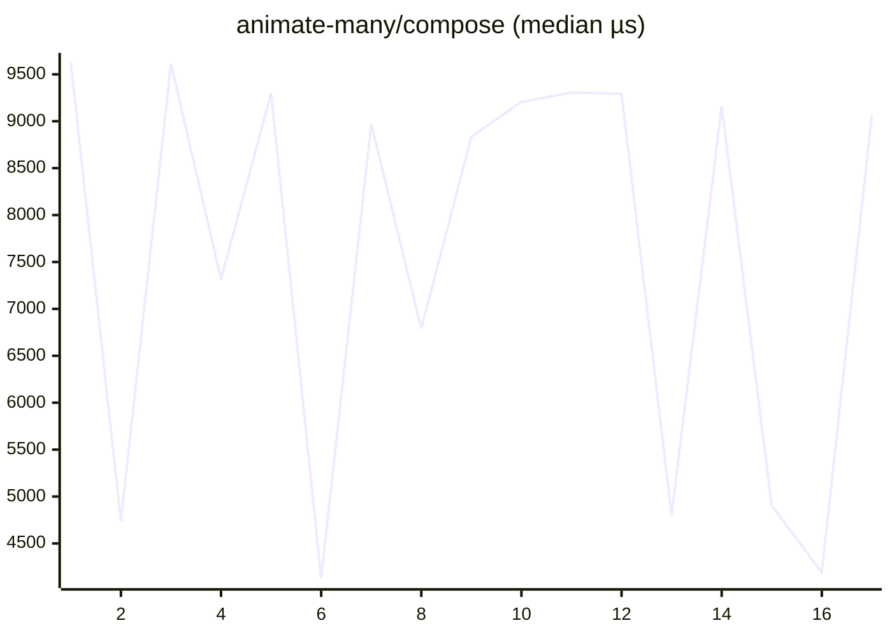
```mermaid
xychart-beta
    title "animate-many/compose (median µs)"
    x-axis 1 --> 17
    line [9621.1, 4735.8, 9612.0, 7315.2, 9298.7, 4130.8, 8970.6, 6790.0, 8834.4, 9205.4, 9306.1, 9292.8, 4799.0, 9161.8, 4902.4, 4191.9, 9068.1]
```

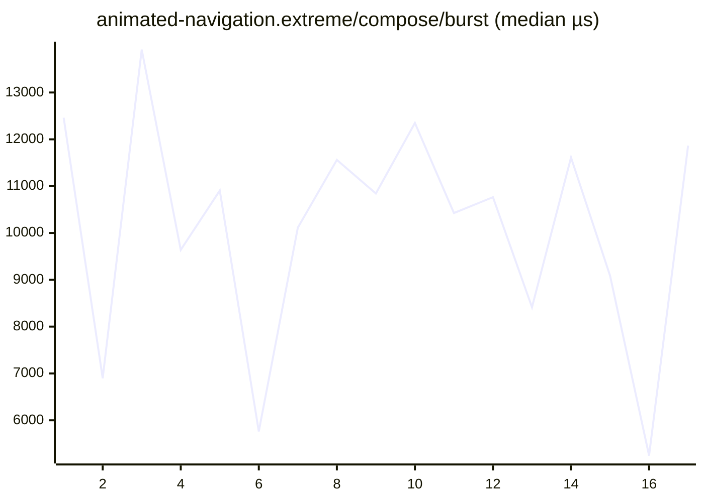
```mermaid
xychart-beta
    title "animated-navigation.extreme/compose/burst (median µs)"
    x-axis 1 --> 17
    line [12461.7, 6898.2, 13915.6, 9639.3, 10905.1, 5761.3, 10113.7, 11560.1, 10842.8, 12348.2, 10426.3, 10764.8, 8413.1, 11612.7, 9088.3, 5246.3, 11867.2]
```

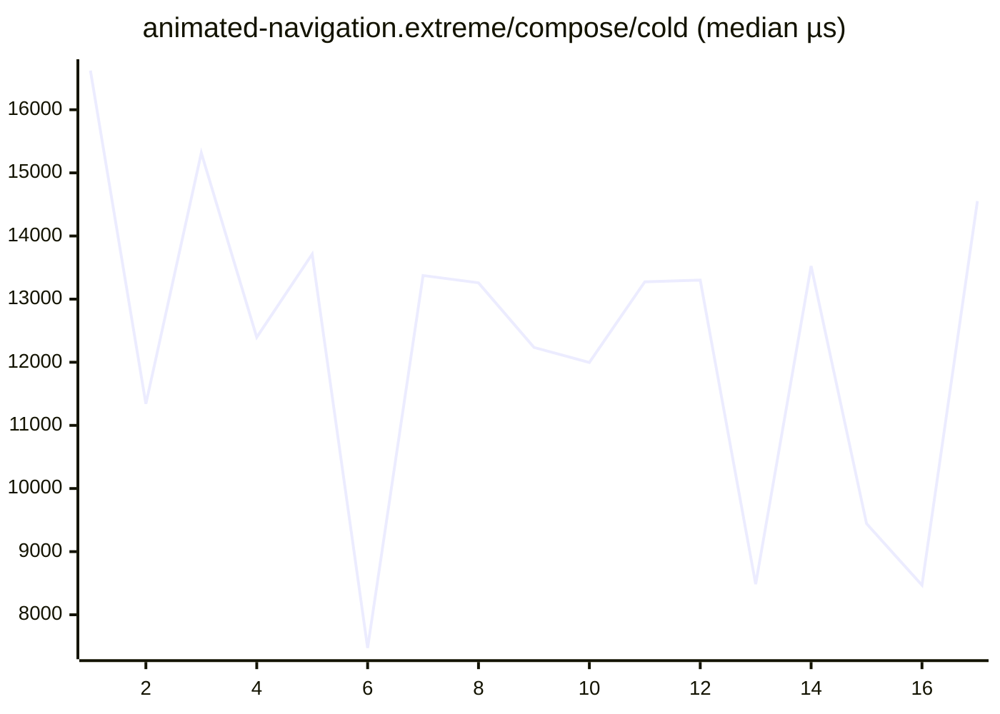
```mermaid
xychart-beta
    title "animated-navigation.extreme/compose/cold (median µs)"
    x-axis 1 --> 17
    line [16620.2, 11340.5, 15315.5, 12396.6, 13713.1, 7474.2, 13373.9, 13257.9, 12235.4, 11996.7, 13273.8, 13300.5, 8485.0, 13524.2, 9443.8, 8468.3, 14553.2]
```

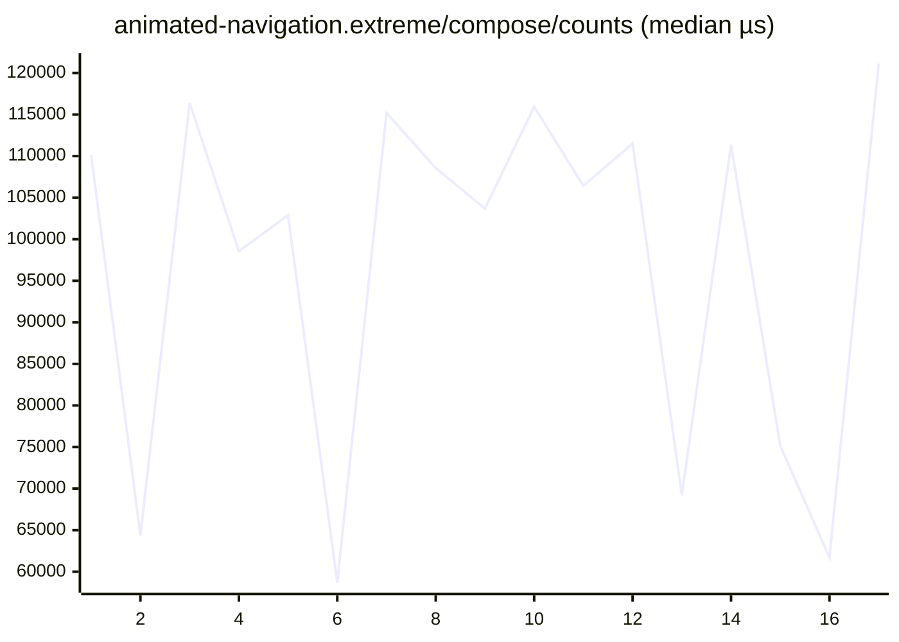
```mermaid
xychart-beta
    title "animated-navigation.extreme/compose/counts (median µs)"
    x-axis 1 --> 17
    line [110129.9, 64349.2, 116391.7, 98569.9, 102876.7, 58688.1, 115195.9, 108552.8, 103684.7, 115937.5, 106415.2, 111517.3, 69185.6, 111367.5, 75157.6, 61703.5, 121144.3]
```

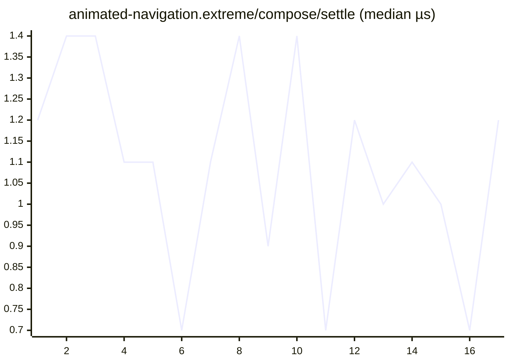
```mermaid
xychart-beta
    title "animated-navigation.extreme/compose/settle (median µs)"
    x-axis 1 --> 17
    line [1.2, 1.4, 1.4, 1.1, 1.1, 0.7, 1.1, 1.4, 0.9, 1.4, 0.7, 1.2, 1.0, 1.1, 1.0, 0.7, 1.2]
```

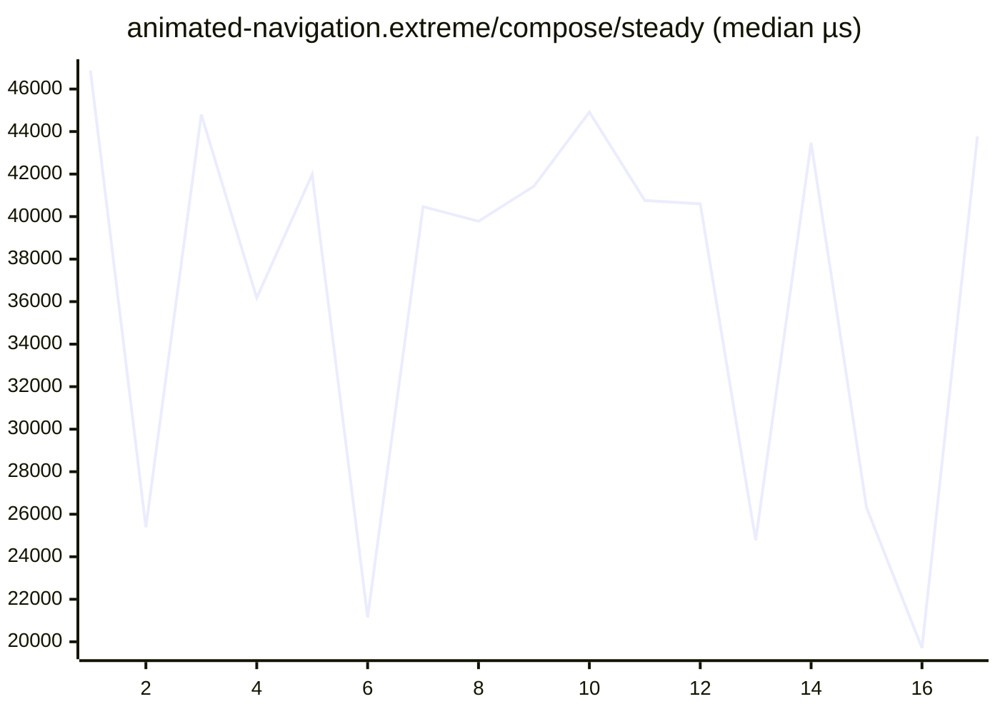
```mermaid
xychart-beta
    title "animated-navigation.extreme/compose/steady (median µs)"
    x-axis 1 --> 17
    line [46868.1, 25388.1, 44800.9, 36175.8, 41986.1, 21150.1, 40467.5, 39782.6, 41428.4, 44914.1, 40760.0, 40602.3, 24776.9, 43474.0, 26309.4, 19709.9, 43774.9]
```

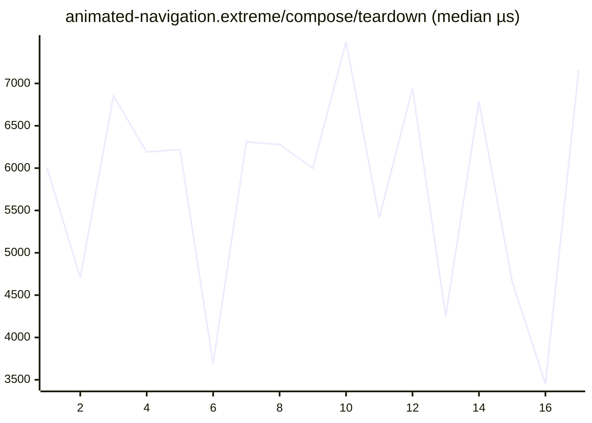
```mermaid
xychart-beta
    title "animated-navigation.extreme/compose/teardown (median µs)"
    x-axis 1 --> 17
    line [6005.0, 4705.5, 6853.0, 6189.7, 6219.9, 3693.0, 6309.6, 6278.2, 5999.3, 7491.5, 5412.1, 6942.1, 4250.5, 6786.2, 4660.1, 3451.8, 7156.4]
```

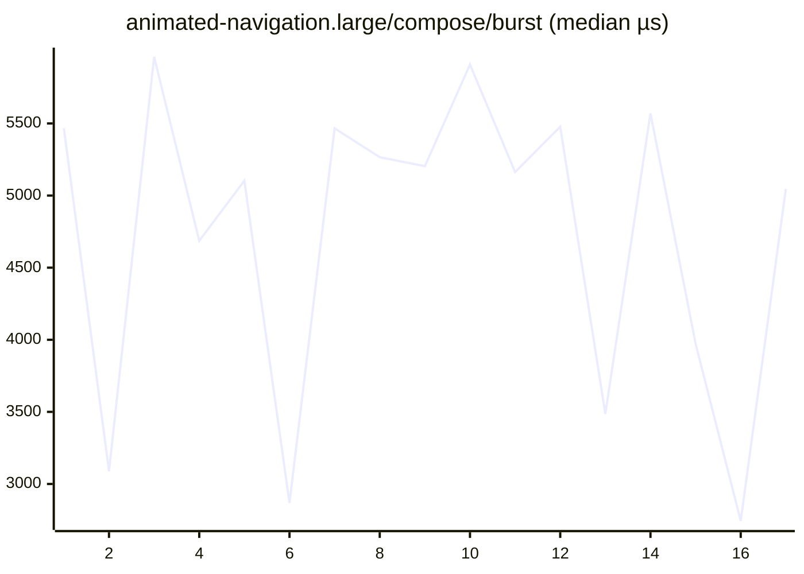
```mermaid
xychart-beta
    title "animated-navigation.large/compose/burst (median µs)"
    x-axis 1 --> 17
    line [5466.6, 3087.8, 5962.6, 4686.8, 5103.1, 2868.2, 5466.2, 5265.7, 5203.7, 5908.6, 5162.6, 5477.3, 3485.2, 5570.7, 3972.3, 2743.9, 5046.1]
```

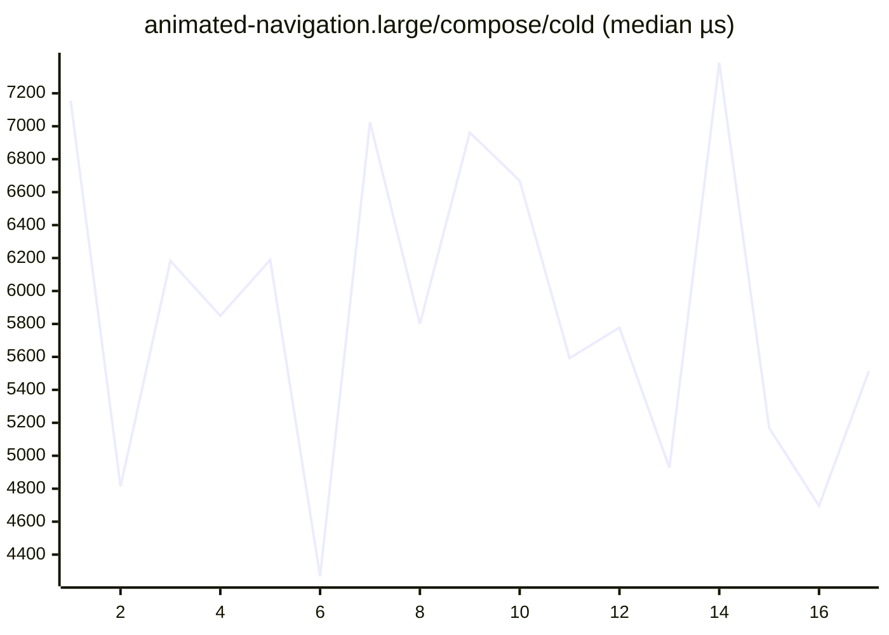
```mermaid
xychart-beta
    title "animated-navigation.large/compose/cold (median µs)"
    x-axis 1 --> 17
    line [7156.2, 4813.3, 6183.5, 5849.2, 6189.4, 4268.5, 7025.1, 5800.1, 6961.6, 6669.8, 5592.5, 5777.9, 4927.5, 7385.2, 5169.2, 4696.1, 5514.8]
```

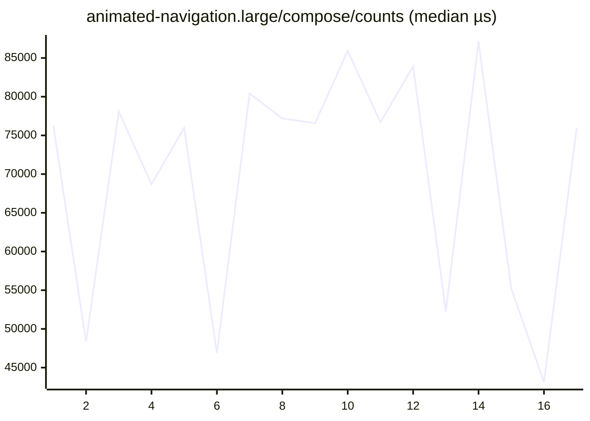
```mermaid
xychart-beta
    title "animated-navigation.large/compose/counts (median µs)"
    x-axis 1 --> 17
    line [76248.8, 48338.1, 78084.1, 68688.7, 75988.3, 46887.2, 80418.2, 77193.1, 76591.3, 85909.7, 76703.1, 83933.1, 52237.7, 87116.2, 55206.4, 43133.9, 75942.8]
```

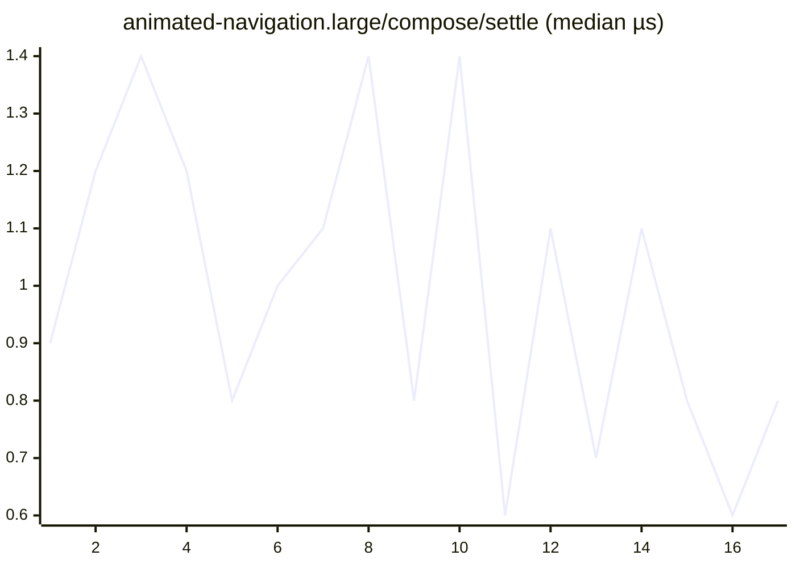
```mermaid
xychart-beta
    title "animated-navigation.large/compose/settle (median µs)"
    x-axis 1 --> 17
    line [0.9, 1.2, 1.4, 1.2, 0.8, 1.0, 1.1, 1.4, 0.8, 1.4, 0.6, 1.1, 0.7, 1.1, 0.8, 0.6, 0.8]
```

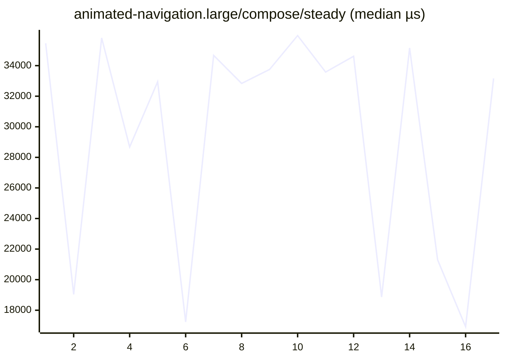
```mermaid
xychart-beta
    title "animated-navigation.large/compose/steady (median µs)"
    x-axis 1 --> 17
    line [35460.5, 19037.5, 35808.1, 28678.7, 32946.1, 17234.9, 34669.9, 32836.2, 33753.5, 35965.6, 33580.5, 34615.5, 18867.2, 35156.6, 21295.6, 16923.0, 33166.9]
```

```mermaid
xychart-beta
    title "animated-navigation.large/compose/teardown (median µs)"
    x-axis 1 --> 17
    line [1975.4, 1851.1, 2399.1, 2304.8, 2075.6, 1672.7, 2579.5, 2372.6, 2180.7, 2684.2, 1910.4, 2522.5, 1640.1, 2454.4, 1910.3, 1238.0, 2056.1]
```

```mermaid
xychart-beta
    title "animated-navigation.medium/compose/burst (median µs)"
    x-axis 1 --> 17
    line [1463.5, 1805.0, 1407.7, 1828.7, 1713.2, 1721.3, 1089.5, 842.0, 1734.8, 1371.7, 837.2, 999.1, 1721.7, 1812.8, 1349.6, 779.2, 1774.3]
```

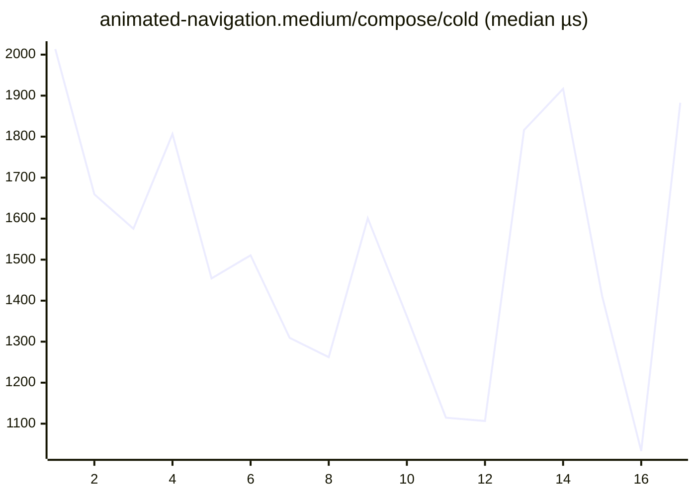
```mermaid
xychart-beta
    title "animated-navigation.medium/compose/cold (median µs)"
    x-axis 1 --> 17
    line [2013.4, 1659.3, 1575.4, 1806.3, 1454.3, 1510.6, 1309.3, 1262.3, 1600.9, 1362.0, 1114.5, 1106.6, 1816.0, 1916.6, 1411.0, 1033.3, 1882.6]
```

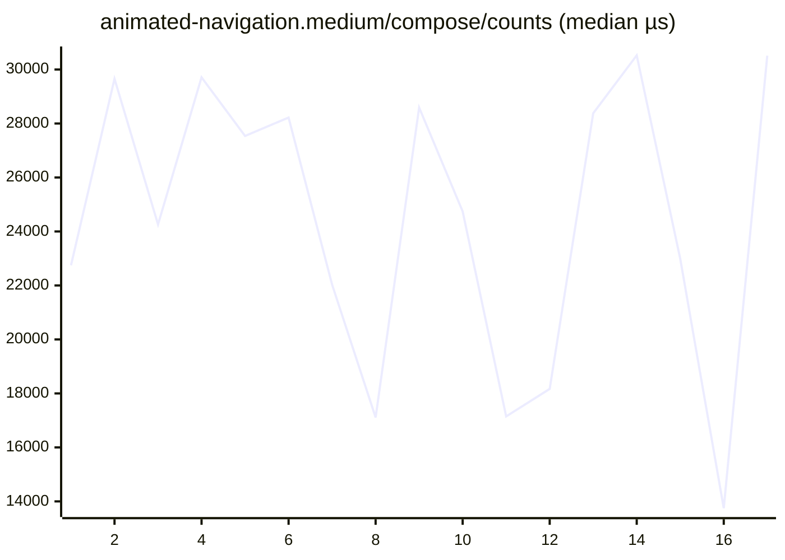
```mermaid
xychart-beta
    title "animated-navigation.medium/compose/counts (median µs)"
    x-axis 1 --> 17
    line [22746.0, 29658.4, 24261.2, 29711.8, 27538.5, 28220.6, 22030.3, 17110.4, 28591.1, 24743.2, 17148.6, 18167.6, 28376.3, 30524.5, 22988.2, 13747.6, 30513.1]
```

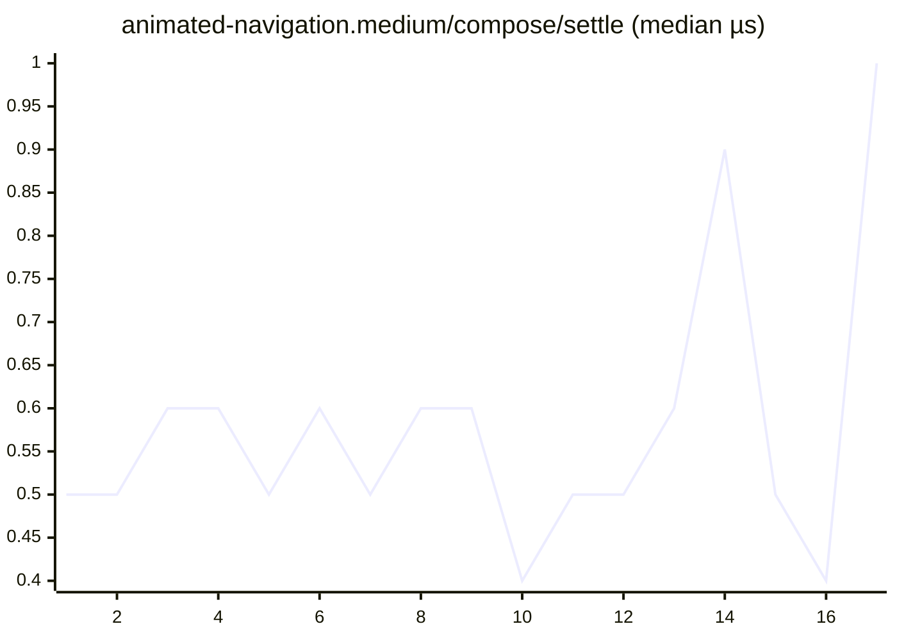
```mermaid
xychart-beta
    title "animated-navigation.medium/compose/settle (median µs)"
    x-axis 1 --> 17
    line [0.5, 0.5, 0.6, 0.6, 0.5, 0.6, 0.5, 0.6, 0.6, 0.4, 0.5, 0.5, 0.6, 0.9, 0.5, 0.4, 1.0]
```

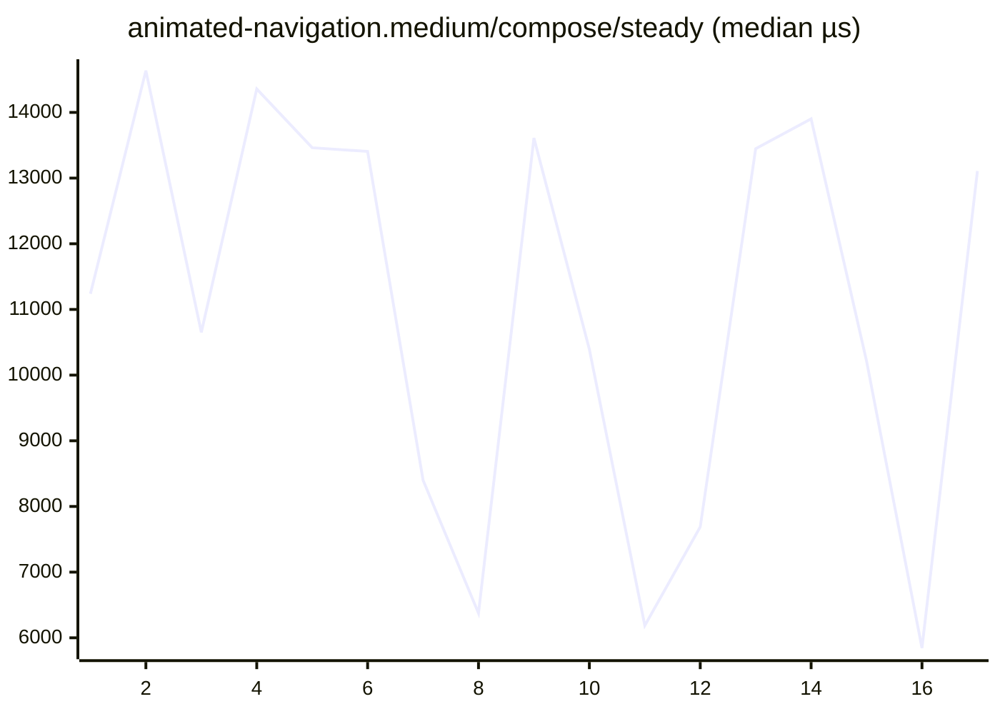
```mermaid
xychart-beta
    title "animated-navigation.medium/compose/steady (median µs)"
    x-axis 1 --> 17
    line [11237.2, 14637.0, 10651.3, 14357.3, 13461.9, 13406.0, 8401.2, 6375.1, 13610.7, 10392.6, 6186.6, 7688.8, 13447.4, 13901.2, 10215.3, 5845.4, 13107.8]
```

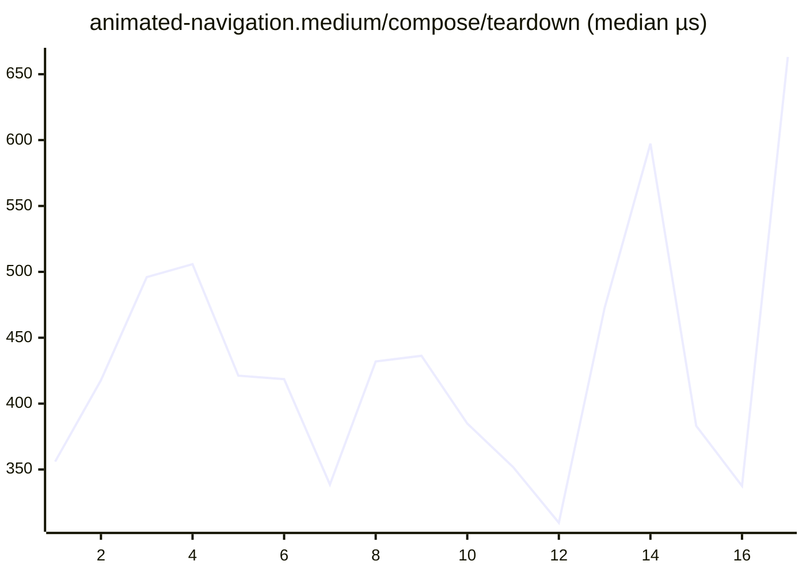
```mermaid
xychart-beta
    title "animated-navigation.medium/compose/teardown (median µs)"
    x-axis 1 --> 17
    line [356.0, 417.8, 496.0, 505.8, 421.2, 418.6, 338.6, 432.0, 436.3, 384.9, 351.9, 309.6, 472.7, 597.3, 383.1, 337.5, 663.1]
```

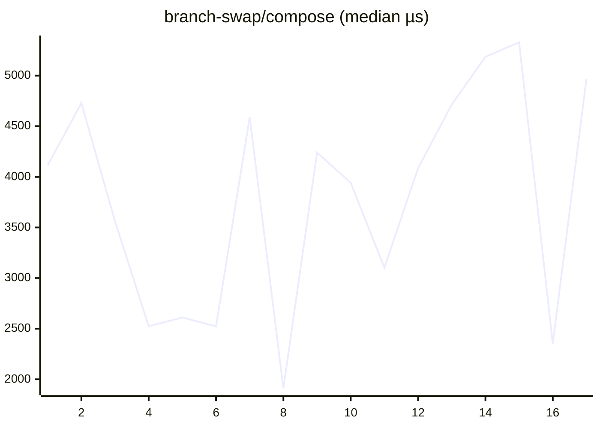
```mermaid
xychart-beta
    title "branch-swap/compose (median µs)"
    x-axis 1 --> 17
    line [4113.6, 4729.3, 3561.0, 2524.1, 2610.3, 2522.9, 4591.4, 1909.9, 4240.8, 3939.9, 3102.4, 4086.3, 4713.5, 5185.1, 5329.1, 2353.1, 4969.3]
```

```mermaid
xychart-beta
    title "cold-mount-100/compose (median µs)"
    x-axis 1 --> 17
    line [686.8, 560.2, 838.1, 567.4, 589.5, 322.8, 586.1, 833.3, 574.8, 590.4, 542.0, 551.8, 731.2, 1077.2, 808.7, 483.9, 513.1]
```

```mermaid
xychart-beta
    title "cold-mount-1000/compose (median µs)"
    x-axis 1 --> 17
    line [8399.3, 4719.3, 3773.5, 7121.6, 6041.0, 5964.6, 7856.3, 5534.2, 7586.1, 7564.1, 6423.2, 5716.5, 6155.1, 4680.5, 6242.3, 3574.2, 8163.7]
```

```mermaid
xychart-beta
    title "cold-mount-10000/compose (median µs)"
    x-axis 1 --> 17
    line [74882.4, 77308.0, 75289.0, 90310.2, 100985.1, 86939.8, 92707.3, 108106.4, 117169.6, 87680.3, 84895.8, 118560.2, 74046.2, 87189.7, 102051.1, 65038.2, 94025.5]
```

```mermaid
xychart-beta
    title "data-grid.extreme/compose/burst (median µs)"
    x-axis 1 --> 17
    line [917195.8, 848359.9, 869706.9, 657651.2, 855176.6, 921506.7, 908083.0, 573450.9, 461483.4, 761043.5, 816508.3, 689906.6, 803454.6, 618026.1, 853689.3, 524407.7, 829320.4]
```

```mermaid
xychart-beta
    title "data-grid.extreme/compose/cold (median µs)"
    x-axis 1 --> 17
    line [564671.1, 532198.1, 527821.7, 398200.7, 504535.6, 560369.8, 559329.2, 357117.7, 275265.8, 469042.6, 502280.7, 419753.1, 493032.1, 374544.2, 525916.9, 330742.4, 514822.8]
```

```mermaid
xychart-beta
    title "data-grid.extreme/compose/counts (median µs)"
    x-axis 1 --> 17
    line [1731762.7, 1413521.5, 1498282.4, 1110786.6, 1445044.7, 1520204.8, 1598444.8, 1013220.0, 820746.8, 1359771.1, 1345694.4, 1198215.0, 1381937.6, 1103694.0, 1487289.3, 939246.6, 1449304.9]
```

```mermaid
xychart-beta
    title "data-grid.extreme/compose/settle (median µs)"
    x-axis 1 --> 17
    line [2.1, 2.1, 1.9, 2.3, 2.1, 2.0, 2.5, 1.9, 2.3, 1.6, 2.0, 2.4, 2.0, 2.1, 2.0, 2.5, 3.0]
```

```mermaid
xychart-beta
    title "data-grid.extreme/compose/steady (median µs)"
    x-axis 1 --> 17
    line [27880.3, 26608.5, 24816.6, 19150.7, 24207.3, 25586.7, 23913.6, 16161.1, 13884.4, 22676.4, 23497.7, 19627.2, 24715.0, 19926.1, 21328.2, 13514.4, 19969.7]
```

```mermaid
xychart-beta
    title "data-grid.extreme/compose/teardown (median µs)"
    x-axis 1 --> 17
    line [1360.6, 1265.7, 1291.4, 1110.8, 1495.5, 1394.8, 1342.7, 1198.4, 894.8, 1159.8, 1218.1, 1067.8, 1172.8, 980.9, 1356.9, 990.5, 1421.0]
```

```mermaid
xychart-beta
    title "data-grid.large/compose/burst (median µs)"
    x-axis 1 --> 17
    line [108370.1, 137573.0, 114009.5, 133242.0, 132707.0, 131389.9, 95336.0, 90479.1, 132048.5, 117034.0, 90517.6, 99924.5, 142674.2, 152054.8, 107266.5, 109774.4, 131631.2]
```

```mermaid
xychart-beta
    title "data-grid.large/compose/cold (median µs)"
    x-axis 1 --> 17
    line [60694.5, 76941.3, 63120.6, 77459.9, 77741.8, 77504.9, 55851.8, 49552.1, 78186.9, 63835.1, 50574.9, 58902.3, 83015.1, 91492.9, 63434.2, 63517.8, 78011.2]
```

```mermaid
xychart-beta
    title "data-grid.large/compose/counts (median µs)"
    x-axis 1 --> 17
    line [187980.4, 244856.9, 207644.2, 241741.6, 244790.8, 244140.2, 179442.8, 167872.8, 245479.5, 209517.2, 173625.5, 183503.3, 247575.1, 280353.1, 191777.3, 191942.0, 246828.4]
```

```mermaid
xychart-beta
    title "data-grid.large/compose/settle (median µs)"
    x-axis 1 --> 17
    line [1.5, 1.6, 2.4, 1.8, 1.5, 1.4, 1.2, 2.6, 1.6, 1.7, 2.0, 1.4, 1.6, 2.2, 1.3, 2.0, 1.6]
```

```mermaid
xychart-beta
    title "data-grid.large/compose/steady (median µs)"
    x-axis 1 --> 17
    line [14957.3, 18099.0, 16104.9, 16959.8, 15977.4, 16630.3, 11479.9, 11754.6, 16353.8, 12991.3, 10569.2, 12334.9, 17439.5, 17744.9, 12209.4, 12926.7, 16077.8]
```

```mermaid
xychart-beta
    title "data-grid.large/compose/teardown (median µs)"
    x-axis 1 --> 17
    line [469.9, 567.8, 474.6, 573.2, 553.4, 516.9, 391.3, 447.8, 530.9, 497.7, 413.5, 417.8, 673.8, 622.3, 432.9, 482.3, 498.6]
```

```mermaid
xychart-beta
    title "data-grid.medium/compose/burst (median µs)"
    x-axis 1 --> 17
    line [69739.0, 35886.9, 46673.5, 57857.6, 48420.1, 50977.2, 67910.8, 47817.6, 71027.7, 60248.1, 63971.8, 40554.9, 61266.2, 43948.0, 45646.3, 37707.1, 69933.5]
```

```mermaid
xychart-beta
    title "data-grid.medium/compose/cold (median µs)"
    x-axis 1 --> 17
    line [39856.7, 21102.5, 25793.1, 34471.6, 28818.4, 27678.6, 37266.3, 27413.1, 42489.8, 36315.9, 37015.0, 23026.9, 36389.3, 25537.0, 24976.5, 22520.6, 36575.2]
```

```mermaid
xychart-beta
    title "data-grid.medium/compose/counts (median µs)"
    x-axis 1 --> 17
    line [141793.3, 71603.8, 99581.8, 122381.7, 107874.3, 104361.4, 148720.8, 103336.5, 148623.9, 130794.7, 134981.7, 87414.3, 140256.9, 101443.1, 103966.6, 82991.9, 140560.5]
```

```mermaid
xychart-beta
    title "data-grid.medium/compose/settle (median µs)"
    x-axis 1 --> 17
    line [2.3, 1.0, 1.8, 1.5, 2.2, 2.0, 2.7, 2.0, 2.4, 1.4, 1.9, 1.2, 1.8, 2.0, 2.6, 1.8, 2.5]
```

```mermaid
xychart-beta
    title "data-grid.medium/compose/steady (median µs)"
    x-axis 1 --> 17
    line [20754.9, 8162.0, 12334.8, 12381.3, 12840.2, 10470.5, 13619.2, 11418.3, 14976.0, 13623.4, 16125.3, 9286.1, 15988.6, 10571.0, 10284.2, 8331.7, 13691.2]
```

```mermaid
xychart-beta
    title "data-grid.medium/compose/teardown (median µs)"
    x-axis 1 --> 17
    line [356.8, 187.9, 248.2, 292.5, 260.1, 258.1, 350.6, 241.2, 365.1, 291.9, 312.0, 182.4, 298.5, 260.1, 225.5, 199.1, 374.9]
```

```mermaid
xychart-beta
    title "dense-dashboard.extreme/compose/burst (median µs)"
    x-axis 1 --> 17
    line [20153.1, 12231.0, 11532.2, 14838.7, 15355.1, 14237.6, 19804.9, 12160.9, 22267.2, 17938.8, 17343.2, 11744.1, 18935.9, 12431.7, 13563.7, 10265.6, 18057.4]
```

```mermaid
xychart-beta
    title "dense-dashboard.extreme/compose/cold (median µs)"
    x-axis 1 --> 17
    line [606.7, 398.8, 383.4, 479.8, 502.1, 460.9, 622.2, 391.5, 598.7, 533.1, 544.2, 396.2, 582.7, 433.7, 388.8, 357.0, 574.0]
```

```mermaid
xychart-beta
    title "dense-dashboard.extreme/compose/counts (median µs)"
    x-axis 1 --> 17
    line [23438.8, 13693.1, 17691.5, 22404.5, 21786.2, 19601.6, 29177.0, 18354.6, 29196.1, 24726.4, 24497.4, 17843.8, 29355.9, 16907.7, 21176.1, 14811.4, 28504.9]
```

```mermaid
xychart-beta
    title "dense-dashboard.extreme/compose/settle (median µs)"
    x-axis 1 --> 17
    line [1.3, 0.9, 1.2, 1.1, 1.4, 0.9, 2.0, 1.1, 1.9, 1.0, 1.0, 1.1, 1.1, 1.3, 1.9, 1.1, 1.5]
```

```mermaid
xychart-beta
    title "dense-dashboard.extreme/compose/steady (median µs)"
    x-axis 1 --> 17
    line [863.1, 432.7, 533.0, 686.6, 708.9, 700.6, 897.3, 551.6, 891.7, 837.9, 851.9, 466.5, 847.8, 522.7, 468.9, 431.9, 891.4]
```

```mermaid
xychart-beta
    title "dense-dashboard.extreme/compose/teardown (median µs)"
    x-axis 1 --> 17
    line [599.1, 388.0, 393.2, 539.8, 566.2, 477.4, 750.9, 387.6, 852.7, 578.6, 584.8, 403.3, 604.5, 409.3, 558.9, 425.1, 670.2]
```

```mermaid
xychart-beta
    title "dense-dashboard.large/compose/burst (median µs)"
    x-axis 1 --> 17
    line [9706.7, 4188.0, 5056.8, 5928.3, 7819.4, 5262.6, 10115.0, 6456.2, 9438.2, 6248.7, 8699.0, 5344.5, 8641.8, 5255.7, 6678.1, 10081.2, 4617.9]
```

```mermaid
xychart-beta
    title "dense-dashboard.large/compose/cold (median µs)"
    x-axis 1 --> 17
    line [371.6, 211.1, 249.9, 272.8, 305.9, 241.0, 388.7, 281.7, 353.2, 277.0, 315.2, 224.8, 318.8, 254.6, 260.3, 378.8, 209.3]
```

```mermaid
xychart-beta
    title "dense-dashboard.large/compose/counts (median µs)"
    x-axis 1 --> 17
    line [16409.6, 9670.9, 14102.2, 13629.3, 13693.5, 13209.6, 18184.6, 13156.2, 19699.1, 16149.3, 17614.6, 12484.4, 17033.2, 11006.9, 11748.4, 17291.5, 11206.2]
```

```mermaid
xychart-beta
    title "dense-dashboard.large/compose/settle (median µs)"
    x-axis 1 --> 17
    line [1.0, 0.6, 1.2, 0.9, 1.0, 0.7, 1.6, 1.1, 1.3, 0.8, 0.8, 1.0, 0.8, 1.1, 1.4, 1.4, 0.6]
```

```mermaid
xychart-beta
    title "dense-dashboard.large/compose/steady (median µs)"
    x-axis 1 --> 17
    line [865.5, 435.0, 514.3, 679.4, 690.4, 687.8, 906.9, 544.2, 843.3, 826.2, 842.4, 453.4, 832.9, 543.4, 462.1, 840.6, 475.5]
```

```mermaid
xychart-beta
    title "dense-dashboard.large/compose/teardown (median µs)"
    x-axis 1 --> 17
    line [297.0, 159.4, 204.5, 229.9, 234.0, 203.9, 330.2, 203.6, 300.1, 241.5, 297.5, 179.0, 256.5, 184.9, 236.6, 313.4, 166.4]
```

```mermaid
xychart-beta
    title "dense-dashboard.medium/compose/burst (median µs)"
    x-axis 1 --> 17
    line [3256.9, 3747.3, 2886.3, 1441.8, 1725.1, 2212.3, 2923.7, 1545.5, 3048.9, 2276.1, 2787.0, 3601.1, 2820.4, 3481.9, 3299.7, 2334.4, 2540.8]
```

```mermaid
xychart-beta
    title "dense-dashboard.medium/compose/cold (median µs)"
    x-axis 1 --> 17
    line [214.4, 274.0, 218.8, 100.9, 158.5, 169.7, 216.8, 94.9, 220.6, 178.7, 193.6, 231.5, 195.7, 210.2, 308.6, 138.8, 217.4]
```

```mermaid
xychart-beta
    title "dense-dashboard.medium/compose/counts (median µs)"
    x-axis 1 --> 17
    line [6736.4, 8374.2, 5949.6, 3187.1, 3588.3, 3998.0, 5805.3, 3074.5, 6058.2, 4688.6, 4602.1, 6344.4, 5931.1, 6502.2, 6059.5, 3138.1, 4633.3]
```

```mermaid
xychart-beta
    title "dense-dashboard.medium/compose/settle (median µs)"
    x-axis 1 --> 17
    line [0.8, 1.3, 0.7, 0.4, 0.9, 0.6, 1.0, 0.4, 0.7, 0.5, 0.7, 0.7, 0.7, 0.7, 1.2, 0.6, 1.0]
```

```mermaid
xychart-beta
    title "dense-dashboard.medium/compose/steady (median µs)"
    x-axis 1 --> 17
    line [823.5, 817.9, 816.4, 407.5, 448.9, 446.8, 626.3, 405.8, 836.7, 691.9, 679.1, 829.3, 806.3, 886.2, 635.3, 437.8, 644.6]
```

```mermaid
xychart-beta
    title "dense-dashboard.medium/compose/teardown (median µs)"
    x-axis 1 --> 17
    line [120.9, 153.9, 121.5, 62.5, 79.1, 89.7, 105.7, 57.1, 114.0, 91.1, 113.4, 114.9, 114.1, 129.6, 134.7, 83.7, 109.7]
```

```mermaid
xychart-beta
    title "entities-identity-churn-10.extreme/compose/burst (median µs)"
    x-axis 1 --> 17
    line [57275.1, 58550.6, 48500.0, 29373.5, 40666.3, 39982.2, 49684.3, 29001.5, 55300.8, 46626.0, 54331.2, 47385.4, 44184.1, 57350.2, 55638.5, 36466.5, 53142.1]
```

```mermaid
xychart-beta
    title "entities-identity-churn-10.extreme/compose/cold (median µs)"
    x-axis 1 --> 17
    line [35128.8, 48787.2, 29239.1, 17390.4, 22368.5, 29280.2, 24311.0, 16950.3, 33925.4, 35068.3, 35395.1, 30904.1, 25973.8, 35820.1, 27155.8, 19162.0, 39830.0]
```

```mermaid
xychart-beta
    title "entities-identity-churn-10.extreme/compose/counts (median µs)"
    x-axis 1 --> 17
    line [203645.1, 278041.5, 232881.6, 153922.4, 182354.5, 184019.0, 216326.1, 144957.2, 253653.9, 222367.1, 244247.3, 227252.0, 222707.6, 229905.6, 227412.0, 154463.0, 253905.0]
```

```mermaid
xychart-beta
    title "entities-identity-churn-10.extreme/compose/settle (median µs)"
    x-axis 1 --> 17
    line [1.7, 2.7, 2.1, 1.3, 2.4, 2.5, 2.5, 1.7, 2.1, 2.4, 2.7, 1.8, 1.7, 2.3, 2.4, 1.7, 2.5]
```

```mermaid
xychart-beta
    title "entities-identity-churn-10.extreme/compose/steady (median µs)"
    x-axis 1 --> 17
    line [67605.4, 110490.0, 62006.6, 30428.1, 51252.0, 46762.5, 64252.2, 28767.6, 66612.9, 59787.7, 63653.0, 55688.2, 55625.3, 65233.1, 65161.4, 37503.7, 66247.5]
```

```mermaid
xychart-beta
    title "entities-identity-churn-10.extreme/compose/teardown (median µs)"
    x-axis 1 --> 17
    line [1382.9, 1964.2, 1144.8, 694.6, 900.0, 1153.0, 1185.0, 704.6, 1317.6, 1288.5, 1374.1, 1154.8, 1108.5, 1439.2, 1308.5, 830.9, 1325.7]
```

```mermaid
xychart-beta
    title "entities-identity-churn-10.large/compose/burst (median µs)"
    x-axis 1 --> 17
    line [22661.4, 12171.9, 13759.9, 13609.3, 14702.9, 13810.3, 16589.5, 13156.5, 16938.4, 14336.2, 14496.7, 12469.3, 15407.9, 10352.2, 12022.2, 9505.6, 16359.3]
```

```mermaid
xychart-beta
    title "entities-identity-churn-10.large/compose/cold (median µs)"
    x-axis 1 --> 17
    line [16026.8, 10773.1, 8930.7, 10020.5, 8909.7, 10600.2, 13336.4, 10600.4, 12699.6, 11446.0, 12019.2, 7298.6, 11158.7, 8272.5, 7480.0, 7996.4, 11097.1]
```

```mermaid
xychart-beta
    title "entities-identity-churn-10.large/compose/counts (median µs)"
    x-axis 1 --> 17
    line [80942.4, 39356.0, 64825.7, 63038.7, 65034.2, 58295.1, 80549.5, 59637.8, 87345.1, 67044.6, 67442.3, 52391.8, 70744.8, 45340.9, 42928.4, 43869.5, 72373.2]
```

```mermaid
xychart-beta
    title "entities-identity-churn-10.large/compose/settle (median µs)"
    x-axis 1 --> 17
    line [1.9, 1.8, 1.6, 1.3, 1.8, 1.6, 2.4, 1.4, 2.1, 1.2, 1.3, 1.3, 1.7, 1.2, 2.0, 1.9, 1.6]
```

```mermaid
xychart-beta
    title "entities-identity-churn-10.large/compose/steady (median µs)"
    x-axis 1 --> 17
    line [29699.1, 13169.4, 18127.8, 19237.6, 16977.4, 16994.0, 22978.3, 17373.8, 24022.9, 20372.9, 19422.1, 16158.3, 19649.2, 15884.6, 12704.8, 12213.1, 20784.8]
```

```mermaid
xychart-beta
    title "entities-identity-churn-10.large/compose/teardown (median µs)"
    x-axis 1 --> 17
    line [555.6, 288.1, 337.4, 360.3, 368.0, 351.5, 470.6, 319.2, 503.9, 407.0, 387.4, 294.0, 408.2, 292.6, 308.6, 273.4, 452.2]
```

```mermaid
xychart-beta
    title "entities-identity-churn-10.medium/compose/burst (median µs)"
    x-axis 1 --> 17
    line [8775.5, 6489.2, 8202.0, 6319.3, 6445.7, 3900.8, 7292.3, 7175.4, 6417.0, 7572.0, 6505.7, 7539.0, 4551.2, 7381.0, 5312.0, 4364.1, 7817.1]
```

```mermaid
xychart-beta
    title "entities-identity-churn-10.medium/compose/cold (median µs)"
    x-axis 1 --> 17
    line [6847.6, 4064.4, 5318.6, 5299.9, 5743.4, 2913.7, 5973.1, 4930.1, 5396.7, 6172.9, 5428.8, 6106.4, 3768.4, 5332.9, 3655.2, 3607.3, 5864.0]
```

```mermaid
xychart-beta
    title "entities-identity-churn-10.medium/compose/counts (median µs)"
    x-axis 1 --> 17
    line [33013.6, 23547.5, 40497.8, 27670.3, 31664.9, 18380.9, 32467.4, 30743.4, 32153.6, 32792.7, 29426.3, 33269.3, 24241.3, 32295.2, 25382.5, 19297.4, 32529.2]
```

```mermaid
xychart-beta
    title "entities-identity-churn-10.medium/compose/settle (median µs)"
    x-axis 1 --> 17
    line [1.1, 1.6, 2.1, 1.6, 0.8, 0.6, 1.3, 1.4, 0.8, 1.5, 0.7, 1.7, 0.9, 0.9, 0.9, 1.0, 1.5]
```

```mermaid
xychart-beta
    title "entities-identity-churn-10.medium/compose/steady (median µs)"
    x-axis 1 --> 17
    line [10632.2, 6021.8, 10678.6, 8206.7, 8958.3, 4763.9, 9523.9, 9074.0, 9048.8, 9567.1, 9299.6, 9981.8, 6169.6, 8767.4, 6681.7, 5242.5, 9912.6]
```

```mermaid
xychart-beta
    title "entities-identity-churn-10.medium/compose/teardown (median µs)"
    x-axis 1 --> 17
    line [231.8, 181.7, 264.1, 212.7, 181.2, 110.8, 211.8, 210.3, 188.4, 238.5, 207.6, 239.0, 147.6, 196.3, 151.4, 128.1, 234.7]
```

```mermaid
xychart-beta
    title "entities-identity-churn-50.extreme/compose/burst (median µs)"
    x-axis 1 --> 17
    line [38163.8, 45513.9, 41164.8, 46703.8, 44520.9, 38822.5, 40775.0, 36485.4, 43653.6, 35867.4, 34266.2, 32167.3, 47315.9, 56247.1, 35460.4, 40749.2, 61095.9]
```

```mermaid
xychart-beta
    title "entities-identity-churn-50.extreme/compose/cold (median µs)"
    x-axis 1 --> 17
    line [30010.2, 36978.8, 29991.4, 41393.0, 32387.4, 25962.5, 25504.0, 25319.0, 37083.9, 25771.7, 25931.6, 22738.4, 30340.0, 38850.1, 21841.9, 22148.0, 27247.6]
```

```mermaid
xychart-beta
    title "entities-identity-churn-50.extreme/compose/counts (median µs)"
    x-axis 1 --> 17
    line [308853.3, 356183.6, 347691.5, 358267.1, 320929.1, 329140.8, 275854.8, 259581.0, 334907.8, 295014.5, 246701.5, 267573.0, 384574.9, 394862.2, 297066.8, 273180.8, 391930.7]
```

```mermaid
xychart-beta
    title "entities-identity-churn-50.extreme/compose/settle (median µs)"
    x-axis 1 --> 17
    line [1.9, 1.8, 2.1, 2.0, 1.8, 1.8, 1.4, 2.3, 2.2, 1.9, 2.2, 1.6, 2.1, 2.4, 1.6, 2.4, 2.2]
```

```mermaid
xychart-beta
    title "entities-identity-churn-50.extreme/compose/steady (median µs)"
    x-axis 1 --> 17
    line [170674.3, 195161.2, 168550.7, 182630.3, 163543.1, 182753.2, 138682.5, 133780.4, 165275.8, 149408.4, 111451.2, 136217.5, 203349.1, 212304.8, 142963.5, 149138.1, 201633.3]
```

```mermaid
xychart-beta
    title "entities-identity-churn-50.extreme/compose/teardown (median µs)"
    x-axis 1 --> 17
    line [1011.2, 1123.7, 1080.1, 1376.9, 1058.4, 1062.6, 926.8, 1133.5, 1104.3, 970.0, 848.3, 985.0, 1305.6, 1480.7, 939.4, 1362.0, 1291.8]
```

```mermaid
xychart-beta
    title "entities-identity-churn-50.large/compose/burst (median µs)"
    x-axis 1 --> 17
    line [20445.0, 22651.5, 14964.2, 12211.5, 11912.3, 14060.4, 15071.6, 9027.6, 18620.6, 19561.0, 14256.0, 15757.8, 16733.7, 18175.8, 16394.2, 9684.6, 19151.9]
```

```mermaid
xychart-beta
    title "entities-identity-churn-50.large/compose/cold (median µs)"
    x-axis 1 --> 17
    line [12195.2, 16233.7, 12335.9, 7185.3, 8832.7, 11712.1, 10066.8, 8342.5, 10620.5, 8742.6, 11307.8, 13813.6, 10078.2, 11520.7, 10071.1, 7153.1, 11875.7]
```

```mermaid
xychart-beta
    title "entities-identity-churn-50.large/compose/counts (median µs)"
    x-axis 1 --> 17
    line [116758.9, 159716.3, 121699.6, 72346.5, 90059.4, 95283.3, 117176.1, 61067.3, 135298.4, 127316.3, 114177.9, 123935.4, 115659.7, 141317.2, 124010.9, 68080.2, 136069.5]
```

```mermaid
xychart-beta
    title "entities-identity-churn-50.large/compose/settle (median µs)"
    x-axis 1 --> 17
    line [1.7, 2.6, 1.9, 1.3, 1.5, 2.2, 2.2, 1.2, 1.7, 1.7, 1.8, 1.7, 1.7, 2.2, 2.2, 1.9, 2.1]
```

```mermaid
xychart-beta
    title "entities-identity-churn-50.large/compose/steady (median µs)"
    x-axis 1 --> 17
    line [65487.9, 100478.1, 59706.0, 34308.7, 51437.5, 47528.6, 59568.6, 31848.4, 60575.3, 53501.9, 51348.9, 56812.4, 56379.8, 63971.2, 62136.9, 35904.4, 63448.6]
```

```mermaid
xychart-beta
    title "entities-identity-churn-50.large/compose/teardown (median µs)"
    x-axis 1 --> 17
    line [465.8, 729.5, 440.9, 295.7, 317.9, 369.3, 410.5, 228.9, 431.5, 405.0, 388.3, 429.0, 422.8, 503.6, 408.5, 265.8, 496.0]
```

```mermaid
xychart-beta
    title "entities-identity-churn-50.medium/compose/burst (median µs)"
    x-axis 1 --> 17
    line [7359.9, 9363.4, 7988.6, 9747.3, 9365.5, 8349.5, 6021.4, 7530.2, 8564.1, 7945.3, 5942.5, 6061.8, 9300.0, 9685.8, 6780.4, 7288.8, 8050.7]
```

```mermaid
xychart-beta
    title "entities-identity-churn-50.medium/compose/cold (median µs)"
    x-axis 1 --> 17
    line [5217.5, 8076.9, 4571.3, 5260.1, 4670.0, 5901.2, 3485.4, 3508.0, 6353.3, 5982.3, 4253.9, 3093.3, 6073.5, 5226.8, 5253.6, 5737.2, 4663.5]
```

```mermaid
xychart-beta
    title "entities-identity-churn-50.medium/compose/counts (median µs)"
    x-axis 1 --> 17
    line [53771.4, 72919.2, 57149.8, 65876.4, 59908.3, 63387.5, 49532.5, 47417.3, 63149.1, 51987.3, 47650.9, 50996.6, 65923.4, 65597.9, 49076.4, 55899.8, 65332.3]
```

```mermaid
xychart-beta
    title "entities-identity-churn-50.medium/compose/settle (median µs)"
    x-axis 1 --> 17
    line [1.0, 1.3, 1.6, 1.3, 1.0, 0.9, 1.1, 2.1, 1.1, 1.2, 1.3, 1.1, 1.3, 1.9, 1.1, 1.3, 1.0]
```

```mermaid
xychart-beta
    title "entities-identity-churn-50.medium/compose/steady (median µs)"
    x-axis 1 --> 17
    line [24173.9, 29083.3, 23959.0, 26680.3, 24724.4, 25894.3, 17904.5, 18238.3, 25204.8, 20874.4, 18761.8, 18671.9, 24933.1, 26327.0, 22199.1, 22426.1, 25053.3]
```

```mermaid
xychart-beta
    title "entities-identity-churn-50.medium/compose/teardown (median µs)"
    x-axis 1 --> 17
    line [206.6, 265.4, 235.4, 253.6, 224.3, 241.3, 176.2, 215.7, 232.0, 204.8, 166.6, 163.6, 247.9, 268.2, 206.9, 208.4, 233.4]
```

```mermaid
xychart-beta
    title "entities-identity-churn.extreme/compose/burst (median µs)"
    x-axis 1 --> 17
    line [67899.9, 40475.8, 49011.8, 47993.9, 58958.8, 49403.5, 73334.0, 54549.5, 66548.0, 54692.4, 50808.2, 45346.6, 64404.4, 44556.8, 54268.3, 51525.4, 49883.4]
```

```mermaid
xychart-beta
    title "entities-identity-churn.extreme/compose/cold (median µs)"
    x-axis 1 --> 17
    line [43440.3, 23189.6, 21354.5, 24947.4, 23666.7, 30840.0, 48721.1, 23251.0, 32258.1, 34556.2, 37320.9, 26896.5, 28562.5, 18882.8, 20662.7, 30879.2, 34709.0]
```

```mermaid
xychart-beta
    title "entities-identity-churn.extreme/compose/counts (median µs)"
    x-axis 1 --> 17
    line [322090.0, 155075.8, 263232.8, 241537.1, 281124.0, 231871.8, 353585.2, 248508.0, 354600.3, 272145.1, 280403.1, 215439.7, 275925.5, 232621.2, 230653.6, 254831.0, 267496.5]
```

```mermaid
xychart-beta
    title "entities-identity-churn.extreme/compose/settle (median µs)"
    x-axis 1 --> 17
    line [2.2, 2.0, 2.2, 1.5, 2.1, 2.1, 3.1, 2.2, 2.6, 1.9, 2.0, 2.2, 1.9, 2.3, 2.4, 1.8, 1.8]
```

```mermaid
xychart-beta
    title "entities-identity-churn.extreme/compose/steady (median µs)"
    x-axis 1 --> 17
    line [168290.2, 78037.0, 94632.2, 97962.6, 108987.6, 90436.8, 176374.5, 99424.5, 155470.2, 102340.9, 104819.1, 92642.8, 109719.2, 93469.6, 91510.1, 92639.5, 99584.2]
```

```mermaid
xychart-beta
    title "entities-identity-churn.extreme/compose/teardown (median µs)"
    x-axis 1 --> 17
    line [1918.2, 1082.7, 1099.8, 1219.6, 1413.1, 1134.2, 2628.7, 1181.1, 1619.0, 1290.8, 1234.4, 1140.3, 1481.3, 1048.1, 1529.4, 1150.6, 1193.5]
```

```mermaid
xychart-beta
    title "entities-identity-churn.large/compose/burst (median µs)"
    x-axis 1 --> 17
    line [15198.1, 12817.1, 17384.4, 12828.2, 14670.0, 10802.1, 16642.4, 15644.2, 13803.3, 15894.8, 14230.7, 17457.7, 12369.8, 16567.9, 12008.9, 9741.6, 13150.5]
```

```mermaid
xychart-beta
    title "entities-identity-churn.large/compose/cold (median µs)"
    x-axis 1 --> 17
    line [14413.0, 10025.1, 12412.5, 10919.1, 9991.0, 7777.1, 12912.0, 9409.6, 12787.2, 12599.2, 13130.1, 11285.8, 9709.2, 10198.8, 8787.1, 8089.2, 10645.0]
```

```mermaid
xychart-beta
    title "entities-identity-churn.large/compose/counts (median µs)"
    x-axis 1 --> 17
    line [94808.6, 66047.0, 131198.0, 102800.1, 106962.5, 78783.2, 123433.1, 103192.9, 104430.0, 107261.8, 97542.2, 114780.9, 81637.6, 108041.6, 87537.3, 71804.0, 99214.7]
```

```mermaid
xychart-beta
    title "entities-identity-churn.large/compose/settle (median µs)"
    x-axis 1 --> 17
    line [1.7, 2.1, 2.3, 1.7, 1.5, 1.8, 2.1, 1.8, 1.5, 2.1, 1.2, 1.9, 1.1, 1.6, 1.4, 1.5, 1.9]
```

```mermaid
xychart-beta
    title "entities-identity-churn.large/compose/steady (median µs)"
    x-axis 1 --> 17
    line [42870.9, 30465.6, 44952.7, 30109.8, 34357.1, 23042.6, 39531.9, 34800.9, 32076.5, 35789.2, 30831.0, 35006.3, 26722.2, 34206.4, 28843.8, 20539.4, 32628.9]
```

```mermaid
xychart-beta
    title "entities-identity-churn.large/compose/teardown (median µs)"
    x-axis 1 --> 17
    line [421.7, 347.3, 504.6, 355.7, 394.0, 294.7, 437.3, 369.5, 374.1, 431.8, 360.0, 430.7, 282.8, 400.7, 317.2, 252.8, 350.4]
```

```mermaid
xychart-beta
    title "entities-identity-churn.medium/compose/burst (median µs)"
    x-axis 1 --> 17
    line [9268.9, 6214.3, 6318.0, 7594.1, 7048.3, 6573.8, 9681.2, 6917.6, 10671.7, 7352.6, 7444.0, 5553.5, 8327.7, 5800.0, 7532.3, 8326.3, 6322.1]
```

```mermaid
xychart-beta
    title "entities-identity-churn.medium/compose/cold (median µs)"
    x-axis 1 --> 17
    line [6175.2, 5202.2, 4209.2, 4766.1, 4414.4, 4459.7, 5534.7, 4639.2, 6259.4, 4559.3, 5122.8, 3357.2, 5238.4, 3007.7, 3873.8, 5338.2, 3450.0]
```

```mermaid
xychart-beta
    title "entities-identity-churn.medium/compose/counts (median µs)"
    x-axis 1 --> 17
    line [48430.6, 24546.5, 34883.2, 42248.6, 35027.4, 39583.1, 54112.8, 35568.3, 53135.7, 45790.5, 44009.5, 32544.3, 46007.6, 30291.5, 38839.5, 46550.4, 31393.6]
```

```mermaid
xychart-beta
    title "entities-identity-churn.medium/compose/settle (median µs)"
    x-axis 1 --> 17
    line [1.8, 1.7, 1.3, 1.0, 1.4, 1.1, 2.0, 1.2, 2.2, 0.9, 1.0, 1.2, 1.1, 1.0, 2.2, 1.9, 1.7]
```

```mermaid
xychart-beta
    title "entities-identity-churn.medium/compose/steady (median µs)"
    x-axis 1 --> 17
    line [18970.0, 11144.9, 13984.1, 14562.6, 12821.2, 13331.6, 17419.2, 12697.6, 19931.5, 14936.2, 14865.4, 12633.7, 15363.1, 9969.8, 13406.1, 17563.5, 10308.7]
```

```mermaid
xychart-beta
    title "entities-identity-churn.medium/compose/teardown (median µs)"
    x-axis 1 --> 17
    line [266.7, 172.8, 182.1, 197.6, 194.9, 188.5, 272.0, 172.4, 326.5, 214.9, 209.0, 161.2, 226.1, 146.6, 225.9, 256.6, 170.9]
```

```mermaid
xychart-beta
    title "entities-integrated.extreme/compose/burst (median µs)"
    x-axis 1 --> 17
    line [21280.1, 17085.4, 25262.9, 28283.5, 20257.0, 10917.0, 19502.9, 24080.5, 19960.3, 23727.6, 18390.4, 21100.0, 17439.3, 20030.5, 18495.9, 10288.4, 17662.3]
```

```mermaid
xychart-beta
    title "entities-integrated.extreme/compose/cold (median µs)"
    x-axis 1 --> 17
    line [107928.0, 93149.3, 109143.0, 107346.8, 112756.0, 73472.7, 113745.4, 103329.2, 116577.4, 113946.5, 114118.9, 112593.3, 90008.5, 108330.3, 94470.8, 73134.4, 107070.4]
```

```mermaid
xychart-beta
    title "entities-integrated.extreme/compose/counts (median µs)"
    x-axis 1 --> 17
    line [345877.0, 271171.1, 372031.9, 371349.9, 343525.6, 217868.2, 360516.2, 336407.1, 365059.0, 423319.5, 361829.1, 349288.6, 282524.2, 357406.1, 330656.7, 215453.7, 326652.3]
```

```mermaid
xychart-beta
    title "entities-integrated.extreme/compose/settle (median µs)"
    x-axis 1 --> 17
    line [1.8, 2.2, 2.2, 2.2, 1.9, 1.8, 1.9, 2.1, 1.9, 2.3, 1.6, 2.2, 1.6, 2.1, 2.0, 1.7, 1.8]
```

```mermaid
xychart-beta
    title "entities-integrated.extreme/compose/steady (median µs)"
    x-axis 1 --> 17
    line [112062.9, 90774.1, 117256.3, 106657.1, 98348.3, 59055.9, 101799.9, 103158.3, 100873.5, 115044.8, 87598.0, 108020.6, 74589.8, 97192.1, 85641.3, 55478.3, 100540.4]
```

```mermaid
xychart-beta
    title "entities-integrated.extreme/compose/teardown (median µs)"
    x-axis 1 --> 17
    line [33241.4, 38551.9, 37604.0, 45565.4, 37162.6, 31516.4, 39172.8, 37057.2, 37139.6, 45558.4, 33108.3, 47613.6, 27231.7, 41531.6, 32174.8, 28169.5, 34564.4]
```

```mermaid
xychart-beta
    title "entities-integrated.large/compose/burst (median µs)"
    x-axis 1 --> 17
    line [8720.8, 10514.8, 8702.4, 10287.4, 10136.5, 9822.3, 8483.4, 7252.4, 9927.0, 8424.9, 6957.0, 8468.7, 10206.6, 14920.9, 8172.7, 8698.5, 10066.6]
```

```mermaid
xychart-beta
    title "entities-integrated.large/compose/cold (median µs)"
    x-axis 1 --> 17
    line [35331.9, 46561.1, 36425.1, 45716.0, 39872.5, 39917.1, 29158.2, 30742.1, 43972.9, 34958.4, 32787.8, 29287.8, 42325.9, 49728.2, 34397.8, 37527.0, 40614.3]
```

```mermaid
xychart-beta
    title "entities-integrated.large/compose/counts (median µs)"
    x-axis 1 --> 17
    line [127887.2, 165417.5, 156094.5, 170891.3, 159918.6, 159409.8, 123085.1, 129687.2, 160052.6, 139696.9, 134004.0, 122945.8, 170282.3, 206774.8, 132931.8, 150500.9, 156970.9]
```

```mermaid
xychart-beta
    title "entities-integrated.large/compose/settle (median µs)"
    x-axis 1 --> 17
    line [1.4, 1.6, 2.0, 1.5, 1.1, 1.3, 1.2, 1.9, 1.5, 1.3, 2.1, 1.3, 1.6, 2.1, 1.2, 1.6, 1.3]
```

```mermaid
xychart-beta
    title "entities-integrated.large/compose/steady (median µs)"
    x-axis 1 --> 17
    line [42270.1, 58987.0, 46845.8, 49441.4, 48906.3, 48394.1, 38336.6, 38926.6, 50075.4, 42207.0, 38612.3, 37360.6, 54678.6, 67411.4, 37331.6, 43265.7, 49176.1]
```

```mermaid
xychart-beta
    title "entities-integrated.large/compose/teardown (median µs)"
    x-axis 1 --> 17
    line [9384.4, 11676.7, 12636.7, 11453.4, 9676.2, 9468.6, 7501.9, 12956.1, 10009.3, 9471.1, 13938.6, 7721.6, 12193.9, 18029.9, 9589.5, 12645.3, 10337.7]
```

```mermaid
xychart-beta
    title "entities-integrated.medium/compose/burst (median µs)"
    x-axis 1 --> 17
    line [8064.7, 5412.3, 8325.1, 7310.8, 7725.2, 4373.6, 8143.5, 7842.8, 7736.3, 7767.2, 7690.7, 7697.9, 6319.0, 7829.1, 6841.2, 4228.0, 7083.2]
```

```mermaid
xychart-beta
    title "entities-integrated.medium/compose/cold (median µs)"
    x-axis 1 --> 17
    line [23640.0, 18354.3, 20523.4, 16963.3, 24114.6, 15390.3, 22026.8, 20615.5, 21547.9, 19992.3, 18799.4, 22885.9, 15659.8, 21287.6, 14038.5, 11065.5, 21659.1]
```

```mermaid
xychart-beta
    title "entities-integrated.medium/compose/counts (median µs)"
    x-axis 1 --> 17
    line [92316.8, 67519.0, 107959.8, 94567.5, 113174.7, 55185.3, 104655.9, 96762.4, 98185.9, 114888.1, 97832.6, 104372.1, 74869.5, 105893.4, 80894.9, 64386.1, 88478.3]
```

```mermaid
xychart-beta
    title "entities-integrated.medium/compose/settle (median µs)"
    x-axis 1 --> 17
    line [1.6, 2.1, 2.2, 1.7, 1.5, 1.0, 1.9, 2.1, 1.6, 1.7, 1.6, 1.7, 1.2, 1.6, 1.4, 1.5, 2.0]
```

```mermaid
xychart-beta
    title "entities-integrated.medium/compose/steady (median µs)"
    x-axis 1 --> 17
    line [39845.5, 29943.1, 47449.4, 35007.7, 37155.4, 20922.3, 41221.1, 36357.3, 41695.6, 35887.0, 39232.7, 35605.8, 30858.8, 34901.2, 30707.7, 20916.0, 35210.3]
```

```mermaid
xychart-beta
    title "entities-integrated.medium/compose/teardown (median µs)"
    x-axis 1 --> 17
    line [6105.6, 6486.4, 6913.2, 7758.7, 5425.1, 3598.7, 7513.6, 6383.3, 5777.9, 6224.8, 6071.4, 6893.6, 4435.3, 6452.0, 4488.1, 4771.4, 6234.5]
```

```mermaid
xychart-beta
    title "entities-relevance-saturated.extreme/compose/burst (median µs)"
    x-axis 1 --> 17
    line [95057.1, 94073.3, 97254.7, 96247.4, 87014.9, 56203.8, 97444.4, 80154.4, 77927.4, 103746.7, 82803.5, 93375.6, 59829.5, 101895.7, 65226.7, 69372.4, 102781.7]
```

```mermaid
xychart-beta
    title "entities-relevance-saturated.extreme/compose/cold (median µs)"
    x-axis 1 --> 17
    line [30591.9, 22227.2, 28424.7, 29174.1, 36070.7, 21358.8, 36288.9, 26574.9, 35611.0, 36983.5, 34520.6, 36564.2, 21527.8, 37487.9, 22901.3, 19757.3, 37880.7]
```

```mermaid
xychart-beta
    title "entities-relevance-saturated.extreme/compose/counts (median µs)"
    x-axis 1 --> 17
    line [228810.1, 211002.3, 277035.4, 262243.7, 240299.8, 164476.9, 257313.3, 264214.0, 233920.7, 276780.2, 221301.1, 270359.0, 177921.8, 274771.1, 192468.4, 166500.1, 277864.5]
```

```mermaid
xychart-beta
    title "entities-relevance-saturated.extreme/compose/settle (median µs)"
    x-axis 1 --> 17
    line [2.0, 2.8, 2.9, 2.6, 2.0, 2.1, 2.8, 2.4, 2.1, 2.9, 2.0, 3.0, 1.8, 2.8, 2.3, 2.5, 2.8]
```

```mermaid
xychart-beta
    title "entities-relevance-saturated.extreme/compose/steady (median µs)"
    x-axis 1 --> 17
    line [56507.4, 52162.7, 59312.8, 52039.1, 53658.6, 36010.3, 61177.2, 57566.9, 48010.2, 68485.7, 53094.5, 57009.3, 41539.1, 57133.3, 49753.9, 42073.5, 66737.1]
```

```mermaid
xychart-beta
    title "entities-relevance-saturated.extreme/compose/teardown (median µs)"
    x-axis 1 --> 17
    line [13113.8, 13417.0, 14500.7, 15465.3, 13655.0, 10660.5, 15751.4, 13314.0, 13344.5, 17644.9, 12661.0, 16440.7, 11094.6, 16090.4, 12986.5, 12086.3, 18142.3]
```

```mermaid
xychart-beta
    title "entities-relevance-saturated.large/compose/burst (median µs)"
    x-axis 1 --> 17
    line [27403.3, 40547.2, 27643.0, 16736.6, 24669.8, 21688.5, 29979.9, 16166.2, 30300.2, 30155.5, 28582.6, 28651.2, 27329.9, 28979.2, 31384.7, 19187.3, 30459.7]
```

```mermaid
xychart-beta
    title "entities-relevance-saturated.large/compose/cold (median µs)"
    x-axis 1 --> 17
    line [11952.4, 12445.2, 13843.1, 7413.0, 8312.1, 8704.4, 10161.2, 6701.9, 12357.0, 10756.6, 10370.8, 11728.1, 11365.2, 11702.2, 11668.6, 7745.8, 13349.5]
```

```mermaid
xychart-beta
    title "entities-relevance-saturated.large/compose/counts (median µs)"
    x-axis 1 --> 17
    line [100423.7, 101703.7, 92984.2, 61791.0, 76047.1, 71772.8, 86609.3, 65186.0, 106708.1, 101829.6, 109206.6, 92523.3, 98196.1, 103780.3, 86269.3, 64958.3, 108453.4]
```

```mermaid
xychart-beta
    title "entities-relevance-saturated.large/compose/settle (median µs)"
    x-axis 1 --> 17
    line [1.5, 2.3, 2.0, 1.3, 1.4, 2.1, 2.5, 1.5, 2.1, 2.3, 2.4, 1.8, 1.6, 2.2, 2.3, 1.8, 2.5]
```

```mermaid
xychart-beta
    title "entities-relevance-saturated.large/compose/steady (median µs)"
    x-axis 1 --> 17
    line [19345.5, 23966.2, 20176.3, 10165.4, 13367.2, 11453.9, 16848.3, 9876.0, 19588.2, 17985.1, 19800.6, 18112.7, 16450.4, 18537.0, 18728.9, 11800.5, 21100.0]
```

```mermaid
xychart-beta
    title "entities-relevance-saturated.large/compose/teardown (median µs)"
    x-axis 1 --> 17
    line [2906.6, 4134.8, 3277.4, 2382.9, 2631.1, 3034.7, 3549.8, 2278.8, 3502.9, 3805.4, 3819.2, 3267.9, 3244.7, 4160.1, 3689.0, 3174.7, 4227.6]
```

```mermaid
xychart-beta
    title "entities-relevance-saturated.medium/compose/burst (median µs)"
    x-axis 1 --> 17
    line [13879.1, 10176.6, 13944.0, 11937.1, 11307.3, 6750.6, 12996.3, 12989.8, 13667.0, 12683.5, 13714.4, 12186.7, 9072.5, 12685.5, 9859.9, 10702.4, 11329.6]
```

```mermaid
xychart-beta
    title "entities-relevance-saturated.medium/compose/cold (median µs)"
    x-axis 1 --> 17
    line [6104.0, 4520.5, 5933.8, 6295.2, 6588.9, 3499.8, 6545.6, 5372.2, 7062.3, 6753.8, 6482.3, 6567.6, 3807.3, 7146.6, 5444.9, 6049.8, 6933.3]
```

```mermaid
xychart-beta
    title "entities-relevance-saturated.medium/compose/counts (median µs)"
    x-axis 1 --> 17
    line [39918.2, 26024.7, 45495.9, 38988.2, 39254.8, 26227.8, 42747.2, 41118.5, 39198.0, 43906.8, 41520.5, 40325.3, 34865.1, 42542.8, 30576.4, 34596.4, 35944.0]
```

```mermaid
xychart-beta
    title "entities-relevance-saturated.medium/compose/settle (median µs)"
    x-axis 1 --> 17
    line [1.3, 1.8, 2.2, 1.9, 1.0, 0.6, 1.3, 2.0, 1.3, 1.8, 1.1, 1.3, 1.1, 1.3, 1.2, 1.0, 0.9]
```

```mermaid
xychart-beta
    title "entities-relevance-saturated.medium/compose/steady (median µs)"
    x-axis 1 --> 17
    line [8588.8, 6714.5, 10581.6, 7636.9, 7928.6, 4687.4, 9124.6, 9217.5, 9170.4, 8764.4, 9846.1, 8458.0, 6308.1, 8997.5, 7632.0, 7560.7, 8957.4]
```

```mermaid
xychart-beta
    title "entities-relevance-saturated.medium/compose/teardown (median µs)"
    x-axis 1 --> 17
    line [1136.6, 1234.8, 1482.3, 1376.9, 1147.0, 743.8, 1440.3, 1227.4, 1235.2, 1620.3, 1200.1, 1482.3, 839.0, 1348.2, 1128.0, 1175.2, 1119.9]
```

```mermaid
xychart-beta
    title "entities-relevance-sweep.extreme/compose/burst (median µs)"
    x-axis 1 --> 17
    line [139551.2, 143863.6, 147758.9, 149769.7, 128240.4, 93044.8, 149168.0, 144251.0, 131585.7, 147043.5, 138853.1, 148610.3, 101068.7, 119055.2, 110184.1, 72087.4, 160453.1]
```

```mermaid
xychart-beta
    title "entities-relevance-sweep.extreme/compose/cold (median µs)"
    x-axis 1 --> 17
    line [37476.4, 26814.0, 37931.2, 27280.6, 33457.4, 32352.6, 32106.3, 26594.2, 30779.4, 41249.8, 30978.2, 42100.3, 29164.0, 34824.5, 24570.5, 25542.1, 30999.6]
```

```mermaid
xychart-beta
    title "entities-relevance-sweep.extreme/compose/counts (median µs)"
    x-axis 1 --> 17
    line [453942.0, 363604.4, 495520.1, 408039.1, 458887.5, 256641.6, 523119.6, 464648.7, 389212.7, 471089.2, 417051.1, 469661.4, 329683.4, 426404.6, 347330.0, 278229.6, 501493.1]
```

```mermaid
xychart-beta
    title "entities-relevance-sweep.extreme/compose/settle (median µs)"
    x-axis 1 --> 17
    line [2.0, 2.9, 2.8, 2.4, 2.0, 2.4, 2.3, 2.3, 2.1, 2.8, 1.9, 2.5, 2.2, 2.6, 2.4, 2.1, 2.9]
```

```mermaid
xychart-beta
    title "entities-relevance-sweep.extreme/compose/steady (median µs)"
    x-axis 1 --> 17
    line [149428.6, 140862.0, 167028.5, 121048.4, 129724.9, 78538.3, 131756.2, 137165.3, 123652.4, 139636.4, 120641.4, 122040.3, 103545.5, 133106.6, 113162.1, 84333.6, 139202.5]
```

```mermaid
xychart-beta
    title "entities-relevance-sweep.extreme/compose/teardown (median µs)"
    x-axis 1 --> 17
    line [13492.1, 13806.8, 15285.8, 15385.2, 13545.9, 12137.9, 14643.9, 14547.8, 13579.1, 18199.6, 14372.0, 16570.3, 12849.3, 15626.4, 13423.7, 10490.4, 17639.4]
```

```mermaid
xychart-beta
    title "entities-relevance-sweep.large/compose/burst (median µs)"
    x-axis 1 --> 17
    line [64372.4, 33315.0, 43296.5, 43553.3, 35754.9, 37879.2, 59168.1, 41786.5, 62893.0, 41234.0, 41592.0, 40247.3, 44117.8, 35485.3, 49323.5, 31247.4, 51478.8]
```

```mermaid
xychart-beta
    title "entities-relevance-sweep.large/compose/cold (median µs)"
    x-axis 1 --> 17
    line [12505.9, 8058.4, 8874.3, 10385.9, 10093.6, 10681.3, 14504.4, 8713.5, 14374.0, 11292.8, 11386.0, 10523.4, 15085.7, 8671.2, 9937.9, 7335.4, 11987.1]
```

```mermaid
xychart-beta
    title "entities-relevance-sweep.large/compose/counts (median µs)"
    x-axis 1 --> 17
    line [187160.4, 84451.7, 121670.1, 137514.1, 119307.2, 116472.5, 200142.9, 111452.0, 166578.4, 138418.4, 149671.4, 110726.1, 145437.5, 115771.8, 88596.5, 93268.4, 141104.0]
```

```mermaid
xychart-beta
    title "entities-relevance-sweep.large/compose/settle (median µs)"
    x-axis 1 --> 17
    line [2.3, 1.9, 2.4, 1.6, 2.2, 2.0, 3.0, 1.6, 2.1, 1.7, 1.6, 2.1, 2.0, 1.5, 2.9, 2.0, 2.3]
```

```mermaid
xychart-beta
    title "entities-relevance-sweep.large/compose/steady (median µs)"
    x-axis 1 --> 17
    line [56628.5, 29545.4, 39104.4, 46006.1, 40089.7, 36520.1, 60341.0, 39911.6, 62544.5, 41919.1, 43771.8, 35749.3, 53958.3, 35052.3, 41185.4, 29745.4, 48038.6]
```

```mermaid
xychart-beta
    title "entities-relevance-sweep.large/compose/teardown (median µs)"
    x-axis 1 --> 17
    line [3915.7, 2636.1, 3097.4, 3094.1, 3740.5, 3308.5, 5401.4, 2983.5, 5239.3, 3464.3, 3300.5, 3248.5, 3921.0, 2890.1, 3820.9, 3228.3, 4505.9]
```

```mermaid
xychart-beta
    title "entities-relevance-sweep.medium/compose/burst (median µs)"
    x-axis 1 --> 17
    line [20435.0, 27247.9, 20502.7, 11766.6, 17019.7, 16181.3, 18018.6, 11196.0, 22081.2, 18378.1, 19867.1, 19531.9, 20313.0, 21543.1, 19255.4, 9951.4, 21150.2]
```

```mermaid
xychart-beta
    title "entities-relevance-sweep.medium/compose/cold (median µs)"
    x-axis 1 --> 17
    line [6221.8, 7648.4, 5806.6, 3251.3, 4242.8, 4567.5, 5171.4, 4429.6, 6358.0, 5384.5, 5603.0, 5878.6, 6642.2, 6654.2, 7442.9, 3039.3, 5962.2]
```

```mermaid
xychart-beta
    title "entities-relevance-sweep.medium/compose/counts (median µs)"
    x-axis 1 --> 17
    line [79311.3, 99350.5, 73925.1, 39521.4, 64266.7, 64313.0, 69307.7, 44008.5, 83227.7, 71954.3, 74650.6, 75859.9, 70648.0, 76061.8, 74721.6, 38150.2, 80706.3]
```

```mermaid
xychart-beta
    title "entities-relevance-sweep.medium/compose/settle (median µs)"
    x-axis 1 --> 17
    line [1.2, 2.3, 1.9, 0.9, 1.5, 2.7, 1.8, 1.2, 1.9, 1.9, 2.3, 1.3, 1.4, 2.1, 2.1, 0.7, 1.2]
```

```mermaid
xychart-beta
    title "entities-relevance-sweep.medium/compose/steady (median µs)"
    x-axis 1 --> 17
    line [21056.0, 29692.1, 21901.2, 11598.6, 16084.1, 17362.8, 19878.1, 12256.6, 20947.0, 16964.2, 20623.5, 20341.0, 20073.2, 20855.7, 20252.8, 10303.5, 19901.0]
```

```mermaid
xychart-beta
    title "entities-relevance-sweep.medium/compose/teardown (median µs)"
    x-axis 1 --> 17
    line [1121.8, 1664.5, 1361.2, 805.1, 1141.2, 1629.0, 1316.3, 1084.8, 1512.6, 1537.9, 1520.4, 1364.3, 1343.3, 1672.1, 1527.7, 734.0, 1330.5]
```

```mermaid
xychart-beta
    title "entity-labels-sparse.extreme/compose/burst (median µs)"
    x-axis 1 --> 17
    line [55182.4, 21144.1, 30740.0, 30157.3, 32728.7, 31850.2, 49922.1, 31055.3, 53579.0, 32139.1, 31815.6, 26603.4, 32438.6, 26913.9, 27635.9, 27398.8, 30432.3]
```

```mermaid
xychart-beta
    title "entity-labels-sparse.extreme/compose/cold (median µs)"
    x-axis 1 --> 17
    line [32818.0, 17437.9, 19443.1, 21501.3, 23241.9, 22558.6, 28906.9, 21218.7, 23868.0, 26137.7, 23298.4, 17062.7, 28183.8, 22229.8, 19742.9, 23598.4, 25903.4]
```

```mermaid
xychart-beta
    title "entity-labels-sparse.extreme/compose/counts (median µs)"
    x-axis 1 --> 17
    line [135325.6, 59311.0, 95734.4, 87969.1, 101861.3, 98252.5, 128543.0, 90083.9, 144277.1, 97523.8, 113922.8, 81348.2, 103566.0, 81203.7, 74574.7, 90254.9, 98055.2]
```

```mermaid
xychart-beta
    title "entity-labels-sparse.extreme/compose/settle (median µs)"
    x-axis 1 --> 17
    line [2.6, 1.7, 2.1, 1.5, 1.8, 2.0, 3.5, 1.8, 2.8, 1.8, 1.8, 1.6, 1.9, 1.7, 2.2, 2.2, 1.5]
```

```mermaid
xychart-beta
    title "entity-labels-sparse.extreme/compose/steady (median µs)"
    x-axis 1 --> 17
    line [5921.1, 2635.6, 4056.5, 3954.9, 4210.9, 3954.1, 5955.2, 3846.6, 5495.2, 4193.8, 4440.5, 3402.7, 4330.0, 3380.7, 3532.7, 3812.4, 4609.7]
```

```mermaid
xychart-beta
    title "entity-labels-sparse.extreme/compose/teardown (median µs)"
    x-axis 1 --> 17
    line [15688.5, 7760.4, 10927.2, 10437.8, 11785.0, 10969.4, 16640.3, 11061.9, 15506.0, 11121.9, 12063.1, 9629.1, 12055.4, 9526.0, 11227.9, 10799.0, 10757.6]
```

```mermaid
xychart-beta
    title "entity-labels-sparse.large/compose/burst (median µs)"
    x-axis 1 --> 17
    line [17004.7, 10266.2, 12968.2, 14944.3, 13156.1, 11903.4, 18937.3, 12006.6, 26302.5, 13367.3, 15223.0, 11928.1, 14830.4, 11024.1, 16235.1, 12510.8, 14265.1]
```

```mermaid
xychart-beta
    title "entity-labels-sparse.large/compose/cold (median µs)"
    x-axis 1 --> 17
    line [14612.0, 9463.4, 9673.3, 10162.5, 10425.1, 9138.0, 16568.5, 10069.1, 12282.3, 12910.0, 10508.1, 9876.4, 15034.8, 7424.0, 10500.2, 10900.8, 12049.0]
```

```mermaid
xychart-beta
    title "entity-labels-sparse.large/compose/counts (median µs)"
    x-axis 1 --> 17
    line [56031.2, 30721.5, 40692.9, 42414.6, 39516.8, 42369.1, 68730.7, 35875.0, 64835.6, 48936.9, 50665.5, 35785.3, 48156.1, 29346.0, 50567.9, 40040.0, 45381.0]
```

```mermaid
xychart-beta
    title "entity-labels-sparse.large/compose/settle (median µs)"
    x-axis 1 --> 17
    line [2.0, 1.2, 1.6, 1.4, 1.4, 1.4, 2.6, 1.3, 2.3, 0.9, 1.3, 1.5, 1.3, 1.3, 2.8, 1.4, 0.9]
```

```mermaid
xychart-beta
    title "entity-labels-sparse.large/compose/steady (median µs)"
    x-axis 1 --> 17
    line [2403.1, 1405.3, 2440.9, 2190.5, 1904.3, 1822.0, 3192.2, 1907.8, 2995.3, 2045.1, 2228.1, 1810.5, 2172.3, 1546.6, 2505.3, 1861.5, 2093.2]
```

```mermaid
xychart-beta
    title "entity-labels-sparse.large/compose/teardown (median µs)"
    x-axis 1 --> 17
    line [4514.6, 2934.8, 3895.1, 3908.4, 3767.0, 3746.9, 5621.8, 3533.9, 5888.2, 3726.7, 3834.5, 3708.0, 3891.7, 2928.4, 5134.2, 3549.0, 3817.3]
```

```mermaid
xychart-beta
    title "entity-labels-sparse.medium/compose/burst (median µs)"
    x-axis 1 --> 17
    line [6844.5, 9109.6, 5969.2, 3082.2, 3646.2, 3725.6, 4815.2, 2559.6, 6620.1, 4670.7, 4261.9, 5522.6, 5484.7, 5854.1, 5283.3, 2761.0, 5995.1]
```

```mermaid
xychart-beta
    title "entity-labels-sparse.medium/compose/cold (median µs)"
    x-axis 1 --> 17
    line [6071.8, 5752.8, 4648.3, 2237.8, 3552.1, 4437.4, 5690.1, 2615.3, 5009.7, 5158.5, 5485.3, 4995.1, 4570.6, 6477.7, 4487.9, 3087.3, 6339.7]
```

```mermaid
xychart-beta
    title "entity-labels-sparse.medium/compose/counts (median µs)"
    x-axis 1 --> 17
    line [24575.3, 28494.2, 23587.6, 12562.2, 18385.8, 16519.4, 22390.3, 11729.1, 24857.0, 20708.8, 20090.8, 24745.1, 22118.7, 26331.3, 23281.7, 13574.5, 23545.6]
```

```mermaid
xychart-beta
    title "entity-labels-sparse.medium/compose/settle (median µs)"
    x-axis 1 --> 17
    line [0.9, 2.3, 0.9, 0.5, 1.0, 1.6, 1.3, 0.5, 1.2, 0.7, 0.8, 0.9, 0.8, 1.2, 1.3, 0.5, 1.1]
```

```mermaid
xychart-beta
    title "entity-labels-sparse.medium/compose/steady (median µs)"
    x-axis 1 --> 17
    line [968.2, 1678.2, 1013.9, 512.7, 665.1, 683.5, 862.0, 487.6, 1022.5, 794.7, 785.9, 995.4, 960.6, 1049.3, 922.9, 510.6, 1067.0]
```

```mermaid
xychart-beta
    title "entity-labels-sparse.medium/compose/teardown (median µs)"
    x-axis 1 --> 17
    line [1286.2, 1937.9, 1228.0, 691.1, 924.8, 1172.3, 1228.5, 658.3, 1406.4, 1132.9, 1103.5, 1217.7, 1180.7, 1511.6, 1315.2, 689.0, 1568.3]
```

```mermaid
xychart-beta
    title "entity-labels.extreme/compose/burst (median µs)"
    x-axis 1 --> 17
    line [53690.8, 21373.5, 33150.6, 31009.3, 34242.4, 32524.1, 61317.8, 32078.2, 60915.5, 31620.4, 33228.4, 29712.7, 37046.3, 28289.2, 28722.6, 18268.0, 34228.5]
```

```mermaid
xychart-beta
    title "entity-labels.extreme/compose/cold (median µs)"
    x-axis 1 --> 17
    line [42536.2, 18791.7, 19043.0, 26424.6, 22746.0, 21814.9, 36125.5, 21193.5, 28086.8, 30303.7, 23060.2, 22384.6, 30485.9, 19556.5, 24609.8, 17352.7, 24554.6]
```

```mermaid
xychart-beta
    title "entity-labels.extreme/compose/counts (median µs)"
    x-axis 1 --> 17
    line [210738.5, 102006.1, 145730.7, 183814.2, 178258.1, 168433.6, 242062.2, 161868.6, 232863.0, 186541.9, 188245.5, 142297.8, 196716.0, 138627.7, 177476.1, 154497.9, 191657.1]
```

```mermaid
xychart-beta
    title "entity-labels.extreme/compose/settle (median µs)"
    x-axis 1 --> 17
    line [2.5, 1.5, 1.8, 1.5, 2.2, 2.0, 3.5, 2.1, 3.2, 1.6, 1.5, 2.3, 1.9, 1.7, 2.4, 1.1, 1.6]
```

```mermaid
xychart-beta
    title "entity-labels.extreme/compose/steady (median µs)"
    x-axis 1 --> 17
    line [52614.8, 24846.6, 30404.9, 43592.1, 39017.9, 38674.6, 51533.9, 30775.3, 51325.8, 43053.2, 41488.7, 28628.6, 46779.6, 26668.4, 32372.7, 23507.7, 43025.5]
```

```mermaid
xychart-beta
    title "entity-labels.extreme/compose/teardown (median µs)"
    x-axis 1 --> 17
    line [16453.7, 7976.6, 10670.0, 11402.2, 12000.1, 11279.1, 18240.8, 11619.8, 16517.0, 11460.7, 11769.0, 11030.8, 12955.7, 9692.4, 12047.6, 7639.1, 11811.7]
```

```mermaid
xychart-beta
    title "entity-labels.large/compose/burst (median µs)"
    x-axis 1 --> 17
    line [19159.2, 27915.4, 15705.5, 8668.6, 10885.5, 11937.1, 15087.9, 7846.9, 18172.7, 15409.8, 14938.4, 14849.0, 14897.6, 18231.3, 15770.3, 12644.3, 14718.2]
```

```mermaid
xychart-beta
    title "entity-labels.large/compose/cold (median µs)"
    x-axis 1 --> 17
    line [18682.7, 20066.2, 13238.4, 7382.9, 9032.9, 10279.1, 13823.3, 9031.2, 13599.2, 12232.6, 14035.7, 12004.1, 14485.9, 16230.2, 14525.1, 12169.5, 11653.4]
```

```mermaid
xychart-beta
    title "entity-labels.large/compose/counts (median µs)"
    x-axis 1 --> 17
    line [91912.5, 114130.0, 97208.5, 44084.1, 62545.8, 66003.8, 77824.4, 47317.9, 96845.6, 83787.9, 83701.1, 91701.4, 87220.4, 102535.9, 77983.9, 77538.4, 85625.0]
```

```mermaid
xychart-beta
    title "entity-labels.large/compose/settle (median µs)"
    x-axis 1 --> 17
    line [1.2, 2.6, 1.6, 0.7, 1.2, 2.1, 2.3, 0.8, 2.2, 2.1, 2.2, 1.5, 1.2, 2.6, 2.1, 1.5, 1.0]
```

```mermaid
xychart-beta
    title "entity-labels.large/compose/steady (median µs)"
    x-axis 1 --> 17
    line [22658.3, 28149.5, 23067.9, 10007.7, 11093.8, 12671.3, 15637.9, 10516.7, 24500.8, 18521.9, 20233.5, 22671.4, 21513.2, 23386.2, 15927.0, 17200.4, 21344.2]
```

```mermaid
xychart-beta
    title "entity-labels.large/compose/teardown (median µs)"
    x-axis 1 --> 17
    line [4112.4, 6443.5, 4511.9, 2413.7, 3359.3, 3824.7, 4739.9, 2515.0, 4863.6, 4518.2, 4821.5, 4134.9, 3876.6, 5458.7, 5018.6, 3889.0, 3821.1]
```

```mermaid
xychart-beta
    title "entity-labels.medium/compose/burst (median µs)"
    x-axis 1 --> 17
    line [6413.9, 7923.0, 6655.7, 2987.1, 4307.0, 3682.8, 4907.8, 3324.3, 5747.3, 5064.4, 5297.7, 6713.9, 5504.7, 6627.0, 5198.1, 3230.1, 5245.7]
```

```mermaid
xychart-beta
    title "entity-labels.medium/compose/cold (median µs)"
    x-axis 1 --> 17
    line [7035.0, 7218.0, 4634.0, 2388.0, 4074.6, 3602.4, 4409.0, 2479.5, 5244.2, 4760.9, 4419.5, 5323.1, 4213.6, 6063.2, 6276.7, 2731.6, 4663.7]
```

```mermaid
xychart-beta
    title "entity-labels.medium/compose/counts (median µs)"
    x-axis 1 --> 17
    line [34527.2, 41760.6, 39554.7, 17018.3, 25208.3, 27401.5, 28674.4, 17827.2, 35343.4, 32495.8, 34975.7, 35907.1, 36349.3, 39135.5, 35820.5, 19006.4, 29867.9]
```

```mermaid
xychart-beta
    title "entity-labels.medium/compose/settle (median µs)"
    x-axis 1 --> 17
    line [0.9, 2.2, 1.4, 0.5, 1.2, 1.7, 1.3, 0.5, 0.9, 1.4, 1.2, 1.0, 0.8, 1.4, 1.8, 0.6, 1.2]
```

```mermaid
xychart-beta
    title "entity-labels.medium/compose/steady (median µs)"
    x-axis 1 --> 17
    line [9633.0, 11476.3, 10002.5, 4084.2, 5621.1, 4900.5, 6594.9, 4294.7, 9081.4, 7094.4, 6927.6, 9313.3, 9086.9, 8777.5, 7069.6, 4383.3, 6593.2]
```

```mermaid
xychart-beta
    title "entity-labels.medium/compose/teardown (median µs)"
    x-axis 1 --> 17
    line [1339.3, 2013.9, 1522.0, 723.0, 1106.6, 1193.6, 1316.0, 773.1, 1320.4, 1297.3, 1347.7, 1364.4, 1211.5, 1589.0, 1508.7, 823.0, 1289.0]
```

```mermaid
xychart-beta
    title "events/compose (median µs)"
    x-axis 1 --> 17
    line [12824.2, 16203.6, 12880.5, 7949.6, 9101.6, 11355.0, 13309.8, 7443.4, 13513.3, 13190.8, 11935.0, 13736.4, 12440.8, 13775.9, 13097.5, 15506.3, 13613.2]
```

```mermaid
xychart-beta
    title "inspector.extreme/compose/burst (median µs)"
    x-axis 1 --> 17
    line [10283.2, 16184.3, 10218.7, 5604.9, 6973.3, 5782.0, 8076.6, 4860.3, 9309.8, 8729.2, 8091.1, 10010.8, 9250.9, 10684.6, 8854.4, 5612.4, 10568.8]
```

```mermaid
xychart-beta
    title "inspector.extreme/compose/cold (median µs)"
    x-axis 1 --> 17
    line [26249.5, 32777.8, 23939.4, 18653.8, 19197.1, 21671.9, 23951.9, 16163.0, 26269.8, 26609.8, 24650.5, 27035.5, 26611.9, 31476.5, 23147.5, 18602.7, 30772.6]
```

```mermaid
xychart-beta
    title "inspector.extreme/compose/counts (median µs)"
    x-axis 1 --> 17
    line [42785.5, 50581.3, 44294.9, 28478.2, 34069.7, 40942.9, 39564.4, 25554.2, 46292.0, 44753.1, 41508.4, 45755.1, 46546.6, 46808.4, 46429.9, 28804.7, 51173.7]
```

```mermaid
xychart-beta
    title "inspector.extreme/compose/settle (median µs)"
    x-axis 1 --> 17
    line [1.2, 2.7, 1.8, 1.4, 1.5, 1.9, 1.8, 0.9, 1.0, 1.8, 1.5, 1.6, 1.1, 2.0, 2.1, 1.8, 2.5]
```

```mermaid
xychart-beta
    title "inspector.extreme/compose/steady (median µs)"
    x-axis 1 --> 17
    line [264.2, 375.4, 304.4, 195.7, 222.4, 257.6, 246.7, 159.7, 268.0, 299.6, 255.5, 296.6, 268.6, 371.6, 277.1, 216.8, 355.7]
```

```mermaid
xychart-beta
    title "inspector.extreme/compose/teardown (median µs)"
    x-axis 1 --> 17
    line [2274.0, 4160.9, 2610.4, 1830.1, 2189.4, 2793.2, 2584.0, 1396.7, 2316.0, 2830.3, 2521.4, 2810.5, 2437.0, 3757.0, 3256.9, 2194.2, 3524.5]
```

```mermaid
xychart-beta
    title "inspector.large/compose/burst (median µs)"
    x-axis 1 --> 17
    line [5172.9, 5523.4, 4834.6, 2399.5, 2543.4, 2718.1, 3191.6, 2265.9, 4720.2, 4039.6, 3748.0, 4533.3, 4540.0, 4760.6, 3382.2, 3724.7, 4460.9]
```

```mermaid
xychart-beta
    title "inspector.large/compose/cold (median µs)"
    x-axis 1 --> 17
    line [10732.1, 10546.3, 9019.8, 4807.1, 6297.0, 7597.7, 6967.6, 5011.2, 8652.6, 7819.4, 6848.8, 8099.9, 8429.0, 8836.5, 7838.0, 7226.4, 7637.4]
```

```mermaid
xychart-beta
    title "inspector.large/compose/counts (median µs)"
    x-axis 1 --> 17
    line [22551.8, 25059.8, 22413.4, 13855.0, 17657.9, 18402.8, 17853.9, 12096.7, 24833.1, 21422.5, 20295.4, 23825.5, 23971.5, 26412.6, 21240.7, 20621.7, 21545.0]
```

```mermaid
xychart-beta
    title "inspector.large/compose/settle (median µs)"
    x-axis 1 --> 17
    line [0.8, 2.1, 1.0, 0.4, 1.1, 1.8, 1.1, 0.5, 1.4, 1.1, 0.9, 0.7, 0.8, 1.3, 1.3, 0.7, 0.8]
```

```mermaid
xychart-beta
    title "inspector.large/compose/steady (median µs)"
    x-axis 1 --> 17
    line [256.4, 347.2, 245.5, 127.5, 160.8, 218.3, 221.2, 140.6, 289.8, 244.4, 219.7, 245.9, 248.1, 297.6, 243.0, 205.8, 234.9]
```

```mermaid
xychart-beta
    title "inspector.large/compose/teardown (median µs)"
    x-axis 1 --> 17
    line [1173.0, 1562.2, 1034.1, 633.8, 819.3, 1184.7, 1068.1, 626.4, 1340.9, 1197.0, 1095.5, 1056.4, 1122.8, 1375.6, 1142.6, 952.1, 1072.1]
```

```mermaid
xychart-beta
    title "inspector.medium/compose/burst (median µs)"
    x-axis 1 --> 17
    line [1730.1, 812.1, 949.5, 1228.1, 1202.6, 1212.4, 1601.2, 956.2, 1714.3, 1575.6, 1559.5, 874.0, 1580.8, 1112.2, 937.7, 790.9, 1627.3]
```

```mermaid
xychart-beta
    title "inspector.medium/compose/cold (median µs)"
    x-axis 1 --> 17
    line [2916.5, 2007.5, 1674.3, 1787.9, 2053.5, 2149.1, 2961.2, 1596.8, 2948.0, 1870.6, 2680.1, 2069.8, 2423.6, 1677.5, 2737.0, 1213.3, 2733.2]
```

```mermaid
xychart-beta
    title "inspector.medium/compose/counts (median µs)"
    x-axis 1 --> 17
    line [6271.7, 3825.7, 3465.4, 5629.4, 5044.4, 4665.5, 6362.0, 3999.4, 8345.3, 6076.5, 6280.1, 4687.9, 6156.4, 4155.2, 5584.4, 2966.0, 5492.3]
```

```mermaid
xychart-beta
    title "inspector.medium/compose/settle (median µs)"
    x-axis 1 --> 17
    line [0.6, 0.4, 0.6, 0.6, 0.5, 0.5, 0.8, 0.6, 1.2, 0.6, 0.6, 0.7, 0.6, 0.6, 1.2, 0.4, 0.8]
```

```mermaid
xychart-beta
    title "inspector.medium/compose/steady (median µs)"
    x-axis 1 --> 17
    line [220.2, 113.5, 160.3, 190.7, 191.8, 189.0, 247.2, 165.5, 280.7, 243.4, 218.6, 151.1, 225.7, 175.2, 179.0, 121.0, 253.7]
```

```mermaid
xychart-beta
    title "inspector.medium/compose/teardown (median µs)"
    x-axis 1 --> 17
    line [363.0, 214.0, 235.1, 343.4, 305.4, 324.2, 440.7, 286.7, 590.6, 378.0, 369.3, 267.4, 368.1, 285.4, 460.6, 217.6, 423.0]
```

```mermaid
xychart-beta
    title "keyed-append/compose (median µs)"
    x-axis 1 --> 17
    line [2241.5, 1230.1, 2017.3, 1849.1, 1890.5, 1051.8, 1973.6, 1709.5, 1889.9, 2007.1, 1855.3, 1932.6, 1345.4, 1874.9, 1375.1, 1490.4, 1831.0]
```

```mermaid
xychart-beta
    title "keyed-insert/compose (median µs)"
    x-axis 1 --> 17
    line [3904.0, 2135.2, 3946.0, 3101.5, 3884.0, 1959.5, 3703.6, 3486.6, 3845.8, 3817.7, 3672.4, 3834.8, 2272.6, 3786.7, 2612.8, 1898.7, 2820.6]
```

```mermaid
xychart-beta
    title "keyed-prepend/compose (median µs)"
    x-axis 1 --> 17
    line [4631.9, 5670.2, 4810.1, 5713.6, 5284.0, 5303.8, 3424.0, 3075.3, 5469.7, 4329.9, 3072.9, 3534.2, 5415.6, 5749.3, 4398.7, 2787.2, 5443.4]
```

```mermaid
xychart-beta
    title "keyed-remove/compose (median µs)"
    x-axis 1 --> 17
    line [3754.0, 2340.4, 3841.8, 2875.3, 3547.1, 1827.6, 3479.3, 3015.0, 3793.2, 3623.3, 3407.1, 3633.7, 2290.5, 3574.5, 2238.6, 4071.0, 1907.7]
```

```mermaid
xychart-beta
    title "keyed-replace/compose (median µs)"
    x-axis 1 --> 17
    line [52486.3, 65204.8, 53183.6, 71503.5, 56891.2, 60200.2, 44740.2, 49482.4, 62602.0, 53547.2, 42754.3, 45079.6, 62821.6, 73484.8, 53239.5, 56699.2, 58779.0]
```

```mermaid
xychart-beta
    title "keyed-reverse/compose (median µs)"
    x-axis 1 --> 17
    line [3454.2, 4152.3, 3170.7, 4076.7, 3867.3, 3889.8, 2315.2, 2136.9, 3943.8, 3223.1, 2172.9, 2596.7, 3912.4, 4086.3, 3167.2, 1995.6, 4192.7]
```

```mermaid
xychart-beta
    title "keyed-rotate/compose (median µs)"
    x-axis 1 --> 17
    line [3675.5, 4205.0, 3245.0, 4008.5, 3943.0, 3893.6, 2361.3, 2144.9, 4059.1, 3293.0, 2245.2, 2677.4, 3984.8, 4099.9, 3222.6, 4157.1, 2193.0]
```

```mermaid
xychart-beta
    title "keyed-shuffle/compose (median µs)"
    x-axis 1 --> 17
    line [3509.2, 4344.0, 3309.9, 4133.7, 4059.5, 4033.7, 2413.3, 2320.3, 4145.0, 3363.4, 2283.9, 2444.8, 4070.7, 4478.8, 3313.3, 2012.3, 4278.8]
```

```mermaid
xychart-beta
    title "mount-cycles/compose (median µs)"
    x-axis 1 --> 17
    line [22487.2, 16290.9, 25389.8, 24470.6, 24881.5, 23116.2, 33298.8, 19578.4, 31633.5, 23882.9, 26129.9, 17334.7, 29876.3, 17030.6, 21914.8, 15351.4, 30271.7]
```

```mermaid
xychart-beta
    title "mount-dispose/compose (median µs)"
    x-axis 1 --> 17
    line [8156.2, 11089.1, 7309.6, 5895.6, 6379.9, 6063.8, 8561.0, 5241.5, 10075.4, 8933.6, 7451.1, 9936.7, 9206.7, 10375.5, 10524.2, 8588.0, 9102.8]
```

```mermaid
xychart-beta
    title "ordered-window-scroll/compose (median µs)"
    x-axis 1 --> 17
    line [476.6, 541.8, 471.3, 556.9, 564.7, 553.8, 385.7, 321.4, 549.1, 480.4, 312.0, 380.8, 545.1, 555.7, 462.8, 545.5, 336.9]
```

```mermaid
xychart-beta
    title "scene-2d.extreme/compose/burst (median µs)"
    x-axis 1 --> 17
    line [30003.3, 30104.3, 33381.7, 27820.2, 30682.4, 19661.0, 28503.1, 27385.1, 30676.5, 28778.6, 30568.6, 30951.2, 19540.1, 31409.7, 26209.6, 17909.0, 28109.4]
```

```mermaid
xychart-beta
    title "scene-2d.extreme/compose/cold (median µs)"
    x-axis 1 --> 17
    line [21590.6, 18636.7, 17711.5, 14764.4, 21038.9, 11215.7, 20462.7, 16769.4, 15059.0, 19783.2, 17011.5, 18762.2, 12419.5, 19569.5, 13907.5, 10148.4, 16561.3]
```

```mermaid
xychart-beta
    title "scene-2d.extreme/compose/counts (median µs)"
    x-axis 1 --> 17
    line [222074.4, 182929.5, 238390.1, 207079.0, 236140.7, 138184.2, 230943.6, 221631.6, 235812.5, 246946.0, 224752.1, 241342.8, 174719.5, 241448.8, 190006.0, 125809.2, 225839.9]
```

```mermaid
xychart-beta
    title "scene-2d.extreme/compose/settle (median µs)"
    x-axis 1 --> 17
    line [2.0, 3.0, 2.5, 2.4, 1.9, 1.8, 2.1, 2.1, 1.9, 2.5, 1.5, 2.2, 1.6, 1.8, 1.9, 1.3, 1.8]
```

```mermaid
xychart-beta
    title "scene-2d.extreme/compose/steady (median µs)"
    x-axis 1 --> 17
    line [101466.1, 63734.7, 97238.3, 78657.6, 93914.1, 52229.2, 93731.7, 90060.2, 95064.3, 92297.5, 93959.2, 96713.1, 67063.4, 97841.6, 72376.4, 49359.2, 92614.3]
```

```mermaid
xychart-beta
    title "scene-2d.extreme/compose/teardown (median µs)"
    x-axis 1 --> 17
    line [1168.5, 1282.5, 1345.4, 1276.1, 1387.9, 883.0, 1294.2, 1087.5, 1445.8, 1448.1, 1234.9, 1334.2, 868.4, 1306.9, 929.6, 722.4, 1263.1]
```

```mermaid
xychart-beta
    title "scene-2d.large/compose/burst (median µs)"
    x-axis 1 --> 17
    line [30042.0, 37026.2, 26826.4, 14648.1, 23991.6, 17009.8, 26266.2, 17048.6, 27192.0, 21699.1, 23196.2, 28654.4, 31188.0, 32384.8, 34843.2, 17709.1, 31519.5]
```

```mermaid
xychart-beta
    title "scene-2d.large/compose/cold (median µs)"
    x-axis 1 --> 17
    line [9782.2, 11285.3, 8011.4, 5744.9, 5928.1, 6149.2, 7633.5, 4052.3, 9373.6, 8092.3, 8242.4, 6786.8, 6807.2, 7117.4, 6850.3, 4113.6, 8211.1]
```

```mermaid
xychart-beta
    title "scene-2d.large/compose/counts (median µs)"
    x-axis 1 --> 17
    line [203516.4, 232335.1, 211377.1, 117511.9, 160501.4, 129535.4, 198277.6, 109338.9, 228267.7, 182225.3, 188809.3, 224954.1, 208367.0, 234148.0, 212192.0, 117190.0, 227841.6]
```

```mermaid
xychart-beta
    title "scene-2d.large/compose/settle (median µs)"
    x-axis 1 --> 17
    line [1.6, 2.4, 1.7, 1.3, 2.1, 2.3, 2.4, 0.8, 1.9, 2.1, 2.4, 1.6, 1.4, 2.1, 2.1, 1.2, 2.0]
```

```mermaid
xychart-beta
    title "scene-2d.large/compose/steady (median µs)"
    x-axis 1 --> 17
    line [102067.8, 113887.3, 93404.2, 50940.6, 68914.9, 56622.4, 81485.3, 49588.3, 98041.4, 74863.3, 78728.0, 93504.9, 93128.0, 96432.7, 82602.4, 52863.5, 97227.9]
```

```mermaid
xychart-beta
    title "scene-2d.large/compose/teardown (median µs)"
    x-axis 1 --> 17
    line [1105.1, 1578.5, 1068.9, 745.5, 942.1, 867.7, 1027.5, 605.7, 1218.9, 1178.1, 1161.4, 1195.8, 1197.4, 1382.0, 1242.9, 773.8, 1453.3]
```

```mermaid
xychart-beta
    title "scene-2d.medium/compose/burst (median µs)"
    x-axis 1 --> 17
    line [18821.8, 22931.8, 19566.8, 24613.0, 21830.9, 21914.7, 15539.6, 16071.1, 20653.1, 16156.2, 13451.4, 17070.9, 21652.9, 31002.5, 17086.0, 9904.0, 20192.8]
```

```mermaid
xychart-beta
    title "scene-2d.medium/compose/cold (median µs)"
    x-axis 1 --> 17
    line [5108.5, 6142.9, 3823.9, 5466.1, 3897.6, 3555.4, 2705.3, 2636.4, 3972.1, 4177.5, 3530.8, 2930.5, 4029.2, 4778.1, 2987.2, 2213.0, 4553.4]
```

```mermaid
xychart-beta
    title "scene-2d.medium/compose/counts (median µs)"
    x-axis 1 --> 17
    line [126713.0, 160716.4, 148021.9, 170011.4, 155845.4, 157157.6, 112924.6, 108237.2, 158063.2, 135151.4, 95137.7, 122218.3, 164109.8, 174780.6, 128244.3, 82185.1, 163648.4]
```

```mermaid
xychart-beta
    title "scene-2d.medium/compose/settle (median µs)"
    x-axis 1 --> 17
    line [1.2, 1.5, 2.2, 1.3, 1.0, 0.9, 1.1, 1.5, 1.2, 1.2, 1.8, 1.1, 1.4, 2.5, 1.0, 0.7, 1.3]
```

```mermaid
xychart-beta
    title "scene-2d.medium/compose/steady (median µs)"
    x-axis 1 --> 17
    line [59494.9, 76366.9, 54077.8, 70846.0, 68475.1, 67595.5, 43826.9, 40181.0, 69670.8, 55909.2, 40456.0, 45717.5, 69116.6, 74648.1, 53571.5, 35744.1, 69414.4]
```

```mermaid
xychart-beta
    title "scene-2d.medium/compose/teardown (median µs)"
    x-axis 1 --> 17
    line [772.6, 884.1, 896.1, 1066.5, 827.8, 814.6, 602.9, 748.2, 845.0, 737.1, 860.2, 616.6, 995.4, 1527.6, 718.0, 455.9, 895.8]
```

```mermaid
xychart-beta
    title "scene-3d/compose (median µs)"
    x-axis 1 --> 17
    line [10372.3, 5793.5, 5440.4, 7389.5, 6615.1, 6376.6, 10244.5, 5127.0, 9321.4, 7547.3, 8374.0, 5006.7, 8357.8, 4614.0, 6280.2, 4434.6, 6035.1]
```

```mermaid
xychart-beta
    title "session-cycle.extreme/compose/burst (median µs)"
    x-axis 1 --> 17
    line [127130.6, 167018.1, 115393.0, 103046.5, 113930.3, 120767.1, 130705.0, 103802.0, 128400.1, 142816.1, 123118.4, 105047.6, 139186.6, 170768.6, 129072.9, 128013.1, 122386.4]
```

```mermaid
xychart-beta
    title "session-cycle.extreme/compose/cold (median µs)"
    x-axis 1 --> 17
    line [4.2, 4.6, 4.2, 4.3, 4.2, 4.6, 5.0, 4.0, 5.4, 4.8, 4.9, 4.2, 4.2, 5.0, 4.6, 4.2, 4.2]
```

```mermaid
xychart-beta
    title "session-cycle.extreme/compose/counts (median µs)"
    x-axis 1 --> 17
    line [296908.1, 344119.5, 308098.2, 247736.6, 332555.4, 297268.8, 364456.1, 271101.1, 346442.2, 365313.0, 389611.0, 372836.0, 351963.4, 441452.6, 390536.3, 249156.5, 378624.3]
```

```mermaid
xychart-beta
    title "session-cycle.extreme/compose/settle (median µs)"
    x-axis 1 --> 17
    line [2.2, 2.3, 1.9, 2.0, 2.2, 2.6, 2.5, 2.1, 2.3, 2.4, 2.5, 2.0, 2.0, 2.5, 2.4, 2.2, 1.9]
```

```mermaid
xychart-beta
    title "session-cycle.extreme/compose/steady (median µs)"
    x-axis 1 --> 17
    line [160845.4, 196666.1, 197076.8, 157127.6, 193707.5, 140489.0, 200387.4, 135009.2, 237679.1, 238449.6, 222780.9, 221526.5, 195005.3, 220550.3, 225054.4, 134965.8, 198877.7]
```

```mermaid
xychart-beta
    title "session-cycle.extreme/compose/teardown (median µs)"
    x-axis 1 --> 17
    line [2.2, 2.6, 2.2, 2.4, 2.1, 2.7, 3.0, 2.5, 2.7, 3.0, 2.9, 2.3, 2.0, 3.0, 2.7, 2.5, 2.2]
```

```mermaid
xychart-beta
    title "session-cycle.large/compose/burst (median µs)"
    x-axis 1 --> 17
    line [57003.0, 42123.0, 46878.9, 50522.5, 39632.6, 42006.2, 57491.1, 47770.6, 43632.6, 37946.8, 48879.6, 45009.6, 58342.1, 47265.2, 39413.0, 26635.5, 54644.6]
```

```mermaid
xychart-beta
    title "session-cycle.large/compose/cold (median µs)"
    x-axis 1 --> 17
    line [4.4, 3.1, 3.5, 3.2, 4.2, 4.3, 6.2, 3.7, 5.4, 4.3, 4.0, 4.1, 4.1, 2.7, 4.6, 3.9, 4.3]
```

```mermaid
xychart-beta
    title "session-cycle.large/compose/counts (median µs)"
    x-axis 1 --> 17
    line [128750.1, 75810.9, 99563.4, 125498.0, 117015.6, 132164.7, 157084.7, 148138.6, 162243.7, 147619.1, 126923.6, 109080.0, 145974.8, 122908.0, 93627.8, 80164.5, 129987.3]
```

```mermaid
xychart-beta
    title "session-cycle.large/compose/settle (median µs)"
    x-axis 1 --> 17
    line [2.2, 1.6, 1.6, 1.4, 2.1, 1.9, 2.5, 1.8, 2.3, 1.8, 1.7, 1.9, 1.9, 1.4, 2.1, 1.7, 2.0]
```

```mermaid
xychart-beta
    title "session-cycle.large/compose/steady (median µs)"
    x-axis 1 --> 17
    line [69667.1, 42712.5, 61818.0, 57307.8, 74551.5, 74773.3, 100237.1, 66389.4, 93951.0, 74531.3, 69768.3, 61192.7, 68105.2, 53923.2, 53150.1, 57893.3, 78420.7]
```

```mermaid
xychart-beta
    title "session-cycle.large/compose/teardown (median µs)"
    x-axis 1 --> 17
    line [2.2, 1.7, 2.0, 1.8, 2.5, 2.3, 2.9, 1.9, 2.4, 1.7, 1.5, 2.1, 2.2, 1.4, 2.8, 1.8, 1.8]
```

```mermaid
xychart-beta
    title "session-cycle.medium/compose/burst (median µs)"
    x-axis 1 --> 17
    line [14058.5, 13643.4, 14167.1, 12992.3, 13234.1, 15559.1, 10465.1, 11655.7, 11959.3, 15591.5, 10920.0, 9897.7, 13971.7, 12299.8, 13051.9, 11471.0, 15268.5]
```

```mermaid
xychart-beta
    title "session-cycle.medium/compose/cold (median µs)"
    x-axis 1 --> 17
    line [3.3, 3.2, 3.5, 3.8, 3.0, 4.3, 2.2, 3.7, 3.0, 4.1, 3.6, 2.7, 3.4, 4.3, 3.5, 3.2, 4.0]
```

```mermaid
xychart-beta
    title "session-cycle.medium/compose/counts (median µs)"
    x-axis 1 --> 17
    line [28155.4, 34778.7, 33666.4, 44220.3, 39011.1, 41846.8, 30498.8, 31874.8, 41643.0, 34746.8, 31038.0, 35524.4, 42354.8, 44418.4, 37392.6, 31982.1, 45245.6]
```

```mermaid
xychart-beta
    title "session-cycle.medium/compose/settle (median µs)"
    x-axis 1 --> 17
    line [1.1, 1.2, 1.8, 1.4, 1.0, 1.2, 1.0, 1.6, 1.3, 1.3, 1.5, 1.0, 1.3, 1.7, 1.1, 1.3, 1.7]
```

```mermaid
xychart-beta
    title "session-cycle.medium/compose/steady (median µs)"
    x-axis 1 --> 17
    line [16033.0, 21649.1, 18367.5, 26384.9, 23587.7, 27936.0, 14539.5, 17820.3, 24159.6, 19799.8, 14886.1, 16868.2, 27178.9, 27489.2, 19355.8, 12787.3, 27801.7]
```

```mermaid
xychart-beta
    title "session-cycle.medium/compose/teardown (median µs)"
    x-axis 1 --> 17
    line [1.4, 1.7, 1.8, 1.5, 1.1, 1.6, 0.9, 1.7, 1.2, 1.2, 1.6, 1.0, 1.4, 1.9, 1.7, 1.6, 2.0]
```

```mermaid
xychart-beta
    title "spatial-scene.extreme/compose/burst (median µs)"
    x-axis 1 --> 17
    line [122493.7, 149820.6, 129214.0, 136849.7, 138470.2, 144472.7, 95523.9, 101470.5, 128743.8, 118774.8, 107945.6, 105041.8, 144308.7, 166047.7, 114966.3, 131759.9, 135340.9]
```

```mermaid
xychart-beta
    title "spatial-scene.extreme/compose/cold (median µs)"
    x-axis 1 --> 17
    line [9688.2, 11822.6, 13879.1, 19936.9, 11791.9, 11562.9, 8114.6, 7744.9, 18853.2, 16933.8, 7747.0, 8661.9, 11087.4, 13966.0, 9297.2, 9682.3, 19078.9]
```

```mermaid
xychart-beta
    title "spatial-scene.extreme/compose/counts (median µs)"
    x-axis 1 --> 17
    line [218379.0, 269117.3, 254745.5, 304720.4, 287843.2, 294778.7, 202222.5, 206267.0, 290406.9, 244142.8, 184190.0, 229340.2, 286223.5, 330432.0, 234958.9, 255349.6, 295141.5]
```

```mermaid
xychart-beta
    title "spatial-scene.extreme/compose/settle (median µs)"
    x-axis 1 --> 17
    line [1.8, 2.0, 2.4, 2.0, 1.4, 1.6, 1.3, 2.1, 1.8, 1.7, 2.0, 1.3, 1.7, 2.6, 1.8, 2.0, 1.8]
```

```mermaid
xychart-beta
    title "spatial-scene.extreme/compose/steady (median µs)"
    x-axis 1 --> 17
    line [53873.0, 66474.9, 52024.6, 70068.5, 63812.5, 64409.4, 43998.7, 39926.7, 68488.9, 57521.6, 39054.6, 44879.7, 63569.9, 68978.0, 49996.6, 51828.3, 70002.5]
```

```mermaid
xychart-beta
    title "spatial-scene.extreme/compose/teardown (median µs)"
    x-axis 1 --> 17
    line [3328.9, 4158.0, 4512.2, 4315.9, 3466.7, 4067.4, 2841.4, 2971.9, 3721.2, 3749.5, 3626.7, 3065.3, 3639.7, 5350.2, 2923.3, 3490.3, 3601.9]
```

```mermaid
xychart-beta
    title "spatial-scene.large/compose/burst (median µs)"
    x-axis 1 --> 17
    line [30042.5, 39771.4, 33445.5, 38984.4, 36092.3, 34872.0, 27515.2, 28800.0, 35259.7, 31377.1, 24590.5, 25859.3, 39608.4, 45187.9, 30630.7, 24291.2, 41952.6]
```

```mermaid
xychart-beta
    title "spatial-scene.large/compose/cold (median µs)"
    x-axis 1 --> 17
    line [2800.4, 3543.0, 3829.8, 3724.9, 3617.4, 3505.9, 3229.3, 2691.6, 4806.4, 2907.8, 2183.6, 2879.2, 3888.6, 4193.1, 2817.9, 3167.6, 4558.5]
```

```mermaid
xychart-beta
    title "spatial-scene.large/compose/counts (median µs)"
    x-axis 1 --> 17
    line [58121.2, 76076.5, 68807.2, 84007.9, 81376.6, 82795.6, 58376.4, 55613.7, 86206.9, 59297.2, 44311.3, 56370.3, 87662.6, 93055.1, 71601.6, 48079.4, 82831.9]
```

```mermaid
xychart-beta
    title "spatial-scene.large/compose/settle (median µs)"
    x-axis 1 --> 17
    line [1.0, 1.2, 2.3, 1.3, 1.0, 1.0, 1.1, 2.0, 1.2, 1.2, 1.0, 1.1, 1.6, 2.1, 1.1, 1.2, 2.0]
```

```mermaid
xychart-beta
    title "spatial-scene.large/compose/steady (median µs)"
    x-axis 1 --> 17
    line [15596.8, 21949.3, 16415.8, 21967.6, 21470.8, 22464.9, 15864.8, 12773.0, 23134.9, 15870.2, 12090.1, 14948.2, 23201.2, 24764.2, 16427.0, 12351.9, 20970.8]
```

```mermaid
xychart-beta
    title "spatial-scene.large/compose/teardown (median µs)"
    x-axis 1 --> 17
    line [739.4, 972.7, 805.0, 855.2, 803.6, 785.7, 627.6, 705.5, 843.2, 695.4, 497.7, 607.9, 1052.8, 1286.5, 687.4, 528.0, 946.8]
```

```mermaid
xychart-beta
    title "spatial-scene.medium/compose/burst (median µs)"
    x-axis 1 --> 17
    line [10440.0, 15557.2, 11457.1, 13518.7, 12640.5, 12542.6, 8682.4, 8878.8, 12787.7, 10457.6, 9024.9, 8827.4, 13781.1, 15537.1, 10266.7, 6334.8, 11961.1]
```

```mermaid
xychart-beta
    title "spatial-scene.medium/compose/cold (median µs)"
    x-axis 1 --> 17
    line [925.2, 1427.4, 1127.5, 1311.3, 1223.2, 1184.2, 879.6, 847.8, 1267.7, 988.1, 846.9, 1025.5, 1343.5, 2126.9, 1128.4, 679.7, 1289.3]
```

```mermaid
xychart-beta
    title "spatial-scene.medium/compose/counts (median µs)"
    x-axis 1 --> 17
    line [27492.1, 38434.8, 28600.2, 38760.3, 35914.7, 37283.3, 26653.6, 25124.6, 39943.0, 29657.9, 65867.1, 26872.3, 39304.2, 41634.3, 28772.1, 19308.3, 39819.1]
```

```mermaid
xychart-beta
    title "spatial-scene.medium/compose/settle (median µs)"
    x-axis 1 --> 17
    line [0.8, 1.2, 1.4, 0.9, 0.8, 0.8, 1.1, 1.1, 0.9, 0.8, 0.8, 1.0, 0.9, 2.5, 0.9, 0.6, 0.8]
```

```mermaid
xychart-beta
    title "spatial-scene.medium/compose/steady (median µs)"
    x-axis 1 --> 17
    line [7535.1, 11593.9, 7440.0, 10757.9, 10783.6, 10447.9, 7142.7, 5944.2, 11076.0, 7590.2, 5930.9, 7744.9, 10941.1, 11507.2, 7760.5, 5517.6, 10924.2]
```

```mermaid
xychart-beta
    title "spatial-scene.medium/compose/teardown (median µs)"
    x-axis 1 --> 17
    line [209.5, 316.8, 257.4, 307.7, 289.4, 268.8, 213.9, 203.7, 284.5, 230.4, 177.8, 196.6, 291.5, 373.8, 235.8, 154.8, 305.7]
```

```mermaid
xychart-beta
    title "status-panel/compose (median µs)"
    x-axis 1 --> 17
    line [468.9, 653.2, 449.9, 652.9, 625.9, 604.8, 463.3, 373.4, 612.2, 459.2, 352.7, 492.0, 622.0, 695.7, 440.5, 317.8, 596.0]
```

```mermaid
xychart-beta
    title "unwind/compose (median µs)"
    x-axis 1 --> 17
    line [4377.9, 5909.9, 4681.9, 2220.6, 3034.6, 3095.2, 3927.3, 2203.9, 4610.8, 4615.6, 4168.6, 5287.0, 3968.8, 5119.5, 5017.5, 2779.9, 5014.6]
```

```mermaid
xychart-beta
    title "update-batched/compose (median µs)"
    x-axis 1 --> 17
    line [3498.0, 1720.7, 3034.6, 2232.9, 3059.4, 1492.9, 3239.3, 2419.1, 3145.7, 2866.6, 3061.9, 2906.3, 1694.5, 2832.4, 1705.8, 1406.1, 2879.4]
```

```mermaid
xychart-beta
    title "update-fanout/compose (median µs)"
    x-axis 1 --> 17
    line [2181.8, 955.8, 1823.1, 1315.3, 1835.1, 822.8, 1892.2, 1379.4, 1836.8, 1623.3, 1834.5, 1580.5, 1039.3, 1573.0, 1099.2, 784.0, 1611.9]
```

```mermaid
xychart-beta
    title "update-leaf/compose (median µs)"
    x-axis 1 --> 17
    line [36.3, 43.0, 35.9, 40.1, 40.7, 40.7, 32.8, 24.2, 40.6, 34.0, 24.7, 32.8, 41.4, 43.5, 35.0, 35.0, 40.2]
```

```mermaid
xychart-beta
    title "update-repeated/compose (median µs)"
    x-axis 1 --> 17
    line [393.2, 210.7, 261.5, 364.0, 356.1, 357.0, 469.4, 268.4, 383.0, 395.5, 388.8, 232.4, 387.3, 244.4, 210.0, 217.7, 386.3]
```

```mermaid
xychart-beta
    title "virtual-filtered-list.extreme/compose/burst (median µs)"
    x-axis 1 --> 17
    line [874021.2, 673319.5, 659995.0, 698672.7, 709767.1, 654183.8, 988199.5, 671053.7, 967523.5, 778264.5, 811090.8, 569938.9, 910413.3, 550601.3, 695441.5, 820702.3, 742009.7]
```

```mermaid
xychart-beta
    title "virtual-filtered-list.extreme/compose/cold (median µs)"
    x-axis 1 --> 17
    line [548551.6, 399701.0, 402562.3, 443175.1, 434568.7, 403527.0, 604894.6, 421563.3, 603837.8, 489436.5, 504515.2, 358296.8, 541987.4, 347947.1, 392957.5, 500707.8, 467942.4]
```

```mermaid
xychart-beta
    title "virtual-filtered-list.extreme/compose/counts (median µs)"
    x-axis 1 --> 17
    line [1518062.6, 1045366.1, 1078431.5, 1190165.4, 1065313.0, 1109872.8, 1634229.8, 1128758.7, 1588525.9, 1438190.9, 1324146.1, 979310.2, 1407718.8, 915354.4, 977918.0, 1440720.4, 1205033.1]
```

```mermaid
xychart-beta
    title "virtual-filtered-list.extreme/compose/settle (median µs)"
    x-axis 1 --> 17
    line [2.2, 2.7, 2.7, 1.8, 2.4, 2.4, 2.9, 2.8, 2.4, 2.2, 2.0, 2.5, 2.6, 2.9, 2.6, 2.0, 2.7]
```

```mermaid
xychart-beta
    title "virtual-filtered-list.extreme/compose/steady (median µs)"
    x-axis 1 --> 17
    line [21817.1, 12911.6, 13726.7, 13668.5, 12849.3, 13460.1, 17921.6, 12450.5, 16974.3, 17271.7, 17237.6, 11368.9, 17521.2, 11575.5, 11761.5, 17423.0, 11351.4]
```

```mermaid
xychart-beta
    title "virtual-filtered-list.extreme/compose/teardown (median µs)"
    x-axis 1 --> 17
    line [597.3, 596.2, 570.2, 533.8, 467.2, 441.5, 606.6, 495.5, 583.4, 518.6, 522.5, 464.9, 584.6, 478.9, 479.2, 494.7, 706.7]
```

```mermaid
xychart-beta
    title "virtual-filtered-list.large/compose/burst (median µs)"
    x-axis 1 --> 17
    line [129597.0, 152881.9, 130628.4, 71007.0, 94251.3, 81557.8, 108804.7, 69145.0, 134404.0, 102881.0, 112407.1, 126039.1, 123775.7, 136155.9, 114486.1, 77275.2, 135195.8]
```

```mermaid
xychart-beta
    title "virtual-filtered-list.large/compose/cold (median µs)"
    x-axis 1 --> 17
    line [77495.7, 86845.4, 78386.1, 43806.1, 55829.2, 50093.8, 66586.9, 43522.0, 82924.9, 63045.2, 66023.5, 76969.5, 75937.8, 79438.3, 68991.4, 49384.0, 80383.1]
```

```mermaid
xychart-beta
    title "virtual-filtered-list.large/compose/counts (median µs)"
    x-axis 1 --> 17
    line [233844.8, 292742.7, 237449.0, 132886.2, 159710.6, 141581.0, 209257.8, 142227.2, 252387.7, 199410.2, 207526.1, 241998.3, 231202.4, 245977.0, 211288.5, 153403.7, 244368.3]
```

```mermaid
xychart-beta
    title "virtual-filtered-list.large/compose/settle (median µs)"
    x-axis 1 --> 17
    line [1.8, 2.5, 2.0, 1.0, 2.1, 2.4, 2.3, 1.2, 2.1, 2.1, 2.4, 1.8, 1.2, 2.4, 2.4, 2.2, 2.6]
```

```mermaid
xychart-beta
    title "virtual-filtered-list.large/compose/steady (median µs)"
    x-axis 1 --> 17
    line [16797.9, 18068.3, 13820.3, 7769.8, 11069.5, 9141.8, 12120.4, 7335.3, 16558.6, 10946.5, 11137.6, 16225.6, 15387.4, 14413.4, 12472.3, 8112.6, 13897.6]
```

```mermaid
xychart-beta
    title "virtual-filtered-list.large/compose/teardown (median µs)"
    x-axis 1 --> 17
    line [394.3, 415.6, 316.6, 177.0, 238.9, 230.5, 303.4, 184.1, 317.8, 280.4, 292.6, 359.0, 307.8, 369.9, 269.5, 212.5, 356.0]
```

```mermaid
xychart-beta
    title "virtual-filtered-list.medium/compose/burst (median µs)"
    x-axis 1 --> 17
    line [26466.6, 30431.0, 24749.7, 14336.6, 15360.9, 16779.4, 21924.1, 13689.7, 24794.3, 20202.7, 20132.0, 25621.4, 24773.5, 25981.2, 22864.6, 13909.1, 25651.2]
```

```mermaid
xychart-beta
    title "virtual-filtered-list.medium/compose/cold (median µs)"
    x-axis 1 --> 17
    line [13006.1, 14270.7, 12615.2, 6978.4, 7976.4, 8554.5, 10792.6, 6996.2, 13356.2, 9970.9, 9896.2, 12853.1, 12663.9, 12606.7, 11415.1, 7262.3, 13373.6]
```

```mermaid
xychart-beta
    title "virtual-filtered-list.medium/compose/counts (median µs)"
    x-axis 1 --> 17
    line [59589.6, 61649.5, 60488.9, 31514.3, 44861.3, 36535.2, 54991.8, 31197.0, 63162.6, 48873.6, 53950.2, 61960.5, 56716.0, 60081.4, 53423.1, 34154.5, 63664.9]
```

```mermaid
xychart-beta
    title "virtual-filtered-list.medium/compose/settle (median µs)"
    x-axis 1 --> 17
    line [1.3, 2.0, 1.7, 0.7, 1.1, 2.3, 2.0, 0.7, 1.8, 2.7, 2.1, 1.3, 0.9, 1.9, 2.1, 0.7, 2.3]
```

```mermaid
xychart-beta
    title "virtual-filtered-list.medium/compose/steady (median µs)"
    x-axis 1 --> 17
    line [13755.1, 15839.6, 11775.6, 6339.4, 8929.5, 7982.2, 10279.3, 6290.3, 14426.7, 10949.9, 8832.9, 13971.7, 12365.5, 11107.7, 10232.8, 7175.8, 14107.1]
```

```mermaid
xychart-beta
    title "virtual-filtered-list.medium/compose/teardown (median µs)"
    x-axis 1 --> 17
    line [209.7, 348.6, 197.9, 112.1, 130.1, 141.5, 160.7, 108.4, 198.1, 167.1, 160.3, 216.6, 190.8, 206.7, 159.2, 103.6, 256.2]
```
