# Compose performance

Latest: `ed40b1034d0cb14cdf442e1f6129ea6cb12bcc52` on 2026-10-26T124204Z, measured on the CI Ubuntu runner by the paired performance shards.
Each value is the median of the candidate arm's samples; p95 is shown beside it. Change compares the previous main commit.

| Benchmark | Median | p95 | Change |
| --- | --- | --- | --- |
| animate-many/bare | 1.63 ms | 1.82 ms | +13.7% |
| animate-many/compose | 8.83 ms | 9.24 ms | +30.1% |
| animate-many/memory/mounted | 2399 KiB | 2399 KiB | +0.0% |
| animate-many/memory/teardown | 0 KiB | 0 KiB | — |
| animated-navigation.extreme/bare/burst | 1.42 ms | 1.47 ms | +30.7% |
| animated-navigation.extreme/bare/cold | 5.56 ms | 8.19 ms | +12.3% |
| animated-navigation.extreme/bare/settle | 0.7 µs | 13.2 µs | -33.6% |
| animated-navigation.extreme/bare/steady | 19.25 ms | 19.81 ms | +40.2% |
| animated-navigation.extreme/bare/teardown | 3.37 ms | 3.81 ms | -6.5% |
| animated-navigation.extreme/compose/burst | 10.84 ms | 10.97 ms | -6.2% |
| animated-navigation.extreme/compose/cold | 12.24 ms | 18.67 ms | -7.7% |
| animated-navigation.extreme/compose/counts | 103.68 ms | 103.68 ms | -4.5% |
| animated-navigation.extreme/compose/settle | 0.9 µs | 1.3 µs | -36.5% |
| animated-navigation.extreme/compose/steady | 41.43 ms | 43.10 ms | +4.1% |
| animated-navigation.extreme/compose/teardown | 6.00 ms | 6.42 ms | -4.4% |
| animated-navigation.extreme/memory/mounted | 7535 KiB | 7535 KiB | +0.0% |
| animated-navigation.extreme/memory/teardown | 0 KiB | 0 KiB | — |
| animated-navigation.large/bare/burst | 686.6 µs | 731.5 µs | +19.4% |
| animated-navigation.large/bare/cold | 1.79 ms | 4.73 ms | -44.8% |
| animated-navigation.large/bare/settle | 0.5 µs | 1.4 µs | -57.8% |
| animated-navigation.large/bare/steady | 8.93 ms | 9.09 ms | +19.4% |
| animated-navigation.large/bare/teardown | 996.9 µs | 1.23 ms | -21.6% |
| animated-navigation.large/compose/burst | 5.20 ms | 5.30 ms | -1.2% |
| animated-navigation.large/compose/cold | 6.96 ms | 9.10 ms | +20.0% |
| animated-navigation.large/compose/counts | 76.59 ms | 76.59 ms | -0.8% |
| animated-navigation.large/compose/settle | 0.8 µs | 2.5 µs | -41.6% |
| animated-navigation.large/compose/steady | 33.75 ms | 35.03 ms | +2.8% |
| animated-navigation.large/compose/teardown | 2.18 ms | 2.24 ms | -8.1% |
| animated-navigation.large/memory/mounted | 3785 KiB | 3785 KiB | -0.2% |
| animated-navigation.large/memory/teardown | 0 KiB | 0 KiB | — |
| animated-navigation.medium/bare/burst | 223.1 µs | 236.4 µs | +69.9% |
| animated-navigation.medium/bare/cold | 518.0 µs | 1.21 ms | +38.9% |
| animated-navigation.medium/bare/settle | 0.4 µs | 0.5 µs | +21.9% |
| animated-navigation.medium/bare/steady | 2.60 ms | 2.65 ms | +62.7% |
| animated-navigation.medium/bare/teardown | 182.0 µs | 254.7 µs | +32.4% |
| animated-navigation.medium/compose/burst | 1.73 ms | 1.87 ms | +106.0% |
| animated-navigation.medium/compose/cold | 1.60 ms | 3.19 ms | +26.8% |
| animated-navigation.medium/compose/counts | 28.59 ms | 28.59 ms | +67.1% |
| animated-navigation.medium/compose/settle | 0.6 µs | 0.8 µs | +5.4% |
| animated-navigation.medium/compose/steady | 13.61 ms | 14.42 ms | +113.5% |
| animated-navigation.medium/compose/teardown | 436.3 µs | 705.3 µs | +1.0% |
| animated-navigation.medium/memory/mounted | 1282 KiB | 1282 KiB | +0.0% |
| animated-navigation.medium/memory/teardown | 0 KiB | 0 KiB | — |
| branch-swap/bare | 3.42 ms | 5.18 ms | +99.4% |
| branch-swap/compose | 4.24 ms | 7.43 ms | +122.0% |
| branch-swap/memory/mounted | 35 KiB | 35 KiB | +0.0% |
| branch-swap/memory/teardown | 0 KiB | 0 KiB | — |
| cold-mount-100/bare | 676.9 µs | 1.23 ms | +32.7% |
| cold-mount-100/compose | 574.8 µs | 1.16 ms | -31.0% |
| cold-mount-100/memory/mounted | 2240 KiB | 2240 KiB | +0.0% |
| cold-mount-100/memory/teardown | 1 KiB | 1 KiB | +0.0% |
| cold-mount-1000/bare | 6.70 ms | 11.62 ms | +31.3% |
| cold-mount-1000/compose | 7.59 ms | 10.65 ms | +37.1% |
| cold-mount-1000/memory/mounted | 21914 KiB | 21914 KiB | +0.0% |
| cold-mount-1000/memory/teardown | 8 KiB | 8 KiB | +0.0% |
| cold-mount-10000/bare | 56.68 ms | 98.18 ms | +9.0% |
| cold-mount-10000/compose | 117.17 ms | 124.89 ms | +8.4% |
| cold-mount-10000/memory/mounted | 219990 KiB | 219990 KiB | -0.0% |
| cold-mount-10000/memory/teardown | 1 KiB | 1 KiB | +0.0% |
| data-grid.extreme/bare/burst | 423.84 ms | 462.24 ms | -20.1% |
| data-grid.extreme/bare/cold | 268.77 ms | 295.12 ms | -20.5% |
| data-grid.extreme/bare/settle | 2.6 µs | 3.7 µs | +32.0% |
| data-grid.extreme/bare/steady | 10.06 ms | 16.11 ms | -23.7% |
| data-grid.extreme/bare/teardown | 406.1 µs | 796.7 µs | -15.5% |
| data-grid.extreme/compose/burst | 461.48 ms | 495.91 ms | -19.5% |
| data-grid.extreme/compose/cold | 275.27 ms | 300.17 ms | -22.9% |
| data-grid.extreme/compose/counts | 820.75 ms | 820.75 ms | -19.0% |
| data-grid.extreme/compose/settle | 2.3 µs | 3.1 µs | +20.0% |
| data-grid.extreme/compose/steady | 13.88 ms | 18.53 ms | -14.1% |
| data-grid.extreme/compose/teardown | 894.8 µs | 1.40 ms | -25.3% |
| data-grid.extreme/memory/mounted | 33055 KiB | 33055 KiB | +0.0% |
| data-grid.extreme/memory/teardown | 1 KiB | 1 KiB | +0.0% |
| data-grid.large/bare/burst | 114.20 ms | 117.92 ms | +64.5% |
| data-grid.large/bare/cold | 71.91 ms | 75.48 ms | +59.2% |
| data-grid.large/bare/settle | 1.2 µs | 3.0 µs | -50.4% |
| data-grid.large/bare/steady | 10.17 ms | 11.66 ms | +63.1% |
| data-grid.large/bare/teardown | 214.6 µs | 444.4 µs | +11.4% |
| data-grid.large/compose/burst | 132.05 ms | 135.17 ms | +45.9% |
| data-grid.large/compose/cold | 78.19 ms | 85.61 ms | +57.8% |
| data-grid.large/compose/counts | 245.48 ms | 245.48 ms | +46.2% |
| data-grid.large/compose/settle | 1.6 µs | 2.0 µs | -38.4% |
| data-grid.large/compose/steady | 16.35 ms | 20.04 ms | +39.1% |
| data-grid.large/compose/teardown | 530.9 µs | 644.2 µs | +18.6% |
| data-grid.large/memory/mounted | 7474 KiB | 7474 KiB | +0.0% |
| data-grid.large/memory/teardown | 1 KiB | 1 KiB | +0.0% |
| data-grid.medium/bare/burst | 57.08 ms | 62.18 ms | +44.4% |
| data-grid.medium/bare/cold | 36.39 ms | 37.44 ms | +45.9% |
| data-grid.medium/bare/settle | 2.6 µs | 3.2 µs | +18.9% |
| data-grid.medium/bare/steady | 7.85 ms | 11.47 ms | +16.1% |
| data-grid.medium/bare/teardown | 103.6 µs | 267.5 µs | +14.4% |
| data-grid.medium/compose/burst | 71.03 ms | 79.11 ms | +48.5% |
| data-grid.medium/compose/cold | 42.49 ms | 45.50 ms | +55.0% |
| data-grid.medium/compose/counts | 148.62 ms | 148.62 ms | +43.8% |
| data-grid.medium/compose/settle | 2.4 µs | 3.3 µs | +19.3% |
| data-grid.medium/compose/steady | 14.98 ms | 27.10 ms | +31.2% |
| data-grid.medium/compose/teardown | 365.1 µs | 731.3 µs | +51.3% |
| data-grid.medium/memory/mounted | 3935 KiB | 3935 KiB | +0.0% |
| data-grid.medium/memory/teardown | 1 KiB | 1 KiB | +0.0% |
| dense-dashboard.extreme/bare/burst | 6.44 ms | 12.85 ms | +21.4% |
| dense-dashboard.extreme/bare/cold | 356.6 µs | 1.30 ms | +63.9% |
| dense-dashboard.extreme/bare/settle | 1.8 µs | 3.1 µs | +58.0% |
| dense-dashboard.extreme/bare/steady | 136.3 µs | 153.5 µs | +38.8% |
| dense-dashboard.extreme/bare/teardown | 306.2 µs | 831.0 µs | +62.9% |
| dense-dashboard.extreme/compose/burst | 22.27 ms | 24.56 ms | +83.1% |
| dense-dashboard.extreme/compose/cold | 598.7 µs | 1.54 ms | +52.9% |
| dense-dashboard.extreme/compose/counts | 29.20 ms | 29.20 ms | +59.1% |
| dense-dashboard.extreme/compose/settle | 1.9 µs | 2.6 µs | +76.0% |
| dense-dashboard.extreme/compose/steady | 891.7 µs | 1.04 ms | +61.7% |
| dense-dashboard.extreme/compose/teardown | 852.7 µs | 1.05 ms | +120.0% |
| dense-dashboard.extreme/memory/mounted | 1250 KiB | 1250 KiB | -0.6% |
| dense-dashboard.extreme/memory/teardown | 0 KiB | 0 KiB | — |
| dense-dashboard.large/bare/burst | 3.30 ms | 5.18 ms | +22.7% |
| dense-dashboard.large/bare/cold | 216.6 µs | 628.7 µs | +94.9% |
| dense-dashboard.large/bare/settle | 0.8 µs | 1.0 µs | -27.1% |
| dense-dashboard.large/bare/steady | 133.9 µs | 226.6 µs | +36.8% |
| dense-dashboard.large/bare/teardown | 119.2 µs | 201.2 µs | +37.1% |
| dense-dashboard.large/compose/burst | 9.44 ms | 13.41 ms | +46.2% |
| dense-dashboard.large/compose/cold | 353.2 µs | 1.18 ms | +25.4% |
| dense-dashboard.large/compose/counts | 19.70 ms | 19.70 ms | +49.7% |
| dense-dashboard.large/compose/settle | 1.3 µs | 2.3 µs | +13.7% |
| dense-dashboard.large/compose/steady | 843.3 µs | 894.4 µs | +55.0% |
| dense-dashboard.large/compose/teardown | 300.1 µs | 494.3 µs | +47.4% |
| dense-dashboard.large/memory/mounted | 657 KiB | 657 KiB | +0.0% |
| dense-dashboard.large/memory/teardown | 0 KiB | 0 KiB | — |
| dense-dashboard.medium/bare/burst | 1.25 ms | 2.75 ms | +112.1% |
| dense-dashboard.medium/bare/cold | 86.5 µs | 217.3 µs | +25.3% |
| dense-dashboard.medium/bare/settle | 0.6 µs | 0.8 µs | +73.2% |
| dense-dashboard.medium/bare/steady | 131.2 µs | 142.6 µs | +86.1% |
| dense-dashboard.medium/bare/teardown | 48.8 µs | 71.8 µs | +65.7% |
| dense-dashboard.medium/compose/burst | 3.05 ms | 4.61 ms | +97.3% |
| dense-dashboard.medium/compose/cold | 220.6 µs | 381.2 µs | +132.5% |
| dense-dashboard.medium/compose/counts | 6.06 ms | 6.06 ms | +97.1% |
| dense-dashboard.medium/compose/settle | 0.7 µs | 0.9 µs | +68.1% |
| dense-dashboard.medium/compose/steady | 836.7 µs | 881.8 µs | +106.2% |
| dense-dashboard.medium/compose/teardown | 114.0 µs | 144.3 µs | +99.5% |
| dense-dashboard.medium/memory/mounted | 328 KiB | 328 KiB | -0.3% |
| dense-dashboard.medium/memory/teardown | 0 KiB | 0 KiB | -100.0% |
| entities-identity-churn-10.extreme/bare/burst | 15.24 ms | 29.67 ms | +54.6% |
| entities-identity-churn-10.extreme/bare/cold | 11.44 ms | 18.53 ms | +76.4% |
| entities-identity-churn-10.extreme/bare/settle | 2.2 µs | 3.6 µs | +224.1% |
| entities-identity-churn-10.extreme/bare/steady | 31.21 ms | 39.43 ms | +77.3% |
| entities-identity-churn-10.extreme/bare/teardown | 380.1 µs | 468.4 µs | +54.9% |
| entities-identity-churn-10.extreme/compose/burst | 55.30 ms | 67.22 ms | +90.7% |
| entities-identity-churn-10.extreme/compose/cold | 33.93 ms | 51.40 ms | +100.1% |
| entities-identity-churn-10.extreme/compose/counts | 253.65 ms | 253.65 ms | +75.0% |
| entities-identity-churn-10.extreme/compose/settle | 2.1 µs | 3.5 µs | +28.5% |
| entities-identity-churn-10.extreme/compose/steady | 66.61 ms | 70.70 ms | +131.6% |
| entities-identity-churn-10.extreme/compose/teardown | 1.32 ms | 2.80 ms | +87.0% |
| entities-identity-churn-10.extreme/memory/mounted | 4382 KiB | 4382 KiB | -0.2% |
| entities-identity-churn-10.extreme/memory/teardown | 0 KiB | 0 KiB | -100.0% |
| entities-identity-churn-10.large/bare/burst | 5.66 ms | 11.39 ms | +38.7% |
| entities-identity-churn-10.large/bare/cold | 3.45 ms | 7.20 ms | +11.3% |
| entities-identity-churn-10.large/bare/settle | 2.3 µs | 3.1 µs | +112.5% |
| entities-identity-churn-10.large/bare/steady | 11.81 ms | 14.63 ms | +49.3% |
| entities-identity-churn-10.large/bare/teardown | 144.8 µs | 180.5 µs | +34.5% |
| entities-identity-churn-10.large/compose/burst | 16.94 ms | 26.77 ms | +28.7% |
| entities-identity-churn-10.large/compose/cold | 12.70 ms | 16.81 ms | +19.8% |
| entities-identity-churn-10.large/compose/counts | 87.35 ms | 87.35 ms | +46.5% |
| entities-identity-churn-10.large/compose/settle | 2.1 µs | 3.7 µs | +42.7% |
| entities-identity-churn-10.large/compose/steady | 24.02 ms | 27.18 ms | +38.3% |
| entities-identity-churn-10.large/compose/teardown | 503.9 µs | 824.5 µs | +57.9% |
| entities-identity-churn-10.large/memory/mounted | 1749 KiB | 1749 KiB | -0.1% |
| entities-identity-churn-10.large/memory/teardown | 1 KiB | 1 KiB | +0.0% |
| entities-identity-churn-10.medium/bare/burst | 2.02 ms | 3.07 ms | -20.7% |
| entities-identity-churn-10.medium/bare/cold | 1.38 ms | 3.57 ms | -42.4% |
| entities-identity-churn-10.medium/bare/settle | 0.8 µs | 1.1 µs | -42.9% |
| entities-identity-churn-10.medium/bare/steady | 5.19 ms | 6.52 ms | +10.4% |
| entities-identity-churn-10.medium/bare/teardown | 52.9 µs | 125.4 µs | -35.4% |
| entities-identity-churn-10.medium/compose/burst | 6.42 ms | 10.56 ms | -10.6% |
| entities-identity-churn-10.medium/compose/cold | 5.40 ms | 8.21 ms | +9.5% |
| entities-identity-churn-10.medium/compose/counts | 32.15 ms | 32.15 ms | +4.6% |
| entities-identity-churn-10.medium/compose/settle | 0.8 µs | 1.0 µs | -38.9% |
| entities-identity-churn-10.medium/compose/steady | 9.05 ms | 11.39 ms | -0.3% |
| entities-identity-churn-10.medium/compose/teardown | 188.4 µs | 326.6 µs | -10.4% |
| entities-identity-churn-10.medium/memory/mounted | 911 KiB | 911 KiB | +0.0% |
| entities-identity-churn-10.medium/memory/teardown | 0 KiB | 0 KiB | — |
| entities-identity-churn-50.extreme/bare/burst | 16.48 ms | 36.47 ms | +11.8% |
| entities-identity-churn-50.extreme/bare/cold | 8.78 ms | 21.37 ms | +52.1% |
| entities-identity-churn-50.extreme/bare/settle | 2.0 µs | 4.8 µs | -13.9% |
| entities-identity-churn-50.extreme/bare/steady | 57.12 ms | 76.34 ms | +36.5% |
| entities-identity-churn-50.extreme/bare/teardown | 351.1 µs | 458.7 µs | +23.3% |
| entities-identity-churn-50.extreme/compose/burst | 43.65 ms | 50.35 ms | +19.6% |
| entities-identity-churn-50.extreme/compose/cold | 37.08 ms | 57.98 ms | +46.5% |
| entities-identity-churn-50.extreme/compose/counts | 334.91 ms | 334.91 ms | +29.0% |
| entities-identity-churn-50.extreme/compose/settle | 2.2 µs | 3.4 µs | -4.4% |
| entities-identity-churn-50.extreme/compose/steady | 165.28 ms | 194.17 ms | +23.5% |
| entities-identity-churn-50.extreme/compose/teardown | 1.10 ms | 1.82 ms | -2.6% |
| entities-identity-churn-50.extreme/memory/mounted | 4348 KiB | 4348 KiB | +0.0% |
| entities-identity-churn-50.extreme/memory/teardown | 1 KiB | 1 KiB | +0.0% |
| entities-identity-churn-50.large/bare/burst | 5.67 ms | 10.82 ms | +80.7% |
| entities-identity-churn-50.large/bare/cold | 3.37 ms | 7.83 ms | +50.4% |
| entities-identity-churn-50.large/bare/settle | 2.2 µs | 2.7 µs | +136.1% |
| entities-identity-churn-50.large/bare/steady | 24.81 ms | 30.87 ms | +78.7% |
| entities-identity-churn-50.large/bare/teardown | 135.8 µs | 268.8 µs | +85.2% |
| entities-identity-churn-50.large/compose/burst | 18.62 ms | 28.12 ms | +106.3% |
| entities-identity-churn-50.large/compose/cold | 10.62 ms | 17.86 ms | +27.3% |
| entities-identity-churn-50.large/compose/counts | 135.30 ms | 135.30 ms | +121.6% |
| entities-identity-churn-50.large/compose/settle | 1.7 µs | 2.4 µs | +41.8% |
| entities-identity-churn-50.large/compose/steady | 60.58 ms | 77.83 ms | +90.2% |
| entities-identity-churn-50.large/compose/teardown | 431.5 µs | 635.9 µs | +88.5% |
| entities-identity-churn-50.large/memory/mounted | 1808 KiB | 1808 KiB | +0.0% |
| entities-identity-churn-50.large/memory/teardown | 1 KiB | 1 KiB | +0.0% |
| entities-identity-churn-50.medium/bare/burst | 2.69 ms | 7.17 ms | +23.4% |
| entities-identity-churn-50.medium/bare/cold | 1.67 ms | 3.07 ms | +66.5% |
| entities-identity-churn-50.medium/bare/settle | 0.9 µs | 1.1 µs | +30.4% |
| entities-identity-churn-50.medium/bare/steady | 9.39 ms | 13.77 ms | +32.9% |
| entities-identity-churn-50.medium/bare/teardown | 66.4 µs | 93.4 µs | -7.9% |
| entities-identity-churn-50.medium/compose/burst | 8.56 ms | 11.96 ms | +13.7% |
| entities-identity-churn-50.medium/compose/cold | 6.35 ms | 8.78 ms | +81.1% |
| entities-identity-churn-50.medium/compose/counts | 63.15 ms | 63.15 ms | +33.2% |
| entities-identity-churn-50.medium/compose/settle | 1.1 µs | 1.4 µs | -46.1% |
| entities-identity-churn-50.medium/compose/steady | 25.20 ms | 33.71 ms | +38.2% |
| entities-identity-churn-50.medium/compose/teardown | 232.0 µs | 384.2 µs | +7.6% |
| entities-identity-churn-50.medium/memory/mounted | 998 KiB | 998 KiB | +1.6% |
| entities-identity-churn-50.medium/memory/teardown | 1 KiB | 1 KiB | +0.0% |
| entities-identity-churn.extreme/bare/burst | 21.41 ms | 31.72 ms | +9.2% |
| entities-identity-churn.extreme/bare/cold | 10.31 ms | 28.71 ms | +35.8% |
| entities-identity-churn.extreme/bare/settle | 2.5 µs | 3.7 µs | +51.3% |
| entities-identity-churn.extreme/bare/steady | 58.89 ms | 82.66 ms | +26.2% |
| entities-identity-churn.extreme/bare/teardown | 559.6 µs | 763.0 µs | +28.5% |
| entities-identity-churn.extreme/compose/burst | 66.55 ms | 84.01 ms | +22.0% |
| entities-identity-churn.extreme/compose/cold | 32.26 ms | 55.34 ms | +38.7% |
| entities-identity-churn.extreme/compose/counts | 354.60 ms | 354.60 ms | +42.7% |
| entities-identity-churn.extreme/compose/settle | 2.6 µs | 3.0 µs | +16.3% |
| entities-identity-churn.extreme/compose/steady | 155.47 ms | 181.01 ms | +56.4% |
| entities-identity-churn.extreme/compose/teardown | 1.62 ms | 3.55 ms | +37.1% |
| entities-identity-churn.extreme/memory/mounted | 4865 KiB | 4865 KiB | +1.8% |
| entities-identity-churn.extreme/memory/teardown | 209 KiB | 209 KiB | +85.0% |
| entities-identity-churn.large/bare/burst | 5.54 ms | 8.64 ms | -0.9% |
| entities-identity-churn.large/bare/cold | 3.18 ms | 7.38 ms | +15.4% |
| entities-identity-churn.large/bare/settle | 1.4 µs | 2.4 µs | -28.9% |
| entities-identity-churn.large/bare/steady | 15.71 ms | 24.58 ms | -0.4% |
| entities-identity-churn.large/bare/teardown | 138.5 µs | 218.8 µs | +15.1% |
| entities-identity-churn.large/compose/burst | 13.80 ms | 23.95 ms | -11.8% |
| entities-identity-churn.large/compose/cold | 12.79 ms | 18.29 ms | +35.9% |
| entities-identity-churn.large/compose/counts | 104.43 ms | 104.43 ms | +1.2% |
| entities-identity-churn.large/compose/settle | 1.5 µs | 2.1 µs | -16.0% |
| entities-identity-churn.large/compose/steady | 32.08 ms | 41.22 ms | -7.8% |
| entities-identity-churn.large/compose/teardown | 374.1 µs | 395.3 µs | +1.3% |
| entities-identity-churn.large/memory/mounted | 1705 KiB | 1705 KiB | -0.5% |
| entities-identity-churn.large/memory/teardown | 0 KiB | 0 KiB | -100.0% |
| entities-identity-churn.medium/bare/burst | 2.95 ms | 5.59 ms | +32.8% |
| entities-identity-churn.medium/bare/cold | 1.53 ms | 3.11 ms | +26.8% |
| entities-identity-churn.medium/bare/settle | 1.7 µs | 3.9 µs | +43.6% |
| entities-identity-churn.medium/bare/steady | 7.47 ms | 13.11 ms | +34.0% |
| entities-identity-churn.medium/bare/teardown | 80.0 µs | 176.4 µs | +37.9% |
| entities-identity-churn.medium/compose/burst | 10.67 ms | 19.61 ms | +54.3% |
| entities-identity-churn.medium/compose/cold | 6.26 ms | 12.25 ms | +34.9% |
| entities-identity-churn.medium/compose/counts | 53.14 ms | 53.14 ms | +49.4% |
| entities-identity-churn.medium/compose/settle | 2.2 µs | 3.5 µs | +91.7% |
| entities-identity-churn.medium/compose/steady | 19.93 ms | 32.34 ms | +57.0% |
| entities-identity-churn.medium/compose/teardown | 326.5 µs | 532.5 µs | +89.3% |
| entities-identity-churn.medium/memory/mounted | 958 KiB | 958 KiB | -0.7% |
| entities-identity-churn.medium/memory/teardown | 0 KiB | 0 KiB | -100.0% |
| entities-integrated.extreme/bare/burst | 5.67 ms | 9.29 ms | -16.0% |
| entities-integrated.extreme/bare/cold | 32.46 ms | 49.94 ms | +20.2% |
| entities-integrated.extreme/bare/settle | 1.6 µs | 3.0 µs | -33.0% |
| entities-integrated.extreme/bare/steady | 23.41 ms | 36.23 ms | -15.5% |
| entities-integrated.extreme/bare/teardown | 23.71 ms | 31.52 ms | -0.5% |
| entities-integrated.extreme/compose/burst | 19.96 ms | 22.77 ms | -17.1% |
| entities-integrated.extreme/compose/cold | 116.58 ms | 163.05 ms | +12.8% |
| entities-integrated.extreme/compose/counts | 365.06 ms | 365.06 ms | +8.5% |
| entities-integrated.extreme/compose/settle | 1.9 µs | 2.7 µs | -12.5% |
| entities-integrated.extreme/compose/steady | 100.87 ms | 119.74 ms | -2.2% |
| entities-integrated.extreme/compose/teardown | 37.14 ms | 40.46 ms | +0.2% |
| entities-integrated.extreme/memory/mounted | 40383 KiB | 40383 KiB | +0.0% |
| entities-integrated.extreme/memory/teardown | 0 KiB | 0 KiB | -100.0% |
| entities-integrated.large/bare/burst | 2.80 ms | 3.44 ms | +32.6% |
| entities-integrated.large/bare/cold | 12.26 ms | 28.07 ms | +53.4% |
| entities-integrated.large/bare/settle | 1.0 µs | 1.2 µs | -37.5% |
| entities-integrated.large/bare/steady | 12.32 ms | 24.40 ms | +16.6% |
| entities-integrated.large/bare/teardown | 5.13 ms | 6.20 ms | -13.7% |
| entities-integrated.large/compose/burst | 9.93 ms | 11.24 ms | +36.9% |
| entities-integrated.large/compose/cold | 43.97 ms | 55.12 ms | +43.0% |
| entities-integrated.large/compose/counts | 160.05 ms | 160.05 ms | +23.4% |
| entities-integrated.large/compose/settle | 1.5 µs | 1.8 µs | -24.4% |
| entities-integrated.large/compose/steady | 50.08 ms | 74.11 ms | +28.6% |
| entities-integrated.large/compose/teardown | 10.01 ms | 11.35 ms | -22.7% |
| entities-integrated.large/memory/mounted | 16705 KiB | 16705 KiB | +0.0% |
| entities-integrated.large/memory/teardown | 8 KiB | 8 KiB | — |
| entities-integrated.medium/bare/burst | 2.25 ms | 4.69 ms | +5.4% |
| entities-integrated.medium/bare/cold | 5.18 ms | 9.47 ms | -17.4% |
| entities-integrated.medium/bare/settle | 1.0 µs | 1.5 µs | -40.3% |
| entities-integrated.medium/bare/steady | 11.00 ms | 16.35 ms | +12.4% |
| entities-integrated.medium/bare/teardown | 2.46 ms | 3.75 ms | +2.3% |
| entities-integrated.medium/compose/burst | 7.74 ms | 14.17 ms | -1.4% |
| entities-integrated.medium/compose/cold | 21.55 ms | 26.97 ms | +4.5% |
| entities-integrated.medium/compose/counts | 98.19 ms | 98.19 ms | +1.5% |
| entities-integrated.medium/compose/settle | 1.6 µs | 15.4 µs | -26.2% |
| entities-integrated.medium/compose/steady | 41.70 ms | 50.40 ms | +14.7% |
| entities-integrated.medium/compose/teardown | 5.78 ms | 7.99 ms | -9.5% |
| entities-integrated.medium/memory/mounted | 9029 KiB | 9029 KiB | +0.0% |
| entities-integrated.medium/memory/teardown | 1 KiB | 1 KiB | -88.9% |
| entities-relevance-saturated.extreme/bare/burst | 18.88 ms | 27.35 ms | +5.3% |
| entities-relevance-saturated.extreme/bare/cold | 12.77 ms | 22.01 ms | +37.3% |
| entities-relevance-saturated.extreme/bare/settle | 2.7 µs | 4.2 µs | +3.5% |
| entities-relevance-saturated.extreme/bare/steady | 94.35 ms | 119.41 ms | -6.3% |
| entities-relevance-saturated.extreme/bare/teardown | 3.42 ms | 4.02 ms | +24.5% |
| entities-relevance-saturated.extreme/compose/burst | 77.93 ms | 105.04 ms | -2.8% |
| entities-relevance-saturated.extreme/compose/cold | 35.61 ms | 49.41 ms | +34.0% |
| entities-relevance-saturated.extreme/compose/counts | 233.92 ms | 233.92 ms | -11.5% |
| entities-relevance-saturated.extreme/compose/settle | 2.1 µs | 2.5 µs | -12.4% |
| entities-relevance-saturated.extreme/compose/steady | 48.01 ms | 86.21 ms | -16.6% |
| entities-relevance-saturated.extreme/compose/teardown | 13.34 ms | 17.68 ms | +0.2% |
| entities-relevance-saturated.extreme/memory/mounted | 12656 KiB | 12656 KiB | -0.1% |
| entities-relevance-saturated.extreme/memory/teardown | 0 KiB | 0 KiB | -100.0% |
| entities-relevance-saturated.large/bare/burst | 7.75 ms | 15.03 ms | +120.3% |
| entities-relevance-saturated.large/bare/cold | 4.53 ms | 7.08 ms | +95.5% |
| entities-relevance-saturated.large/bare/settle | 2.0 µs | 2.9 µs | +85.2% |
| entities-relevance-saturated.large/bare/steady | 36.51 ms | 45.31 ms | +94.1% |
| entities-relevance-saturated.large/bare/teardown | 1.32 ms | 1.62 ms | +27.4% |
| entities-relevance-saturated.large/compose/burst | 30.30 ms | 44.18 ms | +87.4% |
| entities-relevance-saturated.large/compose/cold | 12.36 ms | 17.16 ms | +84.4% |
| entities-relevance-saturated.large/compose/counts | 106.71 ms | 106.71 ms | +63.7% |
| entities-relevance-saturated.large/compose/settle | 2.1 µs | 2.5 µs | +42.6% |
| entities-relevance-saturated.large/compose/steady | 19.59 ms | 27.82 ms | +98.3% |
| entities-relevance-saturated.large/compose/teardown | 3.50 ms | 4.21 ms | +53.7% |
| entities-relevance-saturated.large/memory/mounted | 5096 KiB | 5096 KiB | +0.0% |
| entities-relevance-saturated.large/memory/teardown | 9 KiB | 9 KiB | +800.0% |
| entities-relevance-saturated.medium/bare/burst | 3.38 ms | 5.50 ms | -0.3% |
| entities-relevance-saturated.medium/bare/cold | 1.68 ms | 3.96 ms | +5.5% |
| entities-relevance-saturated.medium/bare/settle | 0.8 µs | 1.1 µs | -58.5% |
| entities-relevance-saturated.medium/bare/steady | 16.73 ms | 21.61 ms | +18.2% |
| entities-relevance-saturated.medium/bare/teardown | 400.2 µs | 469.5 µs | -17.5% |
| entities-relevance-saturated.medium/compose/burst | 13.67 ms | 17.84 ms | +5.2% |
| entities-relevance-saturated.medium/compose/cold | 7.06 ms | 11.27 ms | +31.5% |
| entities-relevance-saturated.medium/compose/counts | 39.20 ms | 39.20 ms | -4.7% |
| entities-relevance-saturated.medium/compose/settle | 1.3 µs | 1.5 µs | -34.9% |
| entities-relevance-saturated.medium/compose/steady | 9.17 ms | 12.46 ms | -0.5% |
| entities-relevance-saturated.medium/compose/teardown | 1.24 ms | 1.75 ms | +0.6% |
| entities-relevance-saturated.medium/memory/mounted | 2557 KiB | 2557 KiB | +0.0% |
| entities-relevance-saturated.medium/memory/teardown | 0 KiB | 0 KiB | — |
| entities-relevance-sweep.extreme/bare/burst | 35.55 ms | 51.12 ms | -10.8% |
| entities-relevance-sweep.extreme/bare/cold | 9.18 ms | 19.79 ms | +3.6% |
| entities-relevance-sweep.extreme/bare/settle | 2.2 µs | 3.1 µs | -12.7% |
| entities-relevance-sweep.extreme/bare/steady | 29.19 ms | 50.27 ms | -6.1% |
| entities-relevance-sweep.extreme/bare/teardown | 3.65 ms | 6.40 ms | +21.7% |
| entities-relevance-sweep.extreme/compose/burst | 131.59 ms | 168.16 ms | -8.8% |
| entities-relevance-sweep.extreme/compose/cold | 30.78 ms | 58.69 ms | +15.7% |
| entities-relevance-sweep.extreme/compose/counts | 389.21 ms | 389.21 ms | -16.2% |
| entities-relevance-sweep.extreme/compose/settle | 2.1 µs | 2.7 µs | -7.1% |
| entities-relevance-sweep.extreme/compose/steady | 123.65 ms | 142.14 ms | -9.9% |
| entities-relevance-sweep.extreme/compose/teardown | 13.58 ms | 15.19 ms | -6.7% |
| entities-relevance-sweep.extreme/memory/mounted | 12656 KiB | 12656 KiB | -0.1% |
| entities-relevance-sweep.extreme/memory/teardown | 0 KiB | 0 KiB | -100.0% |
| entities-relevance-sweep.large/bare/burst | 10.85 ms | 22.88 ms | +32.6% |
| entities-relevance-sweep.large/bare/cold | 4.26 ms | 13.15 ms | -0.8% |
| entities-relevance-sweep.large/bare/settle | 2.6 µs | 5.1 µs | +92.9% |
| entities-relevance-sweep.large/bare/steady | 11.95 ms | 20.50 ms | +34.8% |
| entities-relevance-sweep.large/bare/teardown | 1.46 ms | 2.42 ms | +53.6% |
| entities-relevance-sweep.large/compose/burst | 62.89 ms | 73.09 ms | +50.5% |
| entities-relevance-sweep.large/compose/cold | 14.37 ms | 30.71 ms | +65.0% |
| entities-relevance-sweep.large/compose/counts | 166.58 ms | 166.58 ms | +49.5% |
| entities-relevance-sweep.large/compose/settle | 2.1 µs | 3.3 µs | +27.7% |
| entities-relevance-sweep.large/compose/steady | 62.54 ms | 79.27 ms | +56.7% |
| entities-relevance-sweep.large/compose/teardown | 5.24 ms | 7.16 ms | +75.6% |
| entities-relevance-sweep.large/memory/mounted | 5104 KiB | 5104 KiB | +0.3% |
| entities-relevance-sweep.large/memory/teardown | 0 KiB | 0 KiB | -100.0% |
| entities-relevance-sweep.medium/bare/burst | 5.21 ms | 8.70 ms | +47.9% |
| entities-relevance-sweep.medium/bare/cold | 3.07 ms | 4.75 ms | +147.3% |
| entities-relevance-sweep.medium/bare/settle | 1.2 µs | 2.7 µs | +82.6% |
| entities-relevance-sweep.medium/bare/steady | 6.58 ms | 12.61 ms | +124.4% |
| entities-relevance-sweep.medium/bare/teardown | 606.8 µs | 1.18 ms | +107.8% |
| entities-relevance-sweep.medium/compose/burst | 22.08 ms | 27.30 ms | +97.2% |
| entities-relevance-sweep.medium/compose/cold | 6.36 ms | 11.89 ms | +43.5% |
| entities-relevance-sweep.medium/compose/counts | 83.23 ms | 83.23 ms | +89.1% |
| entities-relevance-sweep.medium/compose/settle | 1.9 µs | 2.2 µs | +66.4% |
| entities-relevance-sweep.medium/compose/steady | 20.95 ms | 29.37 ms | +70.9% |
| entities-relevance-sweep.medium/compose/teardown | 1.51 ms | 1.82 ms | +39.4% |
| entities-relevance-sweep.medium/memory/mounted | 2565 KiB | 2565 KiB | +0.0% |
| entities-relevance-sweep.medium/memory/teardown | 0 KiB | 0 KiB | -100.0% |
| entity-labels-sparse.extreme/bare/burst | 12.48 ms | 14.47 ms | +47.7% |
| entity-labels-sparse.extreme/bare/cold | 8.82 ms | 19.62 ms | +11.3% |
| entity-labels-sparse.extreme/bare/settle | 2.2 µs | 3.3 µs | +68.8% |
| entity-labels-sparse.extreme/bare/steady | 1.33 ms | 1.88 ms | +69.5% |
| entity-labels-sparse.extreme/bare/teardown | 7.69 ms | 10.66 ms | +28.2% |
| entity-labels-sparse.extreme/compose/burst | 53.58 ms | 69.67 ms | +72.5% |
| entity-labels-sparse.extreme/compose/cold | 23.87 ms | 40.67 ms | +12.5% |
| entity-labels-sparse.extreme/compose/counts | 144.28 ms | 144.28 ms | +60.2% |
| entity-labels-sparse.extreme/compose/settle | 2.8 µs | 3.6 µs | +58.8% |
| entity-labels-sparse.extreme/compose/steady | 5.50 ms | 7.25 ms | +42.9% |
| entity-labels-sparse.extreme/compose/teardown | 15.51 ms | 17.32 ms | +40.2% |
| entity-labels-sparse.extreme/memory/mounted | 11931 KiB | 11931 KiB | +0.1% |
| entity-labels-sparse.extreme/memory/teardown | 9 KiB | 9 KiB | +800.0% |
| entity-labels-sparse.large/bare/burst | 4.86 ms | 10.24 ms | +61.2% |
| entity-labels-sparse.large/bare/cold | 5.59 ms | 10.86 ms | +49.1% |
| entity-labels-sparse.large/bare/settle | 1.9 µs | 3.2 µs | +79.8% |
| entity-labels-sparse.large/bare/steady | 657.7 µs | 757.2 µs | +71.5% |
| entity-labels-sparse.large/bare/teardown | 2.72 ms | 3.18 ms | +50.5% |
| entity-labels-sparse.large/compose/burst | 26.30 ms | 30.17 ms | +119.1% |
| entity-labels-sparse.large/compose/cold | 12.28 ms | 21.90 ms | +22.0% |
| entity-labels-sparse.large/compose/counts | 64.84 ms | 64.84 ms | +80.7% |
| entity-labels-sparse.large/compose/settle | 2.3 µs | 3.1 µs | +73.2% |
| entity-labels-sparse.large/compose/steady | 3.00 ms | 3.85 ms | +57.0% |
| entity-labels-sparse.large/compose/teardown | 5.89 ms | 7.15 ms | +66.6% |
| entity-labels-sparse.large/memory/mounted | 6212 KiB | 6212 KiB | +0.1% |
| entity-labels-sparse.large/memory/teardown | 1 KiB | 1 KiB | +0.0% |
| entity-labels-sparse.medium/bare/burst | 1.53 ms | 2.61 ms | +116.6% |
| entity-labels-sparse.medium/bare/cold | 1.57 ms | 5.15 ms | +48.9% |
| entity-labels-sparse.medium/bare/settle | 0.7 µs | 0.9 µs | +62.6% |
| entity-labels-sparse.medium/bare/steady | 221.0 µs | 268.2 µs | +93.7% |
| entity-labels-sparse.medium/bare/teardown | 543.3 µs | 716.2 µs | +82.8% |
| entity-labels-sparse.medium/compose/burst | 6.62 ms | 7.73 ms | +158.6% |
| entity-labels-sparse.medium/compose/cold | 5.01 ms | 9.30 ms | +91.6% |
| entity-labels-sparse.medium/compose/counts | 24.86 ms | 24.86 ms | +111.9% |
| entity-labels-sparse.medium/compose/settle | 1.2 µs | 2.1 µs | +121.3% |
| entity-labels-sparse.medium/compose/steady | 1.02 ms | 1.42 ms | +109.7% |
| entity-labels-sparse.medium/compose/teardown | 1.41 ms | 1.71 ms | +113.6% |
| entity-labels-sparse.medium/memory/mounted | 2787 KiB | 2787 KiB | +0.0% |
| entity-labels-sparse.medium/memory/teardown | 9 KiB | 9 KiB | +800.0% |
| entity-labels.extreme/bare/burst | 10.88 ms | 19.22 ms | +16.3% |
| entity-labels.extreme/bare/cold | 10.79 ms | 19.68 ms | +58.2% |
| entity-labels.extreme/bare/settle | 2.7 µs | 3.7 µs | +99.2% |
| entity-labels.extreme/bare/steady | 1.30 ms | 1.76 ms | +40.7% |
| entity-labels.extreme/bare/teardown | 7.65 ms | 9.29 ms | +15.1% |
| entity-labels.extreme/compose/burst | 60.92 ms | 74.92 ms | +89.9% |
| entity-labels.extreme/compose/cold | 28.09 ms | 46.63 ms | +32.5% |
| entity-labels.extreme/compose/counts | 232.86 ms | 232.86 ms | +43.9% |
| entity-labels.extreme/compose/settle | 3.2 µs | 4.1 µs | +50.6% |
| entity-labels.extreme/compose/steady | 51.33 ms | 57.11 ms | +66.8% |
| entity-labels.extreme/compose/teardown | 16.52 ms | 19.74 ms | +42.1% |
| entity-labels.extreme/memory/mounted | 12133 KiB | 12133 KiB | +0.0% |
| entity-labels.extreme/memory/teardown | 1 KiB | 1 KiB | — |
| entity-labels.large/bare/burst | 4.72 ms | 9.24 ms | +109.3% |
| entity-labels.large/bare/cold | 4.75 ms | 11.78 ms | +79.8% |
| entity-labels.large/bare/settle | 1.3 µs | 1.8 µs | +168.2% |
| entity-labels.large/bare/steady | 552.4 µs | 722.2 µs | +119.9% |
| entity-labels.large/bare/teardown | 2.16 ms | 2.80 ms | +87.4% |
| entity-labels.large/compose/burst | 18.17 ms | 25.33 ms | +131.6% |
| entity-labels.large/compose/cold | 13.60 ms | 21.30 ms | +50.6% |
| entity-labels.large/compose/counts | 96.85 ms | 96.85 ms | +104.7% |
| entity-labels.large/compose/settle | 2.2 µs | 4.4 µs | +157.3% |
| entity-labels.large/compose/steady | 24.50 ms | 25.77 ms | +133.0% |
| entity-labels.large/compose/teardown | 4.86 ms | 5.62 ms | +93.4% |
| entity-labels.large/memory/mounted | 6319 KiB | 6319 KiB | -0.0% |
| entity-labels.large/memory/teardown | 0 KiB | 0 KiB | -100.0% |
| entity-labels.medium/bare/burst | 1.64 ms | 3.27 ms | +92.7% |
| entity-labels.medium/bare/cold | 1.42 ms | 4.47 ms | +14.8% |
| entity-labels.medium/bare/settle | 0.7 µs | 0.8 µs | +71.6% |
| entity-labels.medium/bare/steady | 211.3 µs | 235.7 µs | +84.2% |
| entity-labels.medium/bare/teardown | 496.2 µs | 652.3 µs | +61.8% |
| entity-labels.medium/compose/burst | 5.75 ms | 8.61 ms | +72.9% |
| entity-labels.medium/compose/cold | 5.24 ms | 8.85 ms | +111.5% |
| entity-labels.medium/compose/counts | 35.34 ms | 35.34 ms | +98.3% |
| entity-labels.medium/compose/settle | 0.9 µs | 2.8 µs | +77.7% |
| entity-labels.medium/compose/steady | 9.08 ms | 10.28 ms | +111.5% |
| entity-labels.medium/compose/teardown | 1.32 ms | 1.67 ms | +70.8% |
| entity-labels.medium/memory/mounted | 2849 KiB | 2849 KiB | +0.0% |
| entity-labels.medium/memory/teardown | 1 KiB | 1 KiB | +0.0% |
| events/bare | 10.75 ms | 13.33 ms | +76.7% |
| events/compose | 13.51 ms | 18.85 ms | +81.5% |
| events/memory/mounted | 12 KiB | 12 KiB | +0.0% |
| events/memory/teardown | 0 KiB | 0 KiB | — |
| inspector.extreme/bare/burst | 1.81 ms | 2.34 ms | +92.1% |
| inspector.extreme/bare/cold | 7.51 ms | 13.76 ms | +45.5% |
| inspector.extreme/bare/settle | 0.7 µs | 1.2 µs | +18.5% |
| inspector.extreme/bare/steady | 74.4 µs | 111.7 µs | +86.0% |
| inspector.extreme/bare/teardown | 5.27 ms | 6.90 ms | +45.6% |
| inspector.extreme/compose/burst | 9.31 ms | 9.83 ms | +91.5% |
| inspector.extreme/compose/cold | 26.27 ms | 32.74 ms | +62.5% |
| inspector.extreme/compose/counts | 46.29 ms | 46.29 ms | +81.2% |
| inspector.extreme/compose/settle | 1.0 µs | 2.5 µs | +4.1% |
| inspector.extreme/compose/steady | 268.0 µs | 327.7 µs | +67.8% |
| inspector.extreme/compose/teardown | 2.32 ms | 3.21 ms | +65.8% |
| inspector.extreme/memory/mounted | 21887 KiB | 21887 KiB | +0.1% |
| inspector.extreme/memory/teardown | 0 KiB | 0 KiB | — |
| inspector.large/bare/burst | 889.6 µs | 1.04 ms | +130.0% |
| inspector.large/bare/cold | 3.03 ms | 7.08 ms | +45.2% |
| inspector.large/bare/settle | 0.7 µs | 1.1 µs | +85.5% |
| inspector.large/bare/steady | 72.3 µs | 96.5 µs | +96.4% |
| inspector.large/bare/teardown | 1.79 ms | 1.93 ms | +68.5% |
| inspector.large/compose/burst | 4.72 ms | 4.89 ms | +108.3% |
| inspector.large/compose/cold | 8.65 ms | 15.18 ms | +72.7% |
| inspector.large/compose/counts | 24.83 ms | 24.83 ms | +105.3% |
| inspector.large/compose/settle | 1.4 µs | 2.2 µs | +180.4% |
| inspector.large/compose/steady | 289.8 µs | 320.1 µs | +106.1% |
| inspector.large/compose/teardown | 1.34 ms | 1.57 ms | +114.1% |
| inspector.large/memory/mounted | 7208 KiB | 7208 KiB | +0.0% |
| inspector.large/memory/teardown | 0 KiB | 0 KiB | — |
| inspector.medium/bare/burst | 265.6 µs | 297.1 µs | +32.0% |
| inspector.medium/bare/cold | 1.23 ms | 2.89 ms | +44.1% |
| inspector.medium/bare/settle | 0.6 µs | 1.0 µs | +35.4% |
| inspector.medium/bare/steady | 68.5 µs | 92.2 µs | +41.1% |
| inspector.medium/bare/teardown | 396.4 µs | 519.8 µs | +27.0% |
| inspector.medium/compose/burst | 1.71 ms | 2.09 ms | +79.3% |
| inspector.medium/compose/cold | 2.95 ms | 4.91 ms | +84.6% |
| inspector.medium/compose/counts | 8.35 ms | 8.35 ms | +108.7% |
| inspector.medium/compose/settle | 1.2 µs | 1.7 µs | +89.3% |
| inspector.medium/compose/steady | 280.7 µs | 469.8 µs | +69.6% |
| inspector.medium/compose/teardown | 590.6 µs | 744.4 µs | +106.0% |
| inspector.medium/memory/mounted | 1893 KiB | 1893 KiB | +0.0% |
| inspector.medium/memory/teardown | 0 KiB | 0 KiB | — |
| keyed-append/bare | 1.37 ms | 1.74 ms | +10.4% |
| keyed-append/compose | 1.89 ms | 2.23 ms | +10.5% |
| keyed-append/memory/mounted | 2201 KiB | 2201 KiB | +0.0% |
| keyed-append/memory/teardown | 8 KiB | 8 KiB | — |
| keyed-insert/bare | 1.75 ms | 1.94 ms | +9.5% |
| keyed-insert/compose | 3.85 ms | 4.28 ms | +10.3% |
| keyed-insert/memory/mounted | 2242 KiB | 2242 KiB | +0.0% |
| keyed-insert/memory/teardown | 0 KiB | 0 KiB | — |
| keyed-prepend/bare | 1.85 ms | 2.08 ms | +87.9% |
| keyed-prepend/compose | 5.47 ms | 6.09 ms | +77.9% |
| keyed-prepend/memory/mounted | 2284 KiB | 2284 KiB | +0.0% |
| keyed-prepend/memory/teardown | 0 KiB | 0 KiB | — |
| keyed-remove/bare | 1.49 ms | 2.04 ms | +11.0% |
| keyed-remove/compose | 3.79 ms | 3.96 ms | +25.8% |
| keyed-remove/memory/mounted | 2236 KiB | 2236 KiB | +0.0% |
| keyed-remove/memory/teardown | 0 KiB | 0 KiB | — |
| keyed-replace/bare | 28.13 ms | 33.32 ms | +16.8% |
| keyed-replace/compose | 62.60 ms | 67.18 ms | +26.5% |
| keyed-replace/memory/mounted | 2221 KiB | 2221 KiB | +0.0% |
| keyed-replace/memory/teardown | 0 KiB | 0 KiB | -100.0% |
| keyed-reverse/bare | 1.23 ms | 1.36 ms | +67.7% |
| keyed-reverse/compose | 3.94 ms | 4.04 ms | +84.6% |
| keyed-reverse/memory/mounted | 2279 KiB | 2279 KiB | +0.0% |
| keyed-reverse/memory/teardown | 0 KiB | 0 KiB | — |
| keyed-rotate/bare | 1.23 ms | 1.28 ms | +77.6% |
| keyed-rotate/compose | 4.06 ms | 4.28 ms | +89.2% |
| keyed-rotate/memory/mounted | 2280 KiB | 2280 KiB | -0.3% |
| keyed-rotate/memory/teardown | 8 KiB | 8 KiB | — |
| keyed-shuffle/bare | 1.32 ms | 1.45 ms | +80.7% |
| keyed-shuffle/compose | 4.14 ms | 4.37 ms | +78.6% |
| keyed-shuffle/memory/mounted | 2279 KiB | 2279 KiB | -0.3% |
| keyed-shuffle/memory/teardown | 0 KiB | 0 KiB | — |
| mount-cycles/bare | 21.82 ms | 26.13 ms | +51.2% |
| mount-cycles/compose | 31.63 ms | 34.13 ms | +61.6% |
| mount-cycles/memory/mounted | 4 KiB | 4 KiB | -80.0% |
| mount-cycles/memory/teardown | 0 KiB | 0 KiB | — |
| mount-dispose/bare | 7.85 ms | 8.58 ms | +58.8% |
| mount-dispose/compose | 10.08 ms | 14.11 ms | +92.2% |
| mount-dispose/memory/mounted | 4 KiB | 4 KiB | -66.7% |
| mount-dispose/memory/teardown | 0 KiB | 0 KiB | — |
| ordered-window-scroll/compose | 549.1 µs | 576.7 µs | +70.8% |
| ordered-window-scroll/memory/mounted | 1131 KiB | 1131 KiB | +0.0% |
| ordered-window-scroll/memory/teardown | 0 KiB | 0 KiB | — |
| scene-2d.extreme/bare/burst | 8.09 ms | 11.25 ms | -21.5% |
| scene-2d.extreme/bare/cold | 1.62 ms | 3.53 ms | +11.6% |
| scene-2d.extreme/bare/settle | 1.9 µs | 2.4 µs | -19.8% |
| scene-2d.extreme/bare/steady | 48.76 ms | 59.24 ms | +17.5% |
| scene-2d.extreme/bare/teardown | 573.3 µs | 769.5 µs | +3.4% |
| scene-2d.extreme/compose/burst | 30.68 ms | 45.58 ms | +12.0% |
| scene-2d.extreme/compose/cold | 15.06 ms | 28.59 ms | -10.2% |
| scene-2d.extreme/compose/counts | 235.81 ms | 235.81 ms | +6.4% |
| scene-2d.extreme/compose/settle | 1.9 µs | 2.8 µs | -8.3% |
| scene-2d.extreme/compose/steady | 95.06 ms | 98.46 ms | +5.6% |
| scene-2d.extreme/compose/teardown | 1.45 ms | 1.63 ms | +32.9% |
| scene-2d.extreme/memory/mounted | 13275 KiB | 13275 KiB | +0.1% |
| scene-2d.extreme/memory/teardown | 15 KiB | 15 KiB | +1400.0% |
| scene-2d.large/bare/burst | 8.82 ms | 12.16 ms | +27.6% |
| scene-2d.large/bare/cold | 2.90 ms | 5.57 ms | +220.9% |
| scene-2d.large/bare/settle | 2.0 µs | 2.7 µs | +109.4% |
| scene-2d.large/bare/steady | 50.07 ms | 55.54 ms | +84.9% |
| scene-2d.large/bare/teardown | 645.7 µs | 787.5 µs | +73.7% |
| scene-2d.large/compose/burst | 27.19 ms | 34.72 ms | +59.5% |
| scene-2d.large/compose/cold | 9.37 ms | 10.42 ms | +131.3% |
| scene-2d.large/compose/counts | 228.27 ms | 228.27 ms | +108.8% |
| scene-2d.large/compose/settle | 1.9 µs | 2.8 µs | +132.7% |
| scene-2d.large/compose/steady | 98.04 ms | 105.18 ms | +97.7% |
| scene-2d.large/compose/teardown | 1.22 ms | 1.42 ms | +101.2% |
| scene-2d.large/memory/mounted | 4831 KiB | 4831 KiB | +0.2% |
| scene-2d.large/memory/teardown | 0 KiB | 0 KiB | — |
| scene-2d.medium/bare/burst | 6.25 ms | 9.77 ms | +39.7% |
| scene-2d.medium/bare/cold | 1.36 ms | 2.44 ms | -22.5% |
| scene-2d.medium/bare/settle | 1.0 µs | 1.7 µs | -44.1% |
| scene-2d.medium/bare/steady | 37.14 ms | 39.74 ms | +59.9% |
| scene-2d.medium/bare/teardown | 391.9 µs | 531.2 µs | -9.4% |
| scene-2d.medium/compose/burst | 20.65 ms | 23.50 ms | +28.5% |
| scene-2d.medium/compose/cold | 3.97 ms | 6.21 ms | +50.7% |
| scene-2d.medium/compose/counts | 158.06 ms | 158.06 ms | +46.0% |
| scene-2d.medium/compose/settle | 1.2 µs | 1.5 µs | -21.0% |
| scene-2d.medium/compose/steady | 69.67 ms | 72.96 ms | +73.4% |
| scene-2d.medium/compose/teardown | 845.0 µs | 1.07 ms | +12.9% |
| scene-2d.medium/memory/mounted | 2337 KiB | 2337 KiB | +0.0% |
| scene-2d.medium/memory/teardown | 0 KiB | 0 KiB | — |
| scene-3d/bare | 4.79 ms | 6.10 ms | +72.3% |
| scene-3d/compose | 9.32 ms | 10.26 ms | +81.8% |
| scene-3d/memory/mounted | 1245 KiB | 1245 KiB | -0.6% |
| scene-3d/memory/teardown | 9 KiB | 9 KiB | +800.0% |
| session-cycle.extreme/bare/burst | 143.27 ms | 221.71 ms | +59.0% |
| session-cycle.extreme/bare/cold | 4.5 µs | 7.2 µs | +3.2% |
| session-cycle.extreme/bare/settle | 2.7 µs | 3.5 µs | +17.8% |
| session-cycle.extreme/bare/steady | 180.34 ms | 282.42 ms | +33.5% |
| session-cycle.extreme/bare/teardown | 2.6 µs | 3.0 µs | +21.3% |
| session-cycle.extreme/compose/burst | 128.40 ms | 203.45 ms | +23.7% |
| session-cycle.extreme/compose/cold | 5.4 µs | 8.4 µs | +34.6% |
| session-cycle.extreme/compose/counts | 346.44 ms | 346.44 ms | +27.8% |
| session-cycle.extreme/compose/settle | 2.3 µs | 2.8 µs | +11.0% |
| session-cycle.extreme/compose/steady | 237.68 ms | 320.69 ms | +76.0% |
| session-cycle.extreme/compose/teardown | 2.7 µs | 3.5 µs | +8.8% |
| session-cycle.extreme/memory/mounted | 0 KiB | 0 KiB | -100.0% |
| session-cycle.extreme/memory/teardown | 0 KiB | 0 KiB | — |
| session-cycle.large/bare/burst | 44.57 ms | 76.88 ms | +17.0% |
| session-cycle.large/bare/cold | 4.4 µs | 8.8 µs | +8.3% |
| session-cycle.large/bare/settle | 2.6 µs | 4.0 µs | +23.7% |
| session-cycle.large/bare/steady | 77.67 ms | 96.48 ms | +33.9% |
| session-cycle.large/bare/teardown | 2.6 µs | 3.5 µs | +26.0% |
| session-cycle.large/compose/burst | 43.63 ms | 75.28 ms | -8.7% |
| session-cycle.large/compose/cold | 5.4 µs | 7.1 µs | +45.4% |
| session-cycle.large/compose/counts | 162.24 ms | 162.24 ms | +9.5% |
| session-cycle.large/compose/settle | 2.3 µs | 2.6 µs | +24.9% |
| session-cycle.large/compose/steady | 93.95 ms | 112.14 ms | +41.5% |
| session-cycle.large/compose/teardown | 2.4 µs | 2.7 µs | +26.1% |
| session-cycle.large/memory/mounted | 517 KiB | 517 KiB | — |
| session-cycle.large/memory/teardown | 505 KiB | 505 KiB | — |
| session-cycle.medium/bare/burst | 11.98 ms | 18.46 ms | +20.9% |
| session-cycle.medium/bare/cold | 3.0 µs | 4.9 µs | -30.7% |
| session-cycle.medium/bare/settle | 1.2 µs | 1.6 µs | -37.1% |
| session-cycle.medium/bare/steady | 12.97 ms | 24.38 ms | -13.5% |
| session-cycle.medium/bare/teardown | 1.4 µs | 1.9 µs | -22.3% |
| session-cycle.medium/compose/burst | 11.96 ms | 17.84 ms | +2.6% |
| session-cycle.medium/compose/cold | 3.0 µs | 4.4 µs | -20.0% |
| session-cycle.medium/compose/counts | 41.64 ms | 41.64 ms | +30.6% |
| session-cycle.medium/compose/settle | 1.3 µs | 1.8 µs | -22.4% |
| session-cycle.medium/compose/steady | 24.16 ms | 28.02 ms | +35.6% |
| session-cycle.medium/compose/teardown | 1.2 µs | 1.3 µs | -32.5% |
| session-cycle.medium/memory/mounted | 12 KiB | 12 KiB | +0.0% |
| session-cycle.medium/memory/teardown | 0 KiB | 0 KiB | — |
| spatial-scene.extreme/bare/burst | 48.31 ms | 59.53 ms | +10.2% |
| spatial-scene.extreme/bare/cold | 3.36 ms | 6.92 ms | -3.0% |
| spatial-scene.extreme/bare/settle | 1.6 µs | 2.9 µs | -17.1% |
| spatial-scene.extreme/bare/steady | 74.76 ms | 85.06 ms | +52.0% |
| spatial-scene.extreme/bare/teardown | 1.29 ms | 1.77 ms | +32.0% |
| spatial-scene.extreme/compose/burst | 128.74 ms | 145.63 ms | +26.9% |
| spatial-scene.extreme/compose/cold | 18.85 ms | 26.35 ms | +143.4% |
| spatial-scene.extreme/compose/counts | 290.41 ms | 290.41 ms | +40.8% |
| spatial-scene.extreme/compose/settle | 1.8 µs | 2.1 µs | -14.0% |
| spatial-scene.extreme/compose/steady | 68.49 ms | 78.89 ms | +71.5% |
| spatial-scene.extreme/compose/teardown | 3.72 ms | 5.92 ms | +25.2% |
| spatial-scene.extreme/memory/mounted | 5492 KiB | 5492 KiB | +10.6% |
| spatial-scene.extreme/memory/teardown | 12 KiB | 12 KiB | — |
| spatial-scene.large/bare/burst | 12.46 ms | 17.51 ms | +9.6% |
| spatial-scene.large/bare/cold | 1.14 ms | 1.93 ms | +49.1% |
| spatial-scene.large/bare/settle | 1.0 µs | 1.3 µs | -28.8% |
| spatial-scene.large/bare/steady | 24.19 ms | 27.69 ms | +88.0% |
| spatial-scene.large/bare/teardown | 307.2 µs | 388.5 µs | +32.4% |
| spatial-scene.large/compose/burst | 35.26 ms | 43.38 ms | +22.4% |
| spatial-scene.large/compose/cold | 4.81 ms | 5.83 ms | +78.6% |
| spatial-scene.large/compose/counts | 86.21 ms | 86.21 ms | +55.0% |
| spatial-scene.large/compose/settle | 1.2 µs | 1.7 µs | -36.9% |
| spatial-scene.large/compose/steady | 23.13 ms | 23.78 ms | +81.1% |
| spatial-scene.large/compose/teardown | 843.2 µs | 945.1 µs | +19.5% |
| spatial-scene.large/memory/mounted | 1826 KiB | 1826 KiB | -0.5% |
| spatial-scene.large/memory/teardown | 0 KiB | 0 KiB | -100.0% |
| spatial-scene.medium/bare/burst | 3.68 ms | 5.61 ms | +2.1% |
| spatial-scene.medium/bare/cold | 394.3 µs | 1.00 ms | -18.3% |
| spatial-scene.medium/bare/settle | 0.8 µs | 1.3 µs | +31.7% |
| spatial-scene.medium/bare/steady | 8.28 ms | 9.98 ms | +64.6% |
| spatial-scene.medium/bare/teardown | 103.3 µs | 137.3 µs | +57.9% |
| spatial-scene.medium/compose/burst | 12.79 ms | 15.33 ms | +44.0% |
| spatial-scene.medium/compose/cold | 1.27 ms | 2.94 ms | +49.5% |
| spatial-scene.medium/compose/counts | 39.94 ms | 39.94 ms | +59.0% |
| spatial-scene.medium/compose/settle | 0.9 µs | 1.0 µs | -24.2% |
| spatial-scene.medium/compose/steady | 11.08 ms | 12.08 ms | +86.3% |
| spatial-scene.medium/compose/teardown | 284.5 µs | 341.6 µs | +39.6% |
| spatial-scene.medium/memory/mounted | 728 KiB | 728 KiB | +0.1% |
| spatial-scene.medium/memory/teardown | 2 KiB | 2 KiB | -77.8% |
| status-panel/bare | 105.4 µs | 157.2 µs | +38.2% |
| status-panel/compose | 612.2 µs | 628.8 µs | +63.9% |
| status-panel/memory/mounted | 56 KiB | 56 KiB | +0.0% |
| status-panel/memory/teardown | 0 KiB | 0 KiB | — |
| unwind/bare | 3.98 ms | 5.60 ms | +120.3% |
| unwind/compose | 4.61 ms | 7.88 ms | +109.2% |
| unwind/memory/mounted | 11 KiB | 11 KiB | +0.0% |
| unwind/memory/teardown | 0 KiB | 0 KiB | — |
| update-batched/bare | 1.04 ms | 1.18 ms | +32.5% |
| update-batched/compose | 3.15 ms | 3.36 ms | +30.0% |
| update-batched/memory/mounted | 1879 KiB | 1879 KiB | +0.0% |
| update-batched/memory/teardown | 0 KiB | 0 KiB | — |
| update-fanout/bare | 1.05 ms | 1.12 ms | +34.7% |
| update-fanout/compose | 1.84 ms | 2.02 ms | +33.2% |
| update-fanout/memory/mounted | 1814 KiB | 1814 KiB | -0.1% |
| update-fanout/memory/teardown | 0 KiB | 0 KiB | — |
| update-leaf/bare | 15.8 µs | 16.3 µs | +51.1% |
| update-leaf/compose | 40.6 µs | 43.2 µs | +68.0% |
| update-leaf/memory/mounted | 2766 KiB | 2766 KiB | +0.0% |
| update-leaf/memory/teardown | 0 KiB | 0 KiB | — |
| update-repeated/bare | 37.9 µs | 53.9 µs | +14.3% |
| update-repeated/compose | 383.0 µs | 400.5 µs | +42.7% |
| update-repeated/memory/mounted | 28 KiB | 28 KiB | +40.0% |
| update-repeated/memory/teardown | 0 KiB | 0 KiB | — |
| virtual-filtered-list.extreme/bare/burst | 943.97 ms | 992.85 ms | +51.5% |
| virtual-filtered-list.extreme/bare/cold | 594.54 ms | 648.88 ms | +47.1% |
| virtual-filtered-list.extreme/bare/settle | 2.7 µs | 3.6 µs | -5.1% |
| virtual-filtered-list.extreme/bare/steady | 11.27 ms | 22.07 ms | +34.8% |
| virtual-filtered-list.extreme/bare/teardown | 219.0 µs | 344.0 µs | -2.4% |
| virtual-filtered-list.extreme/compose/burst | 967.52 ms | 1123.28 ms | +44.2% |
| virtual-filtered-list.extreme/compose/cold | 603.84 ms | 616.36 ms | +43.2% |
| virtual-filtered-list.extreme/compose/counts | 1588.53 ms | 1588.53 ms | +40.7% |
| virtual-filtered-list.extreme/compose/settle | 2.4 µs | 3.0 µs | -13.0% |
| virtual-filtered-list.extreme/compose/steady | 16.97 ms | 24.95 ms | +36.3% |
| virtual-filtered-list.extreme/compose/teardown | 583.4 µs | 1.04 ms | +17.7% |
| virtual-filtered-list.extreme/memory/mounted | 31844 KiB | 31844 KiB | +0.0% |
| virtual-filtered-list.extreme/memory/teardown | 1 KiB | 1 KiB | +0.0% |
| virtual-filtered-list.large/bare/burst | 116.59 ms | 132.75 ms | +92.3% |
| virtual-filtered-list.large/bare/cold | 74.46 ms | 79.34 ms | +91.9% |
| virtual-filtered-list.large/bare/settle | 2.9 µs | 3.8 µs | +398.5% |
| virtual-filtered-list.large/bare/steady | 7.03 ms | 9.70 ms | +89.0% |
| virtual-filtered-list.large/bare/teardown | 112.9 µs | 371.9 µs | +76.9% |
| virtual-filtered-list.large/compose/burst | 134.40 ms | 141.48 ms | +94.4% |
| virtual-filtered-list.large/compose/cold | 82.92 ms | 87.58 ms | +90.5% |
| virtual-filtered-list.large/compose/counts | 252.39 ms | 252.39 ms | +77.5% |
| virtual-filtered-list.large/compose/settle | 2.1 µs | 17.6 µs | +77.3% |
| virtual-filtered-list.large/compose/steady | 16.56 ms | 21.46 ms | +125.7% |
| virtual-filtered-list.large/compose/teardown | 317.8 µs | 362.9 µs | +72.6% |
| virtual-filtered-list.large/memory/mounted | 6982 KiB | 6982 KiB | +0.0% |
| virtual-filtered-list.large/memory/teardown | 1 KiB | 1 KiB | +0.0% |
| virtual-filtered-list.medium/bare/burst | 19.04 ms | 20.62 ms | +86.8% |
| virtual-filtered-list.medium/bare/cold | 12.10 ms | 13.97 ms | +94.7% |
| virtual-filtered-list.medium/bare/settle | 2.2 µs | 2.9 µs | +291.1% |
| virtual-filtered-list.medium/bare/steady | 6.65 ms | 9.19 ms | +124.5% |
| virtual-filtered-list.medium/bare/teardown | 64.1 µs | 86.7 µs | +92.9% |
| virtual-filtered-list.medium/compose/burst | 24.79 ms | 28.34 ms | +81.1% |
| virtual-filtered-list.medium/compose/cold | 13.36 ms | 16.20 ms | +90.9% |
| virtual-filtered-list.medium/compose/counts | 63.16 ms | 63.16 ms | +102.5% |
| virtual-filtered-list.medium/compose/settle | 1.8 µs | 2.2 µs | +160.2% |
| virtual-filtered-list.medium/compose/steady | 14.43 ms | 19.03 ms | +129.3% |
| virtual-filtered-list.medium/compose/teardown | 198.1 µs | 353.6 µs | +82.7% |
| virtual-filtered-list.medium/memory/mounted | 1688 KiB | 1688 KiB | +0.0% |
| virtual-filtered-list.medium/memory/teardown | 1 KiB | 1 KiB | +0.0% |

## Trends over the last 9 main commits

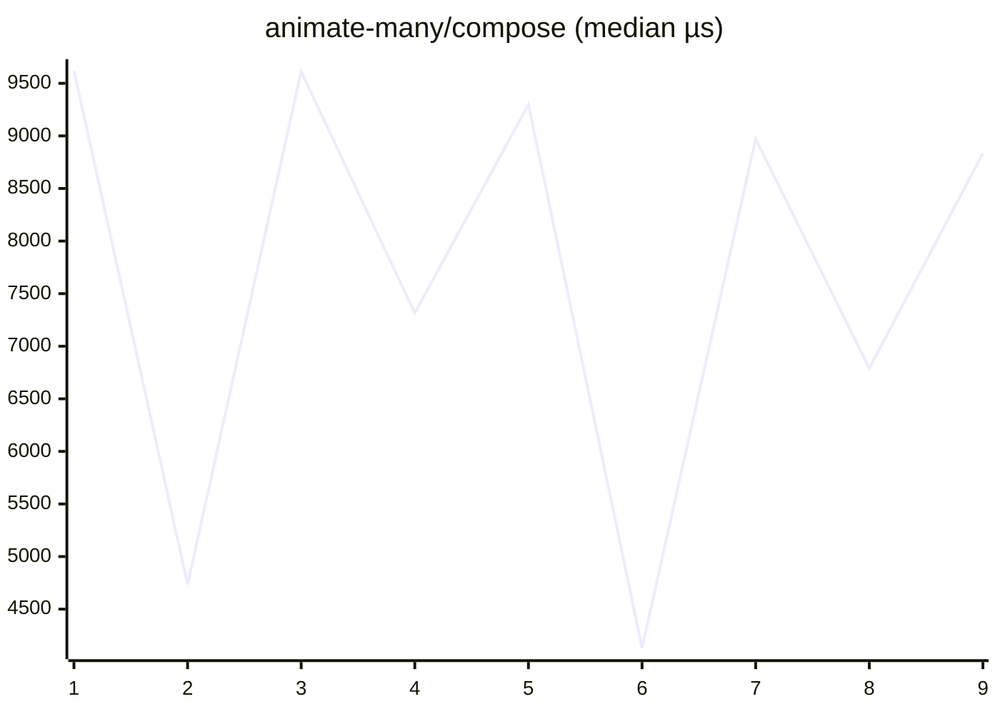
```mermaid
xychart-beta
    title "animate-many/compose (median µs)"
    x-axis 1 --> 9
    line [9621.1, 4735.8, 9612.0, 7315.2, 9298.7, 4130.8, 8970.6, 6790.0, 8834.4]
```

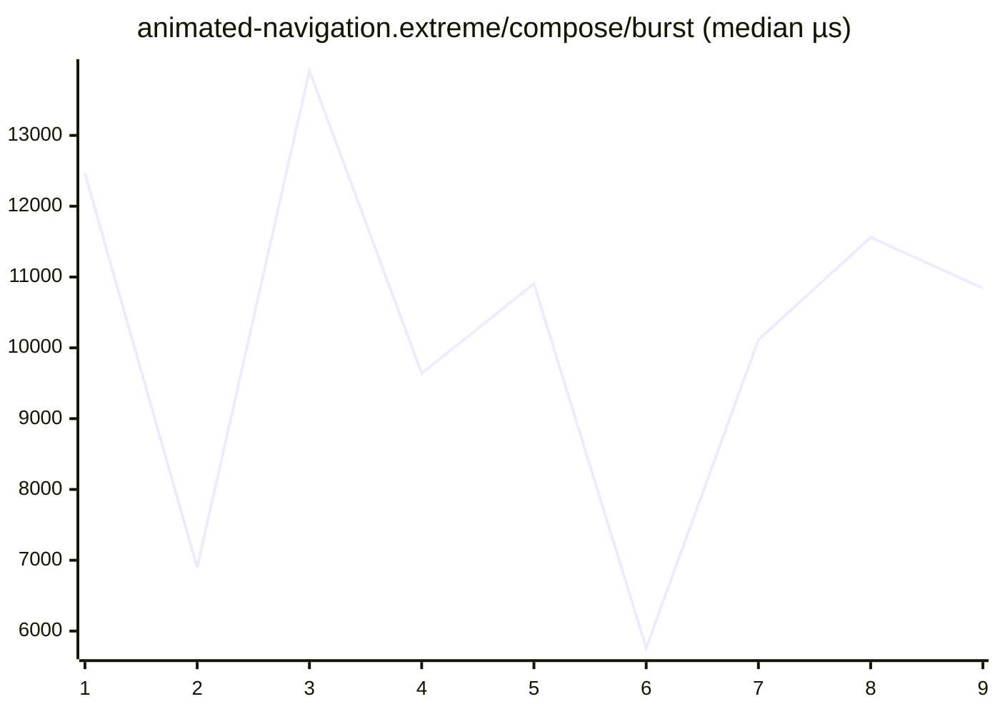
```mermaid
xychart-beta
    title "animated-navigation.extreme/compose/burst (median µs)"
    x-axis 1 --> 9
    line [12461.7, 6898.2, 13915.6, 9639.3, 10905.1, 5761.3, 10113.7, 11560.1, 10842.8]
```

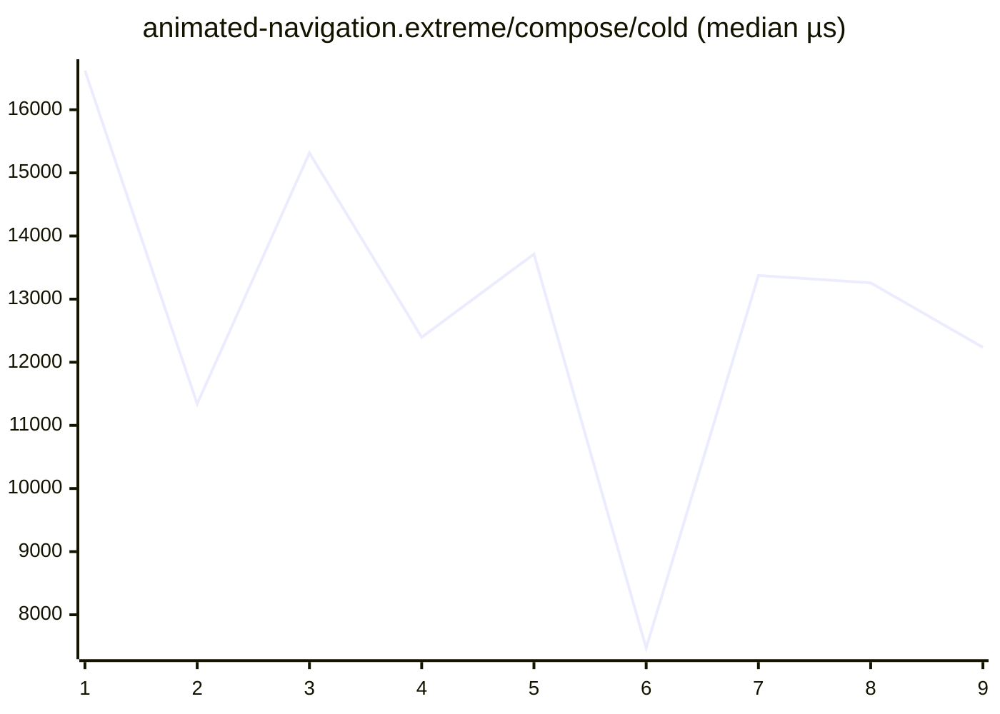
```mermaid
xychart-beta
    title "animated-navigation.extreme/compose/cold (median µs)"
    x-axis 1 --> 9
    line [16620.2, 11340.5, 15315.5, 12396.6, 13713.1, 7474.2, 13373.9, 13257.9, 12235.4]
```

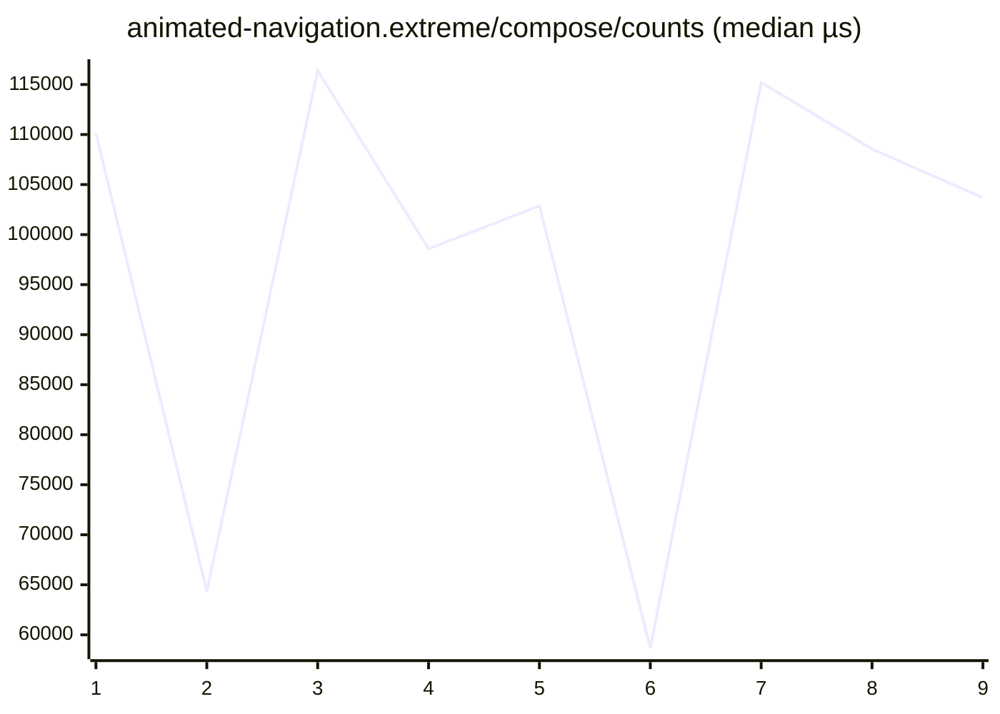
```mermaid
xychart-beta
    title "animated-navigation.extreme/compose/counts (median µs)"
    x-axis 1 --> 9
    line [110129.9, 64349.2, 116391.7, 98569.9, 102876.7, 58688.1, 115195.9, 108552.8, 103684.7]
```

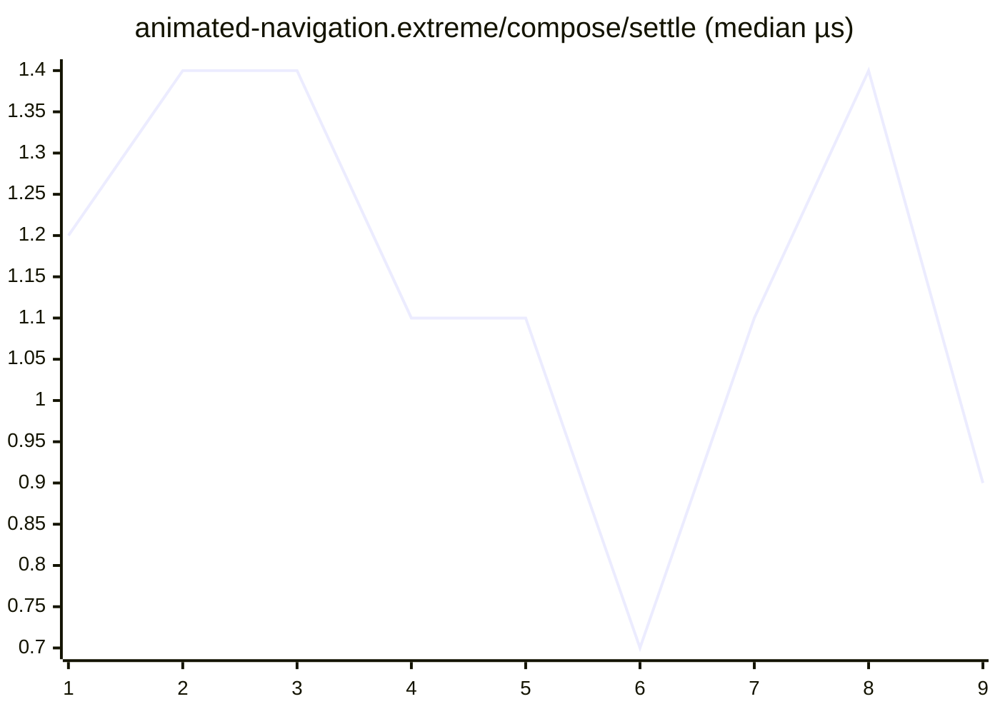
```mermaid
xychart-beta
    title "animated-navigation.extreme/compose/settle (median µs)"
    x-axis 1 --> 9
    line [1.2, 1.4, 1.4, 1.1, 1.1, 0.7, 1.1, 1.4, 0.9]
```

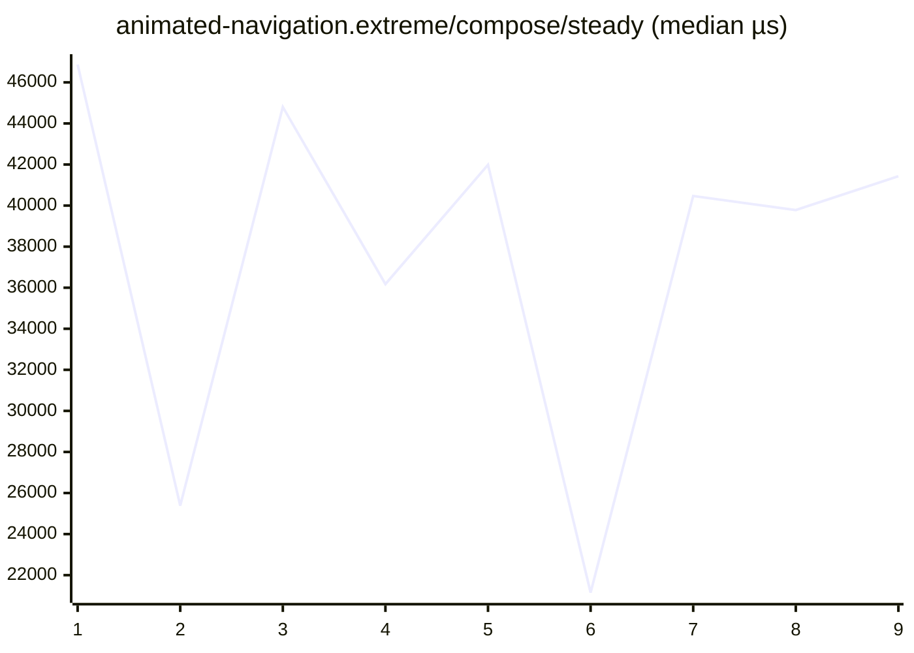
```mermaid
xychart-beta
    title "animated-navigation.extreme/compose/steady (median µs)"
    x-axis 1 --> 9
    line [46868.1, 25388.1, 44800.9, 36175.8, 41986.1, 21150.1, 40467.5, 39782.6, 41428.4]
```

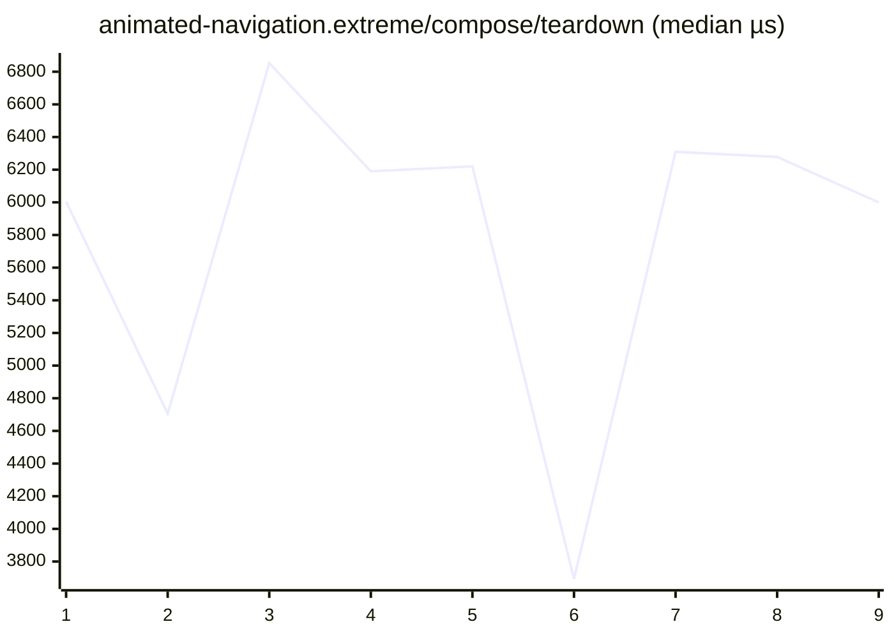
```mermaid
xychart-beta
    title "animated-navigation.extreme/compose/teardown (median µs)"
    x-axis 1 --> 9
    line [6005.0, 4705.5, 6853.0, 6189.7, 6219.9, 3693.0, 6309.6, 6278.2, 5999.3]
```

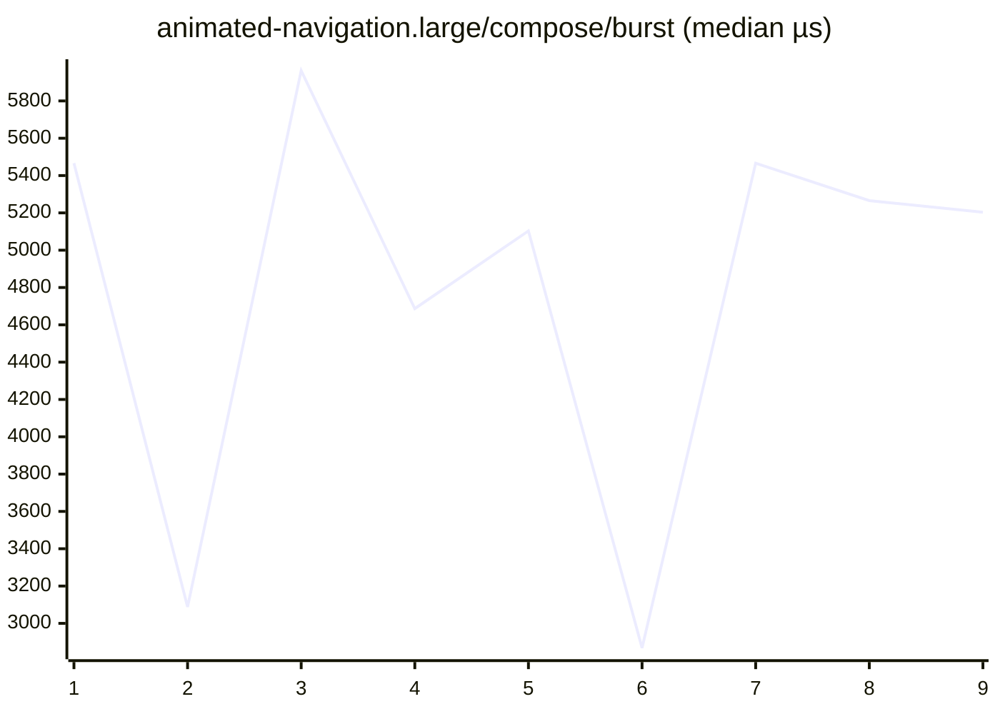
```mermaid
xychart-beta
    title "animated-navigation.large/compose/burst (median µs)"
    x-axis 1 --> 9
    line [5466.6, 3087.8, 5962.6, 4686.8, 5103.1, 2868.2, 5466.2, 5265.7, 5203.7]
```

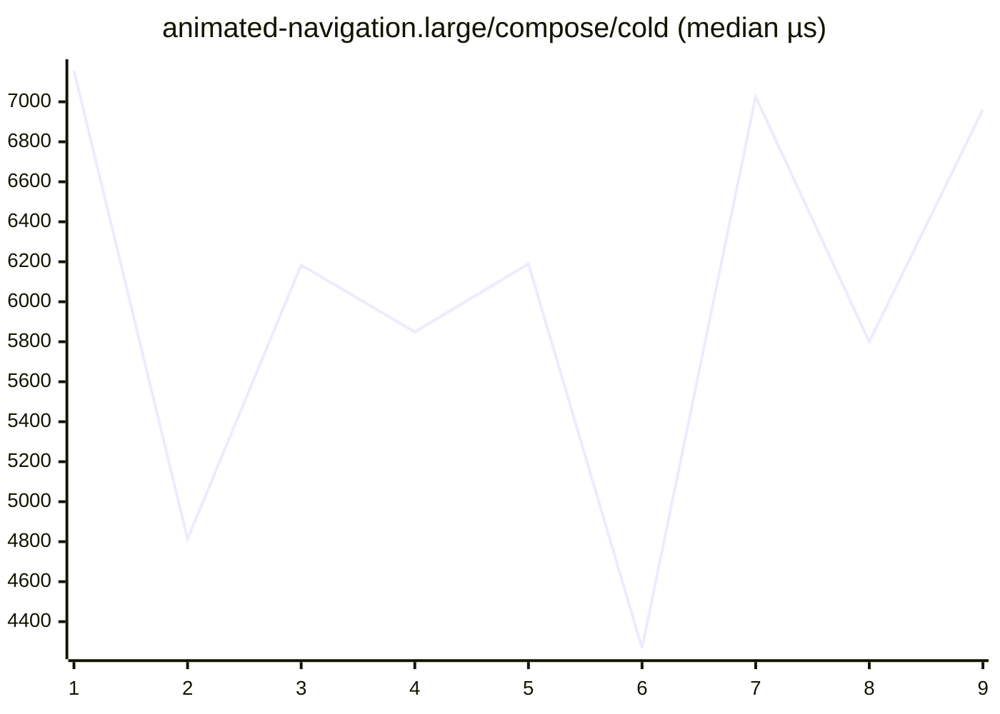
```mermaid
xychart-beta
    title "animated-navigation.large/compose/cold (median µs)"
    x-axis 1 --> 9
    line [7156.2, 4813.3, 6183.5, 5849.2, 6189.4, 4268.5, 7025.1, 5800.1, 6961.6]
```

```mermaid
xychart-beta
    title "animated-navigation.large/compose/counts (median µs)"
    x-axis 1 --> 9
    line [76248.8, 48338.1, 78084.1, 68688.7, 75988.3, 46887.2, 80418.2, 77193.1, 76591.3]
```

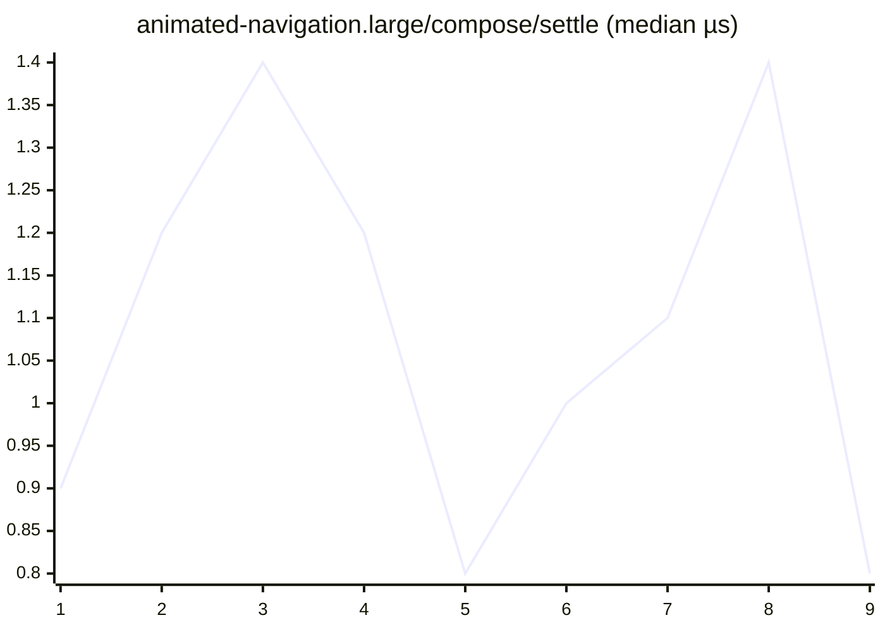
```mermaid
xychart-beta
    title "animated-navigation.large/compose/settle (median µs)"
    x-axis 1 --> 9
    line [0.9, 1.2, 1.4, 1.2, 0.8, 1.0, 1.1, 1.4, 0.8]
```

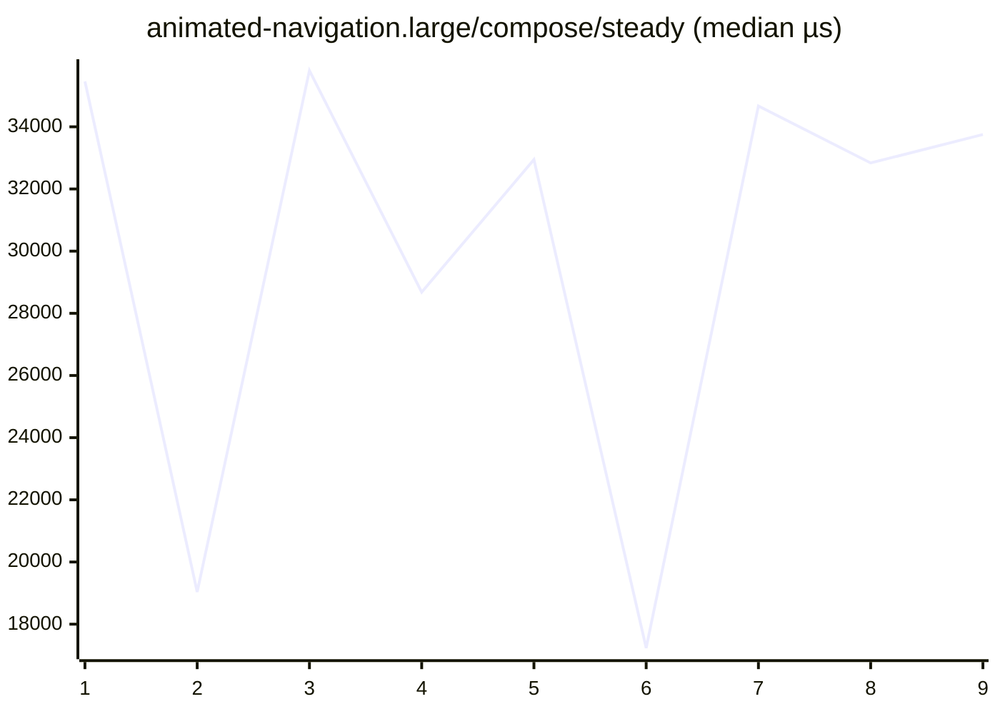
```mermaid
xychart-beta
    title "animated-navigation.large/compose/steady (median µs)"
    x-axis 1 --> 9
    line [35460.5, 19037.5, 35808.1, 28678.7, 32946.1, 17234.9, 34669.9, 32836.2, 33753.5]
```

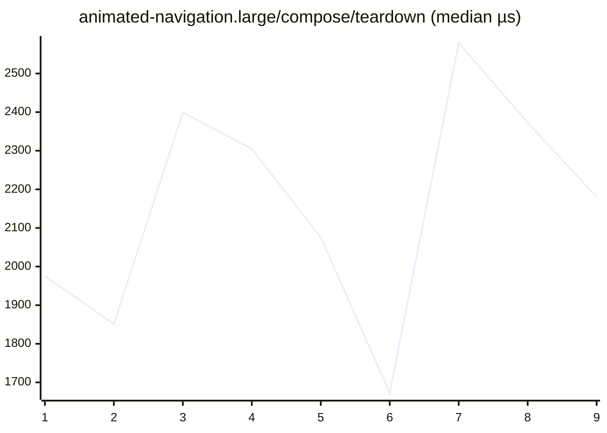
```mermaid
xychart-beta
    title "animated-navigation.large/compose/teardown (median µs)"
    x-axis 1 --> 9
    line [1975.4, 1851.1, 2399.1, 2304.8, 2075.6, 1672.7, 2579.5, 2372.6, 2180.7]
```

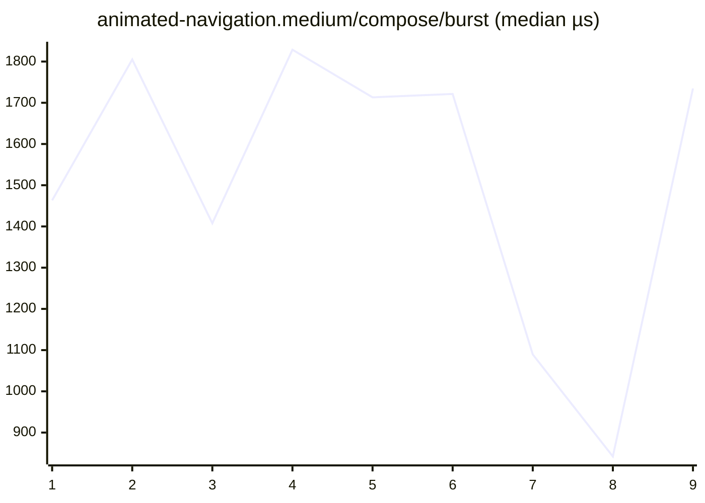
```mermaid
xychart-beta
    title "animated-navigation.medium/compose/burst (median µs)"
    x-axis 1 --> 9
    line [1463.5, 1805.0, 1407.7, 1828.7, 1713.2, 1721.3, 1089.5, 842.0, 1734.8]
```

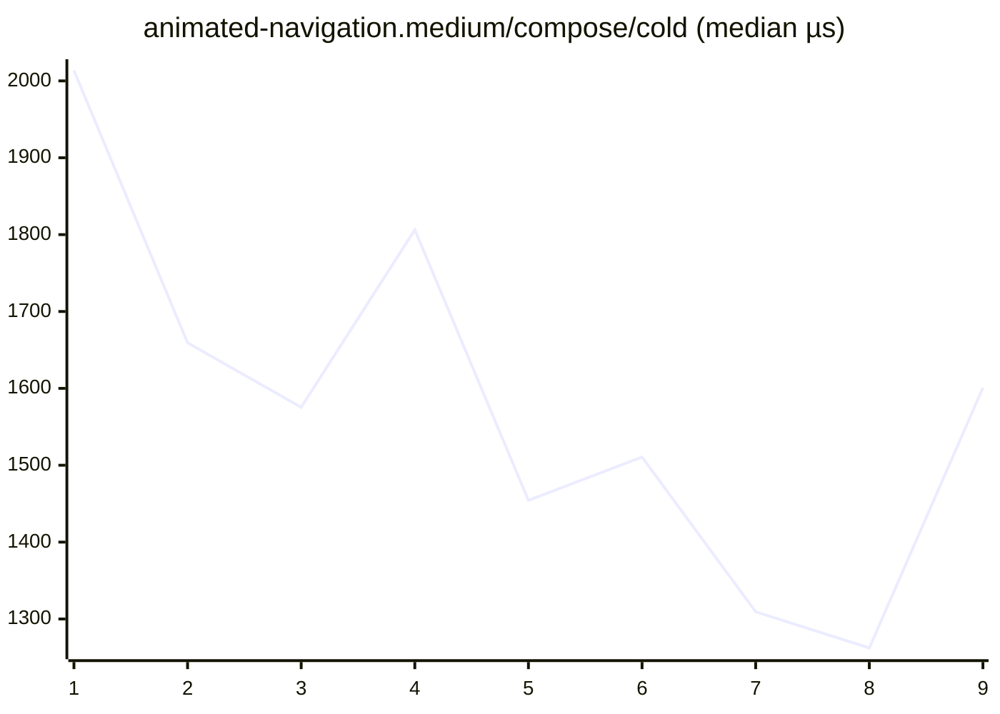
```mermaid
xychart-beta
    title "animated-navigation.medium/compose/cold (median µs)"
    x-axis 1 --> 9
    line [2013.4, 1659.3, 1575.4, 1806.3, 1454.3, 1510.6, 1309.3, 1262.3, 1600.9]
```

```mermaid
xychart-beta
    title "animated-navigation.medium/compose/counts (median µs)"
    x-axis 1 --> 9
    line [22746.0, 29658.4, 24261.2, 29711.8, 27538.5, 28220.6, 22030.3, 17110.4, 28591.1]
```

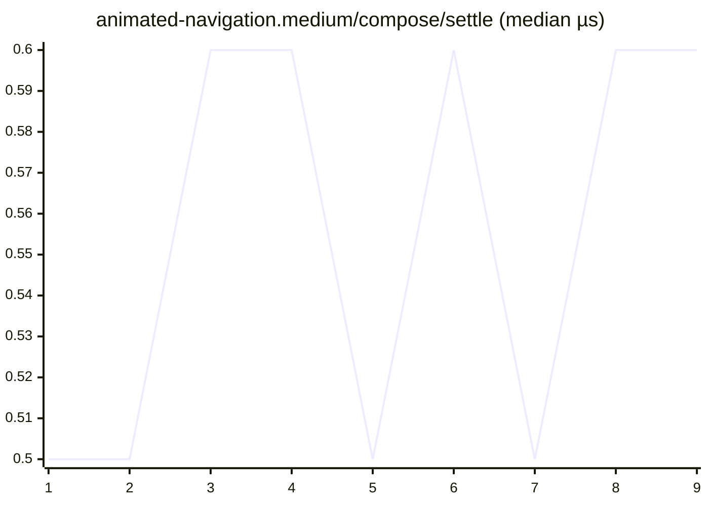
```mermaid
xychart-beta
    title "animated-navigation.medium/compose/settle (median µs)"
    x-axis 1 --> 9
    line [0.5, 0.5, 0.6, 0.6, 0.5, 0.6, 0.5, 0.6, 0.6]
```

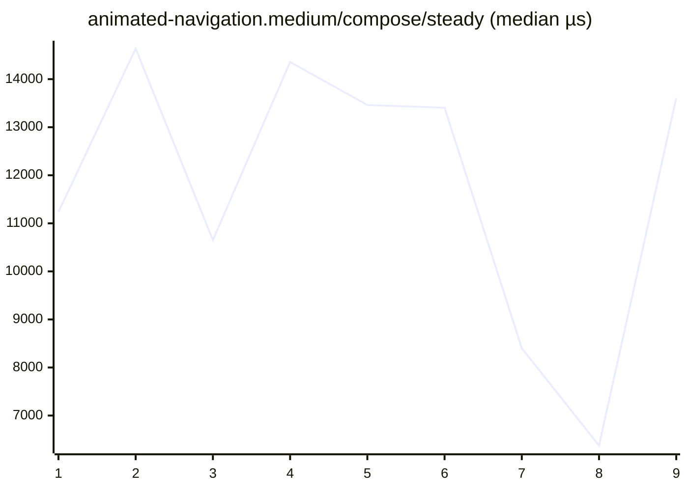
```mermaid
xychart-beta
    title "animated-navigation.medium/compose/steady (median µs)"
    x-axis 1 --> 9
    line [11237.2, 14637.0, 10651.3, 14357.3, 13461.9, 13406.0, 8401.2, 6375.1, 13610.7]
```

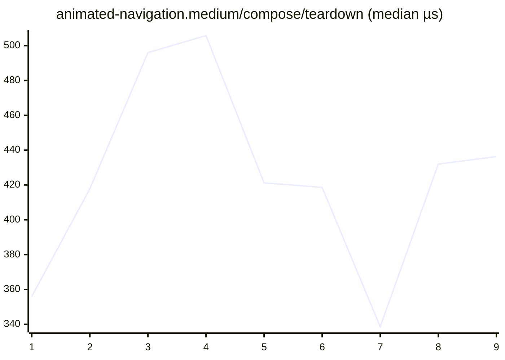
```mermaid
xychart-beta
    title "animated-navigation.medium/compose/teardown (median µs)"
    x-axis 1 --> 9
    line [356.0, 417.8, 496.0, 505.8, 421.2, 418.6, 338.6, 432.0, 436.3]
```

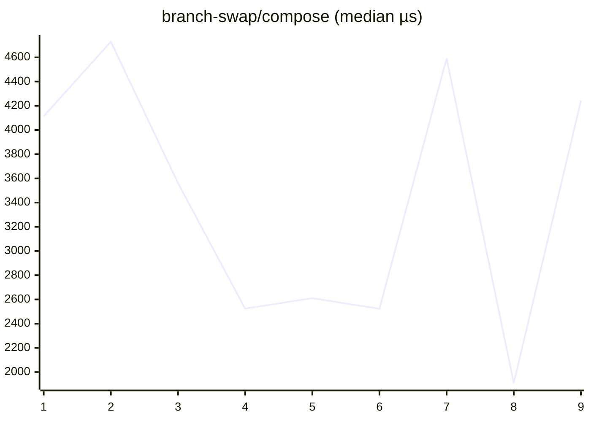
```mermaid
xychart-beta
    title "branch-swap/compose (median µs)"
    x-axis 1 --> 9
    line [4113.6, 4729.3, 3561.0, 2524.1, 2610.3, 2522.9, 4591.4, 1909.9, 4240.8]
```

```mermaid
xychart-beta
    title "cold-mount-100/compose (median µs)"
    x-axis 1 --> 9
    line [686.8, 560.2, 838.1, 567.4, 589.5, 322.8, 586.1, 833.3, 574.8]
```

```mermaid
xychart-beta
    title "cold-mount-1000/compose (median µs)"
    x-axis 1 --> 9
    line [8399.3, 4719.3, 3773.5, 7121.6, 6041.0, 5964.6, 7856.3, 5534.2, 7586.1]
```

```mermaid
xychart-beta
    title "cold-mount-10000/compose (median µs)"
    x-axis 1 --> 9
    line [74882.4, 77308.0, 75289.0, 90310.2, 100985.1, 86939.8, 92707.3, 108106.4, 117169.6]
```

```mermaid
xychart-beta
    title "data-grid.extreme/compose/burst (median µs)"
    x-axis 1 --> 9
    line [917195.8, 848359.9, 869706.9, 657651.2, 855176.6, 921506.7, 908083.0, 573450.9, 461483.4]
```

```mermaid
xychart-beta
    title "data-grid.extreme/compose/cold (median µs)"
    x-axis 1 --> 9
    line [564671.1, 532198.1, 527821.7, 398200.7, 504535.6, 560369.8, 559329.2, 357117.7, 275265.8]
```

```mermaid
xychart-beta
    title "data-grid.extreme/compose/counts (median µs)"
    x-axis 1 --> 9
    line [1731762.7, 1413521.5, 1498282.4, 1110786.6, 1445044.7, 1520204.8, 1598444.8, 1013220.0, 820746.8]
```

```mermaid
xychart-beta
    title "data-grid.extreme/compose/settle (median µs)"
    x-axis 1 --> 9
    line [2.1, 2.1, 1.9, 2.3, 2.1, 2.0, 2.5, 1.9, 2.3]
```

```mermaid
xychart-beta
    title "data-grid.extreme/compose/steady (median µs)"
    x-axis 1 --> 9
    line [27880.3, 26608.5, 24816.6, 19150.7, 24207.3, 25586.7, 23913.6, 16161.1, 13884.4]
```

```mermaid
xychart-beta
    title "data-grid.extreme/compose/teardown (median µs)"
    x-axis 1 --> 9
    line [1360.6, 1265.7, 1291.4, 1110.8, 1495.5, 1394.8, 1342.7, 1198.4, 894.8]
```

```mermaid
xychart-beta
    title "data-grid.large/compose/burst (median µs)"
    x-axis 1 --> 9
    line [108370.1, 137573.0, 114009.5, 133242.0, 132707.0, 131389.9, 95336.0, 90479.1, 132048.5]
```

```mermaid
xychart-beta
    title "data-grid.large/compose/cold (median µs)"
    x-axis 1 --> 9
    line [60694.5, 76941.3, 63120.6, 77459.9, 77741.8, 77504.9, 55851.8, 49552.1, 78186.9]
```

```mermaid
xychart-beta
    title "data-grid.large/compose/counts (median µs)"
    x-axis 1 --> 9
    line [187980.4, 244856.9, 207644.2, 241741.6, 244790.8, 244140.2, 179442.8, 167872.8, 245479.5]
```

```mermaid
xychart-beta
    title "data-grid.large/compose/settle (median µs)"
    x-axis 1 --> 9
    line [1.5, 1.6, 2.4, 1.8, 1.5, 1.4, 1.2, 2.6, 1.6]
```

```mermaid
xychart-beta
    title "data-grid.large/compose/steady (median µs)"
    x-axis 1 --> 9
    line [14957.3, 18099.0, 16104.9, 16959.8, 15977.4, 16630.3, 11479.9, 11754.6, 16353.8]
```

```mermaid
xychart-beta
    title "data-grid.large/compose/teardown (median µs)"
    x-axis 1 --> 9
    line [469.9, 567.8, 474.6, 573.2, 553.4, 516.9, 391.3, 447.8, 530.9]
```

```mermaid
xychart-beta
    title "data-grid.medium/compose/burst (median µs)"
    x-axis 1 --> 9
    line [69739.0, 35886.9, 46673.5, 57857.6, 48420.1, 50977.2, 67910.8, 47817.6, 71027.7]
```

```mermaid
xychart-beta
    title "data-grid.medium/compose/cold (median µs)"
    x-axis 1 --> 9
    line [39856.7, 21102.5, 25793.1, 34471.6, 28818.4, 27678.6, 37266.3, 27413.1, 42489.8]
```

```mermaid
xychart-beta
    title "data-grid.medium/compose/counts (median µs)"
    x-axis 1 --> 9
    line [141793.3, 71603.8, 99581.8, 122381.7, 107874.3, 104361.4, 148720.8, 103336.5, 148623.9]
```

```mermaid
xychart-beta
    title "data-grid.medium/compose/settle (median µs)"
    x-axis 1 --> 9
    line [2.3, 1.0, 1.8, 1.5, 2.2, 2.0, 2.7, 2.0, 2.4]
```

```mermaid
xychart-beta
    title "data-grid.medium/compose/steady (median µs)"
    x-axis 1 --> 9
    line [20754.9, 8162.0, 12334.8, 12381.3, 12840.2, 10470.5, 13619.2, 11418.3, 14976.0]
```

```mermaid
xychart-beta
    title "data-grid.medium/compose/teardown (median µs)"
    x-axis 1 --> 9
    line [356.8, 187.9, 248.2, 292.5, 260.1, 258.1, 350.6, 241.2, 365.1]
```

```mermaid
xychart-beta
    title "dense-dashboard.extreme/compose/burst (median µs)"
    x-axis 1 --> 9
    line [20153.1, 12231.0, 11532.2, 14838.7, 15355.1, 14237.6, 19804.9, 12160.9, 22267.2]
```

```mermaid
xychart-beta
    title "dense-dashboard.extreme/compose/cold (median µs)"
    x-axis 1 --> 9
    line [606.7, 398.8, 383.4, 479.8, 502.1, 460.9, 622.2, 391.5, 598.7]
```

```mermaid
xychart-beta
    title "dense-dashboard.extreme/compose/counts (median µs)"
    x-axis 1 --> 9
    line [23438.8, 13693.1, 17691.5, 22404.5, 21786.2, 19601.6, 29177.0, 18354.6, 29196.1]
```

```mermaid
xychart-beta
    title "dense-dashboard.extreme/compose/settle (median µs)"
    x-axis 1 --> 9
    line [1.3, 0.9, 1.2, 1.1, 1.4, 0.9, 2.0, 1.1, 1.9]
```

```mermaid
xychart-beta
    title "dense-dashboard.extreme/compose/steady (median µs)"
    x-axis 1 --> 9
    line [863.1, 432.7, 533.0, 686.6, 708.9, 700.6, 897.3, 551.6, 891.7]
```

```mermaid
xychart-beta
    title "dense-dashboard.extreme/compose/teardown (median µs)"
    x-axis 1 --> 9
    line [599.1, 388.0, 393.2, 539.8, 566.2, 477.4, 750.9, 387.6, 852.7]
```

```mermaid
xychart-beta
    title "dense-dashboard.large/compose/burst (median µs)"
    x-axis 1 --> 9
    line [9706.7, 4188.0, 5056.8, 5928.3, 7819.4, 5262.6, 10115.0, 6456.2, 9438.2]
```

```mermaid
xychart-beta
    title "dense-dashboard.large/compose/cold (median µs)"
    x-axis 1 --> 9
    line [371.6, 211.1, 249.9, 272.8, 305.9, 241.0, 388.7, 281.7, 353.2]
```

```mermaid
xychart-beta
    title "dense-dashboard.large/compose/counts (median µs)"
    x-axis 1 --> 9
    line [16409.6, 9670.9, 14102.2, 13629.3, 13693.5, 13209.6, 18184.6, 13156.2, 19699.1]
```

```mermaid
xychart-beta
    title "dense-dashboard.large/compose/settle (median µs)"
    x-axis 1 --> 9
    line [1.0, 0.6, 1.2, 0.9, 1.0, 0.7, 1.6, 1.1, 1.3]
```

```mermaid
xychart-beta
    title "dense-dashboard.large/compose/steady (median µs)"
    x-axis 1 --> 9
    line [865.5, 435.0, 514.3, 679.4, 690.4, 687.8, 906.9, 544.2, 843.3]
```

```mermaid
xychart-beta
    title "dense-dashboard.large/compose/teardown (median µs)"
    x-axis 1 --> 9
    line [297.0, 159.4, 204.5, 229.9, 234.0, 203.9, 330.2, 203.6, 300.1]
```

```mermaid
xychart-beta
    title "dense-dashboard.medium/compose/burst (median µs)"
    x-axis 1 --> 9
    line [3256.9, 3747.3, 2886.3, 1441.8, 1725.1, 2212.3, 2923.7, 1545.5, 3048.9]
```

```mermaid
xychart-beta
    title "dense-dashboard.medium/compose/cold (median µs)"
    x-axis 1 --> 9
    line [214.4, 274.0, 218.8, 100.9, 158.5, 169.7, 216.8, 94.9, 220.6]
```

```mermaid
xychart-beta
    title "dense-dashboard.medium/compose/counts (median µs)"
    x-axis 1 --> 9
    line [6736.4, 8374.2, 5949.6, 3187.1, 3588.3, 3998.0, 5805.3, 3074.5, 6058.2]
```

```mermaid
xychart-beta
    title "dense-dashboard.medium/compose/settle (median µs)"
    x-axis 1 --> 9
    line [0.8, 1.3, 0.7, 0.4, 0.9, 0.6, 1.0, 0.4, 0.7]
```

```mermaid
xychart-beta
    title "dense-dashboard.medium/compose/steady (median µs)"
    x-axis 1 --> 9
    line [823.5, 817.9, 816.4, 407.5, 448.9, 446.8, 626.3, 405.8, 836.7]
```

```mermaid
xychart-beta
    title "dense-dashboard.medium/compose/teardown (median µs)"
    x-axis 1 --> 9
    line [120.9, 153.9, 121.5, 62.5, 79.1, 89.7, 105.7, 57.1, 114.0]
```

```mermaid
xychart-beta
    title "entities-identity-churn-10.extreme/compose/burst (median µs)"
    x-axis 1 --> 9
    line [57275.1, 58550.6, 48500.0, 29373.5, 40666.3, 39982.2, 49684.3, 29001.5, 55300.8]
```

```mermaid
xychart-beta
    title "entities-identity-churn-10.extreme/compose/cold (median µs)"
    x-axis 1 --> 9
    line [35128.8, 48787.2, 29239.1, 17390.4, 22368.5, 29280.2, 24311.0, 16950.3, 33925.4]
```

```mermaid
xychart-beta
    title "entities-identity-churn-10.extreme/compose/counts (median µs)"
    x-axis 1 --> 9
    line [203645.1, 278041.5, 232881.6, 153922.4, 182354.5, 184019.0, 216326.1, 144957.2, 253653.9]
```

```mermaid
xychart-beta
    title "entities-identity-churn-10.extreme/compose/settle (median µs)"
    x-axis 1 --> 9
    line [1.7, 2.7, 2.1, 1.3, 2.4, 2.5, 2.5, 1.7, 2.1]
```

```mermaid
xychart-beta
    title "entities-identity-churn-10.extreme/compose/steady (median µs)"
    x-axis 1 --> 9
    line [67605.4, 110490.0, 62006.6, 30428.1, 51252.0, 46762.5, 64252.2, 28767.6, 66612.9]
```

```mermaid
xychart-beta
    title "entities-identity-churn-10.extreme/compose/teardown (median µs)"
    x-axis 1 --> 9
    line [1382.9, 1964.2, 1144.8, 694.6, 900.0, 1153.0, 1185.0, 704.6, 1317.6]
```

```mermaid
xychart-beta
    title "entities-identity-churn-10.large/compose/burst (median µs)"
    x-axis 1 --> 9
    line [22661.4, 12171.9, 13759.9, 13609.3, 14702.9, 13810.3, 16589.5, 13156.5, 16938.4]
```

```mermaid
xychart-beta
    title "entities-identity-churn-10.large/compose/cold (median µs)"
    x-axis 1 --> 9
    line [16026.8, 10773.1, 8930.7, 10020.5, 8909.7, 10600.2, 13336.4, 10600.4, 12699.6]
```

```mermaid
xychart-beta
    title "entities-identity-churn-10.large/compose/counts (median µs)"
    x-axis 1 --> 9
    line [80942.4, 39356.0, 64825.7, 63038.7, 65034.2, 58295.1, 80549.5, 59637.8, 87345.1]
```

```mermaid
xychart-beta
    title "entities-identity-churn-10.large/compose/settle (median µs)"
    x-axis 1 --> 9
    line [1.9, 1.8, 1.6, 1.3, 1.8, 1.6, 2.4, 1.4, 2.1]
```

```mermaid
xychart-beta
    title "entities-identity-churn-10.large/compose/steady (median µs)"
    x-axis 1 --> 9
    line [29699.1, 13169.4, 18127.8, 19237.6, 16977.4, 16994.0, 22978.3, 17373.8, 24022.9]
```

```mermaid
xychart-beta
    title "entities-identity-churn-10.large/compose/teardown (median µs)"
    x-axis 1 --> 9
    line [555.6, 288.1, 337.4, 360.3, 368.0, 351.5, 470.6, 319.2, 503.9]
```

```mermaid
xychart-beta
    title "entities-identity-churn-10.medium/compose/burst (median µs)"
    x-axis 1 --> 9
    line [8775.5, 6489.2, 8202.0, 6319.3, 6445.7, 3900.8, 7292.3, 7175.4, 6417.0]
```

```mermaid
xychart-beta
    title "entities-identity-churn-10.medium/compose/cold (median µs)"
    x-axis 1 --> 9
    line [6847.6, 4064.4, 5318.6, 5299.9, 5743.4, 2913.7, 5973.1, 4930.1, 5396.7]
```

```mermaid
xychart-beta
    title "entities-identity-churn-10.medium/compose/counts (median µs)"
    x-axis 1 --> 9
    line [33013.6, 23547.5, 40497.8, 27670.3, 31664.9, 18380.9, 32467.4, 30743.4, 32153.6]
```

```mermaid
xychart-beta
    title "entities-identity-churn-10.medium/compose/settle (median µs)"
    x-axis 1 --> 9
    line [1.1, 1.6, 2.1, 1.6, 0.8, 0.6, 1.3, 1.4, 0.8]
```

```mermaid
xychart-beta
    title "entities-identity-churn-10.medium/compose/steady (median µs)"
    x-axis 1 --> 9
    line [10632.2, 6021.8, 10678.6, 8206.7, 8958.3, 4763.9, 9523.9, 9074.0, 9048.8]
```

```mermaid
xychart-beta
    title "entities-identity-churn-10.medium/compose/teardown (median µs)"
    x-axis 1 --> 9
    line [231.8, 181.7, 264.1, 212.7, 181.2, 110.8, 211.8, 210.3, 188.4]
```

```mermaid
xychart-beta
    title "entities-identity-churn-50.extreme/compose/burst (median µs)"
    x-axis 1 --> 9
    line [38163.8, 45513.9, 41164.8, 46703.8, 44520.9, 38822.5, 40775.0, 36485.4, 43653.6]
```

```mermaid
xychart-beta
    title "entities-identity-churn-50.extreme/compose/cold (median µs)"
    x-axis 1 --> 9
    line [30010.2, 36978.8, 29991.4, 41393.0, 32387.4, 25962.5, 25504.0, 25319.0, 37083.9]
```

```mermaid
xychart-beta
    title "entities-identity-churn-50.extreme/compose/counts (median µs)"
    x-axis 1 --> 9
    line [308853.3, 356183.6, 347691.5, 358267.1, 320929.1, 329140.8, 275854.8, 259581.0, 334907.8]
```

```mermaid
xychart-beta
    title "entities-identity-churn-50.extreme/compose/settle (median µs)"
    x-axis 1 --> 9
    line [1.9, 1.8, 2.1, 2.0, 1.8, 1.8, 1.4, 2.3, 2.2]
```

```mermaid
xychart-beta
    title "entities-identity-churn-50.extreme/compose/steady (median µs)"
    x-axis 1 --> 9
    line [170674.3, 195161.2, 168550.7, 182630.3, 163543.1, 182753.2, 138682.5, 133780.4, 165275.8]
```

```mermaid
xychart-beta
    title "entities-identity-churn-50.extreme/compose/teardown (median µs)"
    x-axis 1 --> 9
    line [1011.2, 1123.7, 1080.1, 1376.9, 1058.4, 1062.6, 926.8, 1133.5, 1104.3]
```

```mermaid
xychart-beta
    title "entities-identity-churn-50.large/compose/burst (median µs)"
    x-axis 1 --> 9
    line [20445.0, 22651.5, 14964.2, 12211.5, 11912.3, 14060.4, 15071.6, 9027.6, 18620.6]
```

```mermaid
xychart-beta
    title "entities-identity-churn-50.large/compose/cold (median µs)"
    x-axis 1 --> 9
    line [12195.2, 16233.7, 12335.9, 7185.3, 8832.7, 11712.1, 10066.8, 8342.5, 10620.5]
```

```mermaid
xychart-beta
    title "entities-identity-churn-50.large/compose/counts (median µs)"
    x-axis 1 --> 9
    line [116758.9, 159716.3, 121699.6, 72346.5, 90059.4, 95283.3, 117176.1, 61067.3, 135298.4]
```

```mermaid
xychart-beta
    title "entities-identity-churn-50.large/compose/settle (median µs)"
    x-axis 1 --> 9
    line [1.7, 2.6, 1.9, 1.3, 1.5, 2.2, 2.2, 1.2, 1.7]
```

```mermaid
xychart-beta
    title "entities-identity-churn-50.large/compose/steady (median µs)"
    x-axis 1 --> 9
    line [65487.9, 100478.1, 59706.0, 34308.7, 51437.5, 47528.6, 59568.6, 31848.4, 60575.3]
```

```mermaid
xychart-beta
    title "entities-identity-churn-50.large/compose/teardown (median µs)"
    x-axis 1 --> 9
    line [465.8, 729.5, 440.9, 295.7, 317.9, 369.3, 410.5, 228.9, 431.5]
```

```mermaid
xychart-beta
    title "entities-identity-churn-50.medium/compose/burst (median µs)"
    x-axis 1 --> 9
    line [7359.9, 9363.4, 7988.6, 9747.3, 9365.5, 8349.5, 6021.4, 7530.2, 8564.1]
```

```mermaid
xychart-beta
    title "entities-identity-churn-50.medium/compose/cold (median µs)"
    x-axis 1 --> 9
    line [5217.5, 8076.9, 4571.3, 5260.1, 4670.0, 5901.2, 3485.4, 3508.0, 6353.3]
```

```mermaid
xychart-beta
    title "entities-identity-churn-50.medium/compose/counts (median µs)"
    x-axis 1 --> 9
    line [53771.4, 72919.2, 57149.8, 65876.4, 59908.3, 63387.5, 49532.5, 47417.3, 63149.1]
```

```mermaid
xychart-beta
    title "entities-identity-churn-50.medium/compose/settle (median µs)"
    x-axis 1 --> 9
    line [1.0, 1.3, 1.6, 1.3, 1.0, 0.9, 1.1, 2.1, 1.1]
```

```mermaid
xychart-beta
    title "entities-identity-churn-50.medium/compose/steady (median µs)"
    x-axis 1 --> 9
    line [24173.9, 29083.3, 23959.0, 26680.3, 24724.4, 25894.3, 17904.5, 18238.3, 25204.8]
```

```mermaid
xychart-beta
    title "entities-identity-churn-50.medium/compose/teardown (median µs)"
    x-axis 1 --> 9
    line [206.6, 265.4, 235.4, 253.6, 224.3, 241.3, 176.2, 215.7, 232.0]
```

```mermaid
xychart-beta
    title "entities-identity-churn.extreme/compose/burst (median µs)"
    x-axis 1 --> 9
    line [67899.9, 40475.8, 49011.8, 47993.9, 58958.8, 49403.5, 73334.0, 54549.5, 66548.0]
```

```mermaid
xychart-beta
    title "entities-identity-churn.extreme/compose/cold (median µs)"
    x-axis 1 --> 9
    line [43440.3, 23189.6, 21354.5, 24947.4, 23666.7, 30840.0, 48721.1, 23251.0, 32258.1]
```

```mermaid
xychart-beta
    title "entities-identity-churn.extreme/compose/counts (median µs)"
    x-axis 1 --> 9
    line [322090.0, 155075.8, 263232.8, 241537.1, 281124.0, 231871.8, 353585.2, 248508.0, 354600.3]
```

```mermaid
xychart-beta
    title "entities-identity-churn.extreme/compose/settle (median µs)"
    x-axis 1 --> 9
    line [2.2, 2.0, 2.2, 1.5, 2.1, 2.1, 3.1, 2.2, 2.6]
```

```mermaid
xychart-beta
    title "entities-identity-churn.extreme/compose/steady (median µs)"
    x-axis 1 --> 9
    line [168290.2, 78037.0, 94632.2, 97962.6, 108987.6, 90436.8, 176374.5, 99424.5, 155470.2]
```

```mermaid
xychart-beta
    title "entities-identity-churn.extreme/compose/teardown (median µs)"
    x-axis 1 --> 9
    line [1918.2, 1082.7, 1099.8, 1219.6, 1413.1, 1134.2, 2628.7, 1181.1, 1619.0]
```

```mermaid
xychart-beta
    title "entities-identity-churn.large/compose/burst (median µs)"
    x-axis 1 --> 9
    line [15198.1, 12817.1, 17384.4, 12828.2, 14670.0, 10802.1, 16642.4, 15644.2, 13803.3]
```

```mermaid
xychart-beta
    title "entities-identity-churn.large/compose/cold (median µs)"
    x-axis 1 --> 9
    line [14413.0, 10025.1, 12412.5, 10919.1, 9991.0, 7777.1, 12912.0, 9409.6, 12787.2]
```

```mermaid
xychart-beta
    title "entities-identity-churn.large/compose/counts (median µs)"
    x-axis 1 --> 9
    line [94808.6, 66047.0, 131198.0, 102800.1, 106962.5, 78783.2, 123433.1, 103192.9, 104430.0]
```

```mermaid
xychart-beta
    title "entities-identity-churn.large/compose/settle (median µs)"
    x-axis 1 --> 9
    line [1.7, 2.1, 2.3, 1.7, 1.5, 1.8, 2.1, 1.8, 1.5]
```

```mermaid
xychart-beta
    title "entities-identity-churn.large/compose/steady (median µs)"
    x-axis 1 --> 9
    line [42870.9, 30465.6, 44952.7, 30109.8, 34357.1, 23042.6, 39531.9, 34800.9, 32076.5]
```

```mermaid
xychart-beta
    title "entities-identity-churn.large/compose/teardown (median µs)"
    x-axis 1 --> 9
    line [421.7, 347.3, 504.6, 355.7, 394.0, 294.7, 437.3, 369.5, 374.1]
```

```mermaid
xychart-beta
    title "entities-identity-churn.medium/compose/burst (median µs)"
    x-axis 1 --> 9
    line [9268.9, 6214.3, 6318.0, 7594.1, 7048.3, 6573.8, 9681.2, 6917.6, 10671.7]
```

```mermaid
xychart-beta
    title "entities-identity-churn.medium/compose/cold (median µs)"
    x-axis 1 --> 9
    line [6175.2, 5202.2, 4209.2, 4766.1, 4414.4, 4459.7, 5534.7, 4639.2, 6259.4]
```

```mermaid
xychart-beta
    title "entities-identity-churn.medium/compose/counts (median µs)"
    x-axis 1 --> 9
    line [48430.6, 24546.5, 34883.2, 42248.6, 35027.4, 39583.1, 54112.8, 35568.3, 53135.7]
```

```mermaid
xychart-beta
    title "entities-identity-churn.medium/compose/settle (median µs)"
    x-axis 1 --> 9
    line [1.8, 1.7, 1.3, 1.0, 1.4, 1.1, 2.0, 1.2, 2.2]
```

```mermaid
xychart-beta
    title "entities-identity-churn.medium/compose/steady (median µs)"
    x-axis 1 --> 9
    line [18970.0, 11144.9, 13984.1, 14562.6, 12821.2, 13331.6, 17419.2, 12697.6, 19931.5]
```

```mermaid
xychart-beta
    title "entities-identity-churn.medium/compose/teardown (median µs)"
    x-axis 1 --> 9
    line [266.7, 172.8, 182.1, 197.6, 194.9, 188.5, 272.0, 172.4, 326.5]
```

```mermaid
xychart-beta
    title "entities-integrated.extreme/compose/burst (median µs)"
    x-axis 1 --> 9
    line [21280.1, 17085.4, 25262.9, 28283.5, 20257.0, 10917.0, 19502.9, 24080.5, 19960.3]
```

```mermaid
xychart-beta
    title "entities-integrated.extreme/compose/cold (median µs)"
    x-axis 1 --> 9
    line [107928.0, 93149.3, 109143.0, 107346.8, 112756.0, 73472.7, 113745.4, 103329.2, 116577.4]
```

```mermaid
xychart-beta
    title "entities-integrated.extreme/compose/counts (median µs)"
    x-axis 1 --> 9
    line [345877.0, 271171.1, 372031.9, 371349.9, 343525.6, 217868.2, 360516.2, 336407.1, 365059.0]
```

```mermaid
xychart-beta
    title "entities-integrated.extreme/compose/settle (median µs)"
    x-axis 1 --> 9
    line [1.8, 2.2, 2.2, 2.2, 1.9, 1.8, 1.9, 2.1, 1.9]
```

```mermaid
xychart-beta
    title "entities-integrated.extreme/compose/steady (median µs)"
    x-axis 1 --> 9
    line [112062.9, 90774.1, 117256.3, 106657.1, 98348.3, 59055.9, 101799.9, 103158.3, 100873.5]
```

```mermaid
xychart-beta
    title "entities-integrated.extreme/compose/teardown (median µs)"
    x-axis 1 --> 9
    line [33241.4, 38551.9, 37604.0, 45565.4, 37162.6, 31516.4, 39172.8, 37057.2, 37139.6]
```

```mermaid
xychart-beta
    title "entities-integrated.large/compose/burst (median µs)"
    x-axis 1 --> 9
    line [8720.8, 10514.8, 8702.4, 10287.4, 10136.5, 9822.3, 8483.4, 7252.4, 9927.0]
```

```mermaid
xychart-beta
    title "entities-integrated.large/compose/cold (median µs)"
    x-axis 1 --> 9
    line [35331.9, 46561.1, 36425.1, 45716.0, 39872.5, 39917.1, 29158.2, 30742.1, 43972.9]
```

```mermaid
xychart-beta
    title "entities-integrated.large/compose/counts (median µs)"
    x-axis 1 --> 9
    line [127887.2, 165417.5, 156094.5, 170891.3, 159918.6, 159409.8, 123085.1, 129687.2, 160052.6]
```

```mermaid
xychart-beta
    title "entities-integrated.large/compose/settle (median µs)"
    x-axis 1 --> 9
    line [1.4, 1.6, 2.0, 1.5, 1.1, 1.3, 1.2, 1.9, 1.5]
```

```mermaid
xychart-beta
    title "entities-integrated.large/compose/steady (median µs)"
    x-axis 1 --> 9
    line [42270.1, 58987.0, 46845.8, 49441.4, 48906.3, 48394.1, 38336.6, 38926.6, 50075.4]
```

```mermaid
xychart-beta
    title "entities-integrated.large/compose/teardown (median µs)"
    x-axis 1 --> 9
    line [9384.4, 11676.7, 12636.7, 11453.4, 9676.2, 9468.6, 7501.9, 12956.1, 10009.3]
```

```mermaid
xychart-beta
    title "entities-integrated.medium/compose/burst (median µs)"
    x-axis 1 --> 9
    line [8064.7, 5412.3, 8325.1, 7310.8, 7725.2, 4373.6, 8143.5, 7842.8, 7736.3]
```

```mermaid
xychart-beta
    title "entities-integrated.medium/compose/cold (median µs)"
    x-axis 1 --> 9
    line [23640.0, 18354.3, 20523.4, 16963.3, 24114.6, 15390.3, 22026.8, 20615.5, 21547.9]
```

```mermaid
xychart-beta
    title "entities-integrated.medium/compose/counts (median µs)"
    x-axis 1 --> 9
    line [92316.8, 67519.0, 107959.8, 94567.5, 113174.7, 55185.3, 104655.9, 96762.4, 98185.9]
```

```mermaid
xychart-beta
    title "entities-integrated.medium/compose/settle (median µs)"
    x-axis 1 --> 9
    line [1.6, 2.1, 2.2, 1.7, 1.5, 1.0, 1.9, 2.1, 1.6]
```

```mermaid
xychart-beta
    title "entities-integrated.medium/compose/steady (median µs)"
    x-axis 1 --> 9
    line [39845.5, 29943.1, 47449.4, 35007.7, 37155.4, 20922.3, 41221.1, 36357.3, 41695.6]
```

```mermaid
xychart-beta
    title "entities-integrated.medium/compose/teardown (median µs)"
    x-axis 1 --> 9
    line [6105.6, 6486.4, 6913.2, 7758.7, 5425.1, 3598.7, 7513.6, 6383.3, 5777.9]
```

```mermaid
xychart-beta
    title "entities-relevance-saturated.extreme/compose/burst (median µs)"
    x-axis 1 --> 9
    line [95057.1, 94073.3, 97254.7, 96247.4, 87014.9, 56203.8, 97444.4, 80154.4, 77927.4]
```

```mermaid
xychart-beta
    title "entities-relevance-saturated.extreme/compose/cold (median µs)"
    x-axis 1 --> 9
    line [30591.9, 22227.2, 28424.7, 29174.1, 36070.7, 21358.8, 36288.9, 26574.9, 35611.0]
```

```mermaid
xychart-beta
    title "entities-relevance-saturated.extreme/compose/counts (median µs)"
    x-axis 1 --> 9
    line [228810.1, 211002.3, 277035.4, 262243.7, 240299.8, 164476.9, 257313.3, 264214.0, 233920.7]
```

```mermaid
xychart-beta
    title "entities-relevance-saturated.extreme/compose/settle (median µs)"
    x-axis 1 --> 9
    line [2.0, 2.8, 2.9, 2.6, 2.0, 2.1, 2.8, 2.4, 2.1]
```

```mermaid
xychart-beta
    title "entities-relevance-saturated.extreme/compose/steady (median µs)"
    x-axis 1 --> 9
    line [56507.4, 52162.7, 59312.8, 52039.1, 53658.6, 36010.3, 61177.2, 57566.9, 48010.2]
```

```mermaid
xychart-beta
    title "entities-relevance-saturated.extreme/compose/teardown (median µs)"
    x-axis 1 --> 9
    line [13113.8, 13417.0, 14500.7, 15465.3, 13655.0, 10660.5, 15751.4, 13314.0, 13344.5]
```

```mermaid
xychart-beta
    title "entities-relevance-saturated.large/compose/burst (median µs)"
    x-axis 1 --> 9
    line [27403.3, 40547.2, 27643.0, 16736.6, 24669.8, 21688.5, 29979.9, 16166.2, 30300.2]
```

```mermaid
xychart-beta
    title "entities-relevance-saturated.large/compose/cold (median µs)"
    x-axis 1 --> 9
    line [11952.4, 12445.2, 13843.1, 7413.0, 8312.1, 8704.4, 10161.2, 6701.9, 12357.0]
```

```mermaid
xychart-beta
    title "entities-relevance-saturated.large/compose/counts (median µs)"
    x-axis 1 --> 9
    line [100423.7, 101703.7, 92984.2, 61791.0, 76047.1, 71772.8, 86609.3, 65186.0, 106708.1]
```

```mermaid
xychart-beta
    title "entities-relevance-saturated.large/compose/settle (median µs)"
    x-axis 1 --> 9
    line [1.5, 2.3, 2.0, 1.3, 1.4, 2.1, 2.5, 1.5, 2.1]
```

```mermaid
xychart-beta
    title "entities-relevance-saturated.large/compose/steady (median µs)"
    x-axis 1 --> 9
    line [19345.5, 23966.2, 20176.3, 10165.4, 13367.2, 11453.9, 16848.3, 9876.0, 19588.2]
```

```mermaid
xychart-beta
    title "entities-relevance-saturated.large/compose/teardown (median µs)"
    x-axis 1 --> 9
    line [2906.6, 4134.8, 3277.4, 2382.9, 2631.1, 3034.7, 3549.8, 2278.8, 3502.9]
```

```mermaid
xychart-beta
    title "entities-relevance-saturated.medium/compose/burst (median µs)"
    x-axis 1 --> 9
    line [13879.1, 10176.6, 13944.0, 11937.1, 11307.3, 6750.6, 12996.3, 12989.8, 13667.0]
```

```mermaid
xychart-beta
    title "entities-relevance-saturated.medium/compose/cold (median µs)"
    x-axis 1 --> 9
    line [6104.0, 4520.5, 5933.8, 6295.2, 6588.9, 3499.8, 6545.6, 5372.2, 7062.3]
```

```mermaid
xychart-beta
    title "entities-relevance-saturated.medium/compose/counts (median µs)"
    x-axis 1 --> 9
    line [39918.2, 26024.7, 45495.9, 38988.2, 39254.8, 26227.8, 42747.2, 41118.5, 39198.0]
```

```mermaid
xychart-beta
    title "entities-relevance-saturated.medium/compose/settle (median µs)"
    x-axis 1 --> 9
    line [1.3, 1.8, 2.2, 1.9, 1.0, 0.6, 1.3, 2.0, 1.3]
```

```mermaid
xychart-beta
    title "entities-relevance-saturated.medium/compose/steady (median µs)"
    x-axis 1 --> 9
    line [8588.8, 6714.5, 10581.6, 7636.9, 7928.6, 4687.4, 9124.6, 9217.5, 9170.4]
```

```mermaid
xychart-beta
    title "entities-relevance-saturated.medium/compose/teardown (median µs)"
    x-axis 1 --> 9
    line [1136.6, 1234.8, 1482.3, 1376.9, 1147.0, 743.8, 1440.3, 1227.4, 1235.2]
```

```mermaid
xychart-beta
    title "entities-relevance-sweep.extreme/compose/burst (median µs)"
    x-axis 1 --> 9
    line [139551.2, 143863.6, 147758.9, 149769.7, 128240.4, 93044.8, 149168.0, 144251.0, 131585.7]
```

```mermaid
xychart-beta
    title "entities-relevance-sweep.extreme/compose/cold (median µs)"
    x-axis 1 --> 9
    line [37476.4, 26814.0, 37931.2, 27280.6, 33457.4, 32352.6, 32106.3, 26594.2, 30779.4]
```

```mermaid
xychart-beta
    title "entities-relevance-sweep.extreme/compose/counts (median µs)"
    x-axis 1 --> 9
    line [453942.0, 363604.4, 495520.1, 408039.1, 458887.5, 256641.6, 523119.6, 464648.7, 389212.7]
```

```mermaid
xychart-beta
    title "entities-relevance-sweep.extreme/compose/settle (median µs)"
    x-axis 1 --> 9
    line [2.0, 2.9, 2.8, 2.4, 2.0, 2.4, 2.3, 2.3, 2.1]
```

```mermaid
xychart-beta
    title "entities-relevance-sweep.extreme/compose/steady (median µs)"
    x-axis 1 --> 9
    line [149428.6, 140862.0, 167028.5, 121048.4, 129724.9, 78538.3, 131756.2, 137165.3, 123652.4]
```

```mermaid
xychart-beta
    title "entities-relevance-sweep.extreme/compose/teardown (median µs)"
    x-axis 1 --> 9
    line [13492.1, 13806.8, 15285.8, 15385.2, 13545.9, 12137.9, 14643.9, 14547.8, 13579.1]
```

```mermaid
xychart-beta
    title "entities-relevance-sweep.large/compose/burst (median µs)"
    x-axis 1 --> 9
    line [64372.4, 33315.0, 43296.5, 43553.3, 35754.9, 37879.2, 59168.1, 41786.5, 62893.0]
```

```mermaid
xychart-beta
    title "entities-relevance-sweep.large/compose/cold (median µs)"
    x-axis 1 --> 9
    line [12505.9, 8058.4, 8874.3, 10385.9, 10093.6, 10681.3, 14504.4, 8713.5, 14374.0]
```

```mermaid
xychart-beta
    title "entities-relevance-sweep.large/compose/counts (median µs)"
    x-axis 1 --> 9
    line [187160.4, 84451.7, 121670.1, 137514.1, 119307.2, 116472.5, 200142.9, 111452.0, 166578.4]
```

```mermaid
xychart-beta
    title "entities-relevance-sweep.large/compose/settle (median µs)"
    x-axis 1 --> 9
    line [2.3, 1.9, 2.4, 1.6, 2.2, 2.0, 3.0, 1.6, 2.1]
```

```mermaid
xychart-beta
    title "entities-relevance-sweep.large/compose/steady (median µs)"
    x-axis 1 --> 9
    line [56628.5, 29545.4, 39104.4, 46006.1, 40089.7, 36520.1, 60341.0, 39911.6, 62544.5]
```

```mermaid
xychart-beta
    title "entities-relevance-sweep.large/compose/teardown (median µs)"
    x-axis 1 --> 9
    line [3915.7, 2636.1, 3097.4, 3094.1, 3740.5, 3308.5, 5401.4, 2983.5, 5239.3]
```

```mermaid
xychart-beta
    title "entities-relevance-sweep.medium/compose/burst (median µs)"
    x-axis 1 --> 9
    line [20435.0, 27247.9, 20502.7, 11766.6, 17019.7, 16181.3, 18018.6, 11196.0, 22081.2]
```

```mermaid
xychart-beta
    title "entities-relevance-sweep.medium/compose/cold (median µs)"
    x-axis 1 --> 9
    line [6221.8, 7648.4, 5806.6, 3251.3, 4242.8, 4567.5, 5171.4, 4429.6, 6358.0]
```

```mermaid
xychart-beta
    title "entities-relevance-sweep.medium/compose/counts (median µs)"
    x-axis 1 --> 9
    line [79311.3, 99350.5, 73925.1, 39521.4, 64266.7, 64313.0, 69307.7, 44008.5, 83227.7]
```

```mermaid
xychart-beta
    title "entities-relevance-sweep.medium/compose/settle (median µs)"
    x-axis 1 --> 9
    line [1.2, 2.3, 1.9, 0.9, 1.5, 2.7, 1.8, 1.2, 1.9]
```

```mermaid
xychart-beta
    title "entities-relevance-sweep.medium/compose/steady (median µs)"
    x-axis 1 --> 9
    line [21056.0, 29692.1, 21901.2, 11598.6, 16084.1, 17362.8, 19878.1, 12256.6, 20947.0]
```

```mermaid
xychart-beta
    title "entities-relevance-sweep.medium/compose/teardown (median µs)"
    x-axis 1 --> 9
    line [1121.8, 1664.5, 1361.2, 805.1, 1141.2, 1629.0, 1316.3, 1084.8, 1512.6]
```

```mermaid
xychart-beta
    title "entity-labels-sparse.extreme/compose/burst (median µs)"
    x-axis 1 --> 9
    line [55182.4, 21144.1, 30740.0, 30157.3, 32728.7, 31850.2, 49922.1, 31055.3, 53579.0]
```

```mermaid
xychart-beta
    title "entity-labels-sparse.extreme/compose/cold (median µs)"
    x-axis 1 --> 9
    line [32818.0, 17437.9, 19443.1, 21501.3, 23241.9, 22558.6, 28906.9, 21218.7, 23868.0]
```

```mermaid
xychart-beta
    title "entity-labels-sparse.extreme/compose/counts (median µs)"
    x-axis 1 --> 9
    line [135325.6, 59311.0, 95734.4, 87969.1, 101861.3, 98252.5, 128543.0, 90083.9, 144277.1]
```

```mermaid
xychart-beta
    title "entity-labels-sparse.extreme/compose/settle (median µs)"
    x-axis 1 --> 9
    line [2.6, 1.7, 2.1, 1.5, 1.8, 2.0, 3.5, 1.8, 2.8]
```

```mermaid
xychart-beta
    title "entity-labels-sparse.extreme/compose/steady (median µs)"
    x-axis 1 --> 9
    line [5921.1, 2635.6, 4056.5, 3954.9, 4210.9, 3954.1, 5955.2, 3846.6, 5495.2]
```

```mermaid
xychart-beta
    title "entity-labels-sparse.extreme/compose/teardown (median µs)"
    x-axis 1 --> 9
    line [15688.5, 7760.4, 10927.2, 10437.8, 11785.0, 10969.4, 16640.3, 11061.9, 15506.0]
```

```mermaid
xychart-beta
    title "entity-labels-sparse.large/compose/burst (median µs)"
    x-axis 1 --> 9
    line [17004.7, 10266.2, 12968.2, 14944.3, 13156.1, 11903.4, 18937.3, 12006.6, 26302.5]
```

```mermaid
xychart-beta
    title "entity-labels-sparse.large/compose/cold (median µs)"
    x-axis 1 --> 9
    line [14612.0, 9463.4, 9673.3, 10162.5, 10425.1, 9138.0, 16568.5, 10069.1, 12282.3]
```

```mermaid
xychart-beta
    title "entity-labels-sparse.large/compose/counts (median µs)"
    x-axis 1 --> 9
    line [56031.2, 30721.5, 40692.9, 42414.6, 39516.8, 42369.1, 68730.7, 35875.0, 64835.6]
```

```mermaid
xychart-beta
    title "entity-labels-sparse.large/compose/settle (median µs)"
    x-axis 1 --> 9
    line [2.0, 1.2, 1.6, 1.4, 1.4, 1.4, 2.6, 1.3, 2.3]
```

```mermaid
xychart-beta
    title "entity-labels-sparse.large/compose/steady (median µs)"
    x-axis 1 --> 9
    line [2403.1, 1405.3, 2440.9, 2190.5, 1904.3, 1822.0, 3192.2, 1907.8, 2995.3]
```

```mermaid
xychart-beta
    title "entity-labels-sparse.large/compose/teardown (median µs)"
    x-axis 1 --> 9
    line [4514.6, 2934.8, 3895.1, 3908.4, 3767.0, 3746.9, 5621.8, 3533.9, 5888.2]
```

```mermaid
xychart-beta
    title "entity-labels-sparse.medium/compose/burst (median µs)"
    x-axis 1 --> 9
    line [6844.5, 9109.6, 5969.2, 3082.2, 3646.2, 3725.6, 4815.2, 2559.6, 6620.1]
```

```mermaid
xychart-beta
    title "entity-labels-sparse.medium/compose/cold (median µs)"
    x-axis 1 --> 9
    line [6071.8, 5752.8, 4648.3, 2237.8, 3552.1, 4437.4, 5690.1, 2615.3, 5009.7]
```

```mermaid
xychart-beta
    title "entity-labels-sparse.medium/compose/counts (median µs)"
    x-axis 1 --> 9
    line [24575.3, 28494.2, 23587.6, 12562.2, 18385.8, 16519.4, 22390.3, 11729.1, 24857.0]
```

```mermaid
xychart-beta
    title "entity-labels-sparse.medium/compose/settle (median µs)"
    x-axis 1 --> 9
    line [0.9, 2.3, 0.9, 0.5, 1.0, 1.6, 1.3, 0.5, 1.2]
```

```mermaid
xychart-beta
    title "entity-labels-sparse.medium/compose/steady (median µs)"
    x-axis 1 --> 9
    line [968.2, 1678.2, 1013.9, 512.7, 665.1, 683.5, 862.0, 487.6, 1022.5]
```

```mermaid
xychart-beta
    title "entity-labels-sparse.medium/compose/teardown (median µs)"
    x-axis 1 --> 9
    line [1286.2, 1937.9, 1228.0, 691.1, 924.8, 1172.3, 1228.5, 658.3, 1406.4]
```

```mermaid
xychart-beta
    title "entity-labels.extreme/compose/burst (median µs)"
    x-axis 1 --> 9
    line [53690.8, 21373.5, 33150.6, 31009.3, 34242.4, 32524.1, 61317.8, 32078.2, 60915.5]
```

```mermaid
xychart-beta
    title "entity-labels.extreme/compose/cold (median µs)"
    x-axis 1 --> 9
    line [42536.2, 18791.7, 19043.0, 26424.6, 22746.0, 21814.9, 36125.5, 21193.5, 28086.8]
```

```mermaid
xychart-beta
    title "entity-labels.extreme/compose/counts (median µs)"
    x-axis 1 --> 9
    line [210738.5, 102006.1, 145730.7, 183814.2, 178258.1, 168433.6, 242062.2, 161868.6, 232863.0]
```

```mermaid
xychart-beta
    title "entity-labels.extreme/compose/settle (median µs)"
    x-axis 1 --> 9
    line [2.5, 1.5, 1.8, 1.5, 2.2, 2.0, 3.5, 2.1, 3.2]
```

```mermaid
xychart-beta
    title "entity-labels.extreme/compose/steady (median µs)"
    x-axis 1 --> 9
    line [52614.8, 24846.6, 30404.9, 43592.1, 39017.9, 38674.6, 51533.9, 30775.3, 51325.8]
```

```mermaid
xychart-beta
    title "entity-labels.extreme/compose/teardown (median µs)"
    x-axis 1 --> 9
    line [16453.7, 7976.6, 10670.0, 11402.2, 12000.1, 11279.1, 18240.8, 11619.8, 16517.0]
```

```mermaid
xychart-beta
    title "entity-labels.large/compose/burst (median µs)"
    x-axis 1 --> 9
    line [19159.2, 27915.4, 15705.5, 8668.6, 10885.5, 11937.1, 15087.9, 7846.9, 18172.7]
```

```mermaid
xychart-beta
    title "entity-labels.large/compose/cold (median µs)"
    x-axis 1 --> 9
    line [18682.7, 20066.2, 13238.4, 7382.9, 9032.9, 10279.1, 13823.3, 9031.2, 13599.2]
```

```mermaid
xychart-beta
    title "entity-labels.large/compose/counts (median µs)"
    x-axis 1 --> 9
    line [91912.5, 114130.0, 97208.5, 44084.1, 62545.8, 66003.8, 77824.4, 47317.9, 96845.6]
```

```mermaid
xychart-beta
    title "entity-labels.large/compose/settle (median µs)"
    x-axis 1 --> 9
    line [1.2, 2.6, 1.6, 0.7, 1.2, 2.1, 2.3, 0.8, 2.2]
```

```mermaid
xychart-beta
    title "entity-labels.large/compose/steady (median µs)"
    x-axis 1 --> 9
    line [22658.3, 28149.5, 23067.9, 10007.7, 11093.8, 12671.3, 15637.9, 10516.7, 24500.8]
```

```mermaid
xychart-beta
    title "entity-labels.large/compose/teardown (median µs)"
    x-axis 1 --> 9
    line [4112.4, 6443.5, 4511.9, 2413.7, 3359.3, 3824.7, 4739.9, 2515.0, 4863.6]
```

```mermaid
xychart-beta
    title "entity-labels.medium/compose/burst (median µs)"
    x-axis 1 --> 9
    line [6413.9, 7923.0, 6655.7, 2987.1, 4307.0, 3682.8, 4907.8, 3324.3, 5747.3]
```

```mermaid
xychart-beta
    title "entity-labels.medium/compose/cold (median µs)"
    x-axis 1 --> 9
    line [7035.0, 7218.0, 4634.0, 2388.0, 4074.6, 3602.4, 4409.0, 2479.5, 5244.2]
```

```mermaid
xychart-beta
    title "entity-labels.medium/compose/counts (median µs)"
    x-axis 1 --> 9
    line [34527.2, 41760.6, 39554.7, 17018.3, 25208.3, 27401.5, 28674.4, 17827.2, 35343.4]
```

```mermaid
xychart-beta
    title "entity-labels.medium/compose/settle (median µs)"
    x-axis 1 --> 9
    line [0.9, 2.2, 1.4, 0.5, 1.2, 1.7, 1.3, 0.5, 0.9]
```

```mermaid
xychart-beta
    title "entity-labels.medium/compose/steady (median µs)"
    x-axis 1 --> 9
    line [9633.0, 11476.3, 10002.5, 4084.2, 5621.1, 4900.5, 6594.9, 4294.7, 9081.4]
```

```mermaid
xychart-beta
    title "entity-labels.medium/compose/teardown (median µs)"
    x-axis 1 --> 9
    line [1339.3, 2013.9, 1522.0, 723.0, 1106.6, 1193.6, 1316.0, 773.1, 1320.4]
```

```mermaid
xychart-beta
    title "events/compose (median µs)"
    x-axis 1 --> 9
    line [12824.2, 16203.6, 12880.5, 7949.6, 9101.6, 11355.0, 13309.8, 7443.4, 13513.3]
```

```mermaid
xychart-beta
    title "inspector.extreme/compose/burst (median µs)"
    x-axis 1 --> 9
    line [10283.2, 16184.3, 10218.7, 5604.9, 6973.3, 5782.0, 8076.6, 4860.3, 9309.8]
```

```mermaid
xychart-beta
    title "inspector.extreme/compose/cold (median µs)"
    x-axis 1 --> 9
    line [26249.5, 32777.8, 23939.4, 18653.8, 19197.1, 21671.9, 23951.9, 16163.0, 26269.8]
```

```mermaid
xychart-beta
    title "inspector.extreme/compose/counts (median µs)"
    x-axis 1 --> 9
    line [42785.5, 50581.3, 44294.9, 28478.2, 34069.7, 40942.9, 39564.4, 25554.2, 46292.0]
```

```mermaid
xychart-beta
    title "inspector.extreme/compose/settle (median µs)"
    x-axis 1 --> 9
    line [1.2, 2.7, 1.8, 1.4, 1.5, 1.9, 1.8, 0.9, 1.0]
```

```mermaid
xychart-beta
    title "inspector.extreme/compose/steady (median µs)"
    x-axis 1 --> 9
    line [264.2, 375.4, 304.4, 195.7, 222.4, 257.6, 246.7, 159.7, 268.0]
```

```mermaid
xychart-beta
    title "inspector.extreme/compose/teardown (median µs)"
    x-axis 1 --> 9
    line [2274.0, 4160.9, 2610.4, 1830.1, 2189.4, 2793.2, 2584.0, 1396.7, 2316.0]
```

```mermaid
xychart-beta
    title "inspector.large/compose/burst (median µs)"
    x-axis 1 --> 9
    line [5172.9, 5523.4, 4834.6, 2399.5, 2543.4, 2718.1, 3191.6, 2265.9, 4720.2]
```

```mermaid
xychart-beta
    title "inspector.large/compose/cold (median µs)"
    x-axis 1 --> 9
    line [10732.1, 10546.3, 9019.8, 4807.1, 6297.0, 7597.7, 6967.6, 5011.2, 8652.6]
```

```mermaid
xychart-beta
    title "inspector.large/compose/counts (median µs)"
    x-axis 1 --> 9
    line [22551.8, 25059.8, 22413.4, 13855.0, 17657.9, 18402.8, 17853.9, 12096.7, 24833.1]
```

```mermaid
xychart-beta
    title "inspector.large/compose/settle (median µs)"
    x-axis 1 --> 9
    line [0.8, 2.1, 1.0, 0.4, 1.1, 1.8, 1.1, 0.5, 1.4]
```

```mermaid
xychart-beta
    title "inspector.large/compose/steady (median µs)"
    x-axis 1 --> 9
    line [256.4, 347.2, 245.5, 127.5, 160.8, 218.3, 221.2, 140.6, 289.8]
```

```mermaid
xychart-beta
    title "inspector.large/compose/teardown (median µs)"
    x-axis 1 --> 9
    line [1173.0, 1562.2, 1034.1, 633.8, 819.3, 1184.7, 1068.1, 626.4, 1340.9]
```

```mermaid
xychart-beta
    title "inspector.medium/compose/burst (median µs)"
    x-axis 1 --> 9
    line [1730.1, 812.1, 949.5, 1228.1, 1202.6, 1212.4, 1601.2, 956.2, 1714.3]
```

```mermaid
xychart-beta
    title "inspector.medium/compose/cold (median µs)"
    x-axis 1 --> 9
    line [2916.5, 2007.5, 1674.3, 1787.9, 2053.5, 2149.1, 2961.2, 1596.8, 2948.0]
```

```mermaid
xychart-beta
    title "inspector.medium/compose/counts (median µs)"
    x-axis 1 --> 9
    line [6271.7, 3825.7, 3465.4, 5629.4, 5044.4, 4665.5, 6362.0, 3999.4, 8345.3]
```

```mermaid
xychart-beta
    title "inspector.medium/compose/settle (median µs)"
    x-axis 1 --> 9
    line [0.6, 0.4, 0.6, 0.6, 0.5, 0.5, 0.8, 0.6, 1.2]
```

```mermaid
xychart-beta
    title "inspector.medium/compose/steady (median µs)"
    x-axis 1 --> 9
    line [220.2, 113.5, 160.3, 190.7, 191.8, 189.0, 247.2, 165.5, 280.7]
```

```mermaid
xychart-beta
    title "inspector.medium/compose/teardown (median µs)"
    x-axis 1 --> 9
    line [363.0, 214.0, 235.1, 343.4, 305.4, 324.2, 440.7, 286.7, 590.6]
```

```mermaid
xychart-beta
    title "keyed-append/compose (median µs)"
    x-axis 1 --> 9
    line [2241.5, 1230.1, 2017.3, 1849.1, 1890.5, 1051.8, 1973.6, 1709.5, 1889.9]
```

```mermaid
xychart-beta
    title "keyed-insert/compose (median µs)"
    x-axis 1 --> 9
    line [3904.0, 2135.2, 3946.0, 3101.5, 3884.0, 1959.5, 3703.6, 3486.6, 3845.8]
```

```mermaid
xychart-beta
    title "keyed-prepend/compose (median µs)"
    x-axis 1 --> 9
    line [4631.9, 5670.2, 4810.1, 5713.6, 5284.0, 5303.8, 3424.0, 3075.3, 5469.7]
```

```mermaid
xychart-beta
    title "keyed-remove/compose (median µs)"
    x-axis 1 --> 9
    line [3754.0, 2340.4, 3841.8, 2875.3, 3547.1, 1827.6, 3479.3, 3015.0, 3793.2]
```

```mermaid
xychart-beta
    title "keyed-replace/compose (median µs)"
    x-axis 1 --> 9
    line [52486.3, 65204.8, 53183.6, 71503.5, 56891.2, 60200.2, 44740.2, 49482.4, 62602.0]
```

```mermaid
xychart-beta
    title "keyed-reverse/compose (median µs)"
    x-axis 1 --> 9
    line [3454.2, 4152.3, 3170.7, 4076.7, 3867.3, 3889.8, 2315.2, 2136.9, 3943.8]
```

```mermaid
xychart-beta
    title "keyed-rotate/compose (median µs)"
    x-axis 1 --> 9
    line [3675.5, 4205.0, 3245.0, 4008.5, 3943.0, 3893.6, 2361.3, 2144.9, 4059.1]
```

```mermaid
xychart-beta
    title "keyed-shuffle/compose (median µs)"
    x-axis 1 --> 9
    line [3509.2, 4344.0, 3309.9, 4133.7, 4059.5, 4033.7, 2413.3, 2320.3, 4145.0]
```

```mermaid
xychart-beta
    title "mount-cycles/compose (median µs)"
    x-axis 1 --> 9
    line [22487.2, 16290.9, 25389.8, 24470.6, 24881.5, 23116.2, 33298.8, 19578.4, 31633.5]
```

```mermaid
xychart-beta
    title "mount-dispose/compose (median µs)"
    x-axis 1 --> 9
    line [8156.2, 11089.1, 7309.6, 5895.6, 6379.9, 6063.8, 8561.0, 5241.5, 10075.4]
```

```mermaid
xychart-beta
    title "ordered-window-scroll/compose (median µs)"
    x-axis 1 --> 9
    line [476.6, 541.8, 471.3, 556.9, 564.7, 553.8, 385.7, 321.4, 549.1]
```

```mermaid
xychart-beta
    title "scene-2d.extreme/compose/burst (median µs)"
    x-axis 1 --> 9
    line [30003.3, 30104.3, 33381.7, 27820.2, 30682.4, 19661.0, 28503.1, 27385.1, 30676.5]
```

```mermaid
xychart-beta
    title "scene-2d.extreme/compose/cold (median µs)"
    x-axis 1 --> 9
    line [21590.6, 18636.7, 17711.5, 14764.4, 21038.9, 11215.7, 20462.7, 16769.4, 15059.0]
```

```mermaid
xychart-beta
    title "scene-2d.extreme/compose/counts (median µs)"
    x-axis 1 --> 9
    line [222074.4, 182929.5, 238390.1, 207079.0, 236140.7, 138184.2, 230943.6, 221631.6, 235812.5]
```

```mermaid
xychart-beta
    title "scene-2d.extreme/compose/settle (median µs)"
    x-axis 1 --> 9
    line [2.0, 3.0, 2.5, 2.4, 1.9, 1.8, 2.1, 2.1, 1.9]
```

```mermaid
xychart-beta
    title "scene-2d.extreme/compose/steady (median µs)"
    x-axis 1 --> 9
    line [101466.1, 63734.7, 97238.3, 78657.6, 93914.1, 52229.2, 93731.7, 90060.2, 95064.3]
```

```mermaid
xychart-beta
    title "scene-2d.extreme/compose/teardown (median µs)"
    x-axis 1 --> 9
    line [1168.5, 1282.5, 1345.4, 1276.1, 1387.9, 883.0, 1294.2, 1087.5, 1445.8]
```

```mermaid
xychart-beta
    title "scene-2d.large/compose/burst (median µs)"
    x-axis 1 --> 9
    line [30042.0, 37026.2, 26826.4, 14648.1, 23991.6, 17009.8, 26266.2, 17048.6, 27192.0]
```

```mermaid
xychart-beta
    title "scene-2d.large/compose/cold (median µs)"
    x-axis 1 --> 9
    line [9782.2, 11285.3, 8011.4, 5744.9, 5928.1, 6149.2, 7633.5, 4052.3, 9373.6]
```

```mermaid
xychart-beta
    title "scene-2d.large/compose/counts (median µs)"
    x-axis 1 --> 9
    line [203516.4, 232335.1, 211377.1, 117511.9, 160501.4, 129535.4, 198277.6, 109338.9, 228267.7]
```

```mermaid
xychart-beta
    title "scene-2d.large/compose/settle (median µs)"
    x-axis 1 --> 9
    line [1.6, 2.4, 1.7, 1.3, 2.1, 2.3, 2.4, 0.8, 1.9]
```

```mermaid
xychart-beta
    title "scene-2d.large/compose/steady (median µs)"
    x-axis 1 --> 9
    line [102067.8, 113887.3, 93404.2, 50940.6, 68914.9, 56622.4, 81485.3, 49588.3, 98041.4]
```

```mermaid
xychart-beta
    title "scene-2d.large/compose/teardown (median µs)"
    x-axis 1 --> 9
    line [1105.1, 1578.5, 1068.9, 745.5, 942.1, 867.7, 1027.5, 605.7, 1218.9]
```

```mermaid
xychart-beta
    title "scene-2d.medium/compose/burst (median µs)"
    x-axis 1 --> 9
    line [18821.8, 22931.8, 19566.8, 24613.0, 21830.9, 21914.7, 15539.6, 16071.1, 20653.1]
```

```mermaid
xychart-beta
    title "scene-2d.medium/compose/cold (median µs)"
    x-axis 1 --> 9
    line [5108.5, 6142.9, 3823.9, 5466.1, 3897.6, 3555.4, 2705.3, 2636.4, 3972.1]
```

```mermaid
xychart-beta
    title "scene-2d.medium/compose/counts (median µs)"
    x-axis 1 --> 9
    line [126713.0, 160716.4, 148021.9, 170011.4, 155845.4, 157157.6, 112924.6, 108237.2, 158063.2]
```

```mermaid
xychart-beta
    title "scene-2d.medium/compose/settle (median µs)"
    x-axis 1 --> 9
    line [1.2, 1.5, 2.2, 1.3, 1.0, 0.9, 1.1, 1.5, 1.2]
```

```mermaid
xychart-beta
    title "scene-2d.medium/compose/steady (median µs)"
    x-axis 1 --> 9
    line [59494.9, 76366.9, 54077.8, 70846.0, 68475.1, 67595.5, 43826.9, 40181.0, 69670.8]
```

```mermaid
xychart-beta
    title "scene-2d.medium/compose/teardown (median µs)"
    x-axis 1 --> 9
    line [772.6, 884.1, 896.1, 1066.5, 827.8, 814.6, 602.9, 748.2, 845.0]
```

```mermaid
xychart-beta
    title "scene-3d/compose (median µs)"
    x-axis 1 --> 9
    line [10372.3, 5793.5, 5440.4, 7389.5, 6615.1, 6376.6, 10244.5, 5127.0, 9321.4]
```

```mermaid
xychart-beta
    title "session-cycle.extreme/compose/burst (median µs)"
    x-axis 1 --> 9
    line [127130.6, 167018.1, 115393.0, 103046.5, 113930.3, 120767.1, 130705.0, 103802.0, 128400.1]
```

```mermaid
xychart-beta
    title "session-cycle.extreme/compose/cold (median µs)"
    x-axis 1 --> 9
    line [4.2, 4.6, 4.2, 4.3, 4.2, 4.6, 5.0, 4.0, 5.4]
```

```mermaid
xychart-beta
    title "session-cycle.extreme/compose/counts (median µs)"
    x-axis 1 --> 9
    line [296908.1, 344119.5, 308098.2, 247736.6, 332555.4, 297268.8, 364456.1, 271101.1, 346442.2]
```

```mermaid
xychart-beta
    title "session-cycle.extreme/compose/settle (median µs)"
    x-axis 1 --> 9
    line [2.2, 2.3, 1.9, 2.0, 2.2, 2.6, 2.5, 2.1, 2.3]
```

```mermaid
xychart-beta
    title "session-cycle.extreme/compose/steady (median µs)"
    x-axis 1 --> 9
    line [160845.4, 196666.1, 197076.8, 157127.6, 193707.5, 140489.0, 200387.4, 135009.2, 237679.1]
```

```mermaid
xychart-beta
    title "session-cycle.extreme/compose/teardown (median µs)"
    x-axis 1 --> 9
    line [2.2, 2.6, 2.2, 2.4, 2.1, 2.7, 3.0, 2.5, 2.7]
```

```mermaid
xychart-beta
    title "session-cycle.large/compose/burst (median µs)"
    x-axis 1 --> 9
    line [57003.0, 42123.0, 46878.9, 50522.5, 39632.6, 42006.2, 57491.1, 47770.6, 43632.6]
```

```mermaid
xychart-beta
    title "session-cycle.large/compose/cold (median µs)"
    x-axis 1 --> 9
    line [4.4, 3.1, 3.5, 3.2, 4.2, 4.3, 6.2, 3.7, 5.4]
```

```mermaid
xychart-beta
    title "session-cycle.large/compose/counts (median µs)"
    x-axis 1 --> 9
    line [128750.1, 75810.9, 99563.4, 125498.0, 117015.6, 132164.7, 157084.7, 148138.6, 162243.7]
```

```mermaid
xychart-beta
    title "session-cycle.large/compose/settle (median µs)"
    x-axis 1 --> 9
    line [2.2, 1.6, 1.6, 1.4, 2.1, 1.9, 2.5, 1.8, 2.3]
```

```mermaid
xychart-beta
    title "session-cycle.large/compose/steady (median µs)"
    x-axis 1 --> 9
    line [69667.1, 42712.5, 61818.0, 57307.8, 74551.5, 74773.3, 100237.1, 66389.4, 93951.0]
```

```mermaid
xychart-beta
    title "session-cycle.large/compose/teardown (median µs)"
    x-axis 1 --> 9
    line [2.2, 1.7, 2.0, 1.8, 2.5, 2.3, 2.9, 1.9, 2.4]
```

```mermaid
xychart-beta
    title "session-cycle.medium/compose/burst (median µs)"
    x-axis 1 --> 9
    line [14058.5, 13643.4, 14167.1, 12992.3, 13234.1, 15559.1, 10465.1, 11655.7, 11959.3]
```

```mermaid
xychart-beta
    title "session-cycle.medium/compose/cold (median µs)"
    x-axis 1 --> 9
    line [3.3, 3.2, 3.5, 3.8, 3.0, 4.3, 2.2, 3.7, 3.0]
```

```mermaid
xychart-beta
    title "session-cycle.medium/compose/counts (median µs)"
    x-axis 1 --> 9
    line [28155.4, 34778.7, 33666.4, 44220.3, 39011.1, 41846.8, 30498.8, 31874.8, 41643.0]
```

```mermaid
xychart-beta
    title "session-cycle.medium/compose/settle (median µs)"
    x-axis 1 --> 9
    line [1.1, 1.2, 1.8, 1.4, 1.0, 1.2, 1.0, 1.6, 1.3]
```

```mermaid
xychart-beta
    title "session-cycle.medium/compose/steady (median µs)"
    x-axis 1 --> 9
    line [16033.0, 21649.1, 18367.5, 26384.9, 23587.7, 27936.0, 14539.5, 17820.3, 24159.6]
```

```mermaid
xychart-beta
    title "session-cycle.medium/compose/teardown (median µs)"
    x-axis 1 --> 9
    line [1.4, 1.7, 1.8, 1.5, 1.1, 1.6, 0.9, 1.7, 1.2]
```

```mermaid
xychart-beta
    title "spatial-scene.extreme/compose/burst (median µs)"
    x-axis 1 --> 9
    line [122493.7, 149820.6, 129214.0, 136849.7, 138470.2, 144472.7, 95523.9, 101470.5, 128743.8]
```

```mermaid
xychart-beta
    title "spatial-scene.extreme/compose/cold (median µs)"
    x-axis 1 --> 9
    line [9688.2, 11822.6, 13879.1, 19936.9, 11791.9, 11562.9, 8114.6, 7744.9, 18853.2]
```

```mermaid
xychart-beta
    title "spatial-scene.extreme/compose/counts (median µs)"
    x-axis 1 --> 9
    line [218379.0, 269117.3, 254745.5, 304720.4, 287843.2, 294778.7, 202222.5, 206267.0, 290406.9]
```

```mermaid
xychart-beta
    title "spatial-scene.extreme/compose/settle (median µs)"
    x-axis 1 --> 9
    line [1.8, 2.0, 2.4, 2.0, 1.4, 1.6, 1.3, 2.1, 1.8]
```

```mermaid
xychart-beta
    title "spatial-scene.extreme/compose/steady (median µs)"
    x-axis 1 --> 9
    line [53873.0, 66474.9, 52024.6, 70068.5, 63812.5, 64409.4, 43998.7, 39926.7, 68488.9]
```

```mermaid
xychart-beta
    title "spatial-scene.extreme/compose/teardown (median µs)"
    x-axis 1 --> 9
    line [3328.9, 4158.0, 4512.2, 4315.9, 3466.7, 4067.4, 2841.4, 2971.9, 3721.2]
```

```mermaid
xychart-beta
    title "spatial-scene.large/compose/burst (median µs)"
    x-axis 1 --> 9
    line [30042.5, 39771.4, 33445.5, 38984.4, 36092.3, 34872.0, 27515.2, 28800.0, 35259.7]
```

```mermaid
xychart-beta
    title "spatial-scene.large/compose/cold (median µs)"
    x-axis 1 --> 9
    line [2800.4, 3543.0, 3829.8, 3724.9, 3617.4, 3505.9, 3229.3, 2691.6, 4806.4]
```

```mermaid
xychart-beta
    title "spatial-scene.large/compose/counts (median µs)"
    x-axis 1 --> 9
    line [58121.2, 76076.5, 68807.2, 84007.9, 81376.6, 82795.6, 58376.4, 55613.7, 86206.9]
```

```mermaid
xychart-beta
    title "spatial-scene.large/compose/settle (median µs)"
    x-axis 1 --> 9
    line [1.0, 1.2, 2.3, 1.3, 1.0, 1.0, 1.1, 2.0, 1.2]
```

```mermaid
xychart-beta
    title "spatial-scene.large/compose/steady (median µs)"
    x-axis 1 --> 9
    line [15596.8, 21949.3, 16415.8, 21967.6, 21470.8, 22464.9, 15864.8, 12773.0, 23134.9]
```

```mermaid
xychart-beta
    title "spatial-scene.large/compose/teardown (median µs)"
    x-axis 1 --> 9
    line [739.4, 972.7, 805.0, 855.2, 803.6, 785.7, 627.6, 705.5, 843.2]
```

```mermaid
xychart-beta
    title "spatial-scene.medium/compose/burst (median µs)"
    x-axis 1 --> 9
    line [10440.0, 15557.2, 11457.1, 13518.7, 12640.5, 12542.6, 8682.4, 8878.8, 12787.7]
```

```mermaid
xychart-beta
    title "spatial-scene.medium/compose/cold (median µs)"
    x-axis 1 --> 9
    line [925.2, 1427.4, 1127.5, 1311.3, 1223.2, 1184.2, 879.6, 847.8, 1267.7]
```

```mermaid
xychart-beta
    title "spatial-scene.medium/compose/counts (median µs)"
    x-axis 1 --> 9
    line [27492.1, 38434.8, 28600.2, 38760.3, 35914.7, 37283.3, 26653.6, 25124.6, 39943.0]
```

```mermaid
xychart-beta
    title "spatial-scene.medium/compose/settle (median µs)"
    x-axis 1 --> 9
    line [0.8, 1.2, 1.4, 0.9, 0.8, 0.8, 1.1, 1.1, 0.9]
```

```mermaid
xychart-beta
    title "spatial-scene.medium/compose/steady (median µs)"
    x-axis 1 --> 9
    line [7535.1, 11593.9, 7440.0, 10757.9, 10783.6, 10447.9, 7142.7, 5944.2, 11076.0]
```

```mermaid
xychart-beta
    title "spatial-scene.medium/compose/teardown (median µs)"
    x-axis 1 --> 9
    line [209.5, 316.8, 257.4, 307.7, 289.4, 268.8, 213.9, 203.7, 284.5]
```

```mermaid
xychart-beta
    title "status-panel/compose (median µs)"
    x-axis 1 --> 9
    line [468.9, 653.2, 449.9, 652.9, 625.9, 604.8, 463.3, 373.4, 612.2]
```

```mermaid
xychart-beta
    title "unwind/compose (median µs)"
    x-axis 1 --> 9
    line [4377.9, 5909.9, 4681.9, 2220.6, 3034.6, 3095.2, 3927.3, 2203.9, 4610.8]
```

```mermaid
xychart-beta
    title "update-batched/compose (median µs)"
    x-axis 1 --> 9
    line [3498.0, 1720.7, 3034.6, 2232.9, 3059.4, 1492.9, 3239.3, 2419.1, 3145.7]
```

```mermaid
xychart-beta
    title "update-fanout/compose (median µs)"
    x-axis 1 --> 9
    line [2181.8, 955.8, 1823.1, 1315.3, 1835.1, 822.8, 1892.2, 1379.4, 1836.8]
```

```mermaid
xychart-beta
    title "update-leaf/compose (median µs)"
    x-axis 1 --> 9
    line [36.3, 43.0, 35.9, 40.1, 40.7, 40.7, 32.8, 24.2, 40.6]
```

```mermaid
xychart-beta
    title "update-repeated/compose (median µs)"
    x-axis 1 --> 9
    line [393.2, 210.7, 261.5, 364.0, 356.1, 357.0, 469.4, 268.4, 383.0]
```

```mermaid
xychart-beta
    title "virtual-filtered-list.extreme/compose/burst (median µs)"
    x-axis 1 --> 9
    line [874021.2, 673319.5, 659995.0, 698672.7, 709767.1, 654183.8, 988199.5, 671053.7, 967523.5]
```

```mermaid
xychart-beta
    title "virtual-filtered-list.extreme/compose/cold (median µs)"
    x-axis 1 --> 9
    line [548551.6, 399701.0, 402562.3, 443175.1, 434568.7, 403527.0, 604894.6, 421563.3, 603837.8]
```

```mermaid
xychart-beta
    title "virtual-filtered-list.extreme/compose/counts (median µs)"
    x-axis 1 --> 9
    line [1518062.6, 1045366.1, 1078431.5, 1190165.4, 1065313.0, 1109872.8, 1634229.8, 1128758.7, 1588525.9]
```

```mermaid
xychart-beta
    title "virtual-filtered-list.extreme/compose/settle (median µs)"
    x-axis 1 --> 9
    line [2.2, 2.7, 2.7, 1.8, 2.4, 2.4, 2.9, 2.8, 2.4]
```

```mermaid
xychart-beta
    title "virtual-filtered-list.extreme/compose/steady (median µs)"
    x-axis 1 --> 9
    line [21817.1, 12911.6, 13726.7, 13668.5, 12849.3, 13460.1, 17921.6, 12450.5, 16974.3]
```

```mermaid
xychart-beta
    title "virtual-filtered-list.extreme/compose/teardown (median µs)"
    x-axis 1 --> 9
    line [597.3, 596.2, 570.2, 533.8, 467.2, 441.5, 606.6, 495.5, 583.4]
```

```mermaid
xychart-beta
    title "virtual-filtered-list.large/compose/burst (median µs)"
    x-axis 1 --> 9
    line [129597.0, 152881.9, 130628.4, 71007.0, 94251.3, 81557.8, 108804.7, 69145.0, 134404.0]
```

```mermaid
xychart-beta
    title "virtual-filtered-list.large/compose/cold (median µs)"
    x-axis 1 --> 9
    line [77495.7, 86845.4, 78386.1, 43806.1, 55829.2, 50093.8, 66586.9, 43522.0, 82924.9]
```

```mermaid
xychart-beta
    title "virtual-filtered-list.large/compose/counts (median µs)"
    x-axis 1 --> 9
    line [233844.8, 292742.7, 237449.0, 132886.2, 159710.6, 141581.0, 209257.8, 142227.2, 252387.7]
```

```mermaid
xychart-beta
    title "virtual-filtered-list.large/compose/settle (median µs)"
    x-axis 1 --> 9
    line [1.8, 2.5, 2.0, 1.0, 2.1, 2.4, 2.3, 1.2, 2.1]
```

```mermaid
xychart-beta
    title "virtual-filtered-list.large/compose/steady (median µs)"
    x-axis 1 --> 9
    line [16797.9, 18068.3, 13820.3, 7769.8, 11069.5, 9141.8, 12120.4, 7335.3, 16558.6]
```

```mermaid
xychart-beta
    title "virtual-filtered-list.large/compose/teardown (median µs)"
    x-axis 1 --> 9
    line [394.3, 415.6, 316.6, 177.0, 238.9, 230.5, 303.4, 184.1, 317.8]
```

```mermaid
xychart-beta
    title "virtual-filtered-list.medium/compose/burst (median µs)"
    x-axis 1 --> 9
    line [26466.6, 30431.0, 24749.7, 14336.6, 15360.9, 16779.4, 21924.1, 13689.7, 24794.3]
```

```mermaid
xychart-beta
    title "virtual-filtered-list.medium/compose/cold (median µs)"
    x-axis 1 --> 9
    line [13006.1, 14270.7, 12615.2, 6978.4, 7976.4, 8554.5, 10792.6, 6996.2, 13356.2]
```

```mermaid
xychart-beta
    title "virtual-filtered-list.medium/compose/counts (median µs)"
    x-axis 1 --> 9
    line [59589.6, 61649.5, 60488.9, 31514.3, 44861.3, 36535.2, 54991.8, 31197.0, 63162.6]
```

```mermaid
xychart-beta
    title "virtual-filtered-list.medium/compose/settle (median µs)"
    x-axis 1 --> 9
    line [1.3, 2.0, 1.7, 0.7, 1.1, 2.3, 2.0, 0.7, 1.8]
```

```mermaid
xychart-beta
    title "virtual-filtered-list.medium/compose/steady (median µs)"
    x-axis 1 --> 9
    line [13755.1, 15839.6, 11775.6, 6339.4, 8929.5, 7982.2, 10279.3, 6290.3, 14426.7]
```

```mermaid
xychart-beta
    title "virtual-filtered-list.medium/compose/teardown (median µs)"
    x-axis 1 --> 9
    line [209.7, 348.6, 197.9, 112.1, 130.1, 141.5, 160.7, 108.4, 198.1]
```
